# BandPro 系統架構視覺化文件

本文件提供 BandPro 樂團團譜打譜系統的各種架構圖表，幫助理解系統設計和流程。

---

## 1. 系統整體架構圖

### 1.1 分層架構圖
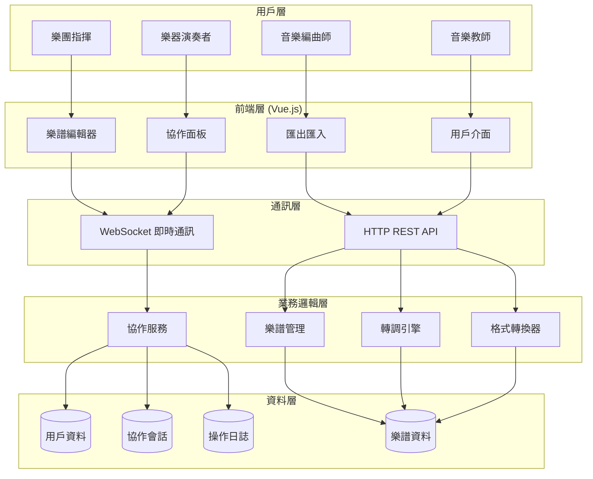

### 1.2 前端模組架構圖
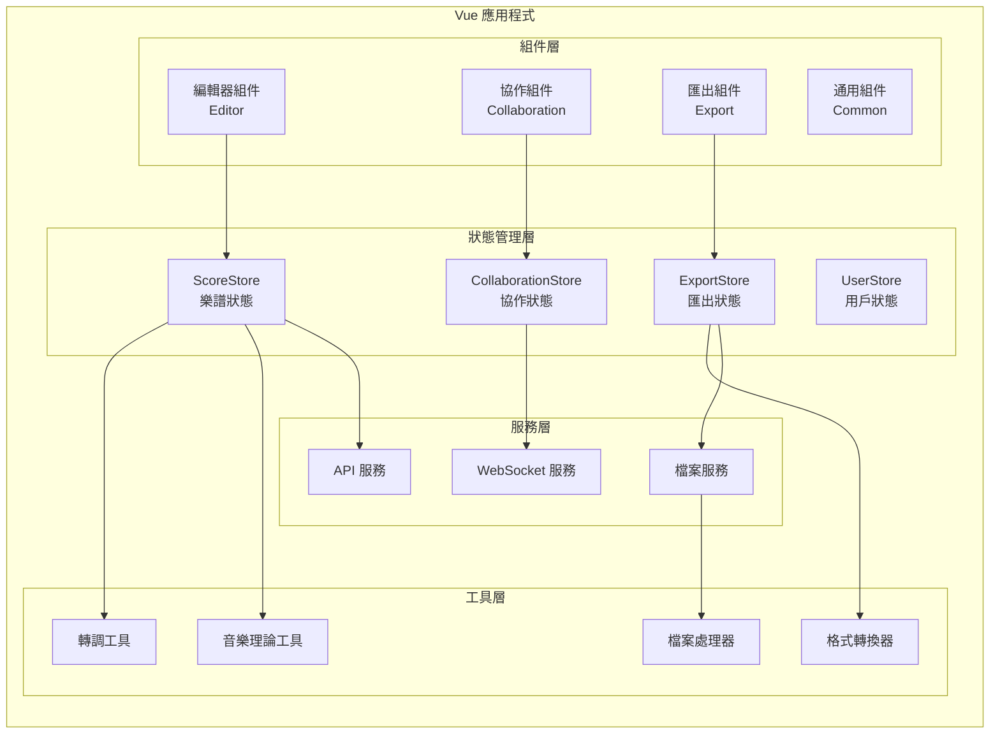

---

## 2. 資料模型關係圖

### 2.1 樂譜資料模型 ER 圖
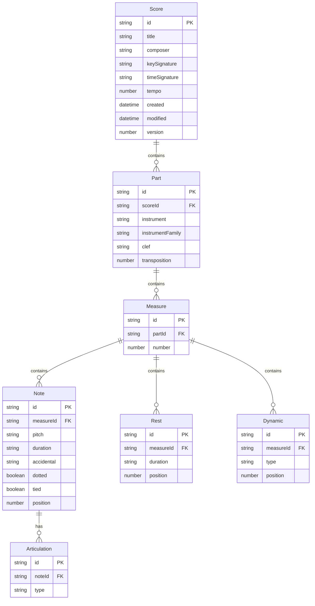

### 2.2 協作系統資料模型
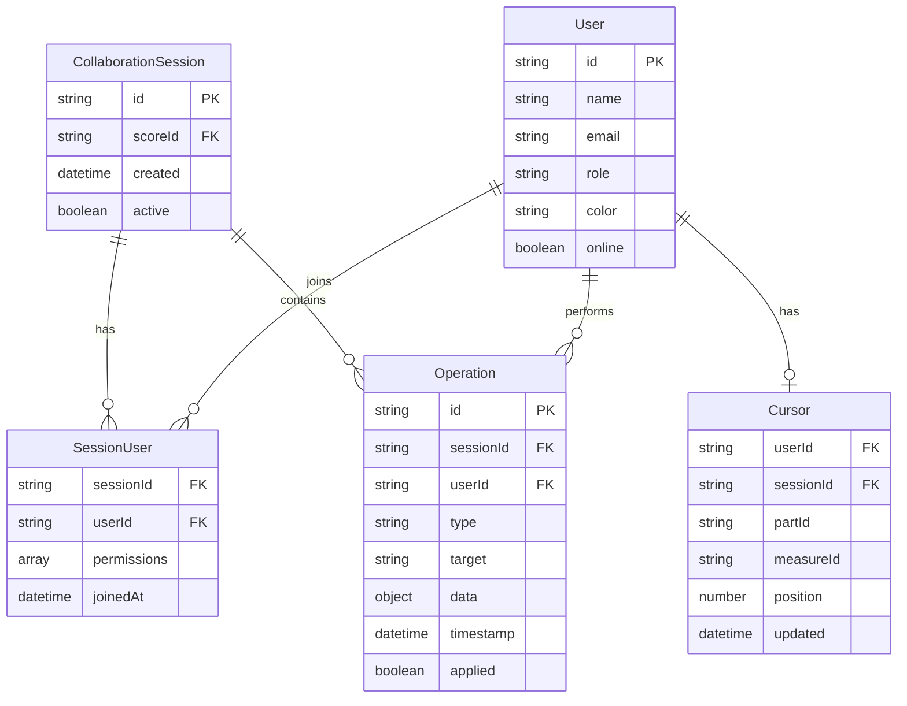

---

## 3. 系統流程圖

### 3.1 用戶操作主流程
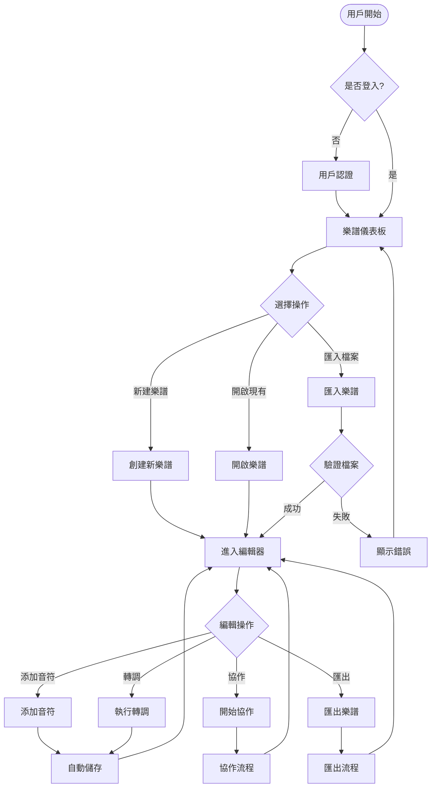

### 3.2 協作工作流程
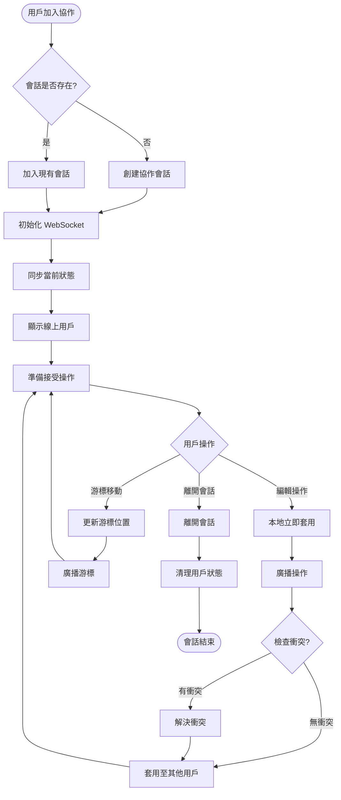

### 3.3 轉調處理流程
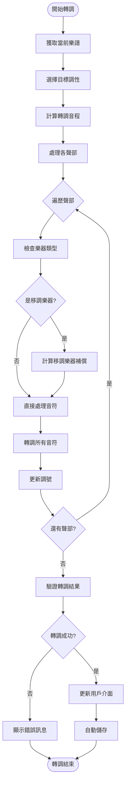

### 3.4 匯出處理流程
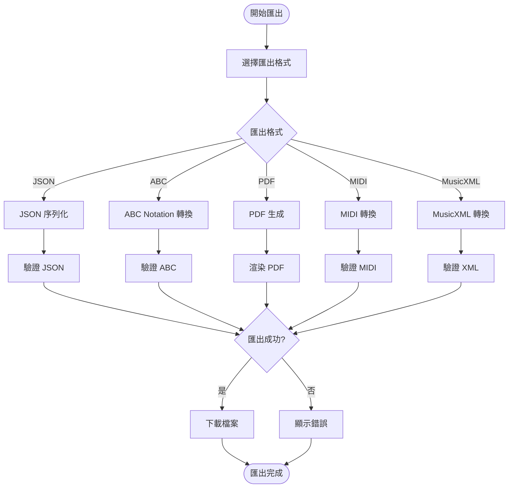

---

## 4. 組件互動循序圖

### 4.1 樂譜編輯循序圖
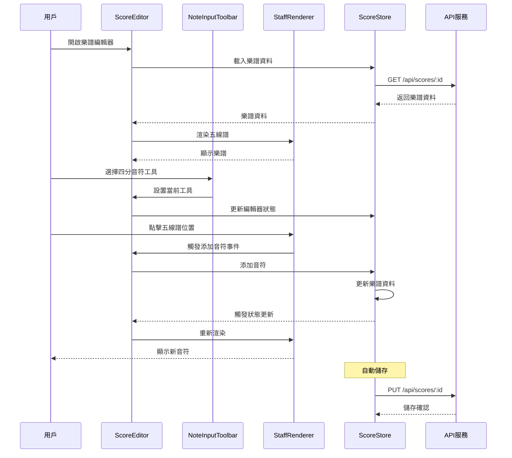

### 4.2 即時協作循序圖
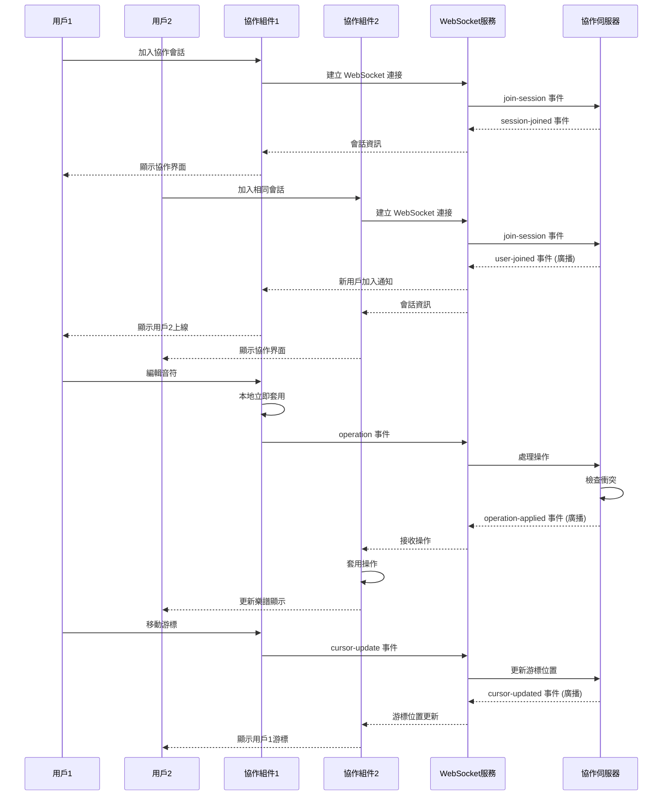

### 4.3 轉調操作循序圖
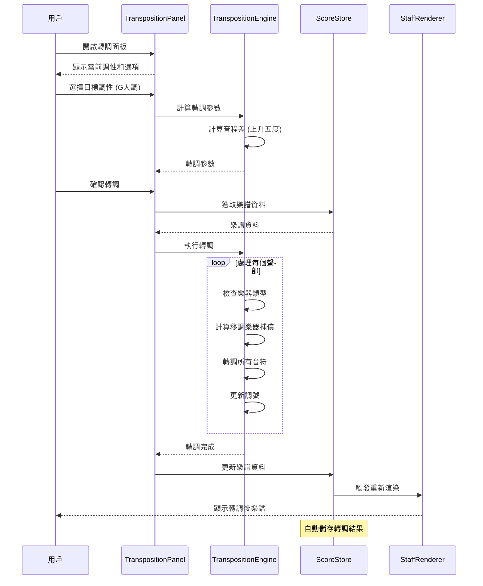

### 4.4 匯出操作循序圖
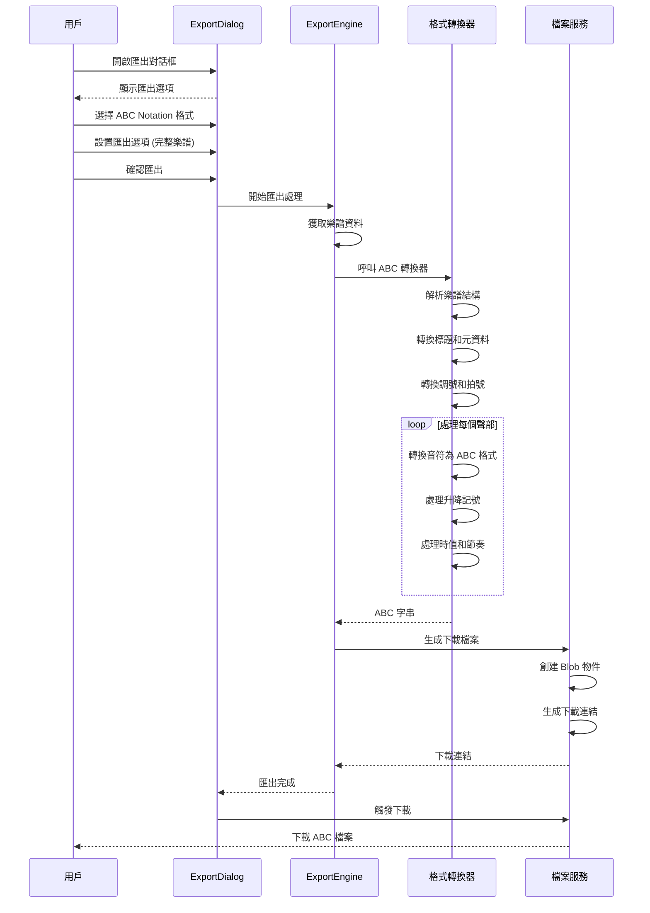

---

## 5. 狀態管理架構圖

### 5.1 Pinia Store 關係圖
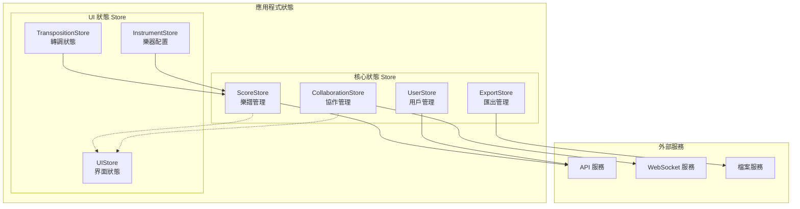

### 5.2 狀態流轉圖
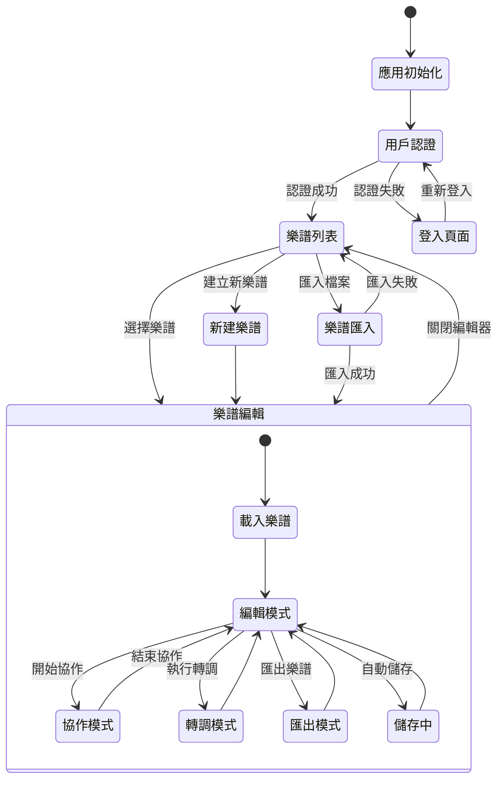

---

## 6. 部署架構圖

### 6.1 系統部署圖
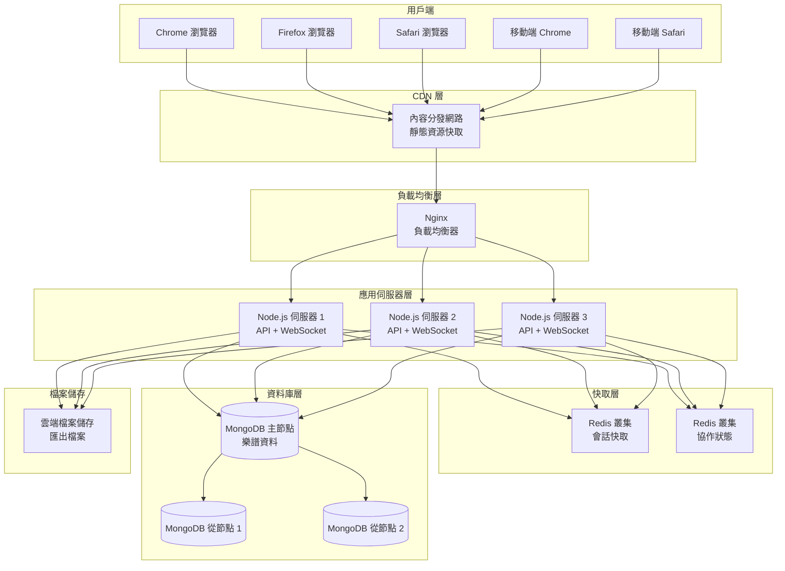

---

## 7. 安全架構圖

### 7.1 安全防護層次圖
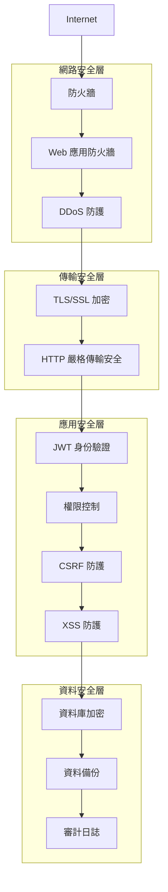

此文件提供了 BandPro 系統的全面視覺化架構說明，涵蓋系統設計的各個層面，有助於開發團隊理解系統整體結構和各組件間的關係。
