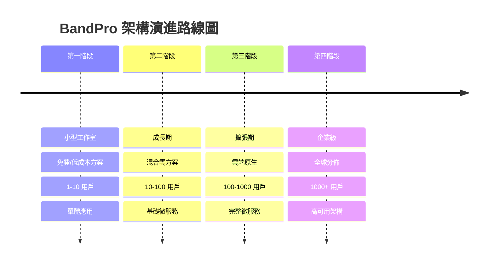

# BandPro 演進式系統架構規劃 - 總覽文件

本文件提供 BandPro 樂團團譜打譜系統的演進式架構規劃，從小型工作室免費方案開始，逐步擴展到企業級架構。

## 📋 架構演進路線圖

### 階段演進概覽

## 📁 文件結構

本規劃包含以下文件：

### 📖 主要文件
- **06_軟體系統架構及硬體系統架構規劃文件.md** - 總覽文件（本文件）
- **07_第一階段架構-小型工作室方案.md** - 免費/低成本起步方案
- **08_第二階段架構-成長期方案.md** - 混合雲擴展方案
- **09_第三階段架構-擴張期方案.md** - 雲端原生方案
- **10_第四階段架構-企業級方案.md** - 高可用全球方案

### 🎯 各階段特點對比

| 特性 | 第一階段 | 第二階段 | 第三階段 | 第四階段 |
|------|----------|----------|----------|----------|
| **用戶規模** | 1-10 | 10-100 | 100-1000 | 1000+ |
| **月費預算** | $0-50 | $50-500 | $500-2000 | $2000+ |
| **架構類型** | 單體應用 | 混合架構 | 微服務 | 分佈式 |
| **部署方式** | 本地/免費雲 | VPS/雲端 | 容器化 | Kubernetes |
| **資料庫** | SQLite/MongoDB | PostgreSQL/MongoDB | MongoDB 集群 | 分佈式資料庫 |
| **快取** | 記憶體快取 | Redis 單節點 | Redis 集群 | 分佈式快取 |
| **CDN** | 無 | Cloudflare 免費 | Cloudflare Pro | 全球 CDN |
| **監控** | 基礎日誌 | 簡單監控 | Prometheus | 企業級監控 |
| **災難恢復** | 本地備份 | 異地備份 | 自動備份 | 多區域備援 |

## 🚀 建議實施順序

### 立即開始（第一階段）
適合剛開始的個人開發者或小型工作室：
- 使用免費方案快速驗證概念
- 低成本快速上線
- 為後續擴展奠定基礎

