# BandPro 第一階段架構 - 小型工作室方案

適用對象：個人開發者、小型工作室、概念驗證
用戶規模：1-10 用戶
預算範圍：$0-50/月

## 🎯 階段目標

- 快速啟動和驗證產品概念
- 最小化初期投資和運營成本
- 建立可擴展的基礎架構
- 為下一階段做好技術準備

---

## 1. 整體架構設計

### 1.1 簡化系統架構
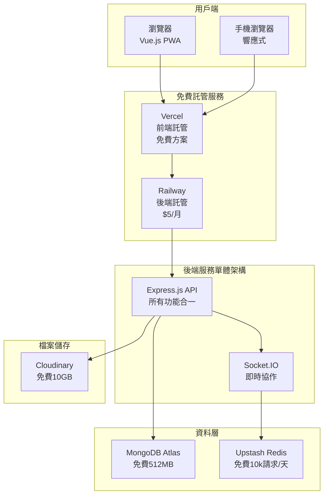

### 1.2 技術選型 (免費優先)
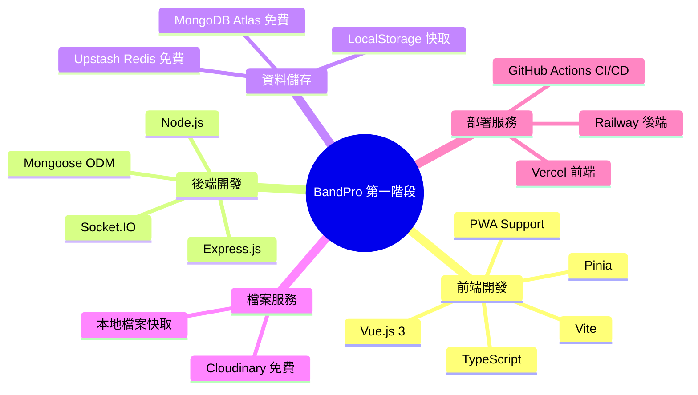

---

## 2. 詳細技術規劃

### 2.1 前端架構
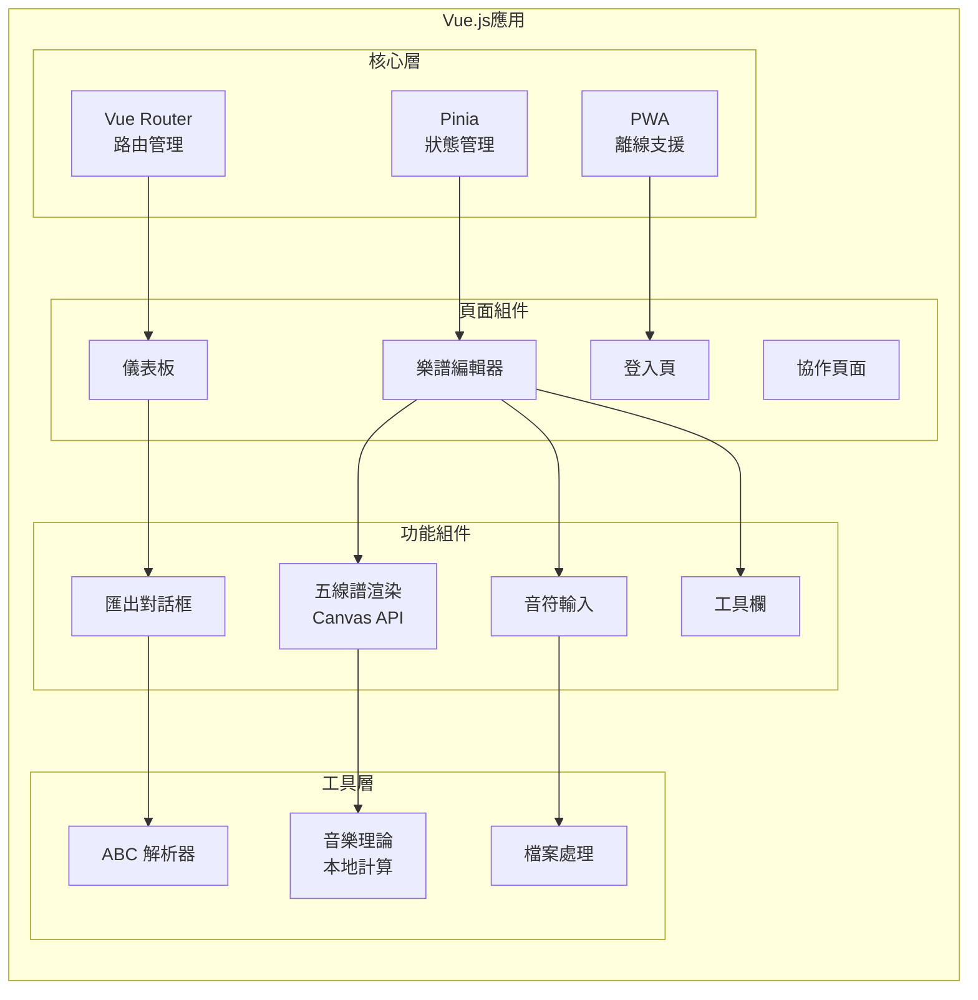

### 2.2 後端架構 (單體設計)
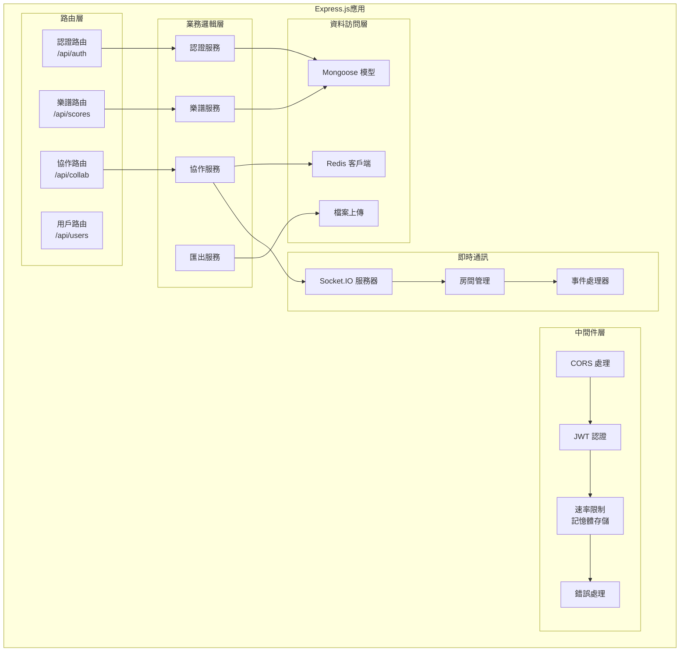

---

## 3. 資料庫設計

### 3.1 MongoDB 集合設計
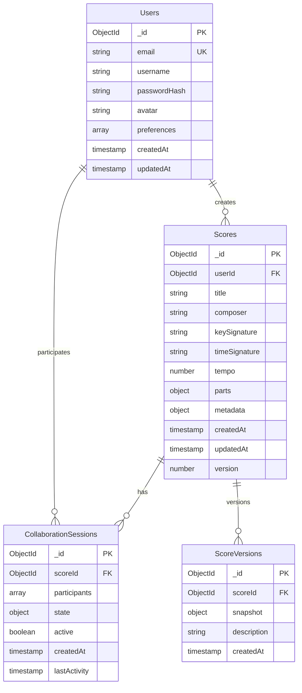

### 3.2 Redis 資料結構
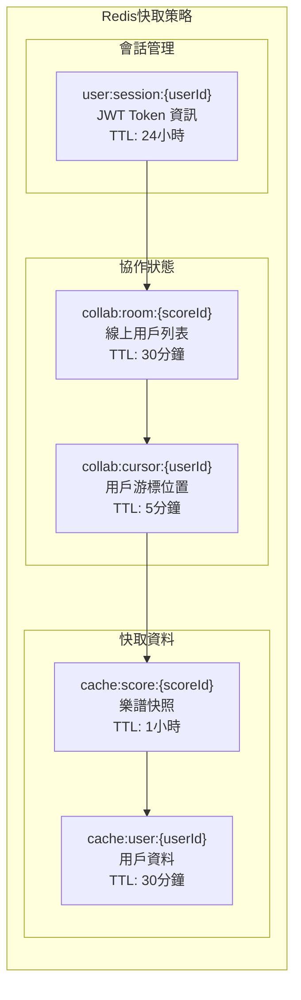

---

## 4. 部署架構

### 4.1 免費託管方案
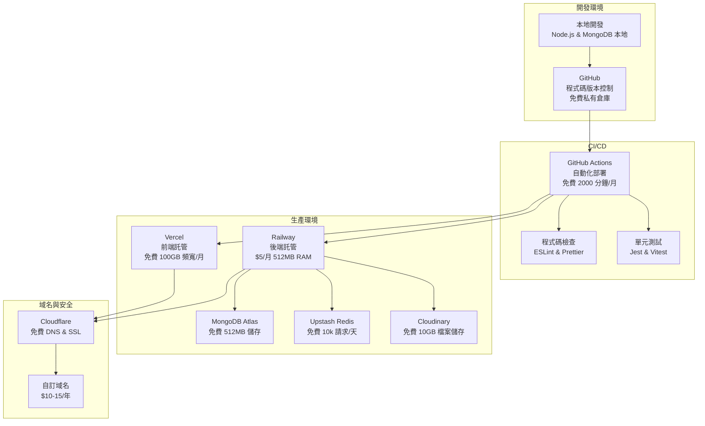

### 4.2 成本結構 (月費)
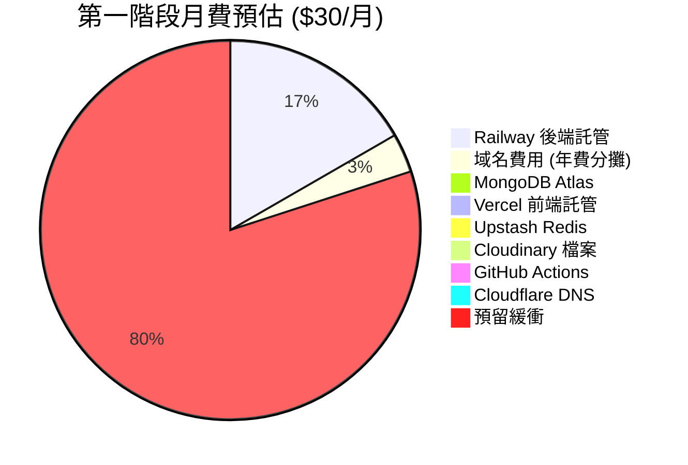

---

## 5. 功能實現策略

### 5.1 MVP 功能優先級
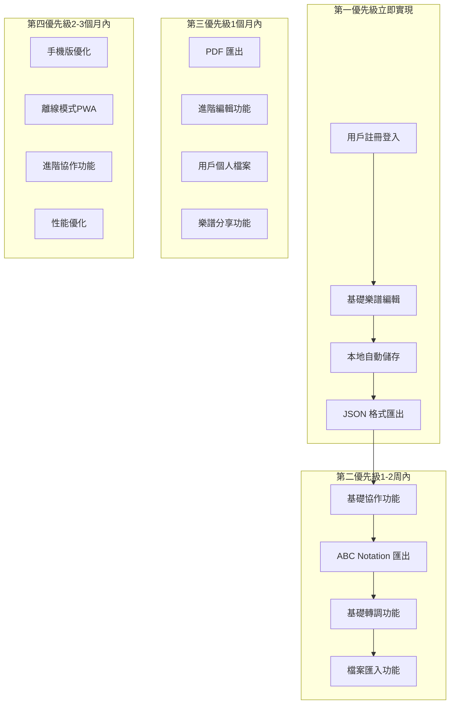

### 5.2 技術債務管理
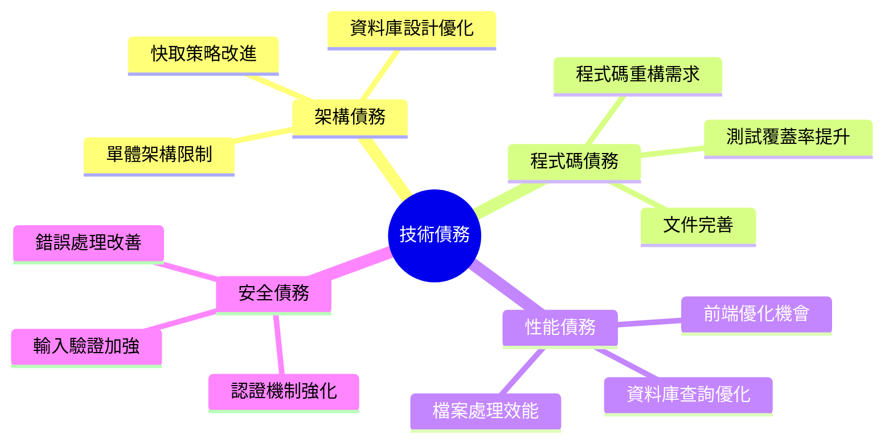

---

## 6. 監控與維護

### 6.1 基礎監控方案
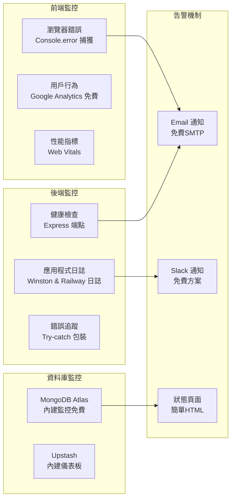

### 6.2 備份策略
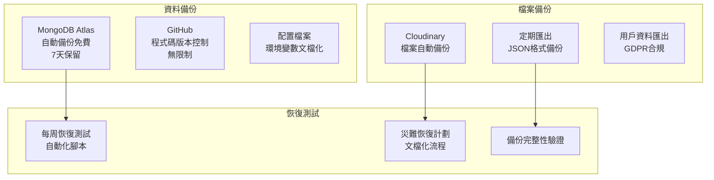

---

## 7. 擴展觸發條件

### 7.1 升級到第二階段的信號
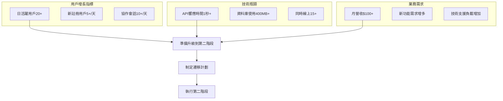

---

## 8. 風險評估

### 8.1 技術風險
| 風險類型 | 可能性 | 影響程度 | 緩解措施 |
|---------|--------|----------|----------|
| **免費服務限制** | 高 | 中 | 監控使用量，準備升級計劃 |
| **單點故障** | 中 | 高 | 快速恢復程序，資料備份 |
| **性能瓶頸** | 中 | 中 | 程式碼優化，快取策略 |
| **資料遺失** | 低 | 高 | 多重備份，版本控制 |

### 8.2 業務風險
| 風險類型 | 可能性 | 影響程度 | 緩解措施 |
|---------|--------|----------|----------|
| **用戶增長停滯** | 中 | 高 | 產品迭代，用戶回饋 |
| **競爭對手** | 高 | 中 | 差異化功能，快速迭代 |
| **技術債務累積** | 高 | 中 | 定期重構，程式碼審查 |
| **團隊擴展困難** | 低 | 中 | 文件化，標準化流程 |

---

## 9. 實施時程

### 9.1 四週衝刺計劃
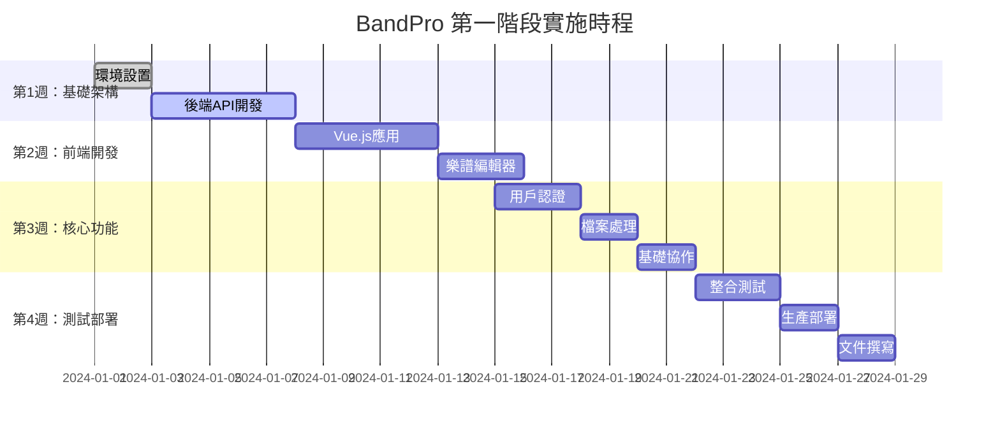

---

## 10. 總結與下一步

### 10.1 第一階段目標達成標準
- ✅ 系統成功上線並可正常訪問
- ✅ 基本樂譜編輯功能可用
- ✅ 用戶註冊登入流程完整
- ✅ 檔案匯出匯入功能正常
- ✅ 基礎協作功能可用
- ✅ 月運營成本控制在 $30 以內
- ✅ 系統響應時間 < 2秒
- ✅ 支援 5-10 個並發用戶

### 10.2 為第二階段做準備
1. **監控關鍵指標**：用戶增長、系統性能、業務指標
2. **收集用戶回饋**：功能需求、使用體驗、痛點分析
3. **技術債務管理**：持續重構、測試覆蓋率、文件更新
4. **資源準備**：團隊擴展、預算規劃、技術升級

👉 **當觸發升級條件時，請參考 [第二階段架構-成長期方案](./08_第二階段架構-成長期方案.md)**
