# BandPro 第二階段架構 - 成長期方案

適用對象：小型團隊、初創公司、驗證成功的產品
用戶規模：10-100 用戶
預算範圍：$50-200/月

## 🎯 階段目標

- 擴展系統容量和性能
- 引入專業級功能和服務
- 建立可靠的監控和運維體系
- 為快速用戶增長做好準備

---

## 1. 整體架構演進

### 1.1 升級後系統架構
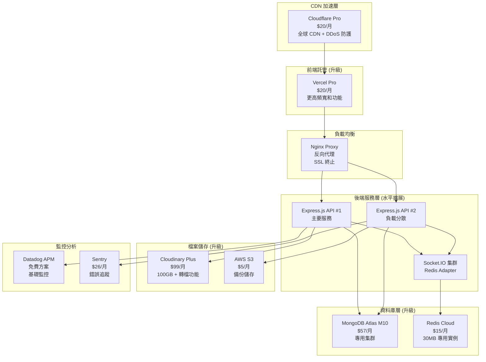

### 1.2 架構改進重點
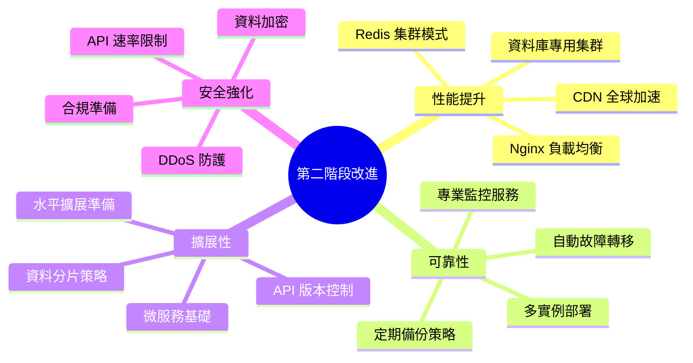

---

## 2. 詳細技術架構

### 2.1 前端架構增強
```mermaid
flowchart LR
    subgraph "前端增強功能"
        subgraph "性能優化"
            CodeSplitting[程式碼分割<br/>Vite + Vue Router]
            LazyLoading[延遲載入<br/>圖片和組件]
            Caching[智能快取<br/>Service Worker]
            Compression[資源壓縮<br/>Gzip + Brotli]
        end
        
        subgraph "PWA 功能"
            OfflineMode[離線模式<br/>樂譜本地編輯]
            PushNotifications[推送通知<br/>協作邀請]
            AppInstall[應用安裝<br/>類原生體驗]
            BackgroundSync[後台同步<br/>離線資料上傳]
        end
        
        subgraph "新增功能模組"
            AdvancedEditor[進階編輯器<br/>更多樂器支援]
            CollabUI[協作界面<br/>即時游標顯示]
            AnalyticsSDK[分析 SDK<br/>用戶行為追蹤]
            PaymentUI[付費功能界面<br/>未來商業化準備]
        end
    end
    
    CodeSplitting --> LazyLoading
    LazyLoading --> Caching
    Caching --> Compression
    
    OfflineMode --> PushNotifications
    PushNotifications --> AppInstall
    AppInstall --> BackgroundSync
    
    AdvancedEditor --> CollabUI
    CollabUI --> AnalyticsSDK
    AnalyticsSDK --> PaymentUI
```

### 2.2 後端架構改進
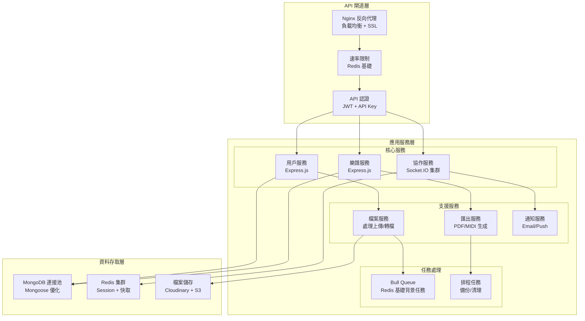

---

## 3. 資料庫架構升級

### 3.1 MongoDB 優化策略
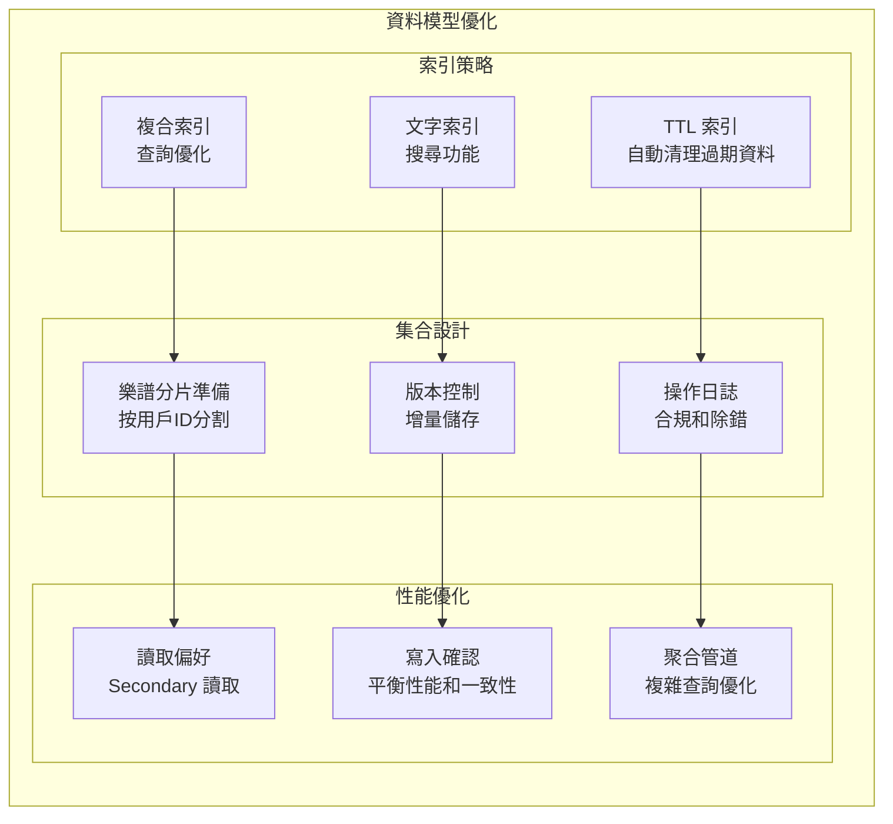

### 3.2 Redis 架構升級
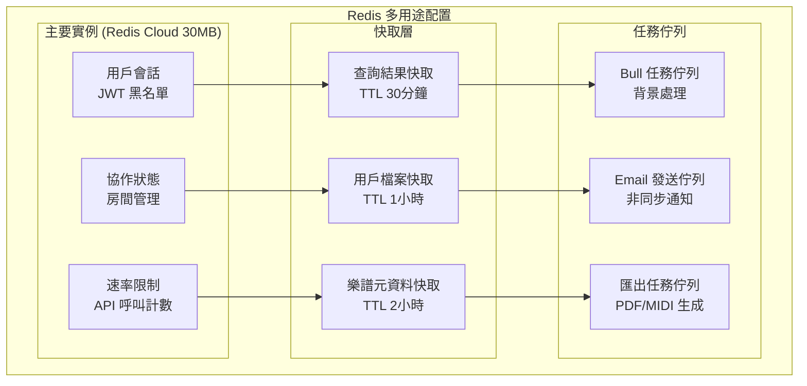

---

## 4. 部署與運維升級

### 4.1 生產環境架構
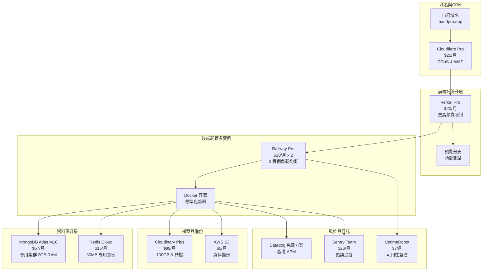

### 4.2 CI/CD 增強流程
```mermaid
flowchart LR
    subgraph DevFlow[開發流程]
        Feature[功能分支開發<br/>Git Flow]
        LocalTest[本地測試<br/>Jest &amp; Cypress]
        PR[Pull Request<br/>程式碼審查]
    end
    
    subgraph AutoTest[自動化測試]
        UnitTests[單元測試<br/>90%覆蓋率目標]
        IntegrationTests[整合測試<br/>API端點測試]
        E2ETests[端到端測試<br/>關鍵流程驗證]
        PerformanceTests[性能測試<br/>響應時間監控]
    end
    
    subgraph DeployStage[部署階段]
        StagingDeploy[預備環境部署<br/>完整測試]
        ProductionDeploy[生產環境部署<br/>藍綠部署]
        HealthCheck[健康檢查<br/>自動回滾]
    end
    
    subgraph MonitorFeedback[監控回饋]
        ErrorTracking[錯誤監控<br/>Sentry 告警]
        PerformanceAPM[性能監控<br/>Datadog APM]
        UserAnalytics[用戶分析<br/>行為追蹤]
    end
    
    Feature --> LocalTest
    LocalTest --> PR
    PR --> UnitTests
    
    UnitTests --> IntegrationTests
    IntegrationTests --> E2ETests
    E2ETests --> PerformanceTests
    
    PerformanceTests --> StagingDeploy
    StagingDeploy --> ProductionDeploy
    ProductionDeploy --> HealthCheck
    
    HealthCheck --> ErrorTracking
    ErrorTracking --> PerformanceAPM
    PerformanceAPM --> UserAnalytics
```

---

## 5. 成本與投資分析

### 5.1 月費結構 ($214/月)
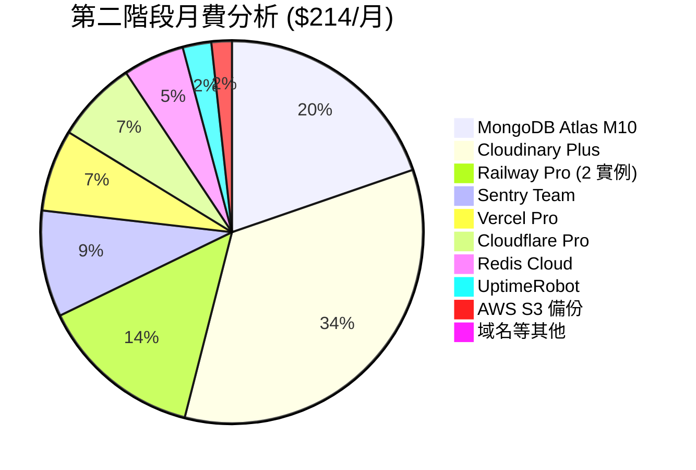

### 5.2 ROI 預期分析
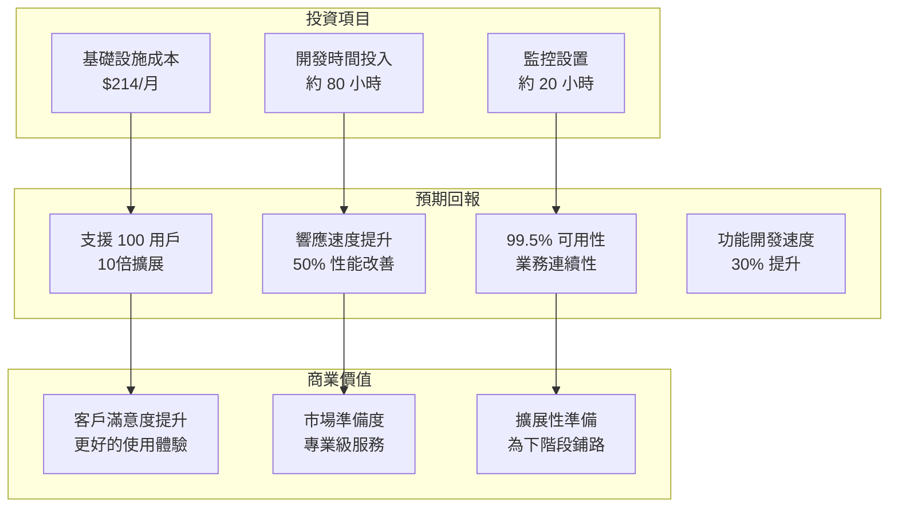

---

## 6. 功能擴展規劃

### 6.1 新增功能模組
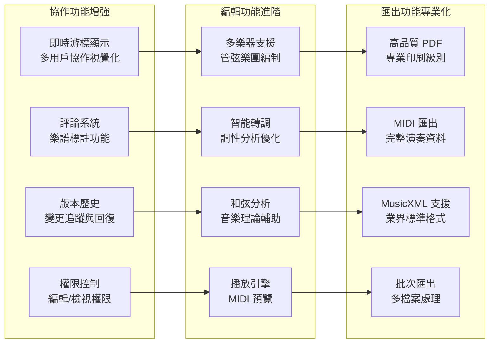

### 6.2 用戶體驗提升
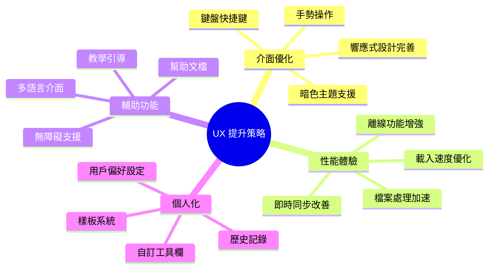

---

## 7. 監控與運維體系

### 7.1 全面監控策略
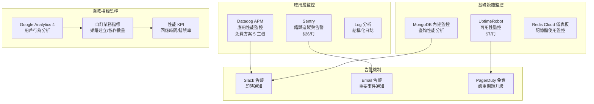

### 7.2 運維自動化
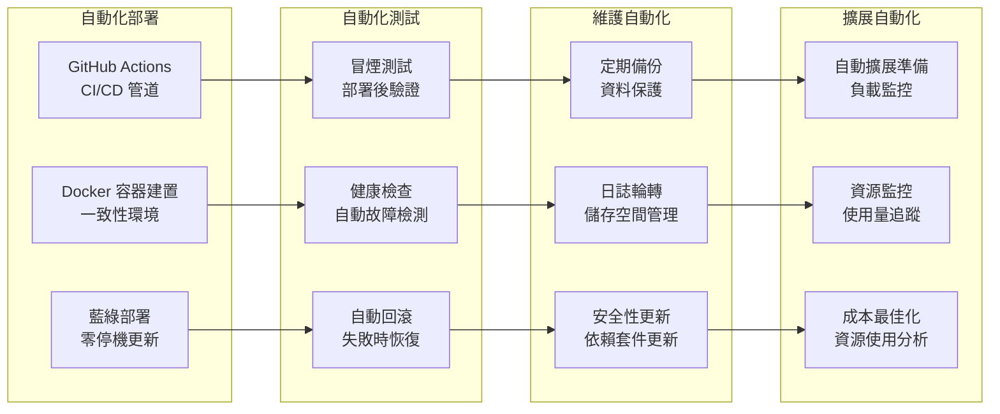

---

## 8. 安全性強化

### 8.1 多層安全防護
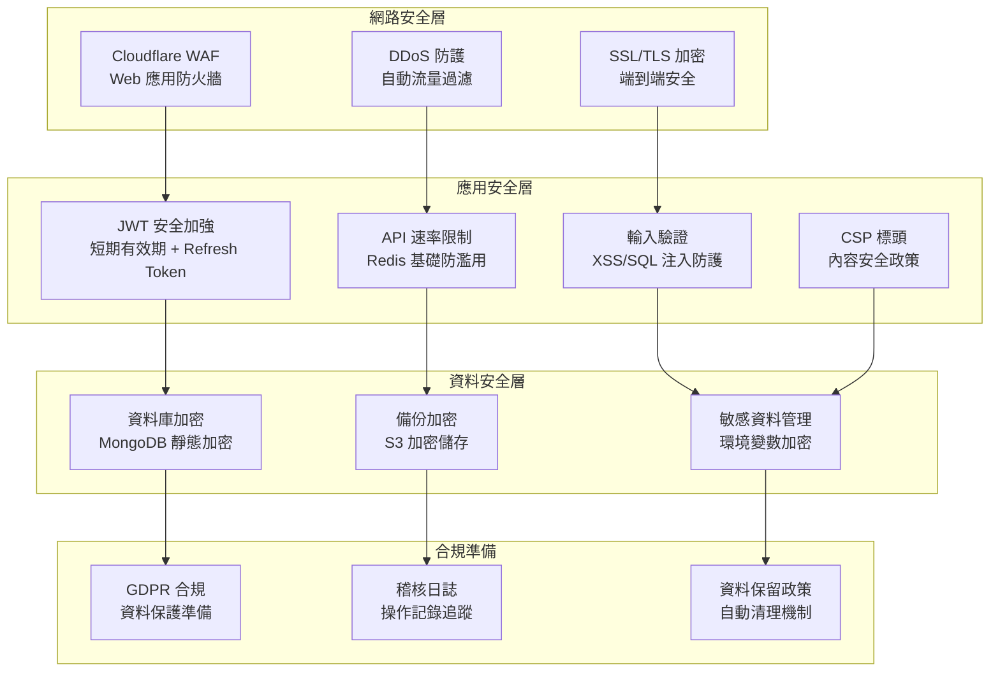

---

## 9. 升級遷移計劃

### 9.1 從第一階段平滑遷移
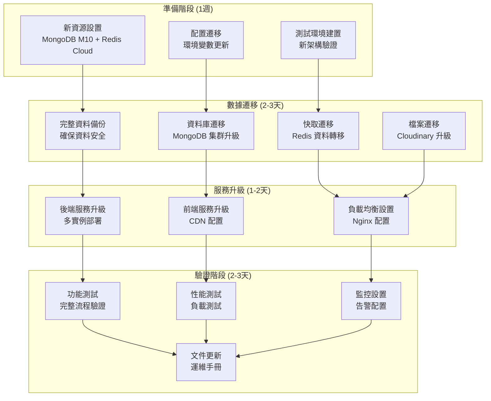

---

## 10. 升級到第三階段的準備

### 10.1 第三階段觸發條件
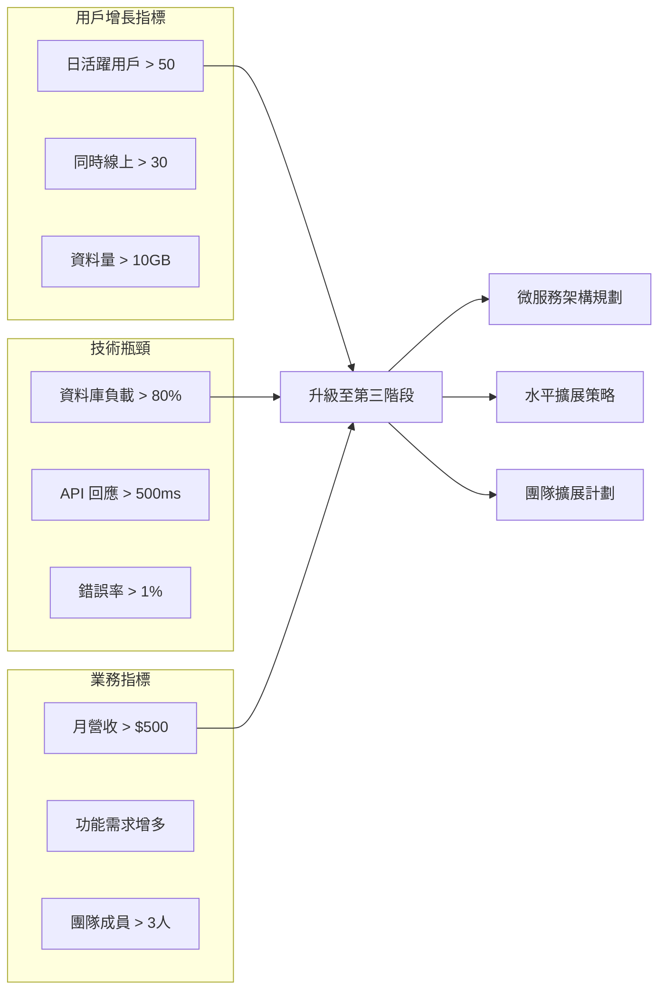

### 10.2 為微服務做準備
- **API 設計標準化**：RESTful API + GraphQL 準備
- **服務邊界定義**：用戶服務、樂譜服務、協作服務分離
- **資料庫分片策略**：為資料分離做準備
- **監控系統完善**：分散式追蹤準備

---

## 總結

第二階段成功將 BandPro 從概念驗證升級為專業級服務，具備：
- **10倍用戶容量** (1-10 → 10-100 用戶)
- **專業級可靠性** (99.5% 可用性目標)
- **企業級監控** (完整的 APM 和錯誤追蹤)
- **安全性強化** (多層防護和合規準備)

👉 **當達到升級條件時，請參考 [第三階段架構-擴張期方案](./09_第三階段架構-擴張期方案.md)**
