# BandPro 第三階段架構 - 擴張期方案

適用對象：成長型公司、B2B 客戶、國際化服務
用戶規模：100-1000 用戶  
預算範圍：$500-2000/月

## 🎯 階段目標

- 微服務架構轉型，提升系統可擴展性
- 多區域部署，支援國際化用戶
- 引入容器化和編排，提升運維效率
- 建立數據驅動的決策體系

---

## 1. 整體架構演進

### 1.1 微服務架構全貌
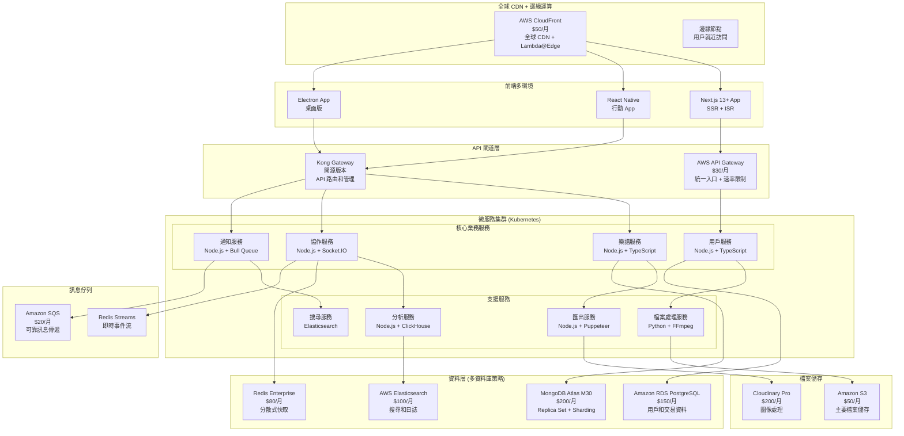

### 1.2 技術棧全面升級
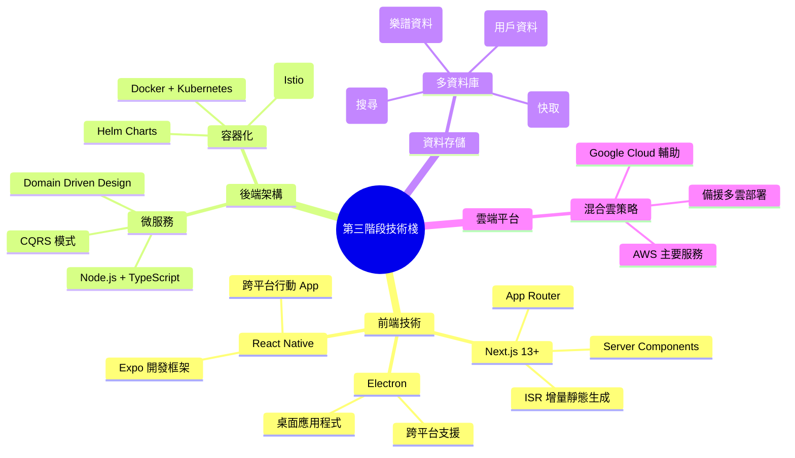

---

## 2. 微服務架構詳細設計

### 2.1 服務邊界定義
```mermaid
flowchart LR
    subgraph "用戶領域 (User Domain)"
        UserService[用戶服務<br/>UserService]
        AuthService[認證服務<br/>AuthService]
        ProfileService[檔案服務<br/>ProfileService]
    end
    
    subgraph "樂譜領域 (Score Domain)"  
        ScoreService[樂譜服務<br/>ScoreService]
        VersionService[版本服務<br/>VersionService]
        TemplateService[模板服務<br/>TemplateService]
    end
    
    subgraph "協作領域 (Collaboration Domain)"
        CollabService[協作服務<br/>CollaborationService]
        RealtimeService[即時服務<br/>RealtimeService]
        CommentService[評論服務<br/>CommentService]
    end
    
    subgraph "檔案處理領域 (File Domain)"
        FileService[檔案服務<br/>FileService]
        ProcessingService[處理服務<br/>ProcessingService]
        ExportService[匯出服務<br/>ExportService]
    end
    
    subgraph "通知領域 (Notification Domain)"
        NotificationService[通知服務<br/>NotificationService]
        EmailService[郵件服務<br/>EmailService]
        PushService[推送服務<br/>PushService]
    end
    
    subgraph "分析領域 (Analytics Domain)"
        AnalyticsService[分析服務<br/>AnalyticsService]
        ReportingService[報表服務<br/>ReportingService]
        MetricsService[指標服務<br/>MetricsService]
    end
    
    UserService --> AuthService
    AuthService --> ProfileService
    
    ScoreService --> VersionService
    VersionService --> TemplateService
    
    CollabService --> RealtimeService
    RealtimeService --> CommentService
    
    FileService --> ProcessingService
    ProcessingService --> ExportService
    
    NotificationService --> EmailService
    EmailService --> PushService
    
    AnalyticsService --> ReportingService
    ReportingService --> MetricsService
```

### 2.2 服務間通訊模式
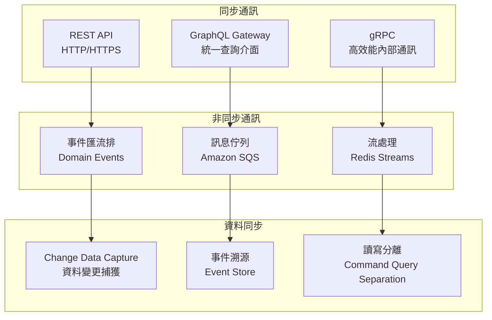

---

## 3. 容器化與編排

### 3.1 Kubernetes 集群架構
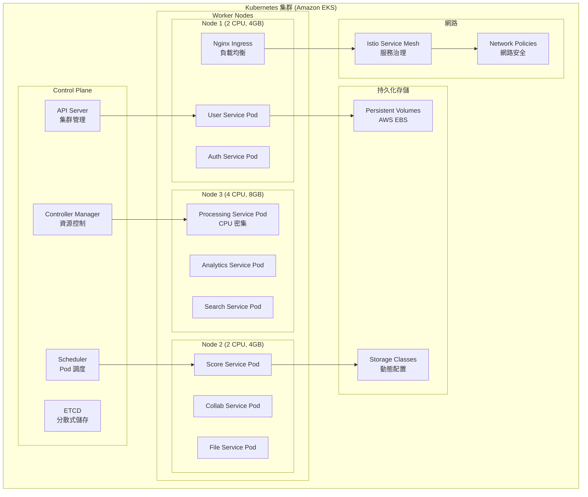

### 3.2 容器映像管理
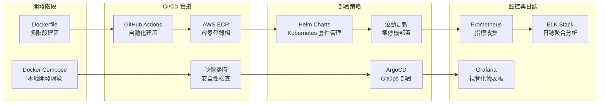

---

## 4. 多資料庫策略

### 4.1 資料庫選型與分配
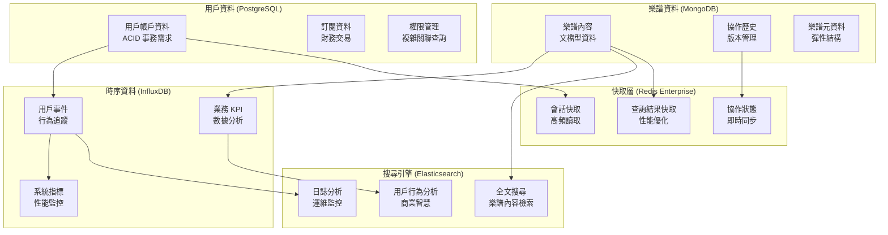

### 4.2 資料一致性策略
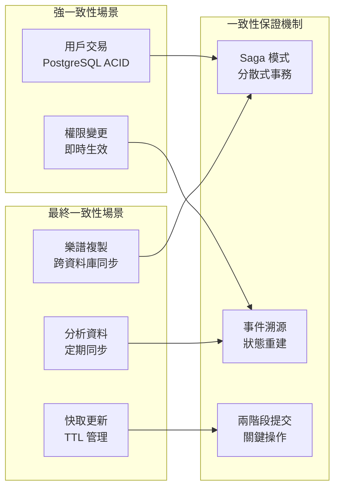

---

## 5. 全球化部署架構

### 5.1 多區域部署策略
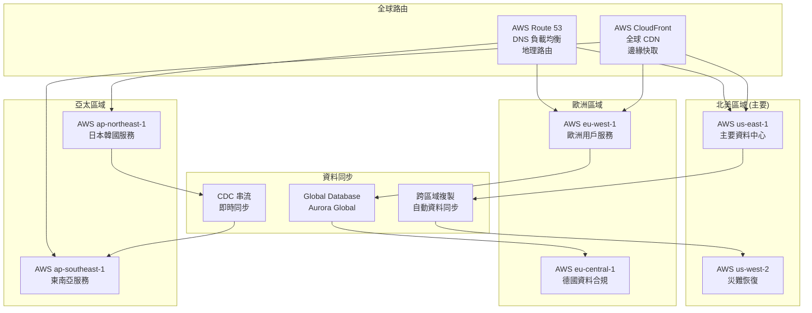

### 5.2 延遲優化策略
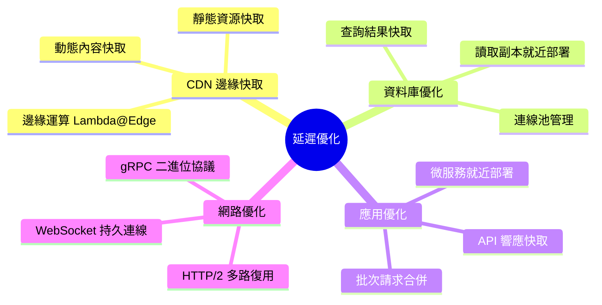

---

## 6. 監控與可觀測性

### 6.1 全棧監控架構
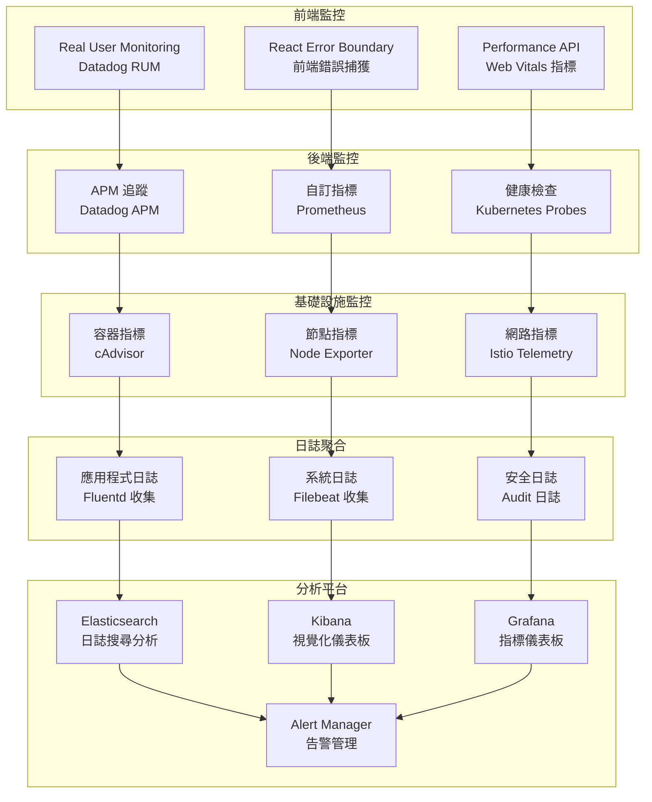

### 6.2 告警策略
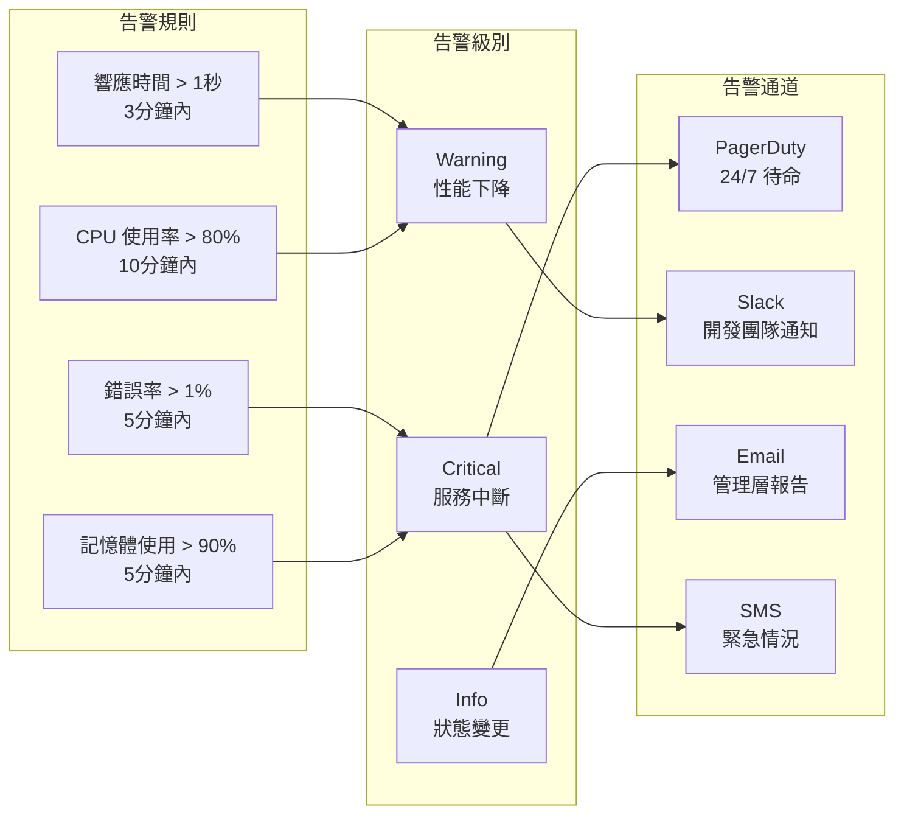

---

## 7. 安全與合規

### 7.1 企業級安全架構
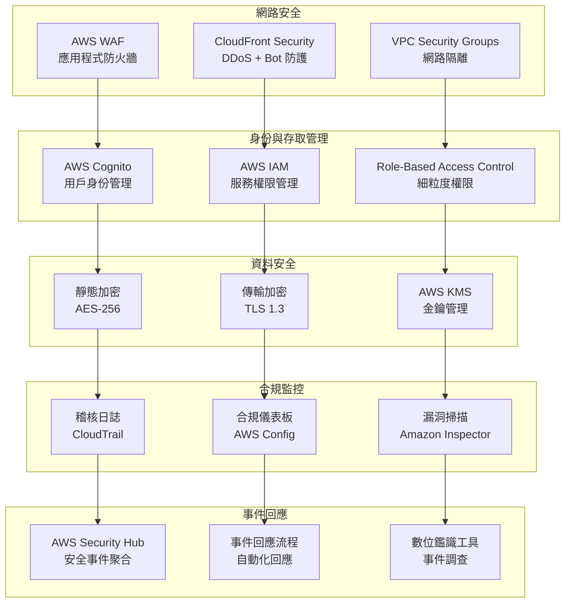

### 7.2 法規合規準備
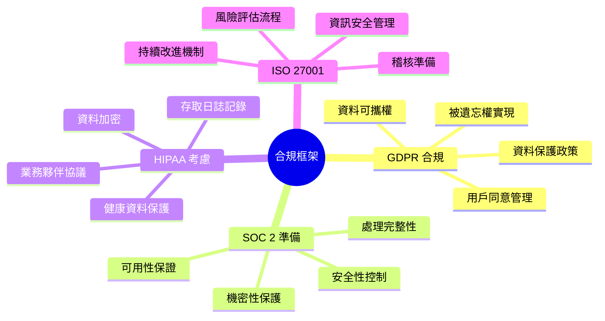

---

## 8. 成本最佳化

### 8.1 成本結構分析 ($1,850/月)
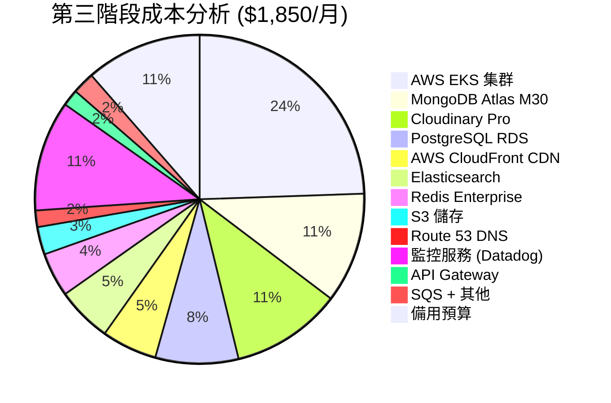

### 8.2 成本最佳化策略
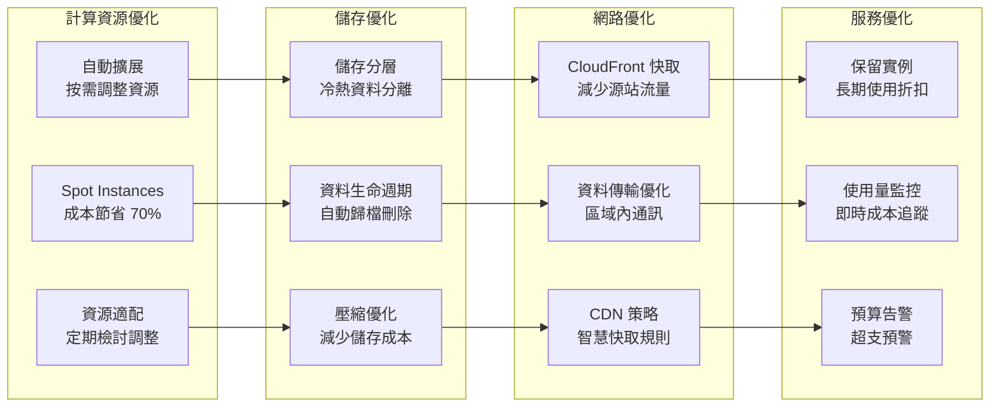

---

## 9. 災難恢復與業務連續性

### 9.1 備份與恢復策略
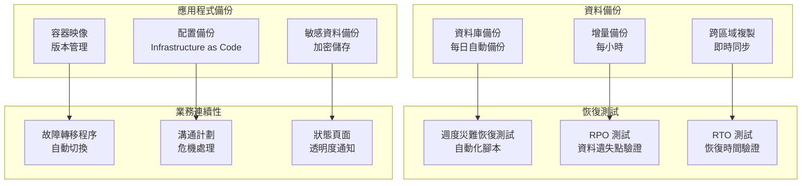

### 9.2 高可用性設計
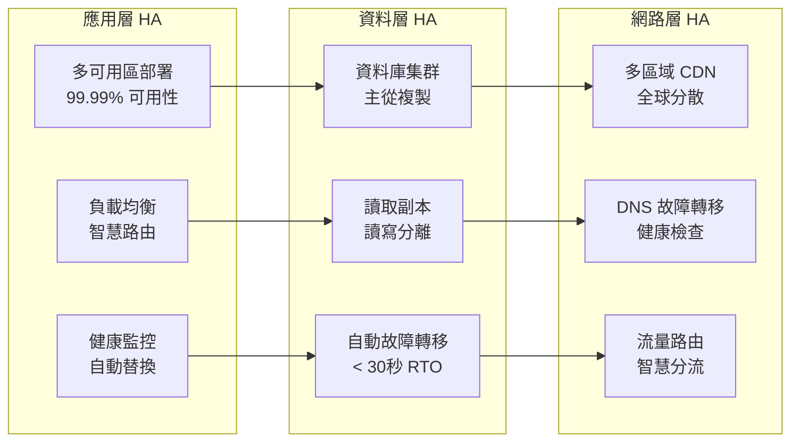

---

## 10. 升級到第四階段的準備

### 10.1 企業級觸發條件
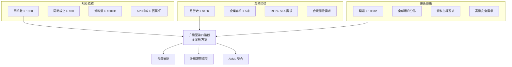

---

## 總結

第三階段成功將 BandPro 轉型為企業級微服務架構，實現：

- **10倍擴展能力** (100-1000 用戶支援)
- **全球化部署** (多區域低延遲服務)
- **微服務架構** (高可擴展性和維護性)
- **企業級可靠性** (99.9% 可用性保證)
- **完整監控體系** (全棧可觀測性)
- **合規準備** (GDPR、SOC 2 等標準)

### 關鍵成就：
✅ 微服務架構完整實現  
✅ 容器化編排 (Kubernetes)  
✅ 多資料庫策略 (多元化資料存儲)  
✅ 全球 CDN 部署  
✅ 企業級監控與告警  
✅ 災難恢復機制  

👉 **當達到企業級需求時，請參考 [第四階段架構-企業級方案](./10_第四階段架構-企業級方案.md)**
