# BandPro 第四階段架構 - 企業級方案

適用對象：大型企業、跨國公司、平台即服務
用戶規模：1000+ 用戶  
預算範圍：$5000+/月

## 🎯 階段目標

- 構建多雲混合架構，實現最高可用性
- 引入 AI/ML 智能功能，提升產品競爭力
- 建立完整的企業級治理體系
- 達成行業領先的性能和安全標準

---

## 1. 企業級架構全貌

### 1.1 多雲混合架構
```mermaid
flowchart TD
    subgraph "全球智能 DNS"
        Route53[AWS Route 53<br/>地理負載均衡]
        CloudflareDNS[Cloudflare DNS<br/>DDoS 防護 + 智能路由]
    end
    
    subgraph "主雲端平台 (AWS)"
        subgraph "美國東部 (主要)"
            AWSUSEast[AWS us-east-1<br/>主要資料中心]
            AWSEKS[Amazon EKS<br/>Kubernetes 編排]
            AWSDatabase[RDS + Aurora Global<br/>多主資料庫]
        end
        
        subgraph "歐洲 (EU 合規)"
            AWSEUWest[AWS eu-west-1<br/>GDPR 合規區域]
            EUDataSovereignty[資料主權保護<br/>本地化儲存]
        end
    end
    
    subgraph "次要雲端平台 (Google Cloud)"
        subgraph "亞太區域"
            GCPAsia[GCP asia-east1<br/>亞洲用戶服務]
            GKECluster[Google GKE<br/>容器編排]
            BigQuery[BigQuery<br/>大數據分析]
        end
    end
    
    subgraph "輔助雲端 (Azure)"
        subgraph "災難恢復"
            AzureBackup[Azure 備份<br/>跨雲災難恢復]
            AzureAI[Azure Cognitive Services<br/>AI 服務整合]
        end
    end
    
    subgraph "邊緣運算網路"
        EdgeLocations[AWS CloudFront PoPs<br/>200+ 全球節點]
        LambdaEdge[Lambda@Edge<br/>邊緣運算]
        CloudflareWorkers[Cloudflare Workers<br/>邊緣 Serverless]
    end
    
    subgraph "企業級 AI/ML 平台"
        SageMaker[AWS SageMaker<br/>機器學習平台]
        VertexAI[Google Vertex AI<br/>AutoML 服務]
        OpenAIAPI[OpenAI API<br/>生成式 AI]
    end
    
    Route53 --> AWSUSEast
    CloudflareDNS --> GCPAsia
    
    AWSUSEast --> AWSEKS
    AWSEKS --> AWSDatabase
    
    GCPAsia --> GKECluster
    GKECluster --> BigQuery
    
    AWSDatabase --> AzureBackup
    BigQuery --> AzureAI
    
    AWSUSEast --> EdgeLocations
    GCPAsia --> LambdaEdge
    EdgeLocations --> CloudflareWorkers
    
    AWSEKS --> SageMaker
    GKECluster --> VertexAI
    SageMaker --> OpenAIAPI
```

### 1.2 企業級技術棧
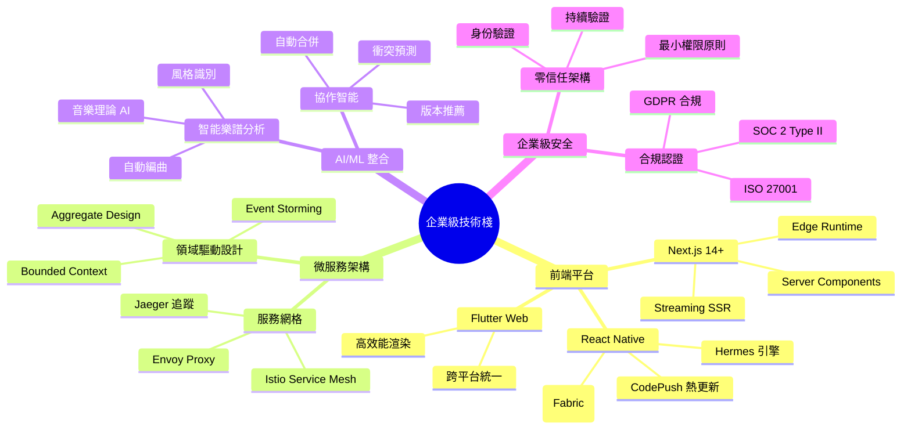

---

## 2. AI/ML 智能功能架構

### 2.1 智能樂譜分析平台
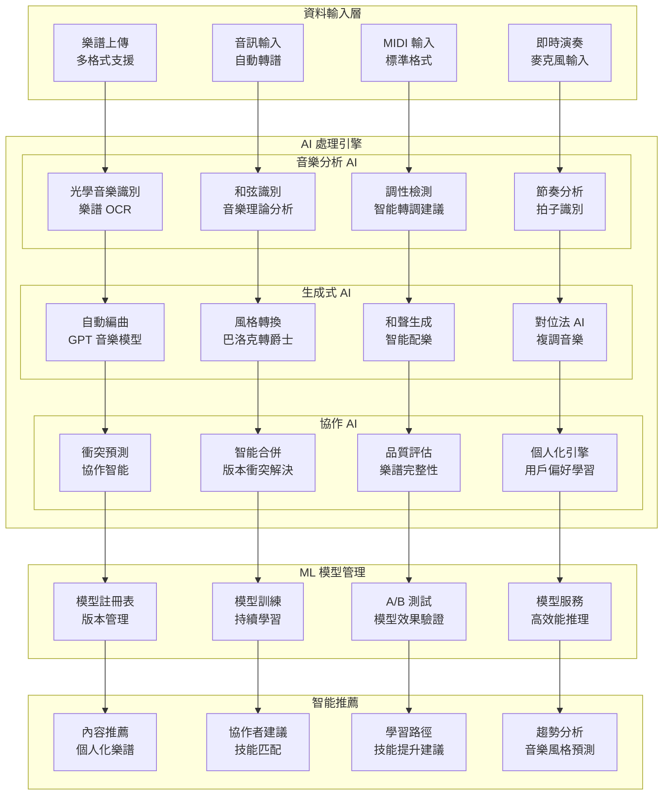

### 2.2 實時 AI 協作引擎
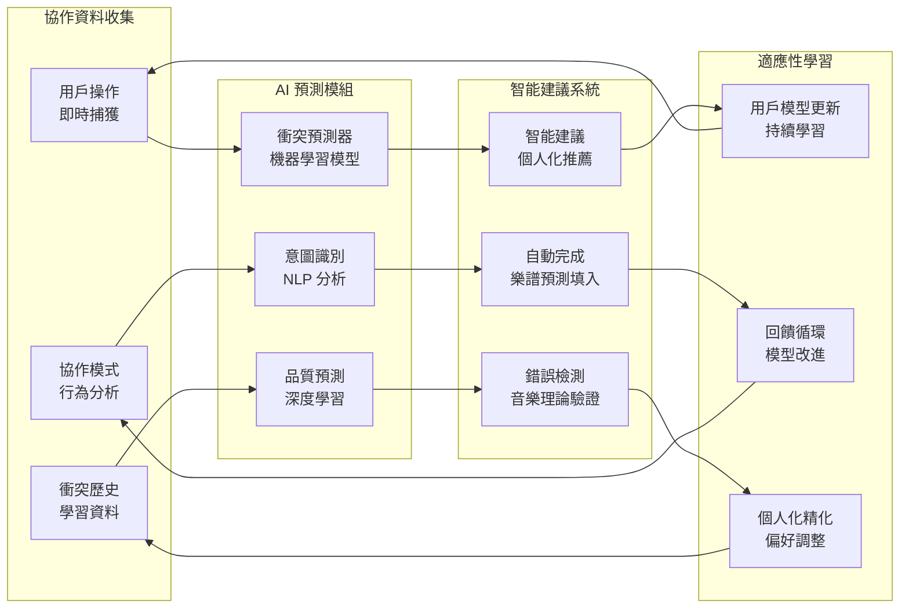

---

## 3. 超大規模系統架構

### 3.1 分散式微服務生態
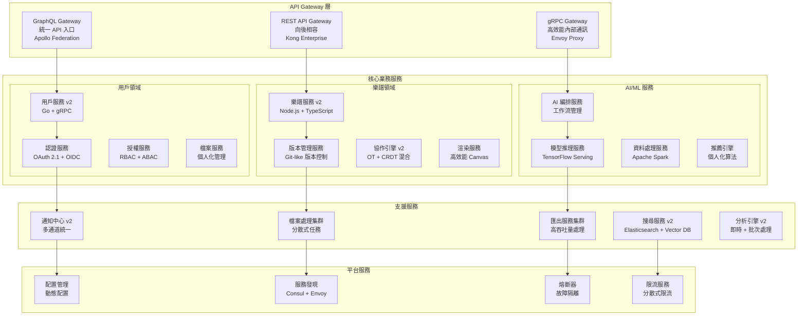

### 3.2 超高效能資料層
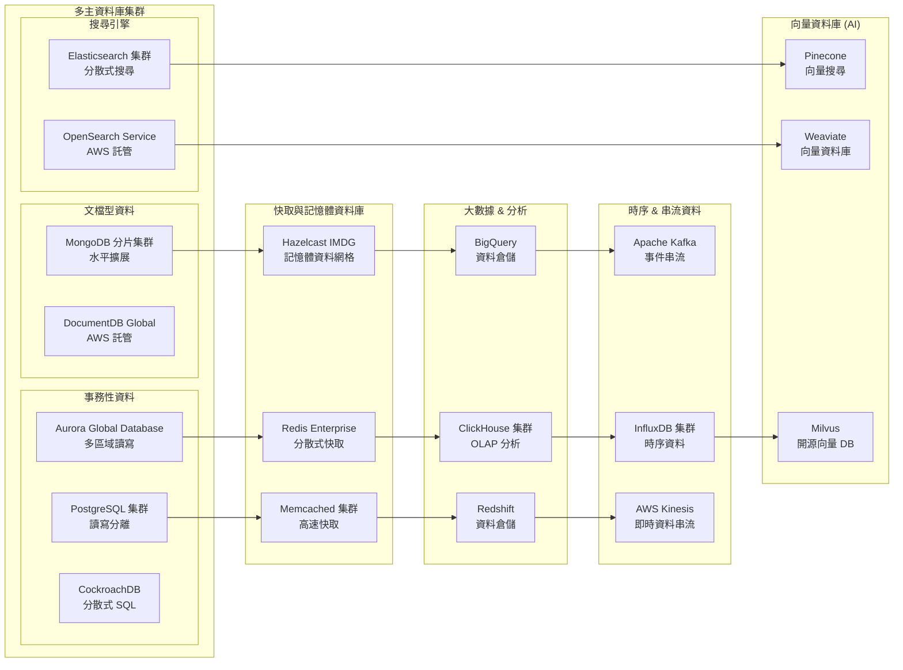

---

## 4. 全球化與本地化架構

### 4.1 多區域部署策略
```mermaid
flowchart TD
    subgraph "北美區域集群"
        subgraph "美國東部 (主要)"
            USEast1[us-east-1<br/>維吉尼亞北部<br/>主要資料中心]
            USEast1Backup[us-east-2<br/>俄亥俄州<br/>災難恢復]
        end
        
        subgraph "美國西部"
            USWest2[us-west-2<br/>奧勒岡州<br/>西岸用戶服務]
            USWest1[us-west-1<br/>加州北部<br/>邊緣運算]
        end
        
        subgraph "加拿大"
            CAcentral1[ca-central-1<br/>加拿大中部<br/>本地合規]
        end
    end
    
    subgraph "歐洲區域集群"
        subgraph "西歐"
            EUWest1[eu-west-1<br/>愛爾蘭<br/>歐洲總部]
            EUWest2[eu-west-2<br/>倫敦<br/>英國服務]
            EUWest3[eu-west-3<br/>巴黎<br/>法國合規]
        end
        
        subgraph "中歐"
            EUCentral1[eu-central-1<br/>法蘭克福<br/>德國合規]
            EUNorth1[eu-north-1<br/>斯德哥爾摩<br/>北歐服務]
        end
    end
    
    subgraph "亞太區域集群"
        subgraph "東亞"
            APNortheast1[ap-northeast-1<br/>東京<br/>日本服務]
            APNortheast2[ap-northeast-2<br/>首爾<br/>韓國服務]
            APEast1[ap-east-1<br/>香港<br/>大中華區]
        end
        
        subgraph "東南亞"
            APSoutheast1[ap-southeast-1<br/>新加坡<br/>東南亞總部]
            APSoutheast2[ap-southeast-2<br/>雪梨<br/>澳洲服務]
        end
        
        subgraph "南亞"
            APSouth1[ap-south-1<br/>孟買<br/>印度服務]
        end
    end
    
    subgraph "智能路由系統"
        GeoDNS[地理 DNS<br/>自動區域選擇]
        LatencyRouting[延遲路由<br/>最佳效能路徑]
        HealthCheck[健康檢查<br/>故障自動切換]
    end
    
    GeoDNS --> USEast1
    GeoDNS --> EUWest1
    GeoDNS --> APNortheast1
    
    LatencyRouting --> USWest2
    LatencyRouting --> EUCentral1
    LatencyRouting --> APSoutheast1
    
    HealthCheck --> USEast1Backup
    HealthCheck --> EUWest2
    HealthCheck --> APSoutheast2
```

### 4.2 資料主權與合規
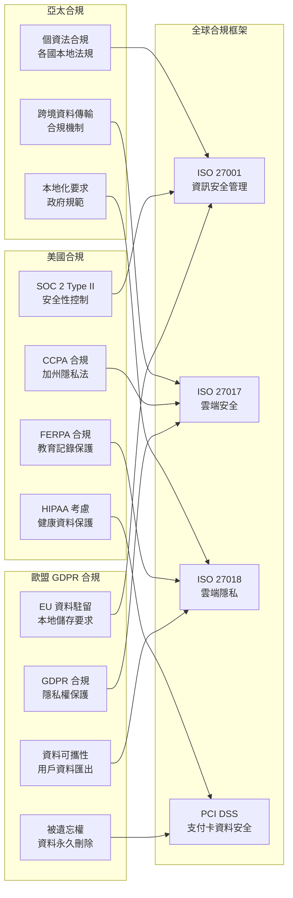

---

## 5. 企業級安全與治理

### 5.1 零信任安全架構
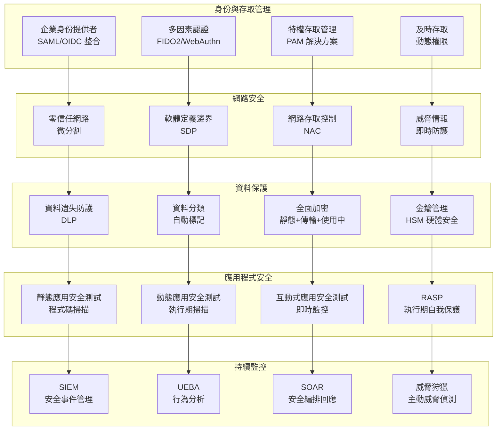

### 5.2 企業治理框架
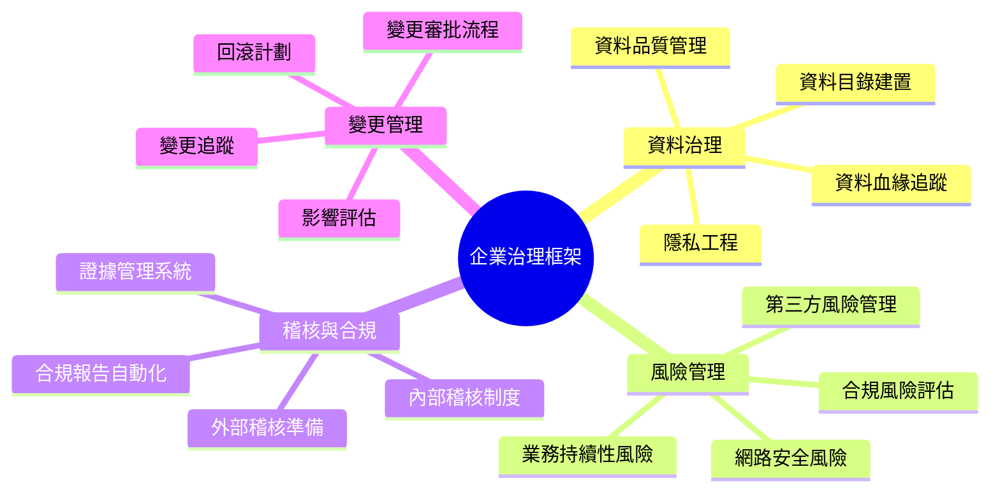

---

## 6. 超級監控與可觀測性

### 6.1 全棧可觀測性平台
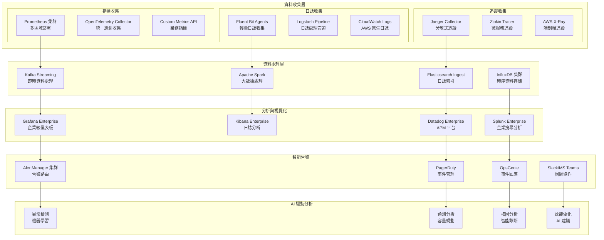

### 6.2 業務監控儀表板
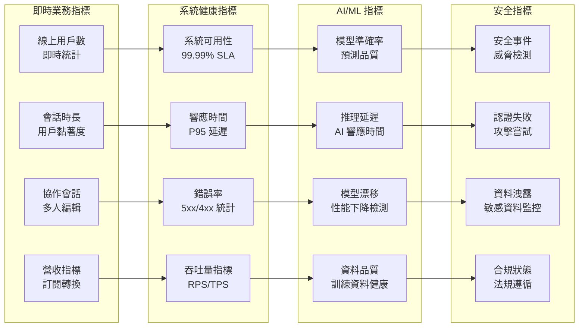

---

## 7. 成本管理與最佳化

### 7.1 企業級成本結構 ($12,000/月)
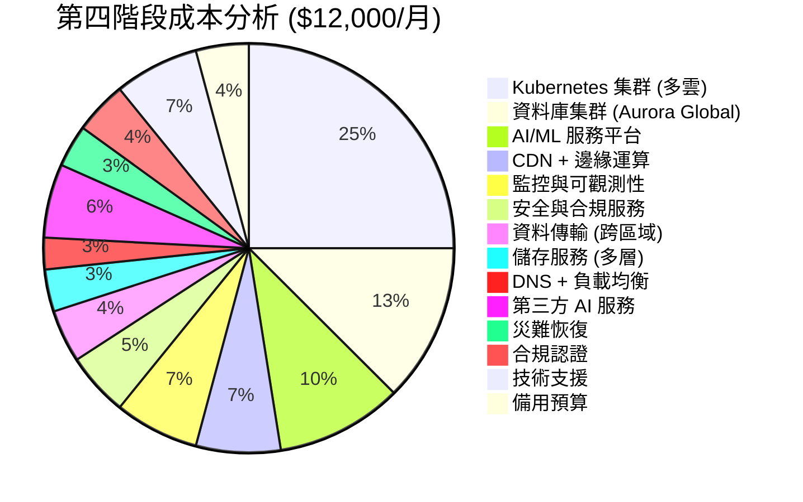

### 7.2 智能成本最佳化
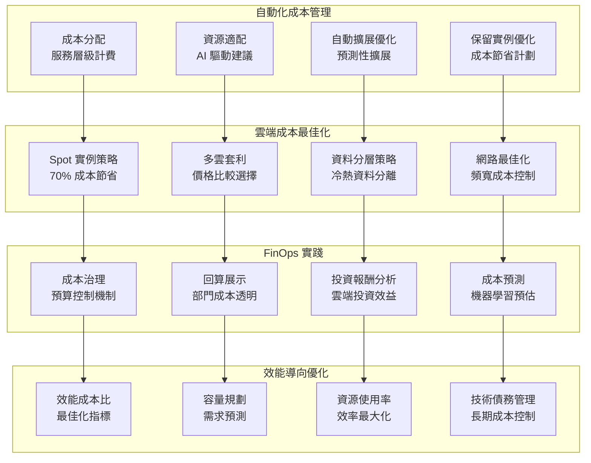

---

## 8. 災難恢復與業務持續性

### 8.1 多雲災難恢復架構
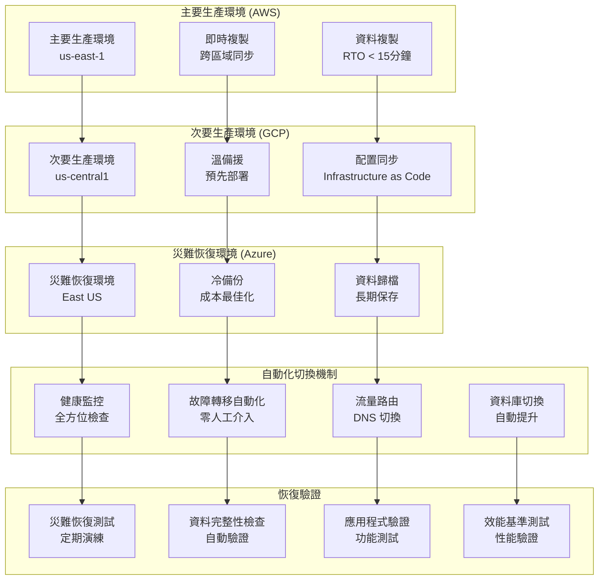

### 8.2 業務持續性指標
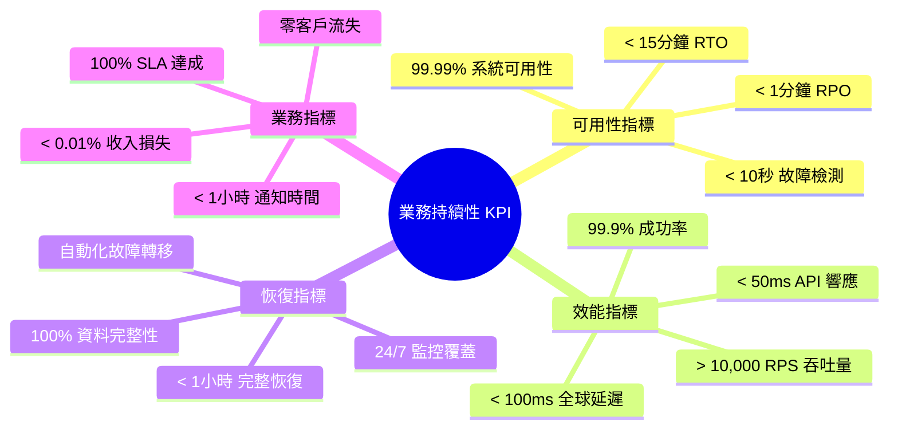

---

## 9. 持續演進與創新

### 9.1 技術創新路線圖
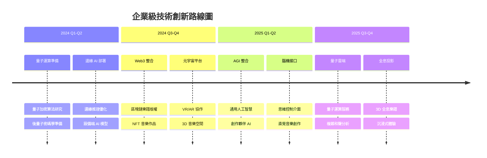

### 9.2 新興技術整合策略
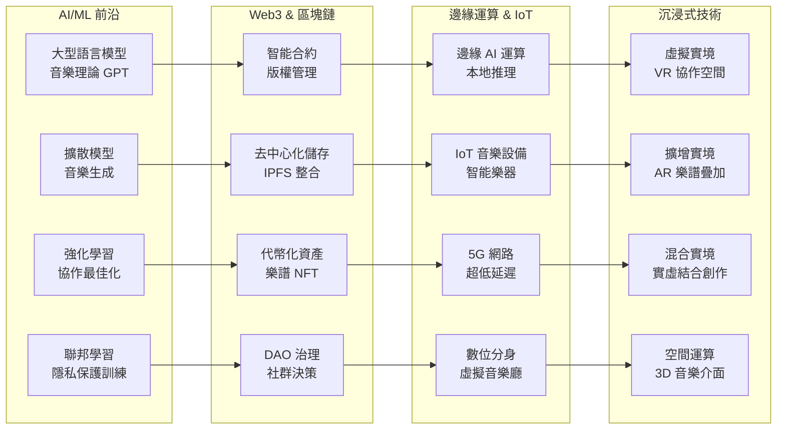

---

## 10. 總結與未來展望

### 10.1 企業級成就總覽
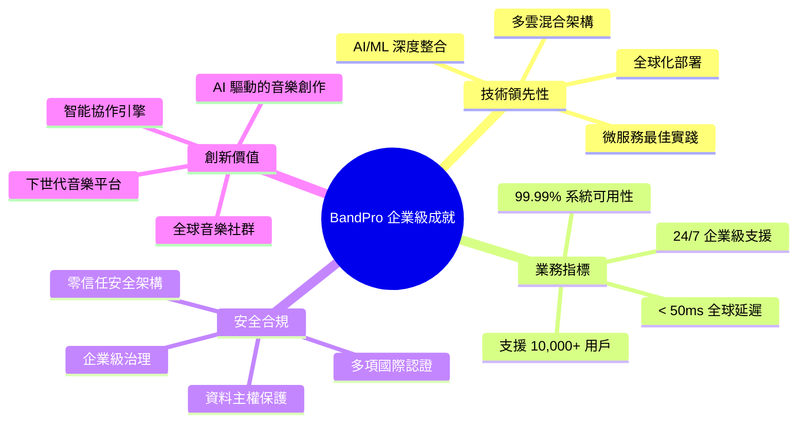

### 10.2 持續優化方向
1. **量子運算整合**：為後量子時代做準備，研究量子加密和量子機器學習在音樂領域的應用
2. **邊緣 AI 擴展**：將更多 AI 功能部署到邊緣節點，實現超低延遲的智能音樂處理
3. **Web3 生態建設**：構建去中心化的音樂創作和版權管理生態系統
4. **元宇宙音樂空間**：打造沉浸式的 3D 音樂創作和協作環境
5. **AGI 音樂夥伴**：開發具備創造力的通用人工智慧音樂創作助手

---

## 結語

BandPro 第四階段架構代表了音樂科技領域的最高水準，融合了：

✅ **世界級技術架構**：多雲混合、微服務、AI/ML 深度整合  
✅ **全球化服務能力**：多區域部署、資料主權合規、本地化服務  
✅ **企業級安全治理**：零信任架構、多重認證、全面合規  
✅ **超級可觀測性**：全棧監控、智能告警、預測分析  
✅ **持續創新能力**：前沿技術整合、敏捷響應市場需求  

這不僅是一個技術平台，更是音樂創作者的智能夥伴，引領音樂科技的未來發展。

🎼 **BandPro：讓音樂創作進入智能時代** 🎼
