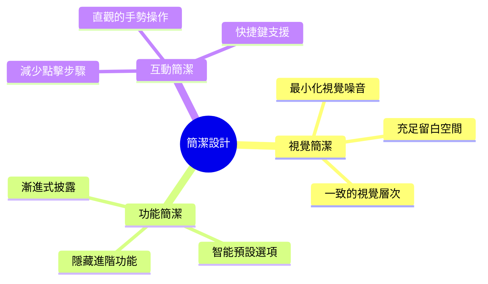
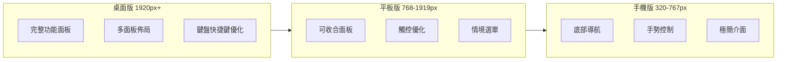
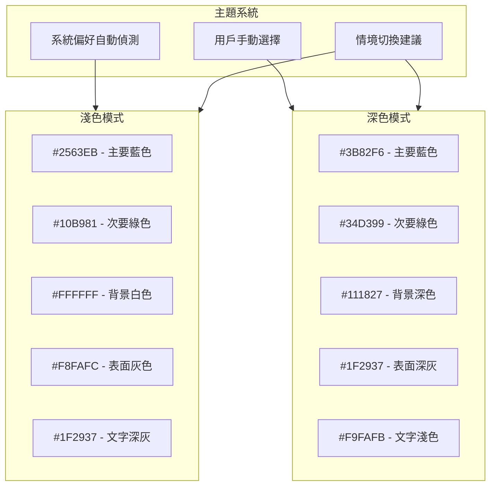
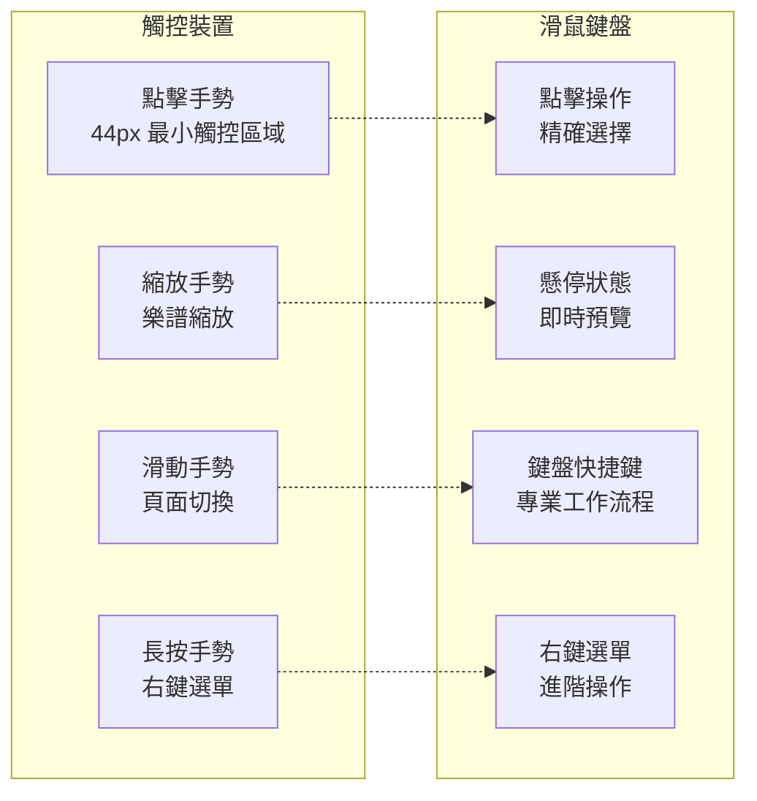
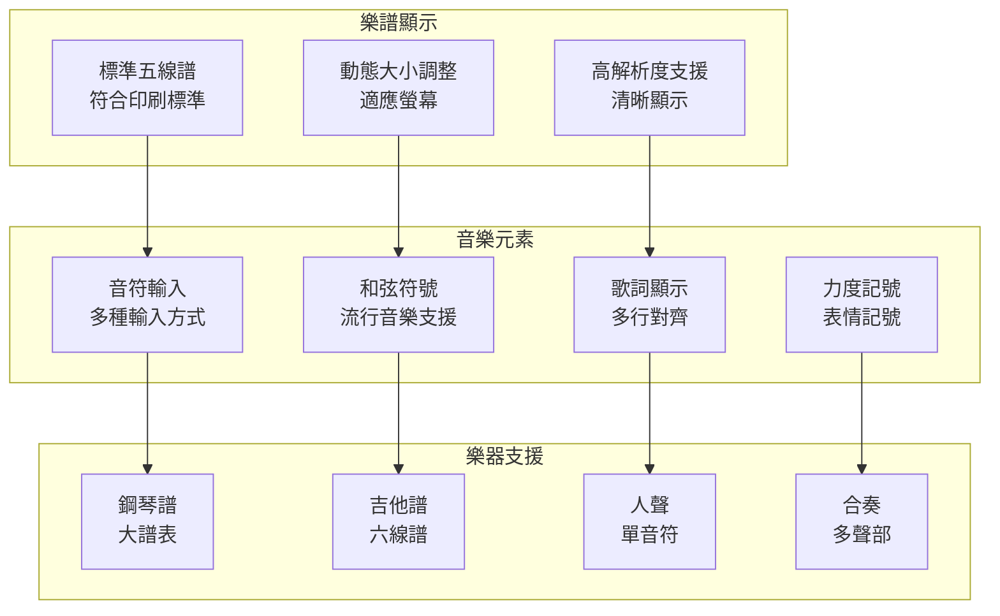
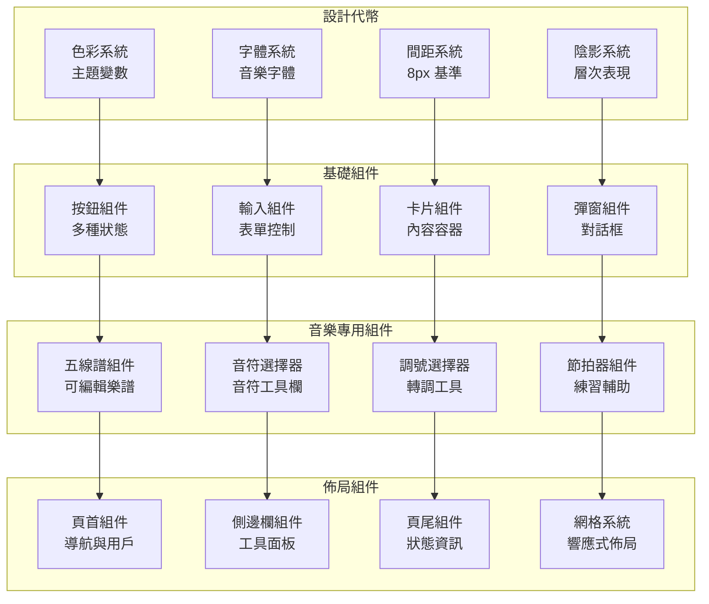
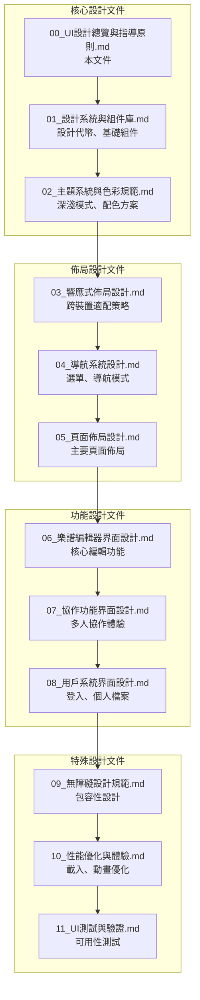

# BandPro UI/UX 設計總覽與指導原則

基於第一階段架構（小型工作室方案）的 UI/UX 完整設計規劃

## 🎯 設計目標

### 核心價值
- **專業音樂創作工具**：提供專業級樂譜編輯體驗
- **直覺易用**：讓音樂人專注創作而非學習工具
- **協作友善**：支援多人即時協作與溝通
- **跨平台一致**：電腦、平板、手機統一體驗

### 用戶群體
- **主要用戶**：音樂教師、學生、業餘音樂愛好者
- **次要用戶**：小型樂團、音樂工作室
- **技術水平**：中等，熟悉基本數位工具

---

## 🎨 設計原則

### 1. 簡潔至上 (Simplicity First)

### 2. 響應式設計 (Responsive Design)

### 3. 深淺色模式 (Dark/Light Theme)

---

## 📱 裝置適配策略

### 斷點設計
| 裝置類型 | 螢幕寺吋 | 斷點範圍 | 主要特色 |
|---------|----------|----------|----------|
| **手機直向** | 4"-6.7" | 320-480px | 單欄佈局、底部導航 |
| **手機橫向** | 4"-6.7" | 481-767px | 雙欄佈局、側邊選單 |
| **平板直向** | 7"-13" | 768-1024px | 可收合側邊欄 |
| **平板橫向** | 7"-13" | 1025-1919px | 多面板佈局 |
| **桌面** | 13"+ | 1920px+ | 完整功能介面 |

### 互動模式適配

---

## 🎵 音樂專業考量

### 樂譜顯示標準

---

## 🧩 組件化設計系統

### Design System 架構

---

## 📋 UI 規劃文件結構

### 文件拆分策略

---

## 🚀 第一階段實施重點

基於小型工作室方案的 UI 實施策略：

### 開發優先級

```mermaid
flowchart LR
    subgraph Phase1[第1週：基礎UI框架]
        DesignTokens[設計代幣設置<br/>CSS Variables]
        BasicComponents[基礎組件開發<br/>Button/Input/Card]
        ThemeSystem[主題切換系統<br/>Dark/Light Mode]
    end
    
    subgraph Phase2[第2週：核心界面]
        Layout[響應式佈局<br/>Header/Sidebar/Main]
        Navigation[導航系統<br/>路由與選單]
        MusicEditor[基礎樂譜編輯器<br/>五線譜顯示]
    end
    
    subgraph Phase3[第3週：功能完善]
        UserAuth[用戶界面<br/>登入/註冊]
        FileOperations[檔案操作界面<br/>匯入/匯出]
        Collaboration[協作界面<br/>即時編輯]
    end
    
    subgraph Phase4[第4週：優化測試]
        MobileOptimization[手機版優化<br/>觸控體驗]
        PerformanceOpt[性能優化<br/>載入速度]
        UserTesting[用戶測試<br/>體驗驗證]
    end
    
    Phase1 --> Phase2
    Phase2 --> Phase3
    Phase3 --> Phase4
```

### 技術實現重點
- **Vue.js 3 + TypeScript**：組件化開發
- **Tailwind CSS**：快速樣式開發
- **Headless UI**：無障礙組件基礎
- **Vite**：開發工具和構建
- **PWA 支援**：離線使用能力

---

## 📊 設計指標與目標

### 用戶體驗指標
| 指標類型 | 目標值 | 測量方法 |
|---------|--------|----------|
| **首次載入時間** | < 3秒 | Lighthouse |
| **操作響應時間** | < 200ms | User Testing |
| **學習曲線** | < 10分鐘上手 | Task Analysis |
| **錯誤率** | < 5% | Error Tracking |
| **用戶滿意度** | > 4.5/5 | User Survey |

### 技術指標
- **Lighthouse 分數**：> 90 (Performance, Accessibility, Best Practices, SEO)
- **跨瀏覽器相容**：Chrome, Firefox, Safari, Edge 最新版本
- **響應式覆蓋**：320px - 3840px 螢幕寬度
- **無障礙等級**：WCAG 2.1 AA 級別

---

## 🎯 下一步行動

1. **詳細設計文件**：按照文件結構逐一完善各部分設計
2. **原型設計**：使用 Figma 創建高保真原型
3. **組件開發**：建立可重用的 UI 組件庫
4. **用戶測試**：邀請目標用戶進行可用性測試
5. **持續迭代**：根據反饋不斷優化設計

👉 **接下來請參考各個詳細設計文件，開始具體的 UI/UX 實施工作**
