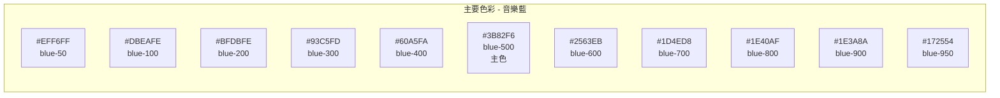
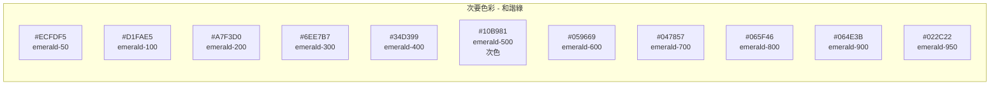
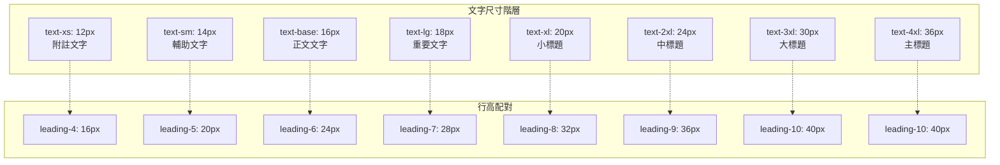
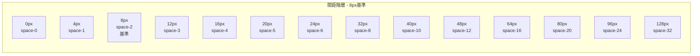
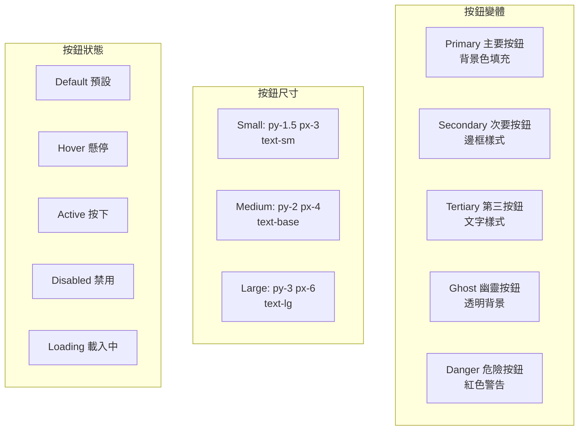
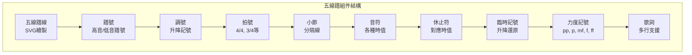

# BandPro 設計系統與組件庫

基於 Vue.js 3 + Tailwind CSS 的完整設計系統規範

## 🎨 設計代幣 (Design Tokens)

### 色彩系統 (Color Palette)

#### 主要色彩


#### 次要色彩


#### 語義色彩
```css
/* 成功色彩 */
--color-success-light: #10B981; /* emerald-500 */
--color-success-dark: #34D399;  /* emerald-400 */

/* 警告色彩 */
--color-warning-light: #F59E0B; /* amber-500 */
--color-warning-dark: #FCD34D;  /* amber-300 */

/* 錯誤色彩 */
--color-error-light: #EF4444;   /* red-500 */
--color-error-dark: #F87171;    /* red-400 */

/* 資訊色彩 */
--color-info-light: #3B82F6;    /* blue-500 */
--color-info-dark: #60A5FA;     /* blue-400 */
```

### 主題變數 (Theme Variables)

#### 淺色主題
```css
:root {
  /* 背景色彩 */
  --bg-primary: #FFFFFF;      /* white */
  --bg-secondary: #F8FAFC;    /* slate-50 */
  --bg-tertiary: #F1F5F9;     /* slate-100 */
  --bg-elevated: #FFFFFF;     /* white + shadow */
  
  /* 表面色彩 */
  --surface-primary: #FFFFFF;  /* white */
  --surface-secondary: #F8FAFC; /* slate-50 */
  --surface-tertiary: #E2E8F0; /* slate-200 */
  
  /* 文字色彩 */
  --text-primary: #0F172A;     /* slate-900 */
  --text-secondary: #475569;   /* slate-600 */
  --text-tertiary: #94A3B8;    /* slate-400 */
  --text-inverse: #FFFFFF;     /* white */
  
  /* 邊框色彩 */
  --border-primary: #E2E8F0;   /* slate-200 */
  --border-secondary: #CBD5E1; /* slate-300 */
  --border-focus: #3B82F6;     /* blue-500 */
  
  /* 陰影 */
  --shadow-sm: 0 1px 2px 0 rgb(0 0 0 / 0.05);
  --shadow-md: 0 4px 6px -1px rgb(0 0 0 / 0.1);
  --shadow-lg: 0 10px 15px -3px rgb(0 0 0 / 0.1);
  --shadow-xl: 0 20px 25px -5px rgb(0 0 0 / 0.1);
}
```

#### 深色主題
```css
[data-theme="dark"] {
  /* 背景色彩 */
  --bg-primary: #0F172A;      /* slate-900 */
  --bg-secondary: #1E293B;    /* slate-800 */
  --bg-tertiary: #334155;     /* slate-700 */
  --bg-elevated: #1E293B;     /* slate-800 + shadow */
  
  /* 表面色彩 */
  --surface-primary: #1E293B;  /* slate-800 */
  --surface-secondary: #334155; /* slate-700 */
  --surface-tertiary: #475569; /* slate-600 */
  
  /* 文字色彩 */
  --text-primary: #F8FAFC;     /* slate-50 */
  --text-secondary: #CBD5E1;   /* slate-300 */
  --text-tertiary: #64748B;    /* slate-500 */
  --text-inverse: #0F172A;     /* slate-900 */
  
  /* 邊框色彩 */
  --border-primary: #475569;   /* slate-600 */
  --border-secondary: #64748B; /* slate-500 */
  --border-focus: #60A5FA;     /* blue-400 */
  
  /* 陰影 */
  --shadow-sm: 0 1px 2px 0 rgb(0 0 0 / 0.3);
  --shadow-md: 0 4px 6px -1px rgb(0 0 0 / 0.4);
  --shadow-lg: 0 10px 15px -3px rgb(0 0 0 / 0.4);
  --shadow-xl: 0 20px 25px -5px rgb(0 0 0 / 0.5);
}
```

---

## 📝 字體系統 (Typography)

### 字體堆疊
```css
/* 主要字體 - 系統字體 */
--font-sans: 'Inter', 'Noto Sans TC', system-ui, -apple-system, sans-serif;

/* 音樂字體 - 樂譜專用 */
--font-music: 'Bravura', 'Academico', 'Finale Maestro', serif;

/* 等寬字體 - 代碼顯示 */
--font-mono: 'JetBrains Mono', 'SF Mono', Monaco, 'Cascadia Code', monospace;
```

### 字體大小階層


### 字重系統
```css
/* 字重定義 */
--font-weight-light: 300;    /* font-light */
--font-weight-normal: 400;   /* font-normal */
--font-weight-medium: 500;   /* font-medium */
--font-weight-semibold: 600; /* font-semibold */
--font-weight-bold: 700;     /* font-bold */
```

---

## 📏 間距系統 (Spacing)

### 8px 基準間距系統


### 間距使用指南
```css
/* 組件內部間距 */
--spacing-xs: 4px;   /* 緊密間距 */
--spacing-sm: 8px;   /* 小間距 */
--spacing-md: 16px;  /* 中等間距 */
--spacing-lg: 24px;  /* 大間距 */
--spacing-xl: 32px;  /* 特大間距 */

/* 佈局間距 */
--layout-xs: 16px;   /* 小型佈局間距 */
--layout-sm: 24px;   /* 中型佈局間距 */
--layout-md: 32px;   /* 大型佈局間距 */
--layout-lg: 48px;   /* 特大佈局間距 */
--layout-xl: 64px;   /* 超大佈局間距 */
```

---

## 🎭 組件庫架構

### 基礎組件 (Atoms)

#### Button 按鈕組件
```typescript
interface ButtonProps {
  variant: 'primary' | 'secondary' | 'tertiary' | 'ghost' | 'danger'
  size: 'sm' | 'md' | 'lg'
  disabled?: boolean
  loading?: boolean
  icon?: string
  iconPosition?: 'left' | 'right'
  fullWidth?: boolean
}
```



#### Input 輸入組件
```typescript
interface InputProps {
  type: 'text' | 'email' | 'password' | 'number' | 'search'
  size: 'sm' | 'md' | 'lg'
  variant: 'default' | 'filled' | 'bordered'
  label?: string
  placeholder?: string
  helperText?: string
  error?: string
  disabled?: boolean
  required?: boolean
  prefix?: string
  suffix?: string
}
```

#### Card 卡片組件
```typescript
interface CardProps {
  variant: 'elevated' | 'outlined' | 'filled'
  padding: 'none' | 'sm' | 'md' | 'lg'
  hoverable?: boolean
  clickable?: boolean
}
```

### 音樂專用組件 (Music Components)

#### StaffRenderer 五線譜渲染器
```typescript
interface StaffRendererProps {
  scoreData: ScoreData
  readonly?: boolean
  zoom: number
  showMeasureNumbers?: boolean
  showClefs?: boolean
  showKeySignature?: boolean
  showTimeSignature?: boolean
  onNoteClick?: (note: Note) => void
  onMeasureClick?: (measure: number) => void
}
```



#### NoteToolbar 音符工具欄
```typescript
interface NoteToolbarProps {
  selectedTool: NoteTool
  onToolChange: (tool: NoteTool) => void
  availableNoteValues: NoteValue[]
  selectedNoteValue: NoteValue
  onNoteValueChange: (value: NoteValue) => void
  showAccidentals?: boolean
  showArticulations?: boolean
}
```

### 佈局組件 (Layout Components)

#### AppHeader 應用標題
```typescript
interface AppHeaderProps {
  title: string
  showLogo?: boolean
  showNavigation?: boolean
  showUserMenu?: boolean
  showThemeToggle?: boolean
  currentTheme: 'light' | 'dark'
  onThemeChange: (theme: 'light' | 'dark') => void
}
```

#### ResponsiveSidebar 響應式側邊欄
```typescript
interface ResponsiveSidebarProps {
  isOpen: boolean
  onToggle: () => void
  position: 'left' | 'right'
  width: string
  collapsible?: boolean
  overlay?: boolean
  persistent?: boolean
}
```

---

## 🎨 組件樣式規範

### CSS 自訂屬性使用
```css
/* 組件基礎樣式 */
.btn {
  @apply inline-flex items-center justify-center;
  @apply font-medium rounded-md transition-colors;
  @apply focus:outline-none focus:ring-2 focus:ring-offset-2;
  
  /* 使用設計代幣 */
  padding: var(--spacing-sm) var(--spacing-md);
  font-size: var(--text-base);
  line-height: var(--leading-6);
}

/* 主要按鈕變體 */
.btn-primary {
  @apply bg-blue-500 text-white;
  @apply hover:bg-blue-600 active:bg-blue-700;
  @apply focus:ring-blue-500;
  @apply disabled:bg-gray-300 disabled:text-gray-500;
}

/* 深色模式適配 */
@media (prefers-color-scheme: dark) {
  .btn-primary {
    @apply bg-blue-600 hover:bg-blue-700 active:bg-blue-800;
  }
}
```

### 動畫與過渡
```css
/* 標準過渡時間 */
--transition-fast: 150ms;
--transition-base: 200ms;
--transition-slow: 300ms;

/* 緩動函數 */
--ease-in-out: cubic-bezier(0.4, 0, 0.2, 1);
--ease-out: cubic-bezier(0, 0, 0.2, 1);
--ease-in: cubic-bezier(0.4, 0, 1, 1);

/* 組件動畫 */
.fade-enter-active,
.fade-leave-active {
  transition: opacity var(--transition-base) var(--ease-in-out);
}

.slide-enter-active,
.slide-leave-active {
  transition: transform var(--transition-base) var(--ease-in-out);
}
```

---

## 📱 響應式組件行為

### 斷點系統整合
```typescript
// 響應式Hook
export const useBreakpoint = () => {
  const breakpoint = ref('mobile')
  
  const updateBreakpoint = () => {
    const width = window.innerWidth
    if (width < 768) breakpoint.value = 'mobile'
    else if (width < 1024) breakpoint.value = 'tablet'
    else breakpoint.value = 'desktop'
  }
  
  return { breakpoint }
}

// 組件中使用
const Component = defineComponent({
  setup() {
    const { breakpoint } = useBreakpoint()
    
    const isMobile = computed(() => breakpoint.value === 'mobile')
    const showSidebar = computed(() => !isMobile.value)
    
    return { isMobile, showSidebar }
  }
})
```

### 觸控優化
```css
/* 觸控目標最小尺寸 */
.touch-target {
  min-height: 44px;
  min-width: 44px;
}

/* 觸控反饋 */
.touchable {
  @apply active:scale-95 transition-transform;
  -webkit-tap-highlight-color: transparent;
}

/* 滾動優化 */
.scroll-area {
  -webkit-overflow-scrolling: touch;
  scrollbar-width: thin;
  scrollbar-color: var(--border-secondary) transparent;
}
```

---

## 🧪 組件測試策略

### 視覺回歸測試
```typescript
// Storybook 故事定義
export default {
  title: 'Components/Button',
  component: Button,
  parameters: {
    docs: {
      description: {
        component: 'Basic button component with multiple variants'
      }
    }
  }
}

export const Default = () => ({
  template: '<Button>Default Button</Button>'
})

export const AllVariants = () => ({
  template: `
    <div class="space-y-4">
      <Button variant="primary">Primary</Button>
      <Button variant="secondary">Secondary</Button>
      <Button variant="tertiary">Tertiary</Button>
      <Button variant="ghost">Ghost</Button>
      <Button variant="danger">Danger</Button>
    </div>
  `
})
```

### 無障礙測試
```typescript
// Jest + Testing Library
import { render, screen } from '@testing-library/vue'
import Button from './Button.vue'

describe('Button Component', () => {
  test('should be keyboard accessible', async () => {
    render(Button, { props: { children: 'Test Button' } })
    
    const button = screen.getByRole('button')
    expect(button).toBeInTheDocument()
    expect(button).not.toHaveAttribute('tabindex', '-1')
  })
  
  test('should have proper ARIA attributes', () => {
    render(Button, { 
      props: { 
        children: 'Test Button',
        disabled: true
      } 
    })
    
    const button = screen.getByRole('button')
    expect(button).toHaveAttribute('aria-disabled', 'true')
  })
})
```

---

## 📚 開發工具與工作流程

### Tailwind CSS 配置
```javascript
// tailwind.config.js
module.exports = {
  content: [
    './src/**/*.{vue,js,ts,jsx,tsx}',
    './docs/**/*.md'
  ],
  darkMode: 'class',
  theme: {
    extend: {
      colors: {
        primary: {
          50: '#eff6ff',
          500: '#3b82f6',
          900: '#1e3a8a',
        },
        secondary: {
          50: '#ecfdf5',
          500: '#10b981',
          900: '#064e3b',
        }
      },
      fontFamily: {
        sans: ['Inter', 'Noto Sans TC', 'sans-serif'],
        music: ['Bravura', 'serif']
      },
      spacing: {
        '18': '4.5rem',
        '88': '22rem',
      }
    }
  },
  plugins: [
    require('@tailwindcss/forms'),
    require('@tailwindcss/typography'),
    require('@headlessui/tailwindcss')
  ]
}
```

### 組件自動導入
```typescript
// vite.config.ts
import { defineConfig } from 'vite'
import vue from '@vitejs/plugin-vue'
import Components from 'unplugin-vue-components/vite'
import { HeadlessUiResolver } from 'unplugin-vue-components/resolvers'

export default defineConfig({
  plugins: [
    vue(),
    Components({
      resolvers: [HeadlessUiResolver()],
      dts: true
    })
  ]
})
```

---

## 🎯 實施路線圖

### 第一階段：基礎組件 (第1週)
- [ ] 設計代幣設置
- [ ] 基礎組件開發 (Button, Input, Card)
- [ ] 主題切換系統
- [ ] Storybook 設置

### 第二階段：音樂組件 (第2週)
- [ ] 五線譜渲染器
- [ ] 音符工具欄
- [ ] 樂器選擇器
- [ ] 播放控制

### 第三階段：佈局組件 (第3週)
- [ ] 響應式導航
- [ ] 側邊欄系統
- [ ] 模態框組件
- [ ] 通知系統

### 第四階段：優化測試 (第4週)
- [ ] 性能優化
- [ ] 無障礙測試
- [ ] 跨瀏覽器測試
- [ ] 用戶體驗優化

👉 **下一步：參考 [02_主題系統與色彩規範.md](./02_主題系統與色彩規範.md) 詳細了解主題實現**
