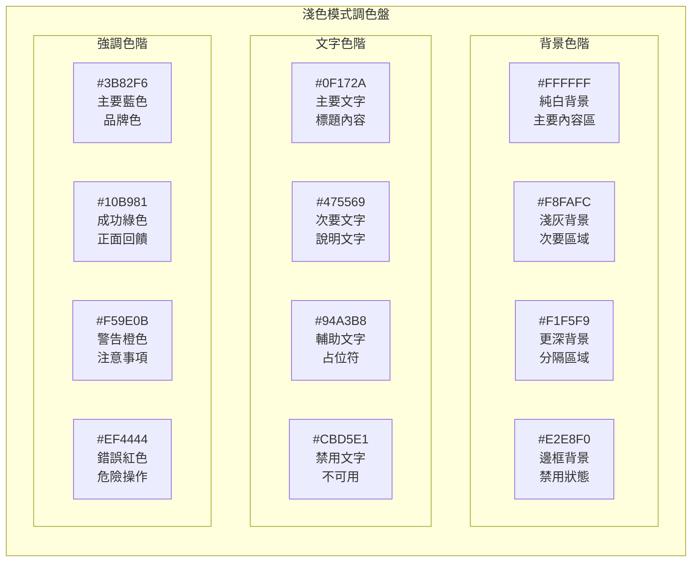
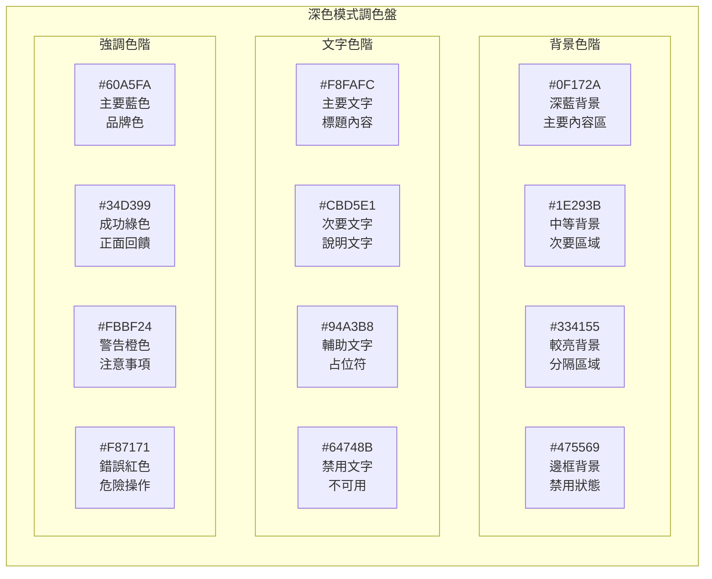
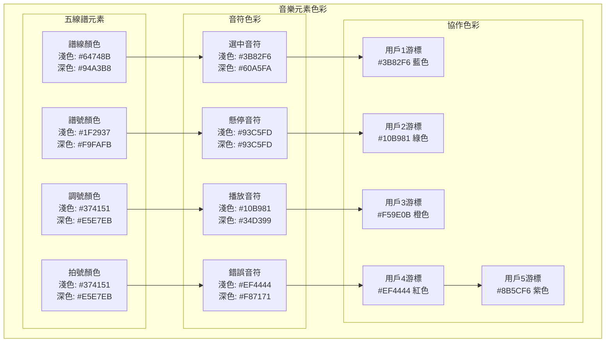

# BandPro 主題系統與色彩規範

深淺色模式完整實現方案與視覺指導原則

## 🌓 主題系統架構

### 主題切換機制
```mermaid
flowchart TD
    subgraph ThemeDetection[主題偵測]
        SystemPreference[系統偏好偵測<br/>prefers-color-scheme]
        UserPreference[用戶手動選擇<br/>localStorage存儲]
        DefaultTheme[預設主題<br/>跟隨系統]
    end
    
    subgraph ThemeState[主題狀態管理]
        VueReactivity[Vue響應式狀態<br/>theme.value]
        CSSVariables[CSS自訂屬性<br/>--color-*]
        HTMLAttribute[HTML屬性<br/>data-theme="dark"]
    end
    
    subgraph ThemeApplication[主題應用]
        ComponentStyles[組件樣式更新<br/>自動切換]
        AnimatedTransition[平滑過渡動畫<br/>200ms transition]
        PersistentStorage[持久化儲存<br/>下次訪問記住]
    end
    
    SystemPreference --> VueReactivity
    UserPreference --> VueReactivity
    DefaultTheme --> VueReactivity
    
    VueReactivity --> CSSVariables
    VueReactivity --> HTMLAttribute
    
    CSSVariables --> ComponentStyles
    HTMLAttribute --> AnimatedTransition
    ComponentStyles --> PersistentStorage
```

### TypeScript 主題類型定義
```typescript
// types/theme.ts
export type ThemeMode = 'light' | 'dark' | 'auto'

export interface ThemeColors {
  // 背景色彩
  background: {
    primary: string
    secondary: string
    tertiary: string
    elevated: string
  }
  
  // 表面色彩
  surface: {
    primary: string
    secondary: string
    tertiary: string
  }
  
  // 文字色彩
  text: {
    primary: string
    secondary: string
    tertiary: string
    inverse: string
  }
  
  // 邊框色彩
  border: {
    primary: string
    secondary: string
    focus: string
  }
  
  // 品牌色彩
  brand: {
    primary: string
    secondary: string
  }
  
  // 語義色彩
  semantic: {
    success: string
    warning: string
    error: string
    info: string
  }
}

export interface ThemeConfig {
  mode: ThemeMode
  colors: ThemeColors
  typography: TypographyConfig
  spacing: SpacingConfig
  shadows: ShadowConfig
}
```

---

## 🎨 色彩規範詳解

### 淺色模式色彩系統


#### 淺色模式 CSS 變數
```css
:root,
[data-theme="light"] {
  /* 背景色彩 */
  --bg-primary: #FFFFFF;
  --bg-secondary: #F8FAFC;
  --bg-tertiary: #F1F5F9;
  --bg-elevated: #FFFFFF;
  --bg-overlay: rgba(0, 0, 0, 0.1);
  
  /* 表面色彩 */
  --surface-primary: #FFFFFF;
  --surface-secondary: #F8FAFC;
  --surface-tertiary: #E2E8F0;
  --surface-hover: #F1F5F9;
  --surface-pressed: #E2E8F0;
  
  /* 文字色彩 */
  --text-primary: #0F172A;
  --text-secondary: #475569;
  --text-tertiary: #94A3B8;
  --text-disabled: #CBD5E1;
  --text-inverse: #FFFFFF;
  --text-link: #3B82F6;
  --text-link-hover: #2563EB;
  
  /* 邊框色彩 */
  --border-primary: #E2E8F0;
  --border-secondary: #CBD5E1;
  --border-tertiary: #94A3B8;
  --border-focus: #3B82F6;
  --border-error: #EF4444;
  --border-success: #10B981;
  
  /* 品牌色彩 */
  --brand-primary: #3B82F6;
  --brand-primary-hover: #2563EB;
  --brand-primary-pressed: #1D4ED8;
  --brand-secondary: #10B981;
  --brand-secondary-hover: #059669;
  --brand-secondary-pressed: #047857;
  
  /* 語義色彩 */
  --success: #10B981;
  --success-bg: #ECFDF5;
  --success-border: #A7F3D0;
  --warning: #F59E0B;
  --warning-bg: #FFFBEB;
  --warning-border: #FED7AA;
  --error: #EF4444;
  --error-bg: #FEF2F2;
  --error-border: #FECACA;
  --info: #3B82F6;
  --info-bg: #EFF6FF;
  --info-border: #BFDBFE;
  
  /* 陰影系統 */
  --shadow-xs: 0 1px 2px 0 rgba(0, 0, 0, 0.05);
  --shadow-sm: 0 1px 3px 0 rgba(0, 0, 0, 0.1), 0 1px 2px -1px rgba(0, 0, 0, 0.1);
  --shadow-md: 0 4px 6px -1px rgba(0, 0, 0, 0.1), 0 2px 4px -2px rgba(0, 0, 0, 0.1);
  --shadow-lg: 0 10px 15px -3px rgba(0, 0, 0, 0.1), 0 4px 6px -4px rgba(0, 0, 0, 0.1);
  --shadow-xl: 0 20px 25px -5px rgba(0, 0, 0, 0.1), 0 8px 10px -6px rgba(0, 0, 0, 0.1);
  --shadow-2xl: 0 25px 50px -12px rgba(0, 0, 0, 0.25);
}
```

### 深色模式色彩系統


#### 深色模式 CSS 變數
```css
[data-theme="dark"] {
  /* 背景色彩 */
  --bg-primary: #0F172A;
  --bg-secondary: #1E293B;
  --bg-tertiary: #334155;
  --bg-elevated: #1E293B;
  --bg-overlay: rgba(0, 0, 0, 0.5);
  
  /* 表面色彩 */
  --surface-primary: #1E293B;
  --surface-secondary: #334155;
  --surface-tertiary: #475569;
  --surface-hover: #334155;
  --surface-pressed: #475569;
  
  /* 文字色彩 */
  --text-primary: #F8FAFC;
  --text-secondary: #CBD5E1;
  --text-tertiary: #94A3B8;
  --text-disabled: #64748B;
  --text-inverse: #0F172A;
  --text-link: #60A5FA;
  --text-link-hover: #3B82F6;
  
  /* 邊框色彩 */
  --border-primary: #475569;
  --border-secondary: #64748B;
  --border-tertiary: #94A3B8;
  --border-focus: #60A5FA;
  --border-error: #F87171;
  --border-success: #34D399;
  
  /* 品牌色彩 */
  --brand-primary: #60A5FA;
  --brand-primary-hover: #3B82F6;
  --brand-primary-pressed: #2563EB;
  --brand-secondary: #34D399;
  --brand-secondary-hover: #10B981;
  --brand-secondary-pressed: #059669;
  
  /* 語義色彩 */
  --success: #34D399;
  --success-bg: #022C22;
  --success-border: #064E3B;
  --warning: #FBBF24;
  --warning-bg: #451A03;
  --warning-border: #92400E;
  --error: #F87171;
  --error-bg: #450A0A;
  --error-border: #991B1B;
  --info: #60A5FA;
  --info-bg: #172554;
  --info-border: #1E40AF;
  
  /* 陰影系統 - 深色模式需要更強的陰影 */
  --shadow-xs: 0 1px 2px 0 rgba(0, 0, 0, 0.3);
  --shadow-sm: 0 1px 3px 0 rgba(0, 0, 0, 0.4), 0 1px 2px -1px rgba(0, 0, 0, 0.4);
  --shadow-md: 0 4px 6px -1px rgba(0, 0, 0, 0.4), 0 2px 4px -2px rgba(0, 0, 0, 0.4);
  --shadow-lg: 0 10px 15px -3px rgba(0, 0, 0, 0.4), 0 4px 6px -4px rgba(0, 0, 0, 0.4);
  --shadow-xl: 0 20px 25px -5px rgba(0, 0, 0, 0.4), 0 8px 10px -6px rgba(0, 0, 0, 0.4);
  --shadow-2xl: 0 25px 50px -12px rgba(0, 0, 0, 0.5);
}
```

---

## 🎼 音樂專用色彩

### 樂譜元素色彩


#### 音樂色彩 CSS 變數
```css
/* 淺色模式音樂色彩 */
[data-theme="light"] {
  /* 樂譜基礎元素 */
  --music-staff-lines: #64748B;
  --music-clef: #1F2937;
  --music-key-signature: #374151;
  --music-time-signature: #374151;
  --music-measure-lines: #94A3B8;
  
  /* 音符狀態色彩 */
  --music-note-default: #1F2937;
  --music-note-selected: #3B82F6;
  --music-note-hover: #93C5FD;
  --music-note-playing: #10B981;
  --music-note-error: #EF4444;
  --music-note-disabled: #CBD5E1;
  
  /* 協作用戶色彩 */
  --collab-user-1: #3B82F6;
  --collab-user-2: #10B981;
  --collab-user-3: #F59E0B;
  --collab-user-4: #EF4444;
  --collab-user-5: #8B5CF6;
  --collab-user-6: #EC4899;
  --collab-user-7: #14B8A6;
  --collab-user-8: #F97316;
}

/* 深色模式音樂色彩 */
[data-theme="dark"] {
  /* 樂譜基礎元素 */
  --music-staff-lines: #94A3B8;
  --music-clef: #F9FAFB;
  --music-key-signature: #E5E7EB;
  --music-time-signature: #E5E7EB;
  --music-measure-lines: #64748B;
  
  /* 音符狀態色彩 */
  --music-note-default: #F9FAFB;
  --music-note-selected: #60A5FA;
  --music-note-hover: #93C5FD;
  --music-note-playing: #34D399;
  --music-note-error: #F87171;
  --music-note-disabled: #64748B;
  
  /* 協作用戶色彩 - 深色模式使用相同色彩但透明度調整 */
  --collab-user-1: #60A5FA;
  --collab-user-2: #34D399;
  --collab-user-3: #FBBF24;
  --collab-user-4: #F87171;
  --collab-user-5: #A78BFA;
  --collab-user-6: #F472B6;
  --collab-user-7: #2DD4BF;
  --collab-user-8: #FB923C;
}
```

---

## 🎛️ 主題切換實現

### Vue 3 Composition API 實現
```typescript
// composables/useTheme.ts
import { ref, computed, watch, onMounted } from 'vue'

type ThemeMode = 'light' | 'dark' | 'auto'

export const useTheme = () => {
  const themeMode = ref<ThemeMode>('auto')
  const systemTheme = ref<'light' | 'dark'>('light')
  
  // 計算當前實際主題
  const currentTheme = computed(() => {
    if (themeMode.value === 'auto') {
      return systemTheme.value
    }
    return themeMode.value === 'dark' ? 'dark' : 'light'
  })
  
  // 監聽系統主題變化
  const mediaQuery = window.matchMedia('(prefers-color-scheme: dark)')
  
  const updateSystemTheme = () => {
    systemTheme.value = mediaQuery.matches ? 'dark' : 'light'
  }
  
  // 應用主題到 DOM
  const applyTheme = (theme: 'light' | 'dark') => {
    const root = document.documentElement
    root.setAttribute('data-theme', theme)
    
    // 添加過渡效果
    root.style.transition = 'background-color 0.2s ease, color 0.2s ease'
    
    // 移除過渡效果（避免影響其他動畫）
    setTimeout(() => {
      root.style.transition = ''
    }, 200)
  }
  
  // 切換主題
  const setTheme = (mode: ThemeMode) => {
    themeMode.value = mode
    localStorage.setItem('theme-preference', mode)
  }
  
  // 初始化主題
  const initTheme = () => {
    // 從 localStorage 讀取用戶偏好
    const stored = localStorage.getItem('theme-preference') as ThemeMode
    if (stored && ['light', 'dark', 'auto'].includes(stored)) {
      themeMode.value = stored
    }
    
    // 更新系統主題
    updateSystemTheme()
    
    // 監聽系統主題變化
    mediaQuery.addEventListener('change', updateSystemTheme)
  }
  
  // 監聽主題變化並應用
  watch(currentTheme, (theme) => {
    applyTheme(theme)
  }, { immediate: true })
  
  onMounted(() => {
    initTheme()
  })
  
  return {
    themeMode,
    currentTheme,
    setTheme,
    toggleTheme: () => {
      const nextTheme = currentTheme.value === 'light' ? 'dark' : 'light'
      setTheme(nextTheme)
    }
  }
}
```

### 主題切換按鈕組件
```vue
<!-- components/ThemeToggle.vue -->
<template>
  <button
    @click="toggleTheme"
    class="theme-toggle"
    :aria-label="`切換到${nextThemeLabel}模式`"
    type="button"
  >
    <Transition name="theme-icon" mode="out-in">
      <SunIcon
        v-if="currentTheme === 'dark'"
        key="sun"
        class="w-5 h-5"
      />
      <MoonIcon
        v-else
        key="moon"
        class="w-5 h-5"
      />
    </Transition>
    
    <!-- 可選的文字標籤 -->
    <span v-if="showLabel" class="ml-2 text-sm font-medium">
      {{ nextThemeLabel }}
    </span>
  </button>
</template>

<script setup lang="ts">
import { computed } from 'vue'
import { SunIcon, MoonIcon } from '@heroicons/vue/24/outline'
import { useTheme } from '@/composables/useTheme'

interface Props {
  showLabel?: boolean
}

withDefaults(defineProps<Props>(), {
  showLabel: false
})

const { currentTheme, toggleTheme } = useTheme()

const nextThemeLabel = computed(() => {
  return currentTheme.value === 'light' ? '深色' : '淺色'
})
</script>

<style scoped>
.theme-toggle {
  @apply inline-flex items-center justify-center;
  @apply w-10 h-10 rounded-lg;
  @apply text-gray-500 hover:text-gray-900;
  @apply bg-gray-100 hover:bg-gray-200;
  @apply dark:text-gray-400 dark:hover:text-gray-100;
  @apply dark:bg-gray-800 dark:hover:bg-gray-700;
  @apply transition-colors duration-200;
  @apply focus:outline-none focus:ring-2 focus:ring-blue-500 focus:ring-offset-2;
  @apply dark:focus:ring-offset-gray-800;
}

/* 圖標切換動畫 */
.theme-icon-enter-active,
.theme-icon-leave-active {
  transition: all 0.2s ease;
}

.theme-icon-enter-from {
  opacity: 0;
  transform: rotate(-90deg) scale(0.8);
}

.theme-icon-leave-to {
  opacity: 0;
  transform: rotate(90deg) scale(0.8);
}
</style>
```

---

## 🎯 主題適配最佳實踐

### 條件樣式應用
```scss
// 使用 CSS 自訂屬性而不是硬編碼顏色
.card {
  background-color: var(--surface-primary);
  border: 1px solid var(--border-primary);
  color: var(--text-primary);
  box-shadow: var(--shadow-md);
  
  // 懸停狀態
  &:hover {
    background-color: var(--surface-hover);
    box-shadow: var(--shadow-lg);
  }
}

// 避免這樣寫
.card-bad {
  background-color: #ffffff; /* 只適用於淺色模式 */
  color: #000000; /* 深色模式下不可讀 */
}
```

### 圖片和圖標適配
```vue
<template>
  <!-- SVG 圖標使用 currentColor -->
  <svg class="icon" fill="currentColor">
    <path d="..." />
  </svg>
  
  <!-- 不同主題使用不同圖片 -->
  
  
  <!-- CSS 背景圖片適配 -->
  <div class="hero-section">
    <!-- 內容 -->
  </div>
</template>

<style scoped>
.icon {
  @apply text-gray-600 dark:text-gray-300;
}

.hero-section {
  background-image: url('/hero-light.jpg');
}

[data-theme="dark"] .hero-section {
  background-image: url('/hero-dark.jpg');
}
</style>
```

### 音樂符號適配
```css
/* 音樂符號在不同主題下的顯示 */
.music-note {
  fill: var(--music-note-default);
  stroke: var(--music-note-default);
  stroke-width: 0.5;
  
  &.selected {
    fill: var(--music-note-selected);
    stroke: var(--music-note-selected);
  }
  
  &.playing {
    fill: var(--music-note-playing);
    stroke: var(--music-note-playing);
    animation: note-pulse 1s ease-in-out infinite;
  }
}

/* 五線譜在不同主題下的適配 */
.staff-line {
  stroke: var(--music-staff-lines);
  stroke-width: 1;
  fill: none;
}

.measure-line {
  stroke: var(--music-measure-lines);
  stroke-width: 1.5;
  fill: none;
}
```

---

## 🧪 主題測試策略

### 視覺回歸測試
```typescript
// tests/visual/theme.spec.ts
import { test, expect } from '@playwright/test'

test.describe('Theme System', () => {
  test('should render correctly in light mode', async ({ page }) => {
    await page.goto('/')
    await page.evaluate(() => {
      document.documentElement.setAttribute('data-theme', 'light')
    })
    
    await expect(page).toHaveScreenshot('light-theme-homepage.png')
  })
  
  test('should render correctly in dark mode', async ({ page }) => {
    await page.goto('/')
    await page.evaluate(() => {
      document.documentElement.setAttribute('data-theme', 'dark')
    })
    
    await expect(page).toHaveScreenshot('dark-theme-homepage.png')
  })
  
  test('should smoothly transition between themes', async ({ page }) => {
    await page.goto('/')
    
    // 點擊主題切換按鈕
    await page.click('[aria-label*="切換"]')
    
    // 等待過渡動畫完成
    await page.waitForTimeout(300)
    
    await expect(page).toHaveScreenshot('theme-transition.png')
  })
})
```

### 色彩對比度測試
```typescript
// tests/accessibility/contrast.spec.ts
import { test, expect } from '@playwright/test'
import { checkContrast } from '@playwright/test/accessibility'

test('should meet WCAG contrast requirements', async ({ page }) => {
  await page.goto('/')
  
  // 測試淺色模式對比度
  await page.evaluate(() => {
    document.documentElement.setAttribute('data-theme', 'light')
  })
  
  const lightContrast = await checkContrast(page, {
    textColor: '#0F172A', // --text-primary
    backgroundColor: '#FFFFFF' // --bg-primary
  })
  
  expect(lightContrast.ratio).toBeGreaterThan(4.5) // WCAG AA 標準
  
  // 測試深色模式對比度
  await page.evaluate(() => {
    document.documentElement.setAttribute('data-theme', 'dark')
  })
  
  const darkContrast = await checkContrast(page, {
    textColor: '#F8FAFC', // --text-primary
    backgroundColor: '#0F172A' // --bg-primary
  })
  
  expect(darkContrast.ratio).toBeGreaterThan(4.5)
})
```

---

## 📱 響應式主題考量

### 移動裝置主題優化
```css
/* 移動裝置上的主題優化 */
@media (max-width: 768px) {
  [data-theme="light"] {
    /* 淺色模式下稍微降低對比度，減少眼睛疲勞 */
    --bg-primary: #FAFAFA;
    --text-primary: #1A1A1A;
  }
  
  [data-theme="dark"] {
    /* 深色模式下使用真正的黑色背景，節省電池 */
    --bg-primary: #000000;
    --bg-secondary: #111111;
  }
}

/* 高亮度環境下的調整 */
@media (prefers-contrast: high) {
  :root {
    --border-primary: #000000;
    --text-secondary: #000000;
  }
  
  [data-theme="dark"] {
    --border-primary: #FFFFFF;
    --text-secondary: #FFFFFF;
  }
}

/* 減少動畫偏好 */
@media (prefers-reduced-motion: reduce) {
  .theme-toggle,
  .theme-icon-enter-active,
  .theme-icon-leave-active {
    transition: none !important;
    animation: none !important;
  }
}
```

---

## 🎯 實施檢查清單

### 開發階段
- [ ] 設置 CSS 自訂屬性系統
- [ ] 實現主題切換邏輯
- [ ] 創建主題切換組件
- [ ] 適配所有 UI 組件
- [ ] 測試音樂符號顯示

### 測試階段
- [ ] 色彩對比度測試（WCAG AA）
- [ ] 視覺回歸測試
- [ ] 跨瀏覽器主題測試
- [ ] 移動裝置主題測試
- [ ] 無障礙功能測試

### 發布準備
- [ ] 性能影響評估
- [ ] 用戶偏好記憶功能
- [ ] 系統主題跟隨功能
- [ ] 平滑過渡動畫
- [ ] 文檔更新

👉 **下一步：參考 [03_響應式佈局設計.md](./03_響應式佈局設計.md) 了解跨裝置適配策略**
