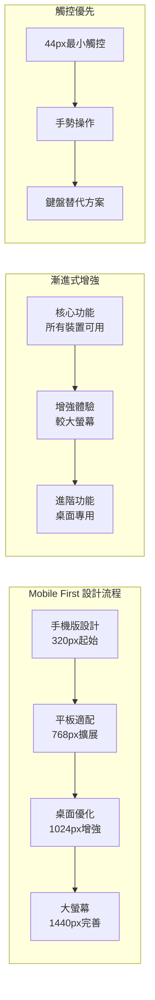
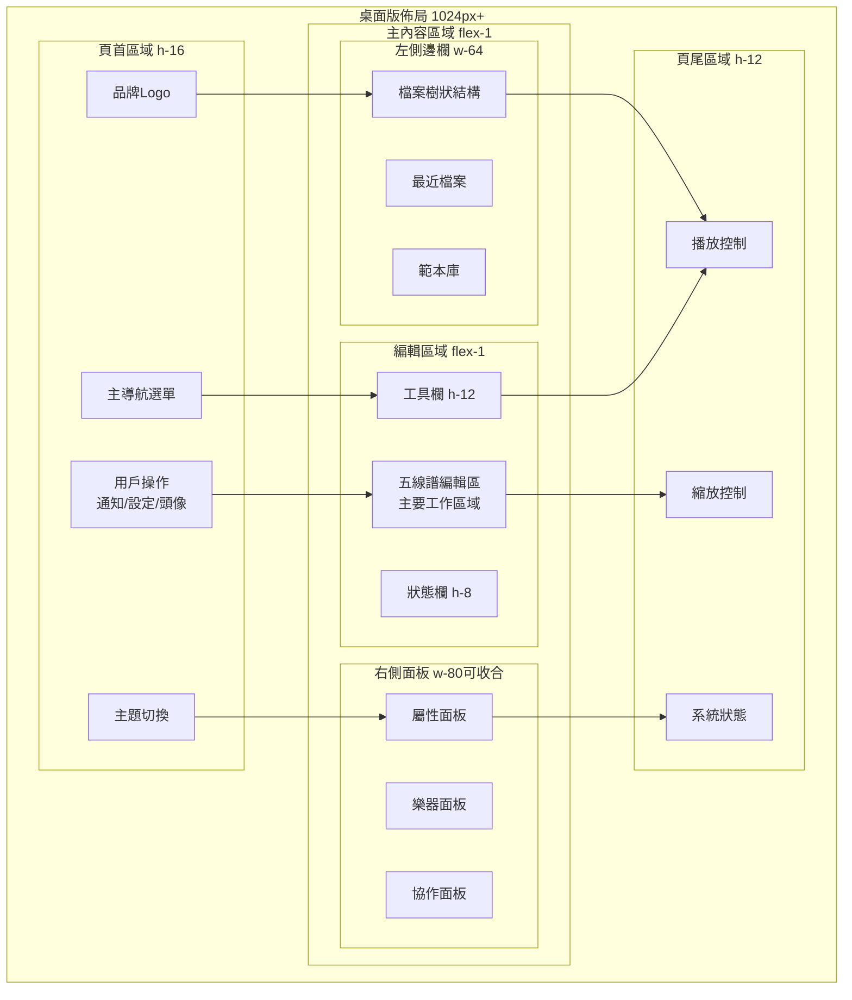
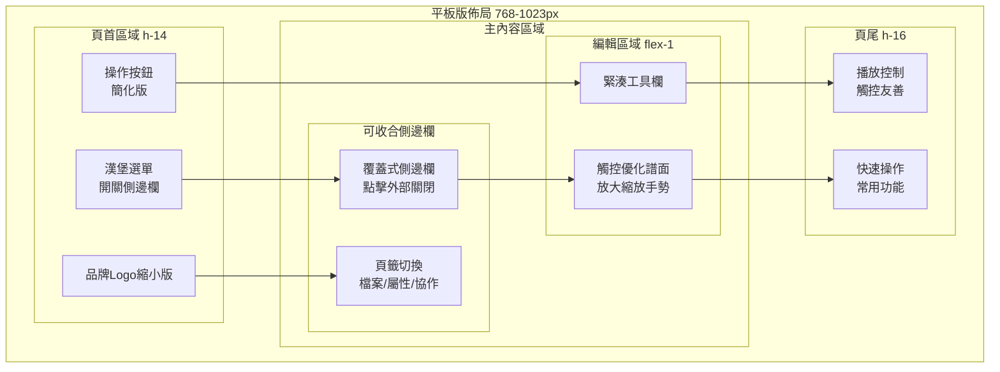
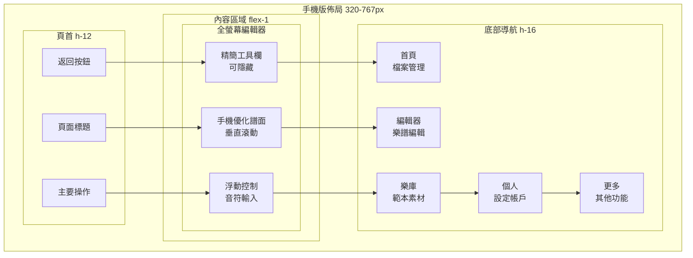
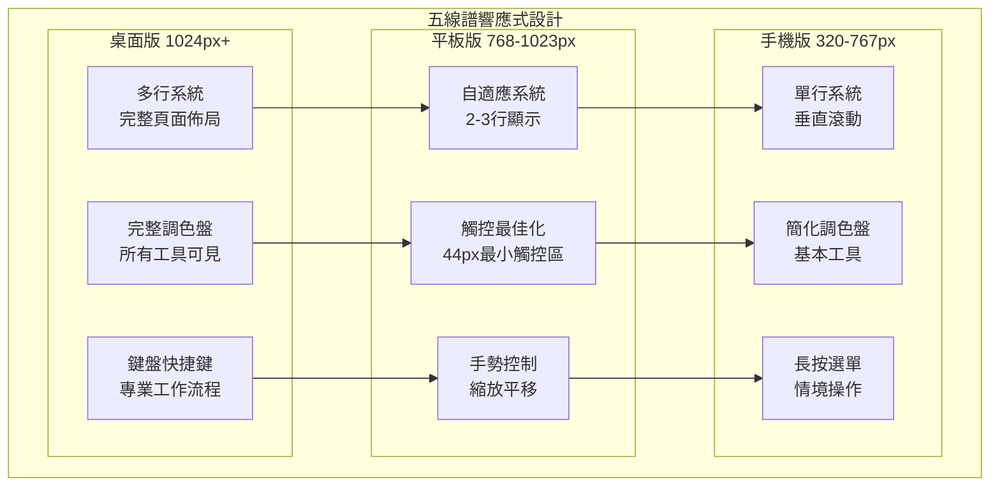

# BandPro 響應式佈局設計

跨裝置一致體驗的完整佈局適配方案

## 📐 響應式設計策略

### 設計哲學：Mobile First


---

## 📱 斷點系統設計

### 主要斷點定義
```typescript
// types/breakpoints.ts
export const breakpoints = {
  xs: '320px',    // 小型手機
  sm: '640px',    // 大型手機
  md: '768px',    // 平板直向
  lg: '1024px',   // 平板橫向/小筆電
  xl: '1280px',   // 桌面
  '2xl': '1536px' // 大桌面
} as const

export type BreakpointKey = keyof typeof breakpoints

// 裝置類型分類
export const deviceTypes = {
  mobile: { min: 0, max: 767 },
  tablet: { min: 768, max: 1023 },
  desktop: { min: 1024, max: Infinity }
} as const
```

### Tailwind CSS 斷點配置
```javascript
// tailwind.config.js
module.exports = {
  theme: {
    screens: {
      'xs': '320px',
      'sm': '640px',
      'md': '768px',
      'lg': '1024px',
      'xl': '1280px',
      '2xl': '1536px',
      // 自訂斷點
      'tablet-portrait': '768px',
      'tablet-landscape': '1024px',
      'desktop-small': '1280px',
      'desktop-large': '1440px',
    },
    extend: {
      // 容器查詢支援
      containers: {
        'xs': '320px',
        'sm': '640px',
        'md': '768px',
        'lg': '1024px',
        'xl': '1280px',
        '2xl': '1536px',
      }
    }
  }
}
```

---

## 🖥️ 桌面版佈局 (1024px+)

### 完整功能佈局


#### 桌面版 CSS 佈局
```css
/* 桌面版主佈局 */
.desktop-layout {
  @apply min-h-screen flex flex-col;
  @apply bg-gray-50 dark:bg-gray-900;
}

/* 頁首 */
.header {
  @apply h-16 bg-white dark:bg-gray-800;
  @apply border-b border-gray-200 dark:border-gray-700;
  @apply flex items-center justify-between px-6;
  @apply sticky top-0 z-50;
}

/* 主內容區 */
.main-content {
  @apply flex-1 flex overflow-hidden;
}

/* 左側邊欄 */
.sidebar-left {
  @apply w-64 bg-gray-50 dark:bg-gray-800;
  @apply border-r border-gray-200 dark:border-gray-700;
  @apply flex flex-col overflow-y-auto;
}

/* 編輯器區域 */
.editor-area {
  @apply flex-1 flex flex-col min-w-0;
}

.editor-toolbar {
  @apply h-12 bg-white dark:bg-gray-800;
  @apply border-b border-gray-200 dark:border-gray-700;
  @apply flex items-center px-4 gap-2;
}

.staff-container {
  @apply flex-1 bg-white dark:bg-gray-900;
  @apply overflow-auto;
  @apply relative;
}

/* 右側面板 */
.sidebar-right {
  @apply w-80 bg-gray-50 dark:bg-gray-800;
  @apply border-l border-gray-200 dark:border-gray-700;
  @apply flex flex-col overflow-y-auto;
  @apply transition-all duration-300 ease-in-out;
  
  &.collapsed {
    @apply w-0 overflow-hidden;
  }
}

/* 頁尾 */
.footer {
  @apply h-12 bg-white dark:bg-gray-800;
  @apply border-t border-gray-200 dark:border-gray-700;
  @apply flex items-center justify-between px-6;
}
```

---

## 📱 平板版佈局 (768-1023px)

### 可收合側邊欄設計


#### 平板版響應式樣式
```css
/* 平板版佈局 768px - 1023px */
@media (min-width: 768px) and (max-width: 1023px) {
  .app-container {
    @apply relative;
  }
  
  .header {
    @apply h-14 px-4;
  }
  
  .hamburger-menu {
    @apply block lg:hidden;
    @apply p-2 rounded-md;
    @apply text-gray-500 hover:text-gray-900;
    @apply dark:text-gray-400 dark:hover:text-gray-100;
  }
  
  .sidebar-left {
    @apply fixed inset-y-0 left-0 z-50;
    @apply transform -translate-x-full transition-transform duration-300;
    @apply w-64 lg:w-80;
    
    &.open {
      @apply translate-x-0;
    }
  }
  
  .sidebar-overlay {
    @apply fixed inset-0 bg-black bg-opacity-50 z-40;
    @apply lg:hidden;
  }
  
  .main-content {
    @apply lg:ml-64;
  }
  
  .editor-toolbar {
    @apply h-10 px-2;
    @apply flex-wrap gap-1;
  }
  
  .toolbar-item {
    @apply min-w-0 flex-shrink-0;
    @apply h-8 px-2 text-sm;
  }
  
  .staff-container {
    @apply touch-pan-x touch-pan-y;
    /* 支援縮放手勢 */
    touch-action: pan-x pan-y pinch-zoom;
  }
  
  .footer {
    @apply h-16 px-4;
    @apply flex-wrap gap-2;
  }
}
```

---

## 📱 手機版佈局 (320-767px)

### 單欄佈局與底部導航


#### 手機版樣式實現
```css
/* 手機版佈局 320px - 767px */
@media (max-width: 767px) {
  .app-container {
    @apply pb-16; /* 為底部導航預留空間 */
  }
  
  .header {
    @apply h-12 px-4;
    @apply justify-between;
  }
  
  .header-title {
    @apply text-lg font-semibold truncate;
  }
  
  .main-content {
    @apply flex-col;
  }
  
  /* 隱藏桌面側邊欄 */
  .sidebar-left,
  .sidebar-right {
    @apply hidden;
  }
  
  .editor-area {
    @apply h-full;
  }
  
  .editor-toolbar {
    @apply h-10 px-2;
    @apply overflow-x-auto scrollbar-none;
    @apply flex gap-1;
    
    /* 工具欄可收合 */
    &.collapsed {
      @apply h-0 overflow-hidden;
    }
  }
  
  .toolbar-toggle {
    @apply fixed top-16 right-4 z-10;
    @apply w-10 h-10 rounded-full;
    @apply bg-blue-500 text-white;
    @apply shadow-lg;
  }
  
  .staff-container {
    @apply px-2 py-4;
    /* 移動端優化滾動 */
    -webkit-overflow-scrolling: touch;
    scroll-behavior: smooth;
  }
  
  /* 底部導航 */
  .bottom-navigation {
    @apply fixed bottom-0 left-0 right-0;
    @apply h-16 bg-white dark:bg-gray-800;
    @apply border-t border-gray-200 dark:border-gray-700;
    @apply flex items-center justify-around;
    @apply z-50;
  }
  
  .bottom-nav-item {
    @apply flex flex-col items-center justify-center;
    @apply min-w-0 flex-1 py-2;
    @apply text-xs font-medium;
    @apply text-gray-500 dark:text-gray-400;
    @apply transition-colors duration-200;
    
    &.active {
      @apply text-blue-500 dark:text-blue-400;
    }
  }
  
  .bottom-nav-icon {
    @apply w-6 h-6 mb-1;
  }
  
  /* 浮動操作按鈕 */
  .floating-action-button {
    @apply fixed bottom-20 right-4;
    @apply w-14 h-14 rounded-full;
    @apply bg-blue-500 text-white;
    @apply shadow-lg;
    @apply flex items-center justify-center;
    @apply z-40;
  }
}

/* 超小螢幕優化 320px - 479px */
@media (max-width: 479px) {
  .header {
    @apply h-10 px-2;
  }
  
  .header-title {
    @apply text-base;
  }
  
  .editor-toolbar {
    @apply h-8 px-1;
  }
  
  .toolbar-item {
    @apply h-6 px-1 text-xs;
    @apply min-w-8;
  }
  
  .bottom-navigation {
    @apply h-14;
  }
  
  .bottom-nav-item {
    @apply text-xs;
  }
  
  .bottom-nav-icon {
    @apply w-5 h-5;
  }
  
  .floating-action-button {
    @apply w-12 h-12 bottom-16 right-2;
  }
}
```

---

## 🎼 音樂專用響應式設計

### 五線譜響應式適配


#### 五線譜響應式樣式
```css
/* 五線譜響應式容器 */
.staff-responsive-container {
  @apply w-full h-full overflow-auto;
  @apply bg-white dark:bg-gray-900;
}

/* 桌面版五線譜 */
@media (min-width: 1024px) {
  .staff-system {
    @apply grid grid-cols-1 gap-8;
    @apply p-8;
    min-height: 297mm; /* A4 頁面高度 */
    max-width: 210mm;  /* A4 頁面寬度 */
    @apply mx-auto;
  }
  
  .staff-line {
    stroke-width: 1;
    @apply stroke-gray-800 dark:stroke-gray-200;
  }
  
  .note-head {
    @apply cursor-pointer;
    r: 3; /* 標準音符大小 */
  }
}

/* 平板版五線譜 */
@media (min-width: 768px) and (max-width: 1023px) {
  .staff-system {
    @apply grid grid-cols-1 gap-6;
    @apply p-4;
  }
  
  .staff-line {
    stroke-width: 1.5;
  }
  
  .note-head {
    r: 4; /* 稍大的音符便於觸控 */
    @apply cursor-pointer;
    
    /* 觸控區域擴大 */
    &::before {
      content: '';
      @apply absolute inset-0;
      transform: scale(1.5);
    }
  }
  
  /* 支援縮放手勢 */
  .staff-container {
    touch-action: pan-x pan-y pinch-zoom;
  }
}

/* 手機版五線譜 */
@media (max-width: 767px) {
  .staff-system {
    @apply flex flex-col gap-4;
    @apply p-2;
    @apply min-h-screen;
  }
  
  .staff-measure {
    @apply mb-6; /* 增加小節間距 */
    min-width: 100vw;
  }
  
  .staff-line {
    stroke-width: 2;
  }
  
  .note-head {
    r: 5; /* 最大音符便於手指操作 */
    @apply cursor-pointer;
  }
  
  /* 垂直滾動優化 */
  .staff-scroll-container {
    @apply overflow-y-auto overflow-x-hidden;
    scroll-snap-type: y mandatory;
  }
  
  .staff-page {
    scroll-snap-align: start;
    @apply min-h-screen;
  }
}
```

---

## 🎯 觸控優化設計

### 觸控目標尺寸指南
```css
/* 觸控目標最小尺寸標準 */
.touch-target {
  @apply min-w-11 min-h-11; /* 44px 最小觸控區域 */
  @apply flex items-center justify-center;
}

.touch-target-small {
  @apply min-w-10 min-h-10; /* 40px 次要觸控區域 */
}

.touch-target-large {
  @apply min-w-12 min-h-12; /* 48px 主要觸控區域 */
}

/* 觸控間距 */
.touch-spacing {
  @apply gap-2; /* 8px 最小間距 */
}

.touch-spacing-comfortable {
  @apply gap-4; /* 16px 舒適間距 */
}
```

### 手勢操作實現
```typescript
// composables/useGestures.ts
import { ref, onMounted, onUnmounted } from 'vue'

export const useGestures = (element: Ref<HTMLElement>) => {
  const isZooming = ref(false)
  const isPanning = ref(false)
  const scale = ref(1)
  const panX = ref(0)
  const panY = ref(0)
  
  let startDistance = 0
  let startScale = 1
  let startPanX = 0
  let startPanY = 0
  
  const handleTouchStart = (e: TouchEvent) => {
    if (e.touches.length === 2) {
      // 雙指縮放開始
      isZooming.value = true
      startDistance = getDistance(e.touches[0], e.touches[1])
      startScale = scale.value
    } else if (e.touches.length === 1) {
      // 單指平移開始
      isPanning.value = true
      startPanX = panX.value
      startPanY = panY.value
    }
  }
  
  const handleTouchMove = (e: TouchEvent) => {
    e.preventDefault()
    
    if (e.touches.length === 2 && isZooming.value) {
      // 雙指縮放
      const currentDistance = getDistance(e.touches[0], e.touches[1])
      const scaleChange = currentDistance / startDistance
      scale.value = Math.max(0.5, Math.min(3, startScale * scaleChange))
    } else if (e.touches.length === 1 && isPanning.value) {
      // 單指平移
      const deltaX = e.touches[0].clientX - e.touches[0].clientX
      const deltaY = e.touches[0].clientY - e.touches[0].clientY
      panX.value = startPanX + deltaX
      panY.value = startPanY + deltaY
    }
  }
  
  const handleTouchEnd = () => {
    isZooming.value = false
    isPanning.value = false
  }
  
  const getDistance = (touch1: Touch, touch2: Touch) => {
    const dx = touch1.clientX - touch2.clientX
    const dy = touch1.clientY - touch2.clientY
    return Math.sqrt(dx * dx + dy * dy)
  }
  
  onMounted(() => {
    const el = element.value
    if (el) {
      el.addEventListener('touchstart', handleTouchStart, { passive: false })
      el.addEventListener('touchmove', handleTouchMove, { passive: false })
      el.addEventListener('touchend', handleTouchEnd)
    }
  })
  
  onUnmounted(() => {
    const el = element.value
    if (el) {
      el.removeEventListener('touchstart', handleTouchStart)
      el.removeEventListener('touchmove', handleTouchMove)
      el.removeEventListener('touchend', handleTouchEnd)
    }
  })
  
  return {
    scale,
    panX,
    panY,
    isZooming,
    isPanning
  }
}
```

---

## 🧭 導航模式適配

### 桌面版導航
```vue
<!-- 桌面版水平導航 -->
<nav class="desktop-navigation">
  <div class="nav-brand">
    
  </div>
  
  <ul class="nav-menu">
    <li class="nav-item">
      <router-link to="/" class="nav-link">首頁</router-link>
    </li>
    <li class="nav-item">
      <router-link to="/editor" class="nav-link">編輯器</router-link>
    </li>
    <li class="nav-item">
      <router-link to="/library" class="nav-link">樂庫</router-link>
    </li>
    <li class="nav-item">
      <router-link to="/collaboration" class="nav-link">協作</router-link>
    </li>
  </ul>
  
  <div class="nav-actions">
    <button class="notification-btn">
      <BellIcon class="w-5 h-5" />
    </button>
    <UserMenu />
    <ThemeToggle />
  </div>
</nav>
```

### 平板版可收合導航
```vue
<!-- 平板版側邊抽屜導航 -->
<template>
  <div class="tablet-navigation">
    <!-- 漢堡選單按鈕 -->
    <button 
      @click="toggleSidebar"
      class="hamburger-btn"
      :class="{ 'active': sidebarOpen }"
    >
      <span></span>
      <span></span>
      <span></span>
    </button>
    
    <!-- 遮罩層 -->
    <div 
      v-if="sidebarOpen"
      @click="closeSidebar"
      class="sidebar-overlay"
    ></div>
    
    <!-- 側邊欄 -->
    <aside 
      class="sidebar"
      :class="{ 'open': sidebarOpen }"
    >
      <nav class="sidebar-nav">
        <router-link
          v-for="item in navItems"
          :key="item.path"
          :to="item.path"
          class="sidebar-nav-item"
          @click="closeSidebar"
        >
          <component :is="item.icon" class="w-6 h-6" />
          <span>{{ item.label }}</span>
        </router-link>
      </nav>
    </aside>
  </div>
</template>

<script setup lang="ts">
import { ref } from 'vue'
import { HomeIcon, PencilIcon, BookOpenIcon, UsersIcon } from '@heroicons/vue/24/outline'

const sidebarOpen = ref(false)

const navItems = [
  { path: '/', icon: HomeIcon, label: '首頁' },
  { path: '/editor', icon: PencilIcon, label: '編輯器' },
  { path: '/library', icon: BookOpenIcon, label: '樂庫' },
  { path: '/collaboration', icon: UsersIcon, label: '協作' }
]

const toggleSidebar = () => {
  sidebarOpen.value = !sidebarOpen.value
}

const closeSidebar = () => {
  sidebarOpen.value = false
}
</script>
```

### 手機版底部導航
```vue
<!-- 手機版底部標籤導航 -->
<nav class="mobile-bottom-navigation">
  <router-link
    v-for="item in bottomNavItems"
    :key="item.path"
    :to="item.path"
    class="bottom-nav-item"
    v-slot="{ isActive }"
  >
    <component 
      :is="item.icon" 
      class="bottom-nav-icon"
      :class="{ 'text-blue-500': isActive }"
    />
    <span 
      class="bottom-nav-label"
      :class="{ 'text-blue-500 font-semibold': isActive }"
    >
      {{ item.label }}
    </span>
  </router-link>
</nav>

<script setup lang="ts">
import { 
  HomeIcon, 
  PencilSquareIcon, 
  BookOpenIcon, 
  UserIcon,
  EllipsisHorizontalIcon 
} from '@heroicons/vue/24/outline'

const bottomNavItems = [
  { path: '/', icon: HomeIcon, label: '首頁' },
  { path: '/editor', icon: PencilSquareIcon, label: '編輯' },
  { path: '/library', icon: BookOpenIcon, label: '樂庫' },
  { path: '/profile', icon: UserIcon, label: '個人' },
  { path: '/more', icon: EllipsisHorizontalIcon, label: '更多' }
]
</script>

<style scoped>
.mobile-bottom-navigation {
  @apply fixed bottom-0 left-0 right-0;
  @apply h-16 bg-white dark:bg-gray-800;
  @apply border-t border-gray-200 dark:border-gray-700;
  @apply flex items-center justify-around;
  @apply z-50;
  @apply safe-area-inset-bottom; /* iOS 安全區域 */
}

.bottom-nav-item {
  @apply flex flex-col items-center justify-center;
  @apply min-w-0 flex-1 py-2;
  @apply transition-colors duration-200;
}

.bottom-nav-icon {
  @apply w-6 h-6 mb-1;
  @apply text-gray-500 dark:text-gray-400;
}

.bottom-nav-label {
  @apply text-xs font-medium;
  @apply text-gray-500 dark:text-gray-400;
  @apply truncate;
}
</style>
```

---

## 📊 效能優化策略

### 響應式圖片
```vue
<template>
  <!-- 響應式圖片組件 -->
  <picture class="responsive-image">
    <!-- 桌面版高解析度 -->
    <source
      media="(min-width: 1024px)"
      :srcset="`${desktopImage} 1x, ${desktopImage2x} 2x`"
    />
    
    <!-- 平板版中等解析度 -->
    <source
      media="(min-width: 768px)"
      :srcset="`${tabletImage} 1x, ${tabletImage2x} 2x`"
    />
    
    <!-- 手機版優化版本 -->
    
  </picture>
</template>
```

### 懶加載與虛擬滾動
```typescript
// composables/useVirtualScroll.ts
export const useVirtualScroll = (
  items: Ref<any[]>,
  itemHeight: number,
  containerHeight: number
) => {
  const scrollTop = ref(0)
  const startIndex = computed(() => 
    Math.floor(scrollTop.value / itemHeight)
  )
  const endIndex = computed(() => 
    Math.min(
      startIndex.value + Math.ceil(containerHeight / itemHeight) + 1,
      items.value.length
    )
  )
  const visibleItems = computed(() => 
    items.value.slice(startIndex.value, endIndex.value)
  )
  
  return {
    scrollTop,
    startIndex,
    endIndex,
    visibleItems
  }
}
```

---

## ✅ 響應式檢查清單

### 設計階段
- [ ] 定義完整斷點系統
- [ ] 設計各裝置佈局變體
- [ ] 規劃觸控互動模式
- [ ] 考慮橫豎屏切換
- [ ] 設計摺疊螢幕適配

### 開發階段
- [ ] 實現 Mobile First CSS
- [ ] 測試所有斷點過渡
- [ ] 優化觸控目標尺寸
- [ ] 實現手勢操作
- [ ] 添加懶加載優化

### 測試階段
- [ ] 真機測試各種尺寸
- [ ] 橫豎屏切換測試
- [ ] 觸控操作流暢度測試
- [ ] 效能表現測試
- [ ] 無障礙功能測試

### 優化階段
- [ ] 圖片資源優化
- [ ] 字體載入優化
- [ ] 動畫效能調整
- [ ] 記憶體使用優化
- [ ] 電池續航考量

👉 **下一步：參考 [04_導航系統設計.md](./04_導航系統設計.md) 了解完整導航實現方案**
