# BandPro 導航系統設計

統一且直覺的導航體驗設計規範

## 🧭 導航系統架構

### 導航層次結構

```mermaid
flowchart TD
    subgraph NavigationHierarchy[導航層次結構]
        subgraph L1[第一層：全域導航]
            GlobalHeader[全域頁首<br/>品牌 + 主要功能]
            PrimaryNav[主要導航<br/>核心功能模組]
        end
        
        subgraph L2[第二層：功能導航]
            SecondaryNav[次要導航<br/>功能內子項目]
            Breadcrumbs[麵包屑<br/>位置指示]
        end
        
        subgraph L3[第三層：內容導航]
            TabNavigation[標籤導航<br/>平行內容切換]
            SidebarNav[側邊導航<br/>深層功能]
        end
        
        subgraph L4[第四層：情境導航]
            ContextMenu[情境選單<br/>右鍵操作]
            FloatingAction[浮動按鈕<br/>主要操作]
        end
    end
    
    GlobalHeader --> SecondaryNav
    PrimaryNav --> Breadcrumbs
    SecondaryNav --> TabNavigation
    Breadcrumbs --> SidebarNav
    TabNavigation --> ContextMenu
    SidebarNav --> FloatingAction
```


### 導航模式分類

```mermaid
mindmap
  root((導航模式))
    桌面導航
      水平導航欄
        主要功能選單
        用戶操作區
        搜尋功能
      垂直側邊欄
        檔案樹狀結構
        工具面板
        屬性設定
    平板導航
      可收合側欄
        覆蓋式抽屜
        推擠式展開
      頂部標籤
        水平滑動
        更多選項
    手機導航
      底部標籤
        主要功能
        5個以內項目
      漢堡選單
        全功能存取
        層級結構
```


---

## 🖥️ 桌面版導航設計

### 全域導航欄

```mermaid
flowchart LR
    subgraph DesktopHeader[桌面版導航欄 h-16]
        subgraph BrandArea[品牌區域]
            Logo[BandPro Logo<br/>首頁連結]
            AppName[應用名稱<br/>可隱藏]
        end
        
        subgraph MainNavigation[主要導航]
            Home[首頁<br/>檔案管理]
            Editor[編輯器<br/>樂譜編輯]
            Library[樂庫<br/>範本素材]
            Collaboration[協作<br/>共享專案]
        end
        
        subgraph SearchArea[搜尋區域]
            GlobalSearch[全域搜尋<br/>Cmd+K 快捷鍵]
        end
        
        subgraph UserArea[用戶區域]
            Notifications[通知中心<br/>協作更新]
            Settings[設定選單<br/>偏好設置]
            UserMenu[用戶選單<br/>個人檔案]
            ThemeToggle[主題切換<br/>深淺模式]
        end
    end
    
    Logo --> Home
    AppName --> Editor
    Home --> Library
    Editor --> Collaboration
    Library --> GlobalSearch
    Collaboration --> Notifications
    GlobalSearch --> Settings
    Notifications --> UserMenu
    Settings --> ThemeToggle
```


#### 桌面導航樣式
```vue
<!-- components/navigation/DesktopHeader.vue -->
<template>
  <header class="desktop-header">
    <!-- 品牌區域 -->
    <div class="header-brand">
      <router-link to="/" class="brand-link">
        
        <span class="brand-name">BandPro</span>
      </router-link>
    </div>
    
    <!-- 主要導航 -->
    <nav class="main-navigation">
      <ul class="nav-list">
        <li v-for="item in mainNavItems" :key="item.path" class="nav-item">
          <router-link
            :to="item.path"
            class="nav-link"
            v-slot="{ isActive, isExactActive }"
          >
            <component :is="item.icon" class="nav-icon" />
            <span class="nav-text">{{ item.label }}</span>
            <div v-if="isActive" class="nav-indicator"></div>
          </router-link>
        </li>
      </ul>
    </nav>
    
    <!-- 全域搜尋 -->
    <div class="search-area">
      <GlobalSearch />
    </div>
    
    <!-- 用戶操作區 -->
    <div class="user-area">
      <NotificationCenter />
      <SettingsDropdown />
      <UserDropdown />
      <ThemeToggle />
    </div>
  </header>
</template>

<script setup lang="ts">
import { 
  HomeIcon, 
  PencilSquareIcon, 
  BookOpenIcon, 
  UsersIcon 
} from '@heroicons/vue/24/outline'

const mainNavItems = [
  { path: '/', icon: HomeIcon, label: '首頁' },
  { path: '/editor', icon: PencilSquareIcon, label: '編輯器' },
  { path: '/library', icon: BookOpenIcon, label: '樂庫' },
  { path: '/collaboration', icon: UsersIcon, label: '協作' }
]
</script>

<style scoped>
.desktop-header {
  @apply h-16 bg-white dark:bg-gray-800;
  @apply border-b border-gray-200 dark:border-gray-700;
  @apply flex items-center justify-between;
  @apply px-6 sticky top-0 z-50;
}

.header-brand {
  @apply flex items-center flex-shrink-0;
}

.brand-link {
  @apply flex items-center space-x-3;
  @apply text-gray-900 dark:text-white;
  @apply hover:text-blue-600 dark:hover:text-blue-400;
  @apply transition-colors duration-200;
}

.brand-logo {
  @apply w-8 h-8;
}

.brand-name {
  @apply text-xl font-bold;
}

.main-navigation {
  @apply flex-1 max-w-md mx-8;
}

.nav-list {
  @apply flex space-x-1;
}

.nav-item {
  @apply flex-1;
}

.nav-link {
  @apply relative flex flex-col items-center;
  @apply px-3 py-2 rounded-lg;
  @apply text-sm font-medium;
  @apply text-gray-600 dark:text-gray-300;
  @apply hover:text-gray-900 dark:hover:text-white;
  @apply hover:bg-gray-100 dark:hover:bg-gray-700;
  @apply transition-all duration-200;
  
  &.router-link-active {
    @apply text-blue-600 dark:text-blue-400;
    @apply bg-blue-50 dark:bg-blue-900/20;
  }
}

.nav-icon {
  @apply w-5 h-5 mb-1;
}

.nav-text {
  @apply text-xs;
}

.nav-indicator {
  @apply absolute bottom-0 left-1/2 transform -translate-x-1/2;
  @apply w-1 h-1 bg-blue-500 rounded-full;
}

.search-area {
  @apply flex-shrink-0 mx-4;
}

.user-area {
  @apply flex items-center space-x-2;
  @apply flex-shrink-0;
}
</style>
```

### 側邊導航系統
```vue
<!-- components/navigation/Sidebar.vue -->
<template>
  <aside 
    class="sidebar"
    :class="{ 
      'sidebar-collapsed': collapsed,
      'sidebar-hidden': hidden 
    }"
  >
    <!-- 側邊欄頭部 -->
    <div class="sidebar-header">
      <h3 v-if="!collapsed" class="sidebar-title">{{ title }}</h3>
      <button 
        @click="$emit('toggle')"
        class="sidebar-toggle"
        :aria-label="collapsed ? '展開側邊欄' : '收起側邊欄'"
      >
        <ChevronLeftIcon 
          class="toggle-icon"
          :class="{ 'rotate-180': collapsed }"
        />
      </button>
    </div>
    
    <!-- 側邊欄內容 -->
    <div class="sidebar-content">
      <slot />
    </div>
    
    <!-- 側邊欄底部 -->
    <div v-if="$slots.footer" class="sidebar-footer">
      <slot name="footer" />
    </div>
  </aside>
</template>

<script setup lang="ts">
import { ChevronLeftIcon } from '@heroicons/vue/24/outline'

interface Props {
  title?: string
  collapsed?: boolean
  hidden?: boolean
}

defineProps<Props>()
defineEmits<{
  toggle: []
}>()
</script>

<style scoped>
.sidebar {
  @apply flex flex-col h-full;
  @apply bg-gray-50 dark:bg-gray-800;
  @apply border-r border-gray-200 dark:border-gray-700;
  @apply transition-all duration-300 ease-in-out;
  width: 256px; /* w-64 */
  
  &.sidebar-collapsed {
    width: 48px; /* w-12 */
  }
  
  &.sidebar-hidden {
    width: 0;
    @apply overflow-hidden;
  }
}

.sidebar-header {
  @apply flex items-center justify-between;
  @apply p-4 border-b border-gray-200 dark:border-gray-700;
  @apply flex-shrink-0;
}

.sidebar-title {
  @apply text-lg font-semibold;
  @apply text-gray-900 dark:text-white;
  @apply truncate;
}

.sidebar-toggle {
  @apply p-1 rounded-md;
  @apply text-gray-500 hover:text-gray-700;
  @apply dark:text-gray-400 dark:hover:text-gray-200;
  @apply hover:bg-gray-200 dark:hover:bg-gray-700;
  @apply transition-colors duration-200;
}

.toggle-icon {
  @apply w-5 h-5;
  @apply transition-transform duration-300;
}

.sidebar-content {
  @apply flex-1 overflow-y-auto;
  @apply p-2;
}

.sidebar-footer {
  @apply flex-shrink-0 p-4;
  @apply border-t border-gray-200 dark:border-gray-700;
}
</style>
```

---

## 📱 平板版導航設計

### 可收合抽屜導航

```mermaid
flowchart TD
    subgraph TabletNavigation[平板導航系統]
        subgraph CompactHeader[緊湊頁首 h-14]
            MenuToggle[選單切換<br/>漢堡按鈕]
            ContextTitle[情境標題<br/>當前頁面]
            QuickActions[快速操作<br/>常用功能]
        end
        
        subgraph DrawerNavigation[抽屜導航]
            OverlayDrawer[覆蓋式抽屜<br/>從左滑入]
            NavigationTabs[導航標籤<br/>分類組織]
            CollapsibleSections[可收合區域<br/>層級結構]
        end
        
        subgraph TabNavigation[標籤導航]
            HorizontalTabs[水平標籤<br/>可滑動]
            MoreMenu[更多選單<br/>溢出項目]
        end
    end
    
    MenuToggle --> OverlayDrawer
    ContextTitle --> NavigationTabs
    QuickActions --> CollapsibleSections
    
    OverlayDrawer --> HorizontalTabs
    NavigationTabs --> MoreMenu
    CollapsibleSections --> HorizontalTabs
```


#### 平板抽屜導航實現
```vue
<!-- components/navigation/TabletDrawer.vue -->
<template>
  <div class="tablet-drawer-container">
    <!-- 遮罩層 -->
    <Transition name="overlay">
      <div 
        v-if="isOpen"
        class="drawer-overlay"
        @click="closeDrawer"
      ></div>
    </Transition>
    
    <!-- 抽屜 -->
    <Transition name="drawer">
      <aside 
        v-if="isOpen"
        class="navigation-drawer"
        @click.stop
      >
        <!-- 抽屜頭部 -->
        <div class="drawer-header">
          <div class="drawer-brand">
            
            <span class="brand-text">BandPro</span>
          </div>
          <button 
            @click="closeDrawer"
            class="close-button"
            aria-label="關閉導航選單"
          >
            <XMarkIcon class="w-6 h-6" />
          </button>
        </div>
        
        <!-- 導航內容 -->
        <nav class="drawer-navigation">
          <div 
            v-for="section in navigationSections"
            :key="section.title"
            class="nav-section"
          >
            <h4 class="nav-section-title">{{ section.title }}</h4>
            <ul class="nav-section-list">
              <li 
                v-for="item in section.items"
                :key="item.path"
                class="nav-item"
              >
                <router-link
                  :to="item.path"
                  class="nav-link"
                  @click="closeDrawer"
                  v-slot="{ isActive }"
                >
                  <component :is="item.icon" class="nav-icon" />
                  <span class="nav-text">{{ item.label }}</span>
                  <ChevronRightIcon 
                    v-if="item.hasChildren" 
                    class="nav-chevron"
                  />
                  <div 
                    v-if="isActive" 
                    class="nav-active-indicator"
                  ></div>
                </router-link>
              </li>
            </ul>
          </div>
        </nav>
        
        <!-- 抽屜底部 -->
        <div class="drawer-footer">
          <UserProfile :compact="true" />
          <ThemeToggle />
        </div>
      </aside>
    </Transition>
  </div>
</template>

<script setup lang="ts">
import { 
  XMarkIcon, 
  ChevronRightIcon,
  HomeIcon,
  PencilSquareIcon,
  BookOpenIcon,
  UsersIcon,
  CogIcon,
  QuestionMarkCircleIcon
} from '@heroicons/vue/24/outline'

interface Props {
  isOpen: boolean
}

defineProps<Props>()

const emit = defineEmits<{
  close: []
}>()

const closeDrawer = () => {
  emit('close')
}

const navigationSections = [
  {
    title: '主要功能',
    items: [
      { path: '/', icon: HomeIcon, label: '首頁' },
      { path: '/editor', icon: PencilSquareIcon, label: '編輯器' },
      { path: '/library', icon: BookOpenIcon, label: '樂庫' },
      { path: '/collaboration', icon: UsersIcon, label: '協作' }
    ]
  },
  {
    title: '設定與幫助',
    items: [
      { path: '/settings', icon: CogIcon, label: '設定' },
      { path: '/help', icon: QuestionMarkCircleIcon, label: '幫助' }
    ]
  }
]
</script>

<style scoped>
.tablet-drawer-container {
  @apply relative z-50;
}

.drawer-overlay {
  @apply fixed inset-0 bg-black bg-opacity-50;
  @apply md:hidden;
}

.navigation-drawer {
  @apply fixed inset-y-0 left-0 z-50;
  @apply w-80 bg-white dark:bg-gray-800;
  @apply shadow-xl;
  @apply flex flex-col;
}

.drawer-header {
  @apply flex items-center justify-between;
  @apply p-4 border-b border-gray-200 dark:border-gray-700;
}

.drawer-brand {
  @apply flex items-center space-x-3;
}

.brand-logo {
  @apply w-8 h-8;
}

.brand-text {
  @apply text-xl font-bold;
  @apply text-gray-900 dark:text-white;
}

.close-button {
  @apply p-2 rounded-md;
  @apply text-gray-500 hover:text-gray-700;
  @apply dark:text-gray-400 dark:hover:text-gray-200;
  @apply hover:bg-gray-100 dark:hover:bg-gray-700;
}

.drawer-navigation {
  @apply flex-1 overflow-y-auto py-4;
}

.nav-section {
  @apply mb-6;
}

.nav-section-title {
  @apply px-4 py-2 text-xs font-semibold;
  @apply text-gray-500 dark:text-gray-400;
  @apply uppercase tracking-wider;
}

.nav-section-list {
  @apply space-y-1 px-2;
}

.nav-item {
  @apply relative;
}

.nav-link {
  @apply flex items-center space-x-3;
  @apply px-3 py-2 rounded-lg;
  @apply text-gray-700 dark:text-gray-300;
  @apply hover:bg-gray-100 dark:hover:bg-gray-700;
  @apply hover:text-gray-900 dark:hover:text-white;
  @apply transition-all duration-200;
  
  &.router-link-active {
    @apply bg-blue-50 dark:bg-blue-900/20;
    @apply text-blue-600 dark:text-blue-400;
  }
}

.nav-icon {
  @apply w-5 h-5 flex-shrink-0;
}

.nav-text {
  @apply flex-1 font-medium;
}

.nav-chevron {
  @apply w-4 h-4 text-gray-400;
}

.nav-active-indicator {
  @apply absolute left-0 top-1/2 transform -translate-y-1/2;
  @apply w-1 h-6 bg-blue-500 rounded-r;
}

.drawer-footer {
  @apply flex items-center justify-between;
  @apply p-4 border-t border-gray-200 dark:border-gray-700;
}

/* 動畫效果 */
.overlay-enter-active,
.overlay-leave-active {
  @apply transition-opacity duration-300;
}

.overlay-enter-from,
.overlay-leave-to {
  @apply opacity-0;
}

.drawer-enter-active,
.drawer-leave-active {
  @apply transition-transform duration-300 ease-in-out;
}

.drawer-enter-from,
.drawer-leave-to {
  @apply transform -translate-x-full;
}
</style>
```

---

## 📱 手機版導航設計

### 底部標籤導航

```mermaid
flowchart TD
    subgraph MobileNavigation[手機導航系統]
        subgraph MinimalHeader[極簡頁首 h-12]
            BackButton[返回按鈕<br/>導航歷史]
            PageTitle[頁面標題<br/>情境指示]
            ActionButton[操作按鈕<br/>主要功能]
        end
        
        subgraph ContentArea[內容區域 flex-1]
            FullScreenContent[全螢幕內容<br/>最大化空間]
            ScrollableArea[可滾動區域<br/>垂直導航]
        end
        
        subgraph BottomTabs[底部標籤 h-16]
            Tab1[首頁<br/>檔案管理]
            Tab2[編輯<br/>樂譜編輯]
            Tab3[樂庫<br/>範本素材]
            Tab4[個人<br/>用戶設定]
            Tab5[更多<br/>其他功能]
        end
    end
    
    BackButton --> FullScreenContent
    PageTitle --> ScrollableArea
    ActionButton --> Tab1
    
    FullScreenContent --> Tab1
    ScrollableArea --> Tab2
    Tab1 --> Tab2
    Tab2 --> Tab3
    Tab3 --> Tab4
    Tab4 --> Tab5
```


#### 手機底部導航實現
```vue
<!-- components/navigation/MobileBottomTabs.vue -->
<template>
  <nav 
    class="mobile-bottom-navigation"
    role="tablist"
    aria-label="主要導航"
  >
    <router-link
      v-for="(tab, index) in bottomTabs"
      :key="tab.path"
      :to="tab.path"
      class="bottom-tab"
      :class="{ 'tab-active': isActiveTab(tab.path) }"
      role="tab"
      :aria-selected="isActiveTab(tab.path)"
      :aria-label="`${tab.label}頁面`"
    >
      <!-- 圖標 -->
      <div class="tab-icon-container">
        <component 
          :is="tab.icon" 
          class="tab-icon"
        />
        
        <!-- 通知徽章 -->
        <div 
          v-if="tab.badge && tab.badge > 0"
          class="tab-badge"
        >
          {{ tab.badge > 99 ? '99+' : tab.badge }}
        </div>
      </div>
      
      <!-- 標籤文字 -->
      <span class="tab-label">{{ tab.label }}</span>
      
      <!-- 活躍指示器 -->
      <div 
        v-if="isActiveTab(tab.path)"
        class="tab-indicator"
      ></div>
    </router-link>
  </nav>
</template>

<script setup lang="ts">
import { computed } from 'vue'
import { useRoute } from 'vue-router'
import { 
  HomeIcon, 
  PencilSquareIcon, 
  BookOpenIcon, 
  UserIcon,
  EllipsisHorizontalIcon 
} from '@heroicons/vue/24/outline'
import {
  HomeIcon as HomeIconSolid,
  PencilSquareIcon as PencilSquareIconSolid,
  BookOpenIcon as BookOpenIconSolid,
  UserIcon as UserIconSolid,
  EllipsisHorizontalIcon as EllipsisHorizontalIconSolid
} from '@heroicons/vue/24/solid'

const route = useRoute()

const bottomTabs = [
  { 
    path: '/', 
    icon: HomeIcon, 
    activeIcon: HomeIconSolid, 
    label: '首頁',
    badge: 0
  },
  { 
    path: '/editor', 
    icon: PencilSquareIcon, 
    activeIcon: PencilSquareIconSolid, 
    label: '編輯',
    badge: 0
  },
  { 
    path: '/library', 
    icon: BookOpenIcon, 
    activeIcon: BookOpenIconSolid, 
    label: '樂庫',
    badge: 0
  },
  { 
    path: '/profile', 
    icon: UserIcon, 
    activeIcon: UserIconSolid, 
    label: '個人',
    badge: 0
  },
  { 
    path: '/more', 
    icon: EllipsisHorizontalIcon, 
    activeIcon: EllipsisHorizontalIconSolid, 
    label: '更多',
    badge: 0
  }
]

const isActiveTab = (path: string) => {
  return route.path === path || 
         (path !== '/' && route.path.startsWith(path))
}
</script>

<style scoped>
.mobile-bottom-navigation {
  @apply fixed bottom-0 left-0 right-0;
  @apply h-16 bg-white dark:bg-gray-800;
  @apply border-t border-gray-200 dark:border-gray-700;
  @apply flex items-center justify-around;
  @apply z-50;
  
  /* iOS 安全區域支援 */
  padding-bottom: env(safe-area-inset-bottom);
}

.bottom-tab {
  @apply relative flex flex-col items-center justify-center;
  @apply min-w-0 flex-1 py-1;
  @apply transition-all duration-200;
  @apply focus:outline-none focus:ring-2 focus:ring-blue-500 focus:ring-inset;
}

.tab-icon-container {
  @apply relative mb-1;
}

.tab-icon {
  @apply w-6 h-6;
  @apply text-gray-500 dark:text-gray-400;
  @apply transition-colors duration-200;
}

.tab-active .tab-icon {
  @apply text-blue-500 dark:text-blue-400;
}

.tab-badge {
  @apply absolute -top-2 -right-2;
  @apply min-w-5 h-5 px-1;
  @apply bg-red-500 text-white;
  @apply text-xs font-bold;
  @apply rounded-full;
  @apply flex items-center justify-center;
}

.tab-label {
  @apply text-xs font-medium;
  @apply text-gray-500 dark:text-gray-400;
  @apply transition-colors duration-200;
  @apply truncate;
}

.tab-active .tab-label {
  @apply text-blue-500 dark:text-blue-400;
  @apply font-semibold;
}

.tab-indicator {
  @apply absolute top-0 left-1/2 transform -translate-x-1/2;
  @apply w-1 h-1 bg-blue-500 rounded-full;
}

/* 點擊反饋 */
.bottom-tab:active {
  @apply scale-95;
}

/* 減少動畫偏好 */
@media (prefers-reduced-motion: reduce) {
  .bottom-tab,
  .tab-icon,
  .tab-label {
    @apply transition-none;
  }
}
</style>
```

---

## 🔍 全域搜尋系統

### 智能搜尋界面
```vue
<!-- components/navigation/GlobalSearch.vue -->
<template>
  <div class="global-search-container">
    <!-- 搜尋輸入框 -->
    <div class="search-input-wrapper">
      <MagnifyingGlassIcon class="search-icon" />
      <input
        v-model="searchQuery"
        @focus="showResults = true"
        @keydown="handleKeydown"
        class="search-input"
        type="text"
        placeholder="搜尋樂譜、範本、用戶..."
        :aria-label="'全域搜尋'"
        ref="searchInputRef"
      />
      
      <!-- 鍵盤快捷鍵提示 -->
      <div class="search-shortcut">
        <kbd class="kbd">⌘</kbd>
        <kbd class="kbd">K</kbd>
      </div>
    </div>
    
    <!-- 搜尋結果下拉選單 -->
    <Transition name="search-results">
      <div 
        v-if="showResults && (searchQuery || recentSearches.length > 0)"
        class="search-results-dropdown"
      >
        <!-- 最近搜尋 -->
        <div v-if="!searchQuery && recentSearches.length > 0" class="search-section">
          <h4 class="section-title">最近搜尋</h4>
          <div class="recent-searches">
            <button
              v-for="recent in recentSearches"
              :key="recent"
              @click="selectSearch(recent)"
              class="recent-search-item"
            >
              <ClockIcon class="recent-icon" />
              <span>{{ recent }}</span>
            </button>
          </div>
        </div>
        
        <!-- 搜尋建議 -->
        <div v-if="searchQuery && suggestions.length > 0" class="search-section">
          <h4 class="section-title">建議</h4>
          <div class="search-suggestions">
            <button
              v-for="(suggestion, index) in suggestions"
              :key="suggestion.id"
              @click="selectSuggestion(suggestion)"
              class="suggestion-item"
              :class="{ 'suggestion-highlighted': index === highlightedIndex }"
            >
              <component :is="suggestion.icon" class="suggestion-icon" />
              <div class="suggestion-content">
                <div class="suggestion-title" v-html="highlightMatch(suggestion.title)"></div>
                <div class="suggestion-subtitle">{{ suggestion.subtitle }}</div>
              </div>
              <div class="suggestion-type">{{ suggestion.type }}</div>
            </button>
          </div>
        </div>
        
        <!-- 無結果 -->
        <div v-if="searchQuery && suggestions.length === 0" class="no-results">
          <FaceSimpleIcon class="no-results-icon" />
          <p class="no-results-text">找不到相關結果</p>
          <p class="no-results-subtitle">試試其他關鍵字或創建新的內容</p>
        </div>
      </div>
    </Transition>
  </div>
</template>

<script setup lang="ts">
import { ref, computed, onMounted, onUnmounted } from 'vue'
import {
  MagnifyingGlassIcon,
  ClockIcon,
  DocumentTextIcon,
  MusicalNoteIcon,
  UserIcon
} from '@heroicons/vue/24/outline'

interface SearchSuggestion {
  id: string
  title: string
  subtitle: string
  type: string
  icon: any
  path: string
}

const searchQuery = ref('')
const showResults = ref(false)
const highlightedIndex = ref(-1)
const searchInputRef = ref<HTMLInputElement>()

// 模擬搜尋建議
const suggestions = computed<SearchSuggestion[]>(() => {
  if (!searchQuery.value) return []
  
  return [
    {
      id: '1',
      title: '卡農鋼琴譜',
      subtitle: '古典音樂 • 約翰·帕赫貝爾',
      type: '樂譜',
      icon: MusicalNoteIcon,
      path: '/scores/canon'
    },
    {
      id: '2', 
      title: '流行歌曲範本',
      subtitle: '範本庫 • C 大調',
      type: '範本',
      icon: DocumentTextIcon,
      path: '/templates/pop'
    },
    {
      id: '3',
      title: '張小明',
      subtitle: '用戶 • 最後活躍：2小時前',
      type: '用戶',
      icon: UserIcon,
      path: '/users/zhangxiaoming'
    }
  ].filter(item => 
    item.title.toLowerCase().includes(searchQuery.value.toLowerCase()) ||
    item.subtitle.toLowerCase().includes(searchQuery.value.toLowerCase())
  )
})

const recentSearches = ref(['鋼琴譜', '流行音樂', '古典音樂'])

const highlightMatch = (text: string) => {
  if (!searchQuery.value) return text
  const regex = new RegExp(`(${searchQuery.value})`, 'gi')
  return text.replace(regex, '<mark>$1</mark>')
}

const handleKeydown = (event: KeyboardEvent) => {
  switch (event.key) {
    case 'Escape':
      showResults.value = false
      searchInputRef.value?.blur()
      break
    case 'ArrowDown':
      event.preventDefault()
      highlightedIndex.value = Math.min(
        highlightedIndex.value + 1,
        suggestions.value.length - 1
      )
      break
    case 'ArrowUp':
      event.preventDefault()
      highlightedIndex.value = Math.max(highlightedIndex.value - 1, -1)
      break
    case 'Enter':
      event.preventDefault()
      if (highlightedIndex.value >= 0) {
        selectSuggestion(suggestions.value[highlightedIndex.value])
      } else if (searchQuery.value) {
        performSearch(searchQuery.value)
      }
      break
  }
}

const selectSearch = (query: string) => {
  searchQuery.value = query
  performSearch(query)
}

const selectSuggestion = (suggestion: SearchSuggestion) => {
  // 導航到建議項目
  console.log('Navigate to:', suggestion.path)
  showResults.value = false
  
  // 添加到最近搜尋
  if (!recentSearches.value.includes(suggestion.title)) {
    recentSearches.value.unshift(suggestion.title)
    recentSearches.value = recentSearches.value.slice(0, 5)
  }
}

const performSearch = (query: string) => {
  console.log('Perform search:', query)
  showResults.value = false
  
  // 添加到最近搜尋
  if (!recentSearches.value.includes(query)) {
    recentSearches.value.unshift(query)
    recentSearches.value = recentSearches.value.slice(0, 5)
  }
}

// 全域鍵盤快捷鍵
const handleGlobalKeydown = (event: KeyboardEvent) => {
  if ((event.metaKey || event.ctrlKey) && event.key === 'k') {
    event.preventDefault()
    searchInputRef.value?.focus()
    showResults.value = true
  }
}

// 點擊外部關閉
const handleClickOutside = (event: Event) => {
  const target = event.target as Element
  if (!target.closest('.global-search-container')) {
    showResults.value = false
  }
}

onMounted(() => {
  document.addEventListener('keydown', handleGlobalKeydown)
  document.addEventListener('click', handleClickOutside)
})

onUnmounted(() => {
  document.removeEventListener('keydown', handleGlobalKeydown)
  document.removeEventListener('click', handleClickOutside)
})
</script>

<style scoped>
.global-search-container {
  @apply relative max-w-md w-full;
}

.search-input-wrapper {
  @apply relative flex items-center;
}

.search-icon {
  @apply absolute left-3 w-4 h-4;
  @apply text-gray-400 dark:text-gray-500;
  @apply pointer-events-none;
}

.search-input {
  @apply w-full pl-10 pr-16 py-2;
  @apply bg-gray-100 dark:bg-gray-700;
  @apply border border-transparent;
  @apply rounded-lg;
  @apply text-gray-900 dark:text-white;
  @apply placeholder-gray-500 dark:placeholder-gray-400;
  @apply focus:bg-white dark:focus:bg-gray-600;
  @apply focus:border-blue-500 dark:focus:border-blue-400;
  @apply focus:outline-none focus:ring-1 focus:ring-blue-500;
  @apply transition-all duration-200;
}

.search-shortcut {
  @apply absolute right-3 flex space-x-1;
  @apply pointer-events-none;
}

.kbd {
  @apply inline-flex items-center justify-center;
  @apply w-5 h-5 text-xs font-medium;
  @apply bg-gray-200 dark:bg-gray-600;
  @apply text-gray-700 dark:text-gray-300;
  @apply rounded border-b-2;
  @apply border-gray-300 dark:border-gray-500;
}

.search-results-dropdown {
  @apply absolute top-full left-0 right-0 mt-2;
  @apply bg-white dark:bg-gray-800;
  @apply border border-gray-200 dark:border-gray-700;
  @apply rounded-lg shadow-lg;
  @apply z-50 max-h-96 overflow-y-auto;
}

.search-section {
  @apply p-2;
  
  &:not(:last-child) {
    @apply border-b border-gray-100 dark:border-gray-700;
  }
}

.section-title {
  @apply px-2 py-1 text-xs font-semibold;
  @apply text-gray-500 dark:text-gray-400;
  @apply uppercase tracking-wider;
}

.recent-searches,
.search-suggestions {
  @apply space-y-1;
}

.recent-search-item,
.suggestion-item {
  @apply w-full flex items-center space-x-3;
  @apply px-3 py-2 rounded-md;
  @apply text-left;
  @apply text-gray-700 dark:text-gray-300;
  @apply hover:bg-gray-100 dark:hover:bg-gray-700;
  @apply transition-colors duration-200;
  
  &:focus {
    @apply outline-none bg-blue-50 dark:bg-blue-900/20;
    @apply text-blue-600 dark:text-blue-400;
  }
}

.suggestion-highlighted {
  @apply bg-blue-50 dark:bg-blue-900/20;
  @apply text-blue-600 dark:text-blue-400;
}

.recent-icon,
.suggestion-icon {
  @apply w-4 h-4 flex-shrink-0;
  @apply text-gray-400 dark:text-gray-500;
}

.suggestion-content {
  @apply flex-1 min-w-0;
}

.suggestion-title {
  @apply font-medium truncate;
  
  :deep(mark) {
    @apply bg-yellow-200 dark:bg-yellow-800/50;
    @apply text-gray-900 dark:text-white;
  }
}

.suggestion-subtitle {
  @apply text-sm text-gray-500 dark:text-gray-400;
  @apply truncate;
}

.suggestion-type {
  @apply text-xs text-gray-400 dark:text-gray-500;
  @apply bg-gray-100 dark:bg-gray-700;
  @apply px-2 py-1 rounded;
  @apply flex-shrink-0;
}

.no-results {
  @apply p-6 text-center;
}

.no-results-icon {
  @apply w-12 h-12 mx-auto mb-3;
  @apply text-gray-300 dark:text-gray-600;
}

.no-results-text {
  @apply text-gray-700 dark:text-gray-300;
  @apply font-medium mb-1;
}

.no-results-subtitle {
  @apply text-sm text-gray-500 dark:text-gray-400;
}

/* 動畫效果 */
.search-results-enter-active,
.search-results-leave-active {
  @apply transition-all duration-200;
}

.search-results-enter-from {
  @apply opacity-0 transform scale-95 -translate-y-2;
}

.search-results-leave-to {
  @apply opacity-0 transform scale-95 translate-y-2;
}
</style>
```

---

## 🍞 麵包屑導航

### 階層式路徑指示
```vue
<!-- components/navigation/Breadcrumbs.vue -->
<template>
  <nav 
    class="breadcrumbs-nav"
    aria-label="麵包屑導航"
  >
    <ol class="breadcrumbs-list">
      <li 
        v-for="(crumb, index) in breadcrumbs"
        :key="crumb.path || index"
        class="breadcrumb-item"
      >
        <!-- 分隔符 -->
        <ChevronRightIcon 
          v-if="index > 0"
          class="breadcrumb-separator"
          aria-hidden="true"
        />
        
        <!-- 可點擊的麵包屑 -->
        <router-link
          v-if="crumb.path && index < breadcrumbs.length - 1"
          :to="crumb.path"
          class="breadcrumb-link"
        >
          <component 
            v-if="crumb.icon"
            :is="crumb.icon" 
            class="breadcrumb-icon"
          />
          <span>{{ crumb.label }}</span>
        </router-link>
        
        <!-- 當前頁面（不可點擊） -->
        <span 
          v-else
          class="breadcrumb-current"
          aria-current="page"
        >
          <component 
            v-if="crumb.icon"
            :is="crumb.icon" 
            class="breadcrumb-icon"
          />
          <span>{{ crumb.label }}</span>
        </span>
      </li>
    </ol>
  </nav>
</template>

<script setup lang="ts">
import { computed } from 'vue'
import { useRoute } from 'vue-router'
import { ChevronRightIcon, HomeIcon } from '@heroicons/vue/24/outline'

interface BreadcrumbItem {
  label: string
  path?: string
  icon?: any
}

const route = useRoute()

const breadcrumbs = computed<BreadcrumbItem[]>(() => {
  const pathArray = route.path.split('/').filter(Boolean)
  const crumbs: BreadcrumbItem[] = [
    { label: '首頁', path: '/', icon: HomeIcon }
  ]
  
  let currentPath = ''
  pathArray.forEach((segment, index) => {
    currentPath += `/${segment}`
    
    // 根據路徑段生成麵包屑標籤
    const label = getBreadcrumbLabel(segment, route)
    const isLast = index === pathArray.length - 1
    
    crumbs.push({
      label,
      path: isLast ? undefined : currentPath
    })
  })
  
  return crumbs
})

const getBreadcrumbLabel = (segment: string, route: any): string => {
  // 根據路由段和參數生成友好的標籤
  switch (segment) {
    case 'editor':
      return '編輯器'
    case 'library':
      return '樂庫'
    case 'collaboration':
      return '協作'
    case 'settings':
      return '設定'
    default:
      // 如果是動態參數，嘗試從 route.params 獲取友好名稱
      if (route.params[segment]) {
        return route.params[segment] as string
      }
      return segment.charAt(0).toUpperCase() + segment.slice(1)
  }
}
</script>

<style scoped>
.breadcrumbs-nav {
  @apply py-2;
}

.breadcrumbs-list {
  @apply flex items-center space-x-1;
  @apply text-sm;
}

.breadcrumb-item {
  @apply flex items-center;
}

.breadcrumb-separator {
  @apply w-4 h-4 mx-2;
  @apply text-gray-400 dark:text-gray-500;
  @apply flex-shrink-0;
}

.breadcrumb-link {
  @apply flex items-center space-x-1;
  @apply text-blue-600 dark:text-blue-400;
  @apply hover:text-blue-800 dark:hover:text-blue-300;
  @apply hover:underline;
  @apply transition-colors duration-200;
  @apply rounded px-1 py-1;
  @apply focus:outline-none focus:ring-2 focus:ring-blue-500;
}

.breadcrumb-current {
  @apply flex items-center space-x-1;
  @apply text-gray-700 dark:text-gray-300;
  @apply font-medium;
}

.breadcrumb-icon {
  @apply w-4 h-4 flex-shrink-0;
}

/* 響應式隱藏中間項目 */
@media (max-width: 640px) {
  .breadcrumb-item:not(:first-child):not(:last-child) {
    @apply hidden;
  }
  
  .breadcrumb-item:nth-last-child(2) {
    @apply block;
  }
}
</style>
```

---

## 🎯 導航性能優化

### 預加載策略
```typescript
// composables/useNavigationPreload.ts
import { ref, watch } from 'vue'
import { useRoute, useRouter } from 'vue-router'

export const useNavigationPreload = () => {
  const route = useRoute()
  const router = useRouter()
  const preloadedRoutes = ref<Set<string>>(new Set())
  
  // 預加載路由組件
  const preloadRoute = async (routePath: string) => {
    if (preloadedRoutes.value.has(routePath)) return
    
    try {
      const routeRecord = router.resolve(routePath)
      if (routeRecord.matched[0]?.components?.default) {
        await routeRecord.matched[0].components.default()
        preloadedRoutes.value.add(routePath)
      }
    } catch (error) {
      console.warn('Failed to preload route:', routePath, error)
    }
  }
  
  // 鼠標懸停時預加載
  const handleLinkHover = (routePath: string) => {
    preloadRoute(routePath)
  }
  
  // 當前路由相關路由的預加載
  watch(
    () => route.path,
    (currentPath) => {
      // 預加載相關路由
      const relatedRoutes = getRelatedRoutes(currentPath)
      relatedRoutes.forEach(routePath => {
        setTimeout(() => preloadRoute(routePath), 100)
      })
    },
    { immediate: true }
  )
  
  const getRelatedRoutes = (currentPath: string): string[] => {
    // 根據當前路徑返回相關路由
    switch (true) {
      case currentPath === '/':
        return ['/editor', '/library']
      case currentPath.startsWith('/editor'):
        return ['/library', '/collaboration']
      case currentPath.startsWith('/library'):
        return ['/editor']
      default:
        return []
    }
  }
  
  return {
    preloadRoute,
    handleLinkHover,
    preloadedRoutes: preloadedRoutes.value
  }
}
```

---

## ✅ 導航實施檢查清單

### 設計階段
- [ ] 定義導航層次結構
- [ ] 設計各裝置導航模式
- [ ] 規劃導航狀態管理
- [ ] 考慮無障礙導航需求
- [ ] 設計導航動畫效果

### 開發階段
- [ ] 實現響應式導航組件
- [ ] 添加鍵盤導航支援
- [ ] 實現搜尋功能
- [ ] 添加麵包屑導航
- [ ] 優化導航性能

### 測試階段
- [ ] 導航流程測試
- [ ] 鍵盤無障礙測試
- [ ] 觸控設備測試
- [ ] 螢幕閱讀器測試
- [ ] 性能指標測試

### 優化階段
- [ ] 導航預加載優化
- [ ] 動畫流暢度優化
- [ ] 記憶體使用優化
- [ ] 用戶體驗改進
- [ ] 分析數據追蹤

👉 **下一步：參考 [05_頁面佈局設計.md](./05_頁面佈局設計.md) 了解具體頁面佈局實現**
