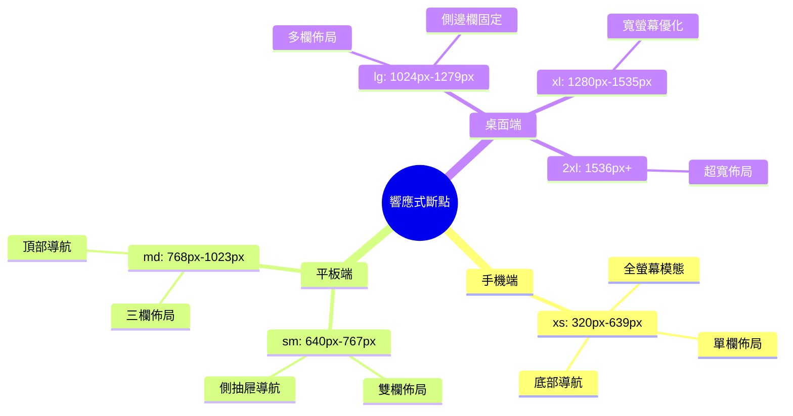
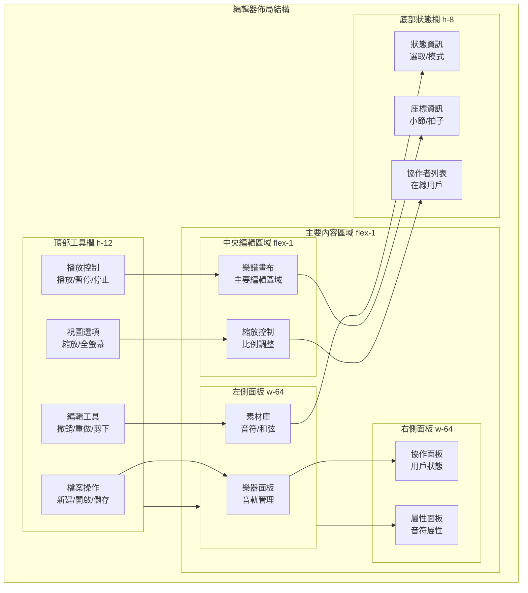

# BandPro 頁面佈局設計

統一且靈活的頁面佈局系統設計規範

## 📐 佈局系統架構

### 佈局層次結構
```mermaid
flowchart TD
    subgraph LayoutHierarchy[頁面佈局層次]
        subgraph L1[應用層級]
            AppShell[應用外殼<br/>導航 + 內容區]
            ModalLayer[模態層<br/>對話框 + 通知]
        end
        
        subgtml L2[頁面層級]
            PageContainer[頁面容器<br/>主要內容區域]
            SidebarLayout[側邊欄佈局<br/>輔助內容]
        end
        
        subgraph L3[區塊層級]
            ContentBlocks[內容區塊<br/>功能模組]
            CardLayouts[卡片佈局<br/>資訊組織]
        end
        
        subgraph L4[組件層級]
            FormLayouts[表單佈局<br/>輸入組織]
            ListLayouts[列表佈局<br/>資料展示]
        end
    end
    
    AppShell --> PageContainer
    ModalLayer --> SidebarLayout
    PageContainer --> ContentBlocks
    SidebarLayout --> CardLayouts
    ContentBlocks --> FormLayouts
    CardLayouts --> ListLayouts
```

### 響應式斷點系統


---

## 🏠 首頁佈局設計

### 響應式首頁佈局
```vue
<!-- views/HomePage.vue -->
<template>
  <div class="home-page">
    <!-- 英雄區域 -->
    <section class="hero-section">
      <div class="hero-container">
        <div class="hero-content">
          <h1 class="hero-title">
            專業樂團<br class="md:hidden">
            <span class="text-gradient">協作打譜系統</span>
          </h1>
          <p class="hero-subtitle">
            支援多人即時協作編輯，讓音樂創作更簡單高效
          </p>
          <div class="hero-actions">
            <router-link to="/editor" class="btn btn-primary btn-lg">
              開始創作
            </router-link>
            <router-link to="/library" class="btn btn-secondary btn-lg">
              瀏覽樂庫
            </router-link>
          </div>
        </div>
        <div class="hero-media">
          <div class="hero-image-placeholder">
            <!-- 樂譜編輯器預覽圖 -->
          </div>
        </div>
      </div>
    </section>

    <!-- 功能特色區域 -->
    <section class="features-section">
      <div class="container">
        <div class="section-header">
          <h2 class="section-title">強大功能</h2>
          <p class="section-subtitle">專為樂團協作設計的完整解決方案</p>
        </div>
        
        <div class="features-grid">
          <div 
            v-for="feature in features"
            :key="feature.id"
            class="feature-card"
          >
            <div class="feature-icon">
              <component :is="feature.icon" class="w-8 h-8" />
            </div>
            <h3 class="feature-title">{{ feature.title }}</h3>
            <p class="feature-description">{{ feature.description }}</p>
          </div>
        </div>
      </div>
    </section>

    <!-- 最近專案區域 -->
    <section v-if="recentProjects.length > 0" class="recent-section">
      <div class="container">
        <div class="section-header-inline">
          <h2 class="section-title">最近專案</h2>
          <router-link to="/projects" class="link-more">
            查看全部
            <ChevronRightIcon class="w-4 h-4" />
          </router-link>
        </div>
        
        <div class="projects-grid">
          <ProjectCard
            v-for="project in recentProjects"
            :key="project.id"
            :project="project"
            class="project-card"
          />
        </div>
      </div>
    </section>

    <!-- 樂庫推薦區域 -->
    <section class="library-section">
      <div class="container">
        <div class="section-header">
          <h2 class="section-title">精選樂譜</h2>
          <p class="section-subtitle">來自社群的優質樂譜分享</p>
        </div>
        
        <div class="library-tabs">
          <button
            v-for="category in libraryCategories"
            :key="category.id"
            @click="activeCategory = category.id"
            class="tab-button"
            :class="{ 'tab-active': activeCategory === category.id }"
          >
            {{ category.name }}
          </button>
        </div>
        
        <div class="library-grid">
          <ScoreCard
            v-for="score in filteredScores"
            :key="score.id"
            :score="score"
            class="score-card"
          />
        </div>
      </div>
    </section>
  </div>
</template>

<script setup lang="ts">
import { ref, computed } from 'vue'
import { ChevronRightIcon } from '@heroicons/vue/24/outline'
import {
  MusicalNoteIcon,
  UsersIcon,
  CloudIcon,
  DevicePhoneMobileIcon
} from '@heroicons/vue/24/outline'

const activeCategory = ref('popular')

const features = [
  {
    id: 1,
    icon: MusicalNoteIcon,
    title: '專業編輯器',
    description: '支援完整的音符、和弦、歌詞編輯功能'
  },
  {
    id: 2,
    icon: UsersIcon,
    title: '即時協作',
    description: '多人同時編輯，即時同步所有變更'
  },
  {
    id: 3,
    icon: CloudIcon,
    title: '雲端同步',
    description: '所有專案自動備份，隨時隨地存取'
  },
  {
    id: 4,
    icon: DevicePhoneMobileIcon,
    title: '跨平台支援',
    description: '桌面、平板、手機完美適配'
  }
]

const recentProjects = ref([
  // 最近專案資料
])

const libraryCategories = [
  { id: 'popular', name: '熱門' },
  { id: 'classical', name: '古典' },
  { id: 'pop', name: '流行' },
  { id: 'jazz', name: '爵士' }
]

const filteredScores = computed(() => {
  // 根據 activeCategory 過濾樂譜
  return []
})
</script>

<style scoped>
.home-page {
  @apply min-h-screen;
}

/* 英雄區域 */
.hero-section {
  @apply py-12 md:py-20 lg:py-24;
  @apply bg-gradient-to-br from-blue-50 via-white to-purple-50;
  @apply dark:from-gray-900 dark:via-gray-800 dark:to-gray-900;
}

.hero-container {
  @apply container mx-auto px-4;
  @apply grid lg:grid-cols-2 gap-8 lg:gap-12;
  @apply items-center;
}

.hero-content {
  @apply space-y-6;
}

.hero-title {
  @apply text-4xl md:text-5xl lg:text-6xl;
  @apply font-bold leading-tight;
  @apply text-gray-900 dark:text-white;
}

.text-gradient {
  @apply bg-gradient-to-r from-blue-600 to-purple-600;
  @apply dark:from-blue-400 dark:to-purple-400;
  @apply bg-clip-text text-transparent;
}

.hero-subtitle {
  @apply text-lg md:text-xl;
  @apply text-gray-600 dark:text-gray-300;
  @apply max-w-lg;
}

.hero-actions {
  @apply flex flex-col sm:flex-row gap-4;
}

.hero-media {
  @apply order-first lg:order-last;
}

.hero-image-placeholder {
  @apply aspect-[4/3] bg-gray-200 dark:bg-gray-700;
  @apply rounded-xl shadow-2xl;
  @apply border border-gray-300 dark:border-gray-600;
}

/* 功能特色區域 */
.features-section {
  @apply py-16 md:py-20;
  @apply bg-white dark:bg-gray-800;
}

.section-header {
  @apply text-center mb-12;
}

.section-title {
  @apply text-3xl md:text-4xl font-bold;
  @apply text-gray-900 dark:text-white;
  @apply mb-4;
}

.section-subtitle {
  @apply text-lg text-gray-600 dark:text-gray-300;
  @apply max-w-2xl mx-auto;
}

.features-grid {
  @apply grid md:grid-cols-2 lg:grid-cols-4 gap-8;
}

.feature-card {
  @apply text-center p-6;
  @apply bg-gray-50 dark:bg-gray-700;
  @apply rounded-xl;
  @apply hover:shadow-lg transition-shadow duration-300;
}

.feature-icon {
  @apply w-16 h-16 mx-auto mb-4;
  @apply bg-blue-100 dark:bg-blue-900;
  @apply rounded-full flex items-center justify-center;
  @apply text-blue-600 dark:text-blue-400;
}

.feature-title {
  @apply text-xl font-semibold mb-3;
  @apply text-gray-900 dark:text-white;
}

.feature-description {
  @apply text-gray-600 dark:text-gray-300;
}

/* 最近專案區域 */
.recent-section {
  @apply py-16 md:py-20;
  @apply bg-gray-50 dark:bg-gray-900;
}

.section-header-inline {
  @apply flex items-center justify-between mb-8;
}

.link-more {
  @apply flex items-center space-x-1;
  @apply text-blue-600 dark:text-blue-400;
  @apply hover:text-blue-800 dark:hover:text-blue-300;
  @apply font-medium;
}

.projects-grid {
  @apply grid md:grid-cols-2 lg:grid-cols-3 gap-6;
}

/* 樂庫推薦區域 */
.library-section {
  @apply py-16 md:py-20;
  @apply bg-white dark:bg-gray-800;
}

.library-tabs {
  @apply flex flex-wrap gap-2 mb-8;
  @apply justify-center;
}

.tab-button {
  @apply px-4 py-2 rounded-full;
  @apply text-sm font-medium;
  @apply text-gray-600 dark:text-gray-300;
  @apply hover:text-gray-900 dark:hover:text-white;
  @apply hover:bg-gray-100 dark:hover:bg-gray-700;
  @apply transition-all duration-200;
  
  &.tab-active {
    @apply bg-blue-100 dark:bg-blue-900;
    @apply text-blue-600 dark:text-blue-400;
  }
}

.library-grid {
  @apply grid md:grid-cols-2 lg:grid-cols-3 xl:grid-cols-4 gap-6;
}

/* 通用樣式 */
.container {
  @apply max-w-7xl mx-auto px-4 sm:px-6 lg:px-8;
}

.btn {
  @apply inline-flex items-center justify-center;
  @apply px-6 py-3 rounded-lg;
  @apply font-medium;
  @apply transition-all duration-200;
  @apply focus:outline-none focus:ring-2 focus:ring-offset-2;
  
  &.btn-lg {
    @apply px-8 py-4 text-lg;
  }
  
  &.btn-primary {
    @apply bg-blue-600 hover:bg-blue-700;
    @apply text-white;
    @apply focus:ring-blue-500;
  }
  
  &.btn-secondary {
    @apply bg-gray-200 hover:bg-gray-300;
    @apply dark:bg-gray-700 dark:hover:bg-gray-600;
    @apply text-gray-900 dark:text-white;
    @apply focus:ring-gray-500;
  }
}
</style>
```

---

## ✏️ 編輯器頁面佈局

### 編輯器主要佈局結構


#### 編輯器佈局實現
```vue
<!-- views/EditorPage.vue -->
<template>
  <div class="editor-page">
    <!-- 頂部工具欄 -->
    <header class="editor-toolbar">
      <div class="toolbar-section">
        <!-- 檔案操作 -->
        <div class="toolbar-group">
          <button class="toolbar-btn" @click="newScore">
            <DocumentPlusIcon class="w-4 h-4" />
            <span class="hidden sm:inline">新建</span>
          </button>
          <button class="toolbar-btn" @click="openScore">
            <FolderOpenIcon class="w-4 h-4" />
            <span class="hidden sm:inline">開啟</span>
          </button>
          <button class="toolbar-btn" @click="saveScore" :disabled="!hasChanges">
            <DocumentArrowDownIcon class="w-4 h-4" />
            <span class="hidden sm:inline">儲存</span>
          </button>
        </div>
        
        <!-- 編輯工具 */
        <div class="toolbar-group">
          <button class="toolbar-btn" @click="undo" :disabled="!canUndo">
            <ArrowUturnLeftIcon class="w-4 h-4" />
          </button>
          <button class="toolbar-btn" @click="redo" :disabled="!canRedo">
            <ArrowUturnRightIcon class="w-4 h-4" />
          </button>
          <div class="toolbar-divider"></div>
          <button class="toolbar-btn" @click="cut">
            <ScissorsIcon class="w-4 h-4" />
          </button>
          <button class="toolbar-btn" @click="copy">
            <DocumentDuplicateIcon class="w-4 h-4" />
          </button>
          <button class="toolbar-btn" @click="paste" :disabled="!canPaste">
            <ClipboardIcon class="w-4 h-4" />
          </button>
        </div>
        
        <!-- 播放控制 -->
        <div class="toolbar-group">
          <button 
            class="toolbar-btn toolbar-btn-primary"
            @click="togglePlayback"
          >
            <PlayIcon v-if="!isPlaying" class="w-4 h-4" />
            <PauseIcon v-else class="w-4 h-4" />
            <span class="hidden md:inline">
              {{ isPlaying ? '暫停' : '播放' }}
            </span>
          </button>
          <button class="toolbar-btn" @click="stopPlayback">
            <StopIcon class="w-4 h-4" />
          </button>
        </div>
      </div>
      
      <div class="toolbar-section">
        <!-- 視圖選項 -->
        <div class="toolbar-group">
          <button class="toolbar-btn" @click="zoomOut">
            <MinusIcon class="w-4 h-4" />
          </button>
          <span class="zoom-display">{{ zoomLevel }}%</span>
          <button class="toolbar-btn" @click="zoomIn">
            <PlusIcon class="w-4 h-4" />
          </button>
          <button class="toolbar-btn" @click="toggleFullscreen">
            <ArrowsPointingOutIcon class="w-4 h-4" />
          </button>
        </div>
      </div>
    </header>
    
    <!-- 主要內容區域 -->
    <main class="editor-main">
      <!-- 左側面板 -->
      <aside 
        class="editor-sidebar editor-sidebar-left"
        :class="{ 'sidebar-collapsed': leftPanelCollapsed }"
      >
        <div class="sidebar-tabs">
          <button
            v-for="tab in leftTabs"
            :key="tab.id"
            @click="activeLeftTab = tab.id"
            class="sidebar-tab"
            :class="{ 'tab-active': activeLeftTab === tab.id }"
          >
            <component :is="tab.icon" class="w-4 h-4" />
            <span v-if="!leftPanelCollapsed">{{ tab.name }}</span>
          </button>
        </div>
        
        <div class="sidebar-content">
          <!-- 樂器面板 -->
          <InstrumentPanel v-if="activeLeftTab === 'instruments'" />
          <!-- 素材庫面板 -->
          <LibraryPanel v-if="activeLeftTab === 'library'" />
        </div>
      </aside>
      
      <!-- 中央編輯區域 -->
      <div class="editor-content">
        <ScoreCanvas 
          :zoom-level="zoomLevel"
          :is-playing="isPlaying"
          @selection-change="handleSelectionChange"
        />
        
        <!-- 縮放控制 -->
        <div class="zoom-controls">
          <button @click="fitToWidth" class="zoom-btn">
            適合寬度
          </button>
          <button @click="fitToPage" class="zoom-btn">
            適合頁面
          </button>
        </div>
      </div>
      
      <!-- 右側面板 -->
      <aside 
        class="editor-sidebar editor-sidebar-right"
        :class="{ 'sidebar-collapsed': rightPanelCollapsed }"
      >
        <div class="sidebar-tabs">
          <button
            v-for="tab in rightTabs"
            :key="tab.id"
            @click="activeRightTab = tab.id"
            class="sidebar-tab"
            :class="{ 'tab-active': activeRightTab === tab.id }"
          >
            <component :is="tab.icon" class="w-4 h-4" />
            <span v-if="!rightPanelCollapsed">{{ tab.name }}</span>
          </button>
        </div>
        
        <div class="sidebar-content">
          <!-- 屬性面板 -->
          <PropertiesPanel v-if="activeRightTab === 'properties'" />
          <!-- 協作面板 -->
          <CollaborationPanel v-if="activeRightTab === 'collaboration'" />
        </div>
      </aside>
    </main>
    
    <!-- 底部狀態欄 -->
    <footer class="editor-statusbar">
      <div class="status-section">
        <span class="status-item">
          {{ selectedCount > 0 ? `已選取 ${selectedCount} 個音符` : '未選取' }}
        </span>
        <span class="status-item">
          小節: {{ currentMeasure }} | 拍子: {{ currentBeat }}
        </span>
      </div>
      
      <div class="status-section">
        <CollaboratorAvatars :collaborators="onlineCollaborators" />
      </div>
    </footer>
  </div>
</template>

<script setup lang="ts">
import { ref, computed } from 'vue'
import {
  DocumentPlusIcon,
  FolderOpenIcon, 
  DocumentArrowDownIcon,
  ArrowUturnLeftIcon,
  ArrowUturnRightIcon,
  ScissorsIcon,
  DocumentDuplicateIcon,
  ClipboardIcon,
  PlayIcon,
  PauseIcon,
  StopIcon,
  MinusIcon,
  PlusIcon,
  ArrowsPointingOutIcon
} from '@heroicons/vue/24/outline'

// 狀態管理
const zoomLevel = ref(100)
const isPlaying = ref(false)
const hasChanges = ref(false)
const canUndo = ref(false)
const canRedo = ref(false)
const canPaste = ref(false)
const selectedCount = ref(0)
const currentMeasure = ref(1)
const currentBeat = ref(1)
const leftPanelCollapsed = ref(false)
const rightPanelCollapsed = ref(false)
const activeLeftTab = ref('instruments')
const activeRightTab = ref('properties')

const leftTabs = [
  { id: 'instruments', name: '樂器', icon: MusicalNoteIcon },
  { id: 'library', name: '素材庫', icon: BookOpenIcon }
]

const rightTabs = [
  { id: 'properties', name: '屬性', icon: AdjustmentsHorizontalIcon },
  { id: 'collaboration', name: '協作', icon: UsersIcon }
]

const onlineCollaborators = ref([
  // 在線協作者資料
])

// 編輯器操作方法
const newScore = () => {
  console.log('新建樂譜')
}

const openScore = () => {
  console.log('開啟樂譜')
}

const saveScore = () => {
  console.log('儲存樂譜')
}

const undo = () => {
  console.log('撤銷操作')
}

const redo = () => {
  console.log('重做操作')
}

const cut = () => {
  console.log('剪下')
}

const copy = () => {
  console.log('複製')
}

const paste = () => {
  console.log('貼上')
}

const togglePlayback = () => {
  isPlaying.value = !isPlaying.value
}

const stopPlayback = () => {
  isPlaying.value = false
}

const zoomIn = () => {
  zoomLevel.value = Math.min(zoomLevel.value + 25, 400)
}

const zoomOut = () => {
  zoomLevel.value = Math.max(zoomLevel.value - 25, 25)
}

const fitToWidth = () => {
  zoomLevel.value = 100 // 計算適合寬度的縮放比例
}

const fitToPage = () => {
  zoomLevel.value = 85 // 計算適合頁面的縮放比例
}

const toggleFullscreen = () => {
  if (document.fullscreenElement) {
    document.exitFullscreen()
  } else {
    document.documentElement.requestFullscreen()
  }
}

const handleSelectionChange = (selection: any) => {
  selectedCount.value = selection.length
}
</script>

<style scoped>
.editor-page {
  @apply h-screen flex flex-col;
  @apply bg-gray-50 dark:bg-gray-900;
}

/* 頂部工具欄 */
.editor-toolbar {
  @apply h-12 bg-white dark:bg-gray-800;
  @apply border-b border-gray-200 dark:border-gray-700;
  @apply flex items-center justify-between px-4;
  @apply flex-shrink-0;
}

.toolbar-section {
  @apply flex items-center space-x-4;
}

.toolbar-group {
  @apply flex items-center space-x-1;
  @apply bg-gray-50 dark:bg-gray-700;
  @apply rounded-lg p-1;
}

.toolbar-btn {
  @apply flex items-center space-x-1;
  @apply px-2 py-1.5 rounded-md;
  @apply text-sm font-medium;
  @apply text-gray-700 dark:text-gray-300;
  @apply hover:bg-white dark:hover:bg-gray-600;
  @apply transition-colors duration-150;
  @apply disabled:opacity-50 disabled:cursor-not-allowed;
  
  &.toolbar-btn-primary {
    @apply bg-blue-500 hover:bg-blue-600;
    @apply text-white;
  }
}

.toolbar-divider {
  @apply w-px h-6 bg-gray-300 dark:bg-gray-600;
  @apply mx-1;
}

.zoom-display {
  @apply px-2 py-1 text-sm font-medium;
  @apply text-gray-700 dark:text-gray-300;
  @apply min-w-12 text-center;
}

/* 主要內容區域 */
.editor-main {
  @apply flex-1 flex overflow-hidden;
}

.editor-sidebar {
  @apply w-64 bg-white dark:bg-gray-800;
  @apply border-r border-gray-200 dark:border-gray-700;
  @apply flex flex-col;
  @apply transition-all duration-300;
  
  &.sidebar-collapsed {
    @apply w-12;
  }
  
  &.editor-sidebar-right {
    @apply border-r-0 border-l border-gray-200 dark:border-gray-700;
  }
}

.sidebar-tabs {
  @apply flex border-b border-gray-200 dark:border-gray-700;
  @apply flex-shrink-0;
}

.sidebar-tab {
  @apply flex-1 flex items-center justify-center space-x-2;
  @apply px-3 py-3;
  @apply text-sm font-medium;
  @apply text-gray-600 dark:text-gray-400;
  @apply hover:text-gray-900 dark:hover:text-white;
  @apply hover:bg-gray-50 dark:hover:bg-gray-700;
  @apply border-b-2 border-transparent;
  @apply transition-all duration-200;
  
  &.tab-active {
    @apply text-blue-600 dark:text-blue-400;
    @apply border-blue-500 dark:border-blue-400;
    @apply bg-blue-50 dark:bg-blue-900/20;
  }
}

.sidebar-content {
  @apply flex-1 overflow-y-auto;
  @apply p-4;
}

/* 中央編輯區域 */
.editor-content {
  @apply flex-1 relative overflow-hidden;
  @apply bg-gray-100 dark:bg-gray-800;
}

.zoom-controls {
  @apply absolute bottom-4 right-4;
  @apply flex space-x-2;
}

.zoom-btn {
  @apply px-3 py-2;
  @apply bg-white dark:bg-gray-700;
  @apply border border-gray-300 dark:border-gray-600;
  @apply text-sm font-medium;
  @apply text-gray-700 dark:text-gray-300;
  @apply rounded-md shadow-sm;
  @apply hover:bg-gray-50 dark:hover:bg-gray-600;
  @apply transition-colors duration-150;
}

/* 底部狀態欄 */
.editor-statusbar {
  @apply h-8 bg-gray-100 dark:bg-gray-700;
  @apply border-t border-gray-200 dark:border-gray-600;
  @apply flex items-center justify-between px-4;
  @apply text-xs text-gray-600 dark:text-gray-400;
  @apply flex-shrink-0;
}

.status-section {
  @apply flex items-center space-x-4;
}

.status-item {
  @apply flex items-center space-x-1;
}
</style>
```

---

## 📚 樂庫頁面佈局

由於內容較長，將樂庫頁面佈局和其他頁面佈局拆分到下一個文件中。

## ✅ 本文件包含內容

1. **佈局系統架構** - 完整的四層佈局層次結構
2. **響應式斷點系統** - 從手機到超寬螢幕的完整斷點定義  
3. **首頁佈局設計** - 英雄區域、功能特色、最近專案、樂庫推薦
4. **編輯器頁面佈局** - 工具欄、側邊面板、畫布區域、狀態欄

## 🔗 相關文件

👉 **下一步：參考 [06_編輯器界面設計.md](./06_編輯器界面設計.md) 了解編輯器詳細界面設計**

👉 **並行：參考 [07_樂庫與協作界面.md](./07_樂庫與協作界面.md) 了解樂庫和協作頁面佈局**
