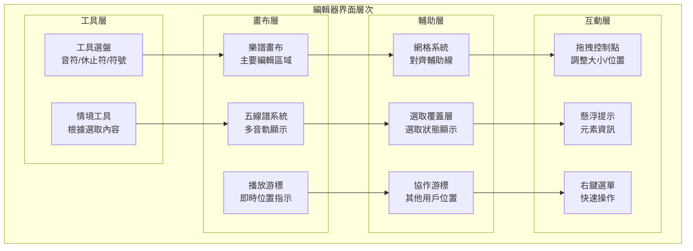
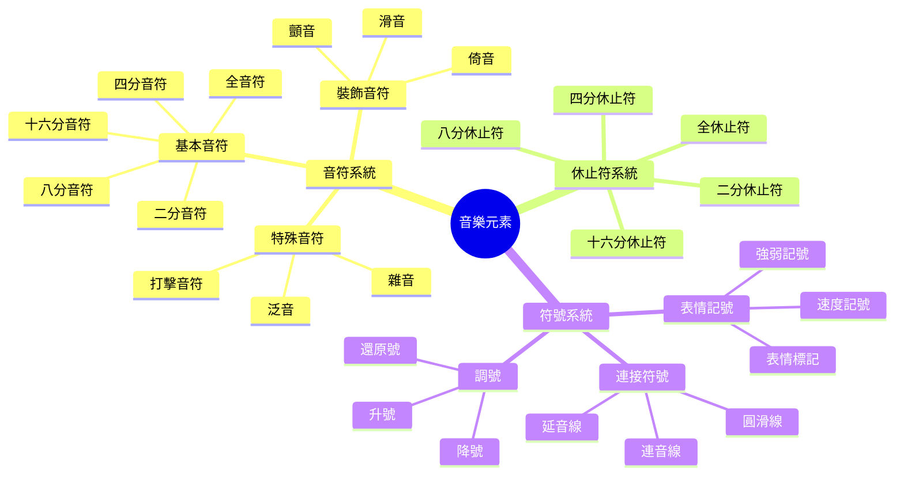

# BandPro 編輯器界面設計

專業音樂編輯器的完整界面設計規範

## 🎼 編輯器核心架構

### 編輯器界面層次


### 音樂元素組織架構


---

## 🎨 工具面板設計

### 主要工具選盤
```vue
<!-- components/editor/ToolPalette.vue -->
<template>
  <div class="tool-palette">
    <!-- 工具分類標籤 -->
    <div class="tool-categories">
      <button
        v-for="category in toolCategories"
        :key="category.id"
        @click="activeCategory = category.id"
        class="category-tab"
        :class="{ 'tab-active': activeCategory === category.id }"
        :title="category.tooltip"
      >
        <component :is="category.icon" class="w-5 h-5" />
        <span class="category-label">{{ category.name }}</span>
      </button>
    </div>
    
    <!-- 工具網格 -->
    <div class="tools-grid">
      <div
        v-for="tool in currentTools"
        :key="tool.id"
        @click="selectTool(tool)"
        @mouseenter="showToolPreview(tool)"
        @mouseleave="hideToolPreview"
        class="tool-item"
        :class="{ 
          'tool-active': selectedTool?.id === tool.id,
          'tool-disabled': tool.disabled
        }"
        :title="tool.tooltip"
      >
        <!-- 工具圖標 -->
        <div class="tool-icon">
          <component 
            v-if="tool.iconComponent"
            :is="tool.iconComponent" 
            class="w-6 h-6"
          />
          <div 
            v-else-if="tool.symbol"
            class="tool-symbol"
          >
            {{ tool.symbol }}
          </div>
          
        </div>
        
        <!-- 工具名稱 -->
        <div class="tool-name">{{ tool.name }}</div>
        
        <!-- 快捷鍵 -->
        <div v-if="tool.shortcut" class="tool-shortcut">
          {{ tool.shortcut }}
        </div>
      </div>
    </div>
    
    <!-- 工具預覽 -->
    <div v-if="previewTool" class="tool-preview">
      <div class="preview-content">
        <h4 class="preview-title">{{ previewTool.name }}</h4>
        <p class="preview-description">{{ previewTool.description }}</p>
        <div v-if="previewTool.shortcut" class="preview-shortcut">
          快捷鍵: <kbd>{{ previewTool.shortcut }}</kbd>
        </div>
      </div>
    </div>
  </div>
</template>

<script setup lang="ts">
import { ref, computed } from 'vue'
import {
  MusicalNoteIcon,
  PauseIcon,
  HashtagIcon,
  SpeakerWaveIcon
} from '@heroicons/vue/24/outline'

interface Tool {
  id: string
  name: string
  category: string
  iconComponent?: any
  symbol?: string
  image?: string
  shortcut?: string
  tooltip: string
  description: string
  disabled?: boolean
}

const activeCategory = ref('notes')
const selectedTool = ref<Tool | null>(null)
const previewTool = ref<Tool | null>(null)

const toolCategories = [
  {
    id: 'notes',
    name: '音符',
    icon: MusicalNoteIcon,
    tooltip: '音符工具'
  },
  {
    id: 'rests',
    name: '休止符',
    icon: PauseIcon,
    tooltip: '休止符工具'
  },
  {
    id: 'symbols',
    name: '符號',
    icon: HashtagIcon,
    tooltip: '音樂符號'
  },
  {
    id: 'dynamics',
    name: '表情',
    icon: SpeakerWaveIcon,
    tooltip: '表情記號'
  }
]

const allTools: Tool[] = [
  // 音符工具
  {
    id: 'whole-note',
    name: '全音符',
    category: 'notes',
    symbol: '𝅝',
    shortcut: '1',
    tooltip: '全音符 (1)',
    description: '持續四拍的音符'
  },
  {
    id: 'half-note',
    name: '二分音符',
    category: 'notes',
    symbol: '𝅗𝅥',
    shortcut: '2',
    tooltip: '二分音符 (2)',
    description: '持續兩拍的音符'
  },
  {
    id: 'quarter-note',
    name: '四分音符',
    category: 'notes',
    symbol: '♩',
    shortcut: '4',
    tooltip: '四分音符 (4)',
    description: '持續一拍的音符'
  },
  {
    id: 'eighth-note',
    name: '八分音符',
    category: 'notes',
    symbol: '♪',
    shortcut: '8',
    tooltip: '八分音符 (8)',
    description: '持續半拍的音符'
  },
  {
    id: 'sixteenth-note',
    name: '十六分音符',
    category: 'notes',
    symbol: '𝅘𝅥𝅯',
    shortcut: '6',
    tooltip: '十六分音符 (6)',
    description: '持續四分之一拍的音符'
  },
  
  // 休止符工具
  {
    id: 'whole-rest',
    name: '全休止符',
    category: 'rests',
    symbol: '■',
    shortcut: 'Shift+1',
    tooltip: '全休止符 (Shift+1)',
    description: '持續四拍的休止符'
  },
  {
    id: 'half-rest',
    name: '二分休止符',
    category: 'rests',
    symbol: '■',
    shortcut: 'Shift+2',
    tooltip: '二分休止符 (Shift+2)',
    description: '持續兩拍的休止符'
  },
  {
    id: 'quarter-rest',
    name: '四分休止符',
    category: 'rests',
    symbol: '𝄽',
    shortcut: 'Shift+4',
    tooltip: '四分休止符 (Shift+4)',
    description: '持續一拍的休止符'
  },
  
  // 符號工具
  {
    id: 'sharp',
    name: '升號',
    category: 'symbols',
    symbol: '♯',
    shortcut: 'S',
    tooltip: '升號 (S)',
    description: '升高半音的記號'
  },
  {
    id: 'flat',
    name: '降號',
    category: 'symbols',
    symbol: '♭',
    shortcut: 'F',
    tooltip: '降號 (F)',
    description: '降低半音的記號'
  },
  {
    id: 'natural',
    name: '還原號',
    category: 'symbols',
    symbol: '♮',
    shortcut: 'N',
    tooltip: '還原號 (N)',
    description: '取消升降的記號'
  },
  
  // 表情記號
  {
    id: 'forte',
    name: '強 (f)',
    category: 'dynamics',
    symbol: 'f',
    shortcut: 'Alt+F',
    tooltip: '強音記號 (Alt+F)',
    description: '表示音量強度'
  },
  {
    id: 'piano',
    name: '弱 (p)',
    category: 'dynamics',
    symbol: 'p',
    shortcut: 'Alt+P',
    tooltip: '弱音記號 (Alt+P)',
    description: '表示音量輕柔'
  }
]

const currentTools = computed(() => {
  return allTools.filter(tool => tool.category === activeCategory.value)
})

const selectTool = (tool: Tool) => {
  if (tool.disabled) return
  selectedTool.value = tool
  // 發送工具選擇事件
  console.log('Selected tool:', tool.id)
}

const showToolPreview = (tool: Tool) => {
  previewTool.value = tool
}

const hideToolPreview = () => {
  previewTool.value = null
}
</script>

<style scoped>
.tool-palette {
  @apply h-full flex flex-col;
  @apply bg-white dark:bg-gray-800;
}

/* 工具分類標籤 */
.tool-categories {
  @apply flex border-b border-gray-200 dark:border-gray-700;
  @apply flex-shrink-0;
}

.category-tab {
  @apply flex-1 flex flex-col items-center justify-center;
  @apply py-3 px-2;
  @apply text-xs font-medium;
  @apply text-gray-600 dark:text-gray-400;
  @apply hover:text-gray-900 dark:hover:text-white;
  @apply hover:bg-gray-50 dark:hover:bg-gray-700;
  @apply border-b-2 border-transparent;
  @apply transition-all duration-200;
  
  &.tab-active {
    @apply text-blue-600 dark:text-blue-400;
    @apply border-blue-500 dark:border-blue-400;
    @apply bg-blue-50 dark:bg-blue-900/20;
  }
}

.category-label {
  @apply mt-1;
}

/* 工具網格 */
.tools-grid {
  @apply flex-1 overflow-y-auto;
  @apply p-2;
  @apply grid grid-cols-2 gap-2;
}

.tool-item {
  @apply relative flex flex-col items-center;
  @apply p-3 rounded-lg;
  @apply bg-gray-50 dark:bg-gray-700;
  @apply hover:bg-gray-100 dark:hover:bg-gray-600;
  @apply border-2 border-transparent;
  @apply cursor-pointer;
  @apply transition-all duration-200;
  
  &.tool-active {
    @apply bg-blue-100 dark:bg-blue-900/30;
    @apply border-blue-500 dark:border-blue-400;
  }
  
  &.tool-disabled {
    @apply opacity-50 cursor-not-allowed;
  }
}

.tool-icon {
  @apply mb-2 flex items-center justify-center;
  @apply w-8 h-8;
}

.tool-symbol {
  @apply text-2xl font-bold;
  @apply text-gray-700 dark:text-gray-300;
}

.tool-image {
  @apply w-full h-full object-contain;
}

.tool-name {
  @apply text-xs font-medium text-center;
  @apply text-gray-700 dark:text-gray-300;
  @apply mb-1;
}

.tool-shortcut {
  @apply text-xs text-gray-500 dark:text-gray-400;
  @apply bg-gray-200 dark:bg-gray-600;
  @apply px-1 rounded;
}

/* 工具預覽 */
.tool-preview {
  @apply border-t border-gray-200 dark:border-gray-700;
  @apply p-4 bg-gray-50 dark:bg-gray-700;
  @apply flex-shrink-0;
}

.preview-content {
  @apply space-y-2;
}

.preview-title {
  @apply font-semibold text-gray-900 dark:text-white;
}

.preview-description {
  @apply text-sm text-gray-600 dark:text-gray-300;
}

.preview-shortcut {
  @apply text-xs text-gray-500 dark:text-gray-400;
}

.preview-shortcut kbd {
  @apply bg-gray-200 dark:bg-gray-600;
  @apply px-1 py-0.5 rounded text-xs;
  @apply font-mono;
}
</style>
```

---

## 🎼 樂譜畫布設計

### 五線譜畫布架構
```vue
<!-- components/editor/ScoreCanvas.vue -->
<template>
  <div 
    ref="canvasContainer"
    class="score-canvas-container"
    @wheel="handleZoom"
    @mousedown="handleCanvasMouseDown"
    @mousemove="handleCanvasMouseMove"
    @mouseup="handleCanvasMouseUp"
    @contextmenu="handleContextMenu"
  >
    <!-- SVG 樂譜畫布 -->
    <svg
      ref="scoreCanvas"
      class="score-canvas"
      :viewBox="`0 0 ${canvasWidth} ${canvasHeight}`"
      :style="{ 
        transform: `scale(${zoomLevel / 100})`,
        transformOrigin: 'top left'
      }"
    >
      <!-- 背景網格 -->
      <g v-if="showGrid" class="grid-layer">
        <defs>
          <pattern
            id="grid"
            width="20"
            height="20"
            patternUnits="userSpaceOnUse"
          >
            <path
              d="M 20 0 L 0 0 0 20"
              fill="none"
              stroke="currentColor"
              stroke-width="0.5"
              opacity="0.3"
            />
          </pattern>
        </defs>
        <rect width="100%" height="100%" fill="url(#grid)" />
      </g>
      
      <!-- 五線譜系統 -->
      <g class="staff-system-layer">
        <StaffSystem
          v-for="(system, index) in staffSystems"
          :key="`system-${index}`"
          :system="system"
          :y-position="index * staffSystemHeight"
          @note-click="handleNoteClick"
          @note-drag="handleNoteDrag"
        />
      </g>
      
      <!-- 選取覆蓋層 -->
      <g class="selection-layer">
        <SelectionBox
          v-if="selectionBox"
          :box="selectionBox"
        />
        <g v-for="element in selectedElements" :key="element.id">
          <SelectionHighlight :element="element" />
        </g>
      </g>
      
      <!-- 播放游標 -->
      <g v-if="isPlaying" class="playback-layer">
        <PlaybackCursor
          :position="playbackPosition"
          :height="canvasHeight"
        />
      </g>
      
      <!-- 協作游標 -->
      <g class="collaboration-layer">
        <CollaborationCursor
          v-for="cursor in collaborationCursors"
          :key="cursor.userId"
          :cursor="cursor"
        />
      </g>
      
      <!-- 拖拽預覽 -->
      <g v-if="dragPreview" class="drag-preview-layer">
        <DragPreview :preview="dragPreview" />
      </g>
    </svg>
    
    <!-- 畫布覆蓋層 -->
    <div class="canvas-overlay">
      <!-- 縮放控制 -->
      <div class="zoom-controls">
        <div class="zoom-indicator">{{ Math.round(zoomLevel) }}%</div>
        <div class="zoom-slider">
          <input
            v-model="zoomLevel"
            type="range"
            min="25"
            max="400"
            step="25"
            class="zoom-range"
          />
        </div>
      </div>
      
      <!-- 小地圖導航 -->
      <div v-if="showMinimap" class="minimap">
        <MinimapView
          :canvas-width="canvasWidth"
          :canvas-height="canvasHeight"
          :viewport="viewport"
          @viewport-change="handleViewportChange"
        />
      </div>
      
      <!-- 情境工具欄 -->
      <ContextualToolbar
        v-if="contextualTools.length > 0"
        :tools="contextualTools"
        :position="contextualToolbarPosition"
        @tool-select="handleContextualTool"
      />
    </div>
    
    <!-- 右鍵選單 -->
    <ContextMenu
      v-if="contextMenu"
      :menu="contextMenu"
      :position="contextMenuPosition"
      @menu-select="handleContextMenuSelect"
      @menu-close="closeContextMenu"
    />
  </div>
</template>

<script setup lang="ts">
import { ref, computed, onMounted, onUnmounted } from 'vue'

interface Props {
  zoomLevel: number
  isPlaying: boolean
  showGrid?: boolean
  showMinimap?: boolean
}

const props = withDefaults(defineProps<Props>(), {
  showGrid: true,
  showMinimap: true
})

const emit = defineEmits<{
  'selection-change': [elements: any[]]
  'zoom-change': [level: number]
  'viewport-change': [viewport: any]
}>()

// 畫布狀態
const canvasContainer = ref<HTMLDivElement>()
const scoreCanvas = ref<SVGElement>()
const canvasWidth = ref(1200)
const canvasHeight = ref(800)
const staffSystemHeight = ref(120)

// 互動狀態
const isDragging = ref(false)
const dragStart = ref({ x: 0, y: 0 })
const selectionBox = ref<any>(null)
const selectedElements = ref<any[]>([])
const contextMenu = ref<any>(null)
const contextMenuPosition = ref({ x: 0, y: 0 })
const dragPreview = ref<any>(null)

// 播放狀態
const playbackPosition = ref(0)

// 協作狀態
const collaborationCursors = ref<any[]>([])

// 情境工具
const contextualTools = ref<any[]>([])
const contextualToolbarPosition = ref({ x: 0, y: 0 })

// 視窗狀態
const viewport = ref({
  x: 0,
  y: 0,
  width: 1200,
  height: 800
})

// 五線譜系統
const staffSystems = computed(() => {
  // 生成五線譜系統資料
  return [
    {
      id: 'system-1',
      staves: [
        { clef: 'treble', key: 'C', time: '4/4' }
      ],
      measures: []
    }
  ]
})

// 事件處理
const handleZoom = (event: WheelEvent) => {
  event.preventDefault()
  const delta = event.deltaY > 0 ? -10 : 10
  const newZoom = Math.max(25, Math.min(400, props.zoomLevel + delta))
  emit('zoom-change', newZoom)
}

const handleCanvasMouseDown = (event: MouseEvent) => {
  if (event.button === 0) { // 左鍵
    isDragging.value = true
    dragStart.value = { x: event.clientX, y: event.clientY }
    
    // 開始選取框
    selectionBox.value = {
      x: event.offsetX,
      y: event.offsetY,
      width: 0,
      height: 0
    }
  }
}

const handleCanvasMouseMove = (event: MouseEvent) => {
  if (isDragging.value && selectionBox.value) {
    // 更新選取框
    selectionBox.value.width = event.offsetX - selectionBox.value.x
    selectionBox.value.height = event.offsetY - selectionBox.value.y
  }
}

const handleCanvasMouseUp = () => {
  if (isDragging.value) {
    isDragging.value = false
    
    // 完成選取
    if (selectionBox.value) {
      const elements = getElementsInBox(selectionBox.value)
      selectedElements.value = elements
      emit('selection-change', elements)
      selectionBox.value = null
    }
  }
}

const handleContextMenu = (event: MouseEvent) => {
  event.preventDefault()
  contextMenu.value = generateContextMenu(event.target)
  contextMenuPosition.value = { x: event.clientX, y: event.clientY }
}

const handleNoteClick = (note: any) => {
  selectedElements.value = [note]
  emit('selection-change', [note])
  
  // 顯示情境工具
  contextualTools.value = generateContextualTools(note)
  contextualToolbarPosition.value = {
    x: note.x + 50,
    y: note.y - 40
  }
}

const handleNoteDrag = (note: any, position: any) => {
  // 處理音符拖拽
  console.log('Note dragged:', note, position)
}

const handleContextualTool = (tool: any) => {
  console.log('Contextual tool selected:', tool)
}

const handleViewportChange = (newViewport: any) => {
  viewport.value = newViewport
  emit('viewport-change', newViewport)
}

const closeContextMenu = () => {
  contextMenu.value = null
}

const handleContextMenuSelect = (action: string) => {
  console.log('Context menu action:', action)
  closeContextMenu()
}

const getElementsInBox = (box: any) => {
  // 返回選取框內的元素
  return []
}

const generateContextMenu = (target: any) => {
  // 根據目標生成情境選單
  return {
    items: [
      { label: '複製', action: 'copy' },
      { label: '剪下', action: 'cut' },
      { label: '貼上', action: 'paste' },
      { separator: true },
      { label: '刪除', action: 'delete' }
    ]
  }
}

const generateContextualTools = (element: any) => {
  // 根據元素生成情境工具
  return [
    { id: 'pitch-up', label: '升高', icon: 'arrow-up' },
    { id: 'pitch-down', label: '降低', icon: 'arrow-down' },
    { id: 'duration-longer', label: '延長', icon: 'plus' },
    { id: 'duration-shorter', label: '縮短', icon: 'minus' }
  ]
}

onMounted(() => {
  // 監聽鍵盤事件
  document.addEventListener('keydown', handleKeyDown)
  document.addEventListener('keyup', handleKeyUp)
})

onUnmounted(() => {
  document.removeEventListener('keydown', handleKeyDown)
  document.removeEventListener('keyup', handleKeyUp)
})

const handleKeyDown = (event: KeyboardEvent) => {
  // 處理鍵盤快捷鍵
  switch (event.key) {
    case 'Delete':
      deleteSelectedElements()
      break
    case 'Escape':
      clearSelection()
      break
  }
}

const handleKeyUp = (event: KeyboardEvent) => {
  // 處理鍵盤釋放事件
}

const deleteSelectedElements = () => {
  selectedElements.value = []
  emit('selection-change', [])
}

const clearSelection = () => {
  selectedElements.value = []
  contextualTools.value = []
  emit('selection-change', [])
}
</script>

<style scoped>
.score-canvas-container {
  @apply relative w-full h-full overflow-hidden;
  @apply bg-white dark:bg-gray-900;
}

.score-canvas {
  @apply w-full h-full;
  @apply cursor-default;
  color: theme('colors.gray.800');
  
  .dark & {
    color: theme('colors.gray.200');
  }
}

.grid-layer {
  @apply pointer-events-none;
}

.staff-system-layer {
  @apply pointer-events-auto;
}

.selection-layer {
  @apply pointer-events-none;
}

.playback-layer {
  @apply pointer-events-none;
}

.collaboration-layer {
  @apply pointer-events-none;
}

.drag-preview-layer {
  @apply pointer-events-none;
}

/* 畫布覆蓋層 */
.canvas-overlay {
  @apply absolute inset-0 pointer-events-none;
}

.zoom-controls {
  @apply absolute bottom-4 right-4;
  @apply pointer-events-auto;
  @apply bg-white dark:bg-gray-800;
  @apply rounded-lg shadow-lg;
  @apply p-3 space-y-2;
}

.zoom-indicator {
  @apply text-sm font-medium text-center;
  @apply text-gray-700 dark:text-gray-300;
}

.zoom-slider {
  @apply w-32;
}

.zoom-range {
  @apply w-full h-2;
  @apply bg-gray-200 dark:bg-gray-600;
  @apply rounded-lg appearance-none;
  @apply cursor-pointer;
  
  &::-webkit-slider-thumb {
    @apply appearance-none w-4 h-4;
    @apply bg-blue-500 rounded-full;
    @apply cursor-pointer;
  }
  
  &::-moz-range-thumb {
    @apply w-4 h-4 bg-blue-500;
    @apply border-0 rounded-full;
    @apply cursor-pointer;
  }
}

.minimap {
  @apply absolute top-4 right-4;
  @apply pointer-events-auto;
  @apply w-48 h-32;
  @apply bg-white dark:bg-gray-800;
  @apply border border-gray-300 dark:border-gray-600;
  @apply rounded-lg shadow-lg;
}
</style>
```

---

## 🎵 音符編輯組件

### 智能音符輸入
```vue
<!-- components/editor/NoteInput.vue -->
<template>
  <div class="note-input-system">
    <!-- 音符輸入模式選擇 -->
    <div class="input-mode-selector">
      <button
        v-for="mode in inputModes"
        :key="mode.id"
        @click="activeInputMode = mode.id"
        class="mode-button"
        :class="{ 'mode-active': activeInputMode === mode.id }"
      >
        <component :is="mode.icon" class="w-4 h-4" />
        <span>{{ mode.name }}</span>
      </button>
    </div>
    
    <!-- 音符屬性面板 -->
    <div class="note-properties-panel">
      <!-- 音符時值選擇 -->
      <div class="property-group">
        <label class="property-label">時值</label>
        <div class="duration-selector">
          <button
            v-for="duration in noteDurations"
            :key="duration.value"
            @click="selectedDuration = duration.value"
            class="duration-button"
            :class="{ 'duration-active': selectedDuration === duration.value }"
          >
            <span class="duration-symbol">{{ duration.symbol }}</span>
            <span class="duration-name">{{ duration.name }}</span>
          </button>
        </div>
      </div>
      
      <!-- 音高調整 -->
      <div class="property-group">
        <label class="property-label">音高</label>
        <div class="pitch-controls">
          <button @click="adjustPitch(-1)" class="pitch-button">
            <ChevronDownIcon class="w-4 h-4" />
          </button>
          <div class="pitch-display">{{ currentPitch }}</div>
          <button @click="adjustPitch(1)" class="pitch-button">
            <ChevronUpIcon class="w-4 h-4" />
          </button>
        </div>
      </div>
      
      <!-- 臨時記號 -->
      <div class="property-group">
        <label class="property-label">臨時記號</label>
        <div class="accidental-selector">
          <button
            v-for="accidental in accidentals"
            :key="accidental.id"
            @click="selectedAccidental = accidental.id"
            class="accidental-button"
            :class="{ 'accidental-active': selectedAccidental === accidental.id }"
          >
            {{ accidental.symbol }}
          </button>
        </div>
      </div>
      
      <!-- 表情記號 -->
      <div class="property-group">
        <label class="property-label">表情</label>
        <div class="articulation-selector">
          <button
            v-for="articulation in articulations"
            :key="articulation.id"
            @click="toggleArticulation(articulation.id)"
            class="articulation-button"
            :class="{ 'articulation-active': selectedArticulations.includes(articulation.id) }"
          >
            {{ articulation.symbol }}
          </button>
        </div>
      </div>
    </div>
    
    <!-- 即時預覽 -->
    <div class="note-preview">
      <div class="preview-label">預覽</div>
      <div class="preview-staff">
        <svg class="preview-svg" viewBox="0 0 100 60">
          <!-- 五線譜線 -->
          <g class="staff-lines">
            <line v-for="i in 5" :key="i" 
                  :y1="i * 10 + 5" :y2="i * 10 + 5" 
                  x1="10" x2="90" 
                  stroke="currentColor" stroke-width="1"/>
          </g>
          
          <!-- 預覽音符 -->
          <g class="preview-note" transform="translate(50, 30)">
            <NoteSymbol
              :duration="selectedDuration"
              :pitch="currentPitch"
              :accidental="selectedAccidental"
              :articulations="selectedArticulations"
            />
          </g>
        </svg>
      </div>
    </div>
  </div>
</template>

<script setup lang="ts">
import { ref, computed } from 'vue'
import {
  CursorArrowRaysIcon,
  HandRaisedIcon,
  PencilIcon,
  ChevronUpIcon,
  ChevronDownIcon
} from '@heroicons/vue/24/outline'

const activeInputMode = ref('cursor')
const selectedDuration = ref('quarter')
const currentPitch = ref('C4')
const selectedAccidental = ref('')
const selectedArticulations = ref<string[]>([])

const inputModes = [
  { id: 'cursor', name: '游標', icon: CursorArrowRaysIcon },
  { id: 'click', name: '點擊', icon: HandRaisedIcon },
  { id: 'draw', name: '繪製', icon: PencilIcon }
]

const noteDurations = [
  { value: 'whole', symbol: '𝅝', name: '全音符' },
  { value: 'half', symbol: '𝅗𝅥', name: '二分音符' },
  { value: 'quarter', symbol: '♩', name: '四分音符' },
  { value: 'eighth', symbol: '♪', name: '八分音符' },
  { value: 'sixteenth', symbol: '𝅘𝅥𝅯', name: '十六分音符' }
]

const accidentals = [
  { id: 'sharp', symbol: '♯' },
  { id: 'flat', symbol: '♭' },
  { id: 'natural', symbol: '♮' },
  { id: '', symbol: '無' }
]

const articulations = [
  { id: 'staccato', symbol: '.' },
  { id: 'accent', symbol: '>' },
  { id: 'tenuto', symbol: '-' },
  { id: 'fermata', symbol: '𝄐' }
]

const adjustPitch = (direction: number) => {
  // 調整音高邏輯
  const pitches = ['C', 'C#', 'D', 'D#', 'E', 'F', 'F#', 'G', 'G#', 'A', 'A#', 'B']
  const octaves = [0, 1, 2, 3, 4, 5, 6, 7, 8]
  
  const currentNote = currentPitch.value.slice(0, -1)
  const currentOctave = parseInt(currentPitch.value.slice(-1))
  const currentIndex = pitches.indexOf(currentNote)
  
  let newIndex = currentIndex + direction
  let newOctave = currentOctave
  
  if (newIndex >= pitches.length) {
    newIndex = 0
    newOctave += 1
  } else if (newIndex < 0) {
    newIndex = pitches.length - 1
    newOctave -= 1
  }
  
  newOctave = Math.max(0, Math.min(8, newOctave))
  currentPitch.value = pitches[newIndex] + newOctave
}

const toggleArticulation = (id: string) => {
  const index = selectedArticulations.value.indexOf(id)
  if (index > -1) {
    selectedArticulations.value.splice(index, 1)
  } else {
    selectedArticulations.value.push(id)
  }
}
</script>

<style scoped>
.note-input-system {
  @apply space-y-4 p-4;
  @apply bg-white dark:bg-gray-800;
  @apply border border-gray-200 dark:border-gray-700;
  @apply rounded-lg;
}

/* 輸入模式選擇 */
.input-mode-selector {
  @apply flex space-x-2;
}

.mode-button {
  @apply flex items-center space-x-2;
  @apply px-3 py-2 rounded-md;
  @apply text-sm font-medium;
  @apply text-gray-600 dark:text-gray-300;
  @apply bg-gray-100 dark:bg-gray-700;
  @apply hover:bg-gray-200 dark:hover:bg-gray-600;
  @apply transition-colors duration-200;
  
  &.mode-active {
    @apply bg-blue-100 dark:bg-blue-900;
    @apply text-blue-600 dark:text-blue-400;
  }
}

/* 屬性面板 */
.note-properties-panel {
  @apply space-y-4;
}

.property-group {
  @apply space-y-2;
}

.property-label {
  @apply block text-sm font-medium;
  @apply text-gray-700 dark:text-gray-300;
}

/* 時值選擇器 */
.duration-selector {
  @apply grid grid-cols-5 gap-2;
}

.duration-button {
  @apply flex flex-col items-center;
  @apply p-2 rounded-md;
  @apply bg-gray-50 dark:bg-gray-700;
  @apply hover:bg-gray-100 dark:hover:bg-gray-600;
  @apply transition-colors duration-200;
  
  &.duration-active {
    @apply bg-blue-100 dark:bg-blue-900;
    @apply text-blue-600 dark:text-blue-400;
  }
}

.duration-symbol {
  @apply text-xl font-bold mb-1;
}

.duration-name {
  @apply text-xs;
}

/* 音高控制 */
.pitch-controls {
  @apply flex items-center space-x-2;
}

.pitch-button {
  @apply p-2 rounded-md;
  @apply bg-gray-100 dark:bg-gray-700;
  @apply hover:bg-gray-200 dark:hover:bg-gray-600;
  @apply transition-colors duration-200;
}

.pitch-display {
  @apply px-3 py-2;
  @apply bg-gray-50 dark:bg-gray-700;
  @apply border border-gray-300 dark:border-gray-600;
  @apply rounded-md;
  @apply text-center font-mono;
  @apply min-w-16;
}

/* 臨時記號選擇器 */
.accidental-selector {
  @apply flex space-x-2;
}

.accidental-button {
  @apply flex items-center justify-center;
  @apply w-8 h-8 rounded-md;
  @apply bg-gray-100 dark:bg-gray-700;
  @apply hover:bg-gray-200 dark:hover:bg-gray-600;
  @apply text-lg font-bold;
  @apply transition-colors duration-200;
  
  &.accidental-active {
    @apply bg-blue-100 dark:bg-blue-900;
    @apply text-blue-600 dark:text-blue-400;
  }
}

/* 表情記號選擇器 */
.articulation-selector {
  @apply flex flex-wrap gap-2;
}

.articulation-button {
  @apply flex items-center justify-center;
  @apply w-8 h-8 rounded-md;
  @apply bg-gray-100 dark:bg-gray-700;
  @apply hover:bg-gray-200 dark:hover:bg-gray-600;
  @apply text-lg font-bold;
  @apply transition-colors duration-200;
  
  &.articulation-active {
    @apply bg-green-100 dark:bg-green-900;
    @apply text-green-600 dark:text-green-400;
  }
}

/* 即時預覽 */
.note-preview {
  @apply mt-4 p-4;
  @apply bg-gray-50 dark:bg-gray-700;
  @apply rounded-md;
}

.preview-label {
  @apply text-sm font-medium mb-2;
  @apply text-gray-700 dark:text-gray-300;
}

.preview-staff {
  @apply flex justify-center;
}

.preview-svg {
  @apply w-32 h-20;
  color: theme('colors.gray.700');
  
  .dark & {
    color: theme('colors.gray.300');
  }
}

.staff-lines line {
  opacity: 0.6;
}
</style>
```

---

## 🎛️ 屬性面板設計

### 動態屬性編輯器
```vue
<!-- components/editor/PropertiesPanel.vue -->
<template>
  <div class="properties-panel">
    <!-- 面板標題 -->
    <div class="panel-header">
      <h3 class="panel-title">屬性</h3>
      <div v-if="selectedElements.length > 0" class="selection-info">
        已選取 {{ selectedElements.length }} 個元素
      </div>
    </div>
    
    <!-- 屬性內容 -->
    <div class="panel-content">
      <!-- 無選取狀態 -->
      <div v-if="selectedElements.length === 0" class="no-selection">
        <div class="no-selection-icon">
          <CursorArrowRaysIcon class="w-12 h-12 text-gray-300" />
        </div>
        <p class="no-selection-text">請選取一個或多個元素來編輯屬性</p>
      </div>
      
      <!-- 單一元素屬性 -->
      <div v-else-if="selectedElements.length === 1" class="single-element">
        <div class="element-type-badge">
          {{ getElementTypeName(selectedElements[0]) }}
        </div>
        
        <!-- 音符屬性 -->
        <div v-if="selectedElements[0].type === 'note'" class="note-properties">
          <!-- 基本屬性 -->
          <div class="property-section">
            <h4 class="section-title">基本屬性</h4>
            
            <div class="property-item">
              <label class="property-label">音高</label>
              <PitchSelector
                v-model="selectedElements[0].pitch"
                @change="updateProperty('pitch', $event)"
              />
            </div>
            
            <div class="property-item">
              <label class="property-label">時值</label>
              <DurationSelector
                v-model="selectedElements[0].duration"
                @change="updateProperty('duration', $event)"
              />
            </div>
            
            <div class="property-item">
              <label class="property-label">臨時記號</label>
              <AccidentalSelector
                v-model="selectedElements[0].accidental"
                @change="updateProperty('accidental', $event)"
              />
            </div>
          </div>
          
          <!-- 表情記號 -->
          <div class="property-section">
            <h4 class="section-title">表情記號</h4>
            
            <div class="property-item">
              <label class="property-label">力度</label>
              <DynamicSelector
                v-model="selectedElements[0].dynamic"
                @change="updateProperty('dynamic', $event)"
              />
            </div>
            
            <div class="property-item">
              <label class="property-label">奏法</label>
              <ArticulationSelector
                v-model="selectedElements[0].articulations"
                @change="updateProperty('articulations', $event)"
              />
            </div>
          </div>
          
          <!-- 位置與對齊 -->
          <div class="property-section">
            <h4 class="section-title">位置與對齊</h4>
            
            <div class="property-item">
              <label class="property-label">水平位置</label>
              <div class="coordinate-input">
                <input
                  v-model.number="selectedElements[0].x"
                  @change="updateProperty('x', $event.target.value)"
                  type="number"
                  class="coordinate-field"
                />
                <span class="coordinate-unit">px</span>
              </div>
            </div>
            
            <div class="property-item">
              <label class="property-label">垂直位置</label>
              <div class="coordinate-input">
                <input
                  v-model.number="selectedElements[0].y"
                  @change="updateProperty('y', $event.target.value)"
                  type="number"
                  class="coordinate-field"
                />
                <span class="coordinate-unit">px</span>
              </div>
            </div>
          </div>
        </div>
        
        <!-- 休止符屬性 -->
        <div v-else-if="selectedElements[0].type === 'rest'" class="rest-properties">
          <div class="property-section">
            <h4 class="section-title">休止符屬性</h4>
            
            <div class="property-item">
              <label class="property-label">時值</label>
              <DurationSelector
                v-model="selectedElements[0].duration"
                @change="updateProperty('duration', $event)"
              />
            </div>
          </div>
        </div>
        
        <!-- 其他元素屬性 -->
        <div v-else class="generic-properties">
          <div class="property-section">
            <h4 class="section-title">通用屬性</h4>
            
            <div class="property-item">
              <label class="property-label">顏色</label>
              <ColorPicker
                v-model="selectedElements[0].color"
                @change="updateProperty('color', $event)"
              />
            </div>
            
            <div class="property-item">
              <label class="property-label">透明度</label>
              <div class="opacity-slider">
                <input
                  v-model.number="selectedElements[0].opacity"
                  @change="updateProperty('opacity', $event.target.value)"
                  type="range"
                  min="0"
                  max="1"
                  step="0.1"
                  class="slider"
                />
                <span class="opacity-value">{{ Math.round(selectedElements[0].opacity * 100) }}%</span>
              </div>
            </div>
          </div>
        </div>
      </div>
      
      <!-- 多元素屬性 -->
      <div v-else class="multiple-elements">
        <div class="element-type-badge">
          {{ selectedElements.length }} 個元素
        </div>
        
        <!-- 批量操作 -->
        <div class="property-section">
          <h4 class="section-title">批量操作</h4>
          
          <div class="batch-actions">
            <button @click="alignElements('left')" class="batch-action-btn">
              <AlignLeft class="w-4 h-4" />
              左對齊
            </button>
            
            <button @click="alignElements('center')" class="batch-action-btn">
              <AlignCenter class="w-4 h-4" />
              水平居中
            </button>
            
            <button @click="alignElements('right')" class="batch-action-btn">
              <AlignRight class="w-4 h-4" />
              右對齊
            </button>
          </div>
          
          <div class="batch-actions">
            <button @click="distributeElements('horizontal')" class="batch-action-btn">
              <DistributeHorizontal class="w-4 h-4" />
              水平分佈
            </button>
            
            <button @click="distributeElements('vertical')" class="batch-action-btn">
              <DistributeVertical class="w-4 h-4" />
              垂直分佈
            </button>
          </div>
        </div>
        
        <!-- 共同屬性 -->
        <div class="property-section">
          <h4 class="section-title">共同屬性</h4>
          
          <div v-for="commonProperty in commonProperties" :key="commonProperty.key">
            <div class="property-item">
              <label class="property-label">{{ commonProperty.label }}</label>
              <component
                :is="commonProperty.component"
                :model-value="commonProperty.value"
                @change="updateMultipleProperties(commonProperty.key, $event)"
              />
            </div>
          </div>
        </div>
      </div>
    </div>
  </div>
</template>

<script setup lang="ts">
import { ref, computed } from 'vue'
import { CursorArrowRaysIcon } from '@heroicons/vue/24/outline'

interface Props {
  selectedElements: any[]
}

const props = defineProps<Props>()

const emit = defineEmits<{
  'property-change': [elementId: string, property: string, value: any]
  'batch-property-change': [elementIds: string[], property: string, value: any]
}>()

// 計算共同屬性
const commonProperties = computed(() => {
  if (props.selectedElements.length === 0) return []
  
  const commonProps = []
  const firstElement = props.selectedElements[0]
  
  // 檢查所有選取元素都有的屬性
  for (const [key, value] of Object.entries(firstElement)) {
    if (props.selectedElements.every(el => el.hasOwnProperty(key))) {
      // 檢查是否所有元素的這個屬性值都相同
      const allSameValue = props.selectedElements.every(el => el[key] === value)
      
      commonProps.push({
        key,
        label: getPropertyLabel(key),
        component: getPropertyComponent(key),
        value: allSameValue ? value : '(混合)',
        mixed: !allSameValue
      })
    }
  }
  
  return commonProps
})

const getElementTypeName = (element: any): string => {
  const typeNames: { [key: string]: string } = {
    note: '音符',
    rest: '休止符',
    clef: '譜號',
    key: '調號',
    time: '拍號'
  }
  return typeNames[element.type] || element.type
}

const getPropertyLabel = (key: string): string => {
  const labels: { [key: string]: string } = {
    pitch: '音高',
    duration: '時值',
    accidental: '臨時記號',
    color: '顏色',
    opacity: '透明度',
    x: '水平位置',
    y: '垂直位置'
  }
  return labels[key] || key
}

const getPropertyComponent = (key: string): string => {
  const components: { [key: string]: string } = {
    pitch: 'PitchSelector',
    duration: 'DurationSelector',
    accidental: 'AccidentalSelector',
    color: 'ColorPicker',
    opacity: 'OpacitySlider'
  }
  return components[key] || 'input'
}

const updateProperty = (property: string, value: any) => {
  if (props.selectedElements.length === 1) {
    const element = props.selectedElements[0]
    emit('property-change', element.id, property, value)
  }
}

const updateMultipleProperties = (property: string, value: any) => {
  const elementIds = props.selectedElements.map(el => el.id)
  emit('batch-property-change', elementIds, property, value)
}

const alignElements = (alignment: 'left' | 'center' | 'right') => {
  console.log('Align elements:', alignment)
}

const distributeElements = (direction: 'horizontal' | 'vertical') => {
  console.log('Distribute elements:', direction)
}
</script>

<style scoped>
.properties-panel {
  @apply h-full flex flex-col;
  @apply bg-white dark:bg-gray-800;
}

.panel-header {
  @apply p-4 border-b border-gray-200 dark:border-gray-700;
  @apply flex-shrink-0;
}

.panel-title {
  @apply text-lg font-semibold;
  @apply text-gray-900 dark:text-white;
}

.selection-info {
  @apply text-sm text-gray-600 dark:text-gray-400;
  @apply mt-1;
}

.panel-content {
  @apply flex-1 overflow-y-auto;
  @apply p-4 space-y-6;
}

/* 無選取狀態 */
.no-selection {
  @apply text-center py-8;
}

.no-selection-icon {
  @apply mb-4;
}

.no-selection-text {
  @apply text-gray-500 dark:text-gray-400;
  @apply text-sm;
}

/* 元素類型標記 */
.element-type-badge {
  @apply inline-block px-3 py-1;
  @apply bg-blue-100 dark:bg-blue-900;
  @apply text-blue-800 dark:text-blue-200;
  @apply text-sm font-medium rounded-full;
  @apply mb-4;
}

/* 屬性區段 */
.property-section {
  @apply space-y-4;
}

.section-title {
  @apply text-sm font-semibold;
  @apply text-gray-700 dark:text-gray-300;
  @apply border-b border-gray-200 dark:border-gray-700;
  @apply pb-2;
}

/* 屬性項目 */
.property-item {
  @apply space-y-2;
}

.property-label {
  @apply block text-sm font-medium;
  @apply text-gray-600 dark:text-gray-400;
}

/* 座標輸入 */
.coordinate-input {
  @apply flex items-center space-x-2;
}

.coordinate-field {
  @apply flex-1 px-3 py-2;
  @apply bg-gray-50 dark:bg-gray-700;
  @apply border border-gray-300 dark:border-gray-600;
  @apply rounded-md;
  @apply text-sm;
}

.coordinate-unit {
  @apply text-sm text-gray-500 dark:text-gray-400;
}

/* 透明度滑桿 */
.opacity-slider {
  @apply flex items-center space-x-3;
}

.slider {
  @apply flex-1 h-2;
  @apply bg-gray-200 dark:bg-gray-600;
  @apply rounded-lg appearance-none;
  @apply cursor-pointer;
}

.opacity-value {
  @apply text-sm font-medium;
  @apply text-gray-600 dark:text-gray-400;
  @apply min-w-12 text-right;
}

/* 批量操作 */
.batch-actions {
  @apply grid grid-cols-3 gap-2;
  @apply mb-4;
}

.batch-action-btn {
  @apply flex flex-col items-center;
  @apply p-3 rounded-md;
  @apply text-xs font-medium;
  @apply text-gray-600 dark:text-gray-300;
  @apply bg-gray-100 dark:bg-gray-700;
  @apply hover:bg-gray-200 dark:hover:bg-gray-600;
  @apply transition-colors duration-200;
}
</style>
```

---

## ✅ 本文件包含內容

1. **編輯器核心架構** - 四層界面層次結構和音樂元素組織
2. **工具面板設計** - 分類工具選盤，包含音符、休止符、符號、表情記號
3. **樂譜畫布設計** - SVG 畫布架構，支援縮放、選取、協作游標
4. **音符編輯組件** - 智能音符輸入系統，即時預覽功能
5. **屬性面板設計** - 動態屬性編輯器，支援單一與批量編輯

## 🔗 相關文件

👉 **下一步：參考 [07_樂庫與協作界面.md](./07_樂庫與協作界面.md) 了解樂庫和協作界面設計**

👉 **並行：參考 [08_用戶系統界面.md](./08_用戶系統界面.md) 了解用戶系統和設定界面**
