# BandPro 樂庫與協作界面設計

樂譜管理與多人協作的完整界面設計規範

## 📚 樂庫系統架構

### 樂庫界面層次

```mermaid
flowchart TD
    subgraph LibraryInterface[樂庫界面層次]
        subgraph BrowsingLayer[瀏覽層]
            CategoryFilter[分類篩選<br/>風格/樂器/難度]
            SearchSystem[搜尋系統<br/>智能檢索]
            SortingOptions[排序選項<br/>時間/評分/熱度]
        end
        
        subgraph DisplayLayer[顯示層]
            GridView[網格檢視<br/>縮圖展示]
            ListView[列表檢視<br/>詳細資訊]
            CardView[卡片檢視<br/>預覽模式]
        end
        
        subgraph PreviewLayer[預覽層]
            QuickPreview[快速預覽<br/>彈窗顯示]
            AudioPreview[音頻預覽<br/>MIDI播放]
            ScorePreview[樂譜預覽<br/>SVG渲染]
        end
        
        subgraph ActionLayer[操作層]
            DownloadActions[下載操作<br/>多格式支援]
            ShareActions[分享操作<br/>連結/嵌入]
            CollectionActions[收藏操作<br/>個人書籤]
        end
    end
    
    CategoryFilter --> GridView
    SearchSystem --> ListView
    SortingOptions --> CardView
    
    GridView --> QuickPreview
    ListView --> AudioPreview
    CardView --> ScorePreview
    
    QuickPreview --> DownloadActions
    AudioPreview --> ShareActions
    ScorePreview --> CollectionActions
```


### 協作系統架構

```mermaid
mindmap
  root((協作系統))
    即時協作
      同步編輯
        操作廣播
        衝突解決
        狀態同步
      協作感知
        用戶游標
        選取狀態
        編輯指示
    權限管理
      專案權限
        擁有者
        編輯者
        檢視者
      功能權限
        編輯權限
        評論權限
        分享權限
    溝通工具
      即時評論
        樂譜標註
        討論串
        提及功能
      版本控制
        變更歷史
        版本比較
        回復機制
```


---

## 📖 樂庫瀏覽界面

### 樂庫主頁佈局
```vue
<!-- views/LibraryPage.vue -->
<template>
  <div class="library-page">
    <!-- 樂庫標題與工具欄 -->
    <header class="library-header">
      <div class="container">
        <div class="header-content">
          <div class="header-title">
            <h1 class="page-title">樂譜庫</h1>
            <p class="page-subtitle">探索和分享優質樂譜</p>
          </div>
          
          <div class="header-actions">
            <button @click="uploadScore" class="btn btn-primary">
              <CloudArrowUpIcon class="w-4 h-4" />
              上傳樂譜
            </button>
            
            <div class="view-toggle">
              <button
                v-for="view in viewModes"
                :key="view.id"
                @click="currentView = view.id"
                class="view-btn"
                :class="{ 'view-active': currentView === view.id }"
                :title="view.label"
              >
                <component :is="view.icon" class="w-4 h-4" />
              </button>
            </div>
          </div>
        </div>
        
        <!-- 搜尋與篩選區 -->
        <div class="search-filter-bar">
          <div class="search-section">
            <div class="search-input-wrapper">
              <MagnifyingGlassIcon class="search-icon" />
              <input
                v-model="searchQuery"
                @input="performSearch"
                class="search-input"
                type="text"
                placeholder="搜尋樂譜、作曲家、標籤..."
              />
              <button v-if="searchQuery" @click="clearSearch" class="clear-search">
                <XMarkIcon class="w-4 h-4" />
              </button>
            </div>
            
            <button @click="toggleAdvancedSearch" class="advanced-search-btn">
              <AdjustmentsHorizontalIcon class="w-4 h-4" />
              進階搜尋
            </button>
          </div>
          
          <div class="filter-section">
            <!-- 快速篩選 -->
            <div class="quick-filters">
              <select v-model="selectedCategory" class="filter-select">
                <option value="">所有分類</option>
                <option v-for="category in categories" :key="category.id" :value="category.id">
                  {{ category.name }}
                </option>
              </select>
              
              <select v-model="selectedDifficulty" class="filter-select">
                <option value="">所有難度</option>
                <option v-for="level in difficultyLevels" :key="level.id" :value="level.id">
                  {{ level.name }}
                </option>
              </select>
              
              <select v-model="sortBy" class="filter-select">
                <option value="latest">最新上傳</option>
                <option value="popular">最受歡迎</option>
                <option value="rating">評分最高</option>
                <option value="downloads">下載最多</option>
              </select>
            </div>
            
            <!-- 標籤篩選 -->
            <div v-if="popularTags.length > 0" class="tag-filters">
              <button
                v-for="tag in popularTags"
                :key="tag.id"
                @click="toggleTag(tag.id)"
                class="tag-filter"
                :class="{ 'tag-active': selectedTags.includes(tag.id) }"
              >
                {{ tag.name }}
              </button>
            </div>
          </div>
        </div>
        
        <!-- 進階搜尋面板 -->
        <Transition name="advanced-search">
          <AdvancedSearchPanel
            v-if="showAdvancedSearch"
            v-model="advancedFilters"
            @search="handleAdvancedSearch"
            @close="showAdvancedSearch = false"
          />
        </Transition>
      </div>
    </header>
    
    <!-- 樂譜內容區域 -->
    <main class="library-content">
      <div class="container">
        <!-- 搜尋結果統計 -->
        <div v-if="searchQuery || hasActiveFilters" class="search-results-info">
          <p class="results-count">
            找到 <strong>{{ totalResults }}</strong> 份樂譜
          </p>
          <button v-if="hasActiveFilters" @click="clearAllFilters" class="clear-filters">
            清除所有篩選
          </button>
        </div>
        
        <!-- 樂譜網格/列表 -->
        <div class="scores-container">
          <!-- 網格檢視 -->
          <div v-if="currentView === 'grid'" class="scores-grid">
            <ScoreCard
              v-for="score in scores"
              :key="score.id"
              :score="score"
              @preview="showScorePreview"
              @download="downloadScore"
              @favorite="toggleFavorite"
              class="score-grid-item"
            />
          </div>
          
          <!-- 列表檢視 -->
          <div v-else-if="currentView === 'list'" class="scores-list">
            <ScoreListItem
              v-for="score in scores"
              :key="score.id"
              :score="score"
              @preview="showScorePreview"
              @download="downloadScore"
              @favorite="toggleFavorite"
              class="score-list-item"
            />
          </div>
          
          <!-- 載入中 -->
          <div v-if="loading" class="loading-state">
            <div class="loading-spinner"></div>
            <p>載入樂譜中...</p>
          </div>
          
          <!-- 空狀態 -->
          <div v-else-if="scores.length === 0" class="empty-state">
            <MusicalNoteIcon class="empty-icon" />
            <h3 class="empty-title">找不到符合條件的樂譜</h3>
            <p class="empty-description">試試調整搜尋關鍵字或篩選條件</p>
            <button @click="clearSearch" class="btn btn-primary">清除搜尋</button>
          </div>
        </div>
        
        <!-- 分頁控制 -->
        <div v-if="totalPages > 1" class="pagination">
          <Pagination
            :current-page="currentPage"
            :total-pages="totalPages"
            @page-change="handlePageChange"
          />
        </div>
      </div>
    </main>
    
    <!-- 樂譜預覽模態 -->
    <ScorePreviewModal
      v-if="previewScore"
      :score="previewScore"
      @close="closePreview"
      @download="downloadScore"
      @edit="editScore"
    />
  </div>
</template>

<script setup lang="ts">
import { ref, computed, onMounted } from 'vue'
import {
  MagnifyingGlassIcon,
  XMarkIcon,
  AdjustmentsHorizontalIcon,
  CloudArrowUpIcon,
  Squares2X2Icon,
  ListBulletIcon,
  MusicalNoteIcon
} from '@heroicons/vue/24/outline'

// 檢視模式
const viewModes = [
  { id: 'grid', label: '網格檢視', icon: Squares2X2Icon },
  { id: 'list', label: '列表檢視', icon: ListBulletIcon }
]

// 響應式狀態
const currentView = ref('grid')
const searchQuery = ref('')
const showAdvancedSearch = ref(false)
const selectedCategory = ref('')
const selectedDifficulty = ref('')
const selectedTags = ref<string[]>([])
const sortBy = ref('latest')
const currentPage = ref(1)
const totalPages = ref(1)
const totalResults = ref(0)
const loading = ref(false)
const previewScore = ref(null)

const advancedFilters = ref({
  composer: '',
  yearRange: [1800, 2024],
  keySignature: '',
  timeSignature: '',
  minDuration: '',
  maxDuration: ''
})

// 模擬資料
const categories = ref([
  { id: 'classical', name: '古典音樂' },
  { id: 'pop', name: '流行音樂' },
  { id: 'jazz', name: '爵士樂' },
  { id: 'folk', name: '民謠' }
])

const difficultyLevels = ref([
  { id: 'beginner', name: '初級' },
  { id: 'intermediate', name: '中級' },
  { id: 'advanced', name: '高級' },
  { id: 'expert', name: '專家級' }
])

const popularTags = ref([
  { id: 'piano', name: '鋼琴' },
  { id: 'violin', name: '小提琴' },
  { id: 'guitar', name: '吉他' },
  { id: 'vocal', name: '聲樂' }
])

const scores = ref([])

// 計算屬性
const hasActiveFilters = computed(() => {
  return selectedCategory.value || 
         selectedDifficulty.value || 
         selectedTags.value.length > 0 ||
         Object.values(advancedFilters.value).some(v => 
           Array.isArray(v) ? v[0] !== 1800 || v[1] !== 2024 : v !== ''
         )
})

// 方法
const performSearch = () => {
  loading.value = true
  // 模擬 API 呼叫
  setTimeout(() => {
    loading.value = false
    // 更新搜尋結果
  }, 500)
}

const clearSearch = () => {
  searchQuery.value = ''
  performSearch()
}

const toggleAdvancedSearch = () => {
  showAdvancedSearch.value = !showAdvancedSearch.value
}

const handleAdvancedSearch = (filters: any) => {
  advancedFilters.value = filters
  performSearch()
}

const toggleTag = (tagId: string) => {
  const index = selectedTags.value.indexOf(tagId)
  if (index > -1) {
    selectedTags.value.splice(index, 1)
  } else {
    selectedTags.value.push(tagId)
  }
  performSearch()
}

const clearAllFilters = () => {
  selectedCategory.value = ''
  selectedDifficulty.value = ''
  selectedTags.value = []
  advancedFilters.value = {
    composer: '',
    yearRange: [1800, 2024],
    keySignature: '',
    timeSignature: '',
    minDuration: '',
    maxDuration: ''
  }
  performSearch()
}

const showScorePreview = (score: any) => {
  previewScore.value = score
}

const closePreview = () => {
  previewScore.value = null
}

const downloadScore = (score: any) => {
  console.log('Download score:', score.id)
}

const editScore = (score: any) => {
  console.log('Edit score:', score.id)
}

const toggleFavorite = (score: any) => {
  console.log('Toggle favorite:', score.id)
}

const uploadScore = () => {
  console.log('Upload score')
}

const handlePageChange = (page: number) => {
  currentPage.value = page
  performSearch()
}

onMounted(() => {
  performSearch()
})
</script>

<style scoped>
.library-page {
  @apply min-h-screen bg-gray-50 dark:bg-gray-900;
}

/* 樂庫標題 */
.library-header {
  @apply bg-white dark:bg-gray-800;
  @apply border-b border-gray-200 dark:border-gray-700;
  @apply py-6;
}

.header-content {
  @apply flex items-center justify-between mb-6;
}

.header-title {
  @apply space-y-1;
}

.page-title {
  @apply text-3xl font-bold;
  @apply text-gray-900 dark:text-white;
}

.page-subtitle {
  @apply text-gray-600 dark:text-gray-400;
}

.header-actions {
  @apply flex items-center space-x-4;
}

.view-toggle {
  @apply flex bg-gray-100 dark:bg-gray-700 rounded-lg p-1;
}

.view-btn {
  @apply px-3 py-2 rounded-md;
  @apply text-gray-600 dark:text-gray-300;
  @apply hover:text-gray-900 dark:hover:text-white;
  @apply transition-colors duration-200;
  
  &.view-active {
    @apply bg-white dark:bg-gray-600;
    @apply text-gray-900 dark:text-white;
    @apply shadow-sm;
  }
}

/* 搜尋與篩選 */
.search-filter-bar {
  @apply space-y-4;
}

.search-section {
  @apply flex items-center space-x-4;
}

.search-input-wrapper {
  @apply relative flex-1 max-w-md;
}

.search-icon {
  @apply absolute left-3 top-1/2 transform -translate-y-1/2;
  @apply w-4 h-4 text-gray-400;
}

.search-input {
  @apply w-full pl-10 pr-10 py-2.5;
  @apply bg-gray-100 dark:bg-gray-700;
  @apply border border-transparent;
  @apply rounded-lg;
  @apply text-gray-900 dark:text-white;
  @apply placeholder-gray-500;
  @apply focus:bg-white dark:focus:bg-gray-600;
  @apply focus:border-blue-500;
  @apply focus:outline-none focus:ring-1 focus:ring-blue-500;
}

.clear-search {
  @apply absolute right-3 top-1/2 transform -translate-y-1/2;
  @apply text-gray-400 hover:text-gray-600;
}

.advanced-search-btn {
  @apply flex items-center space-x-2;
  @apply px-4 py-2.5;
  @apply text-gray-600 dark:text-gray-300;
  @apply hover:text-gray-900 dark:hover:text-white;
  @apply hover:bg-gray-100 dark:hover:bg-gray-700;
  @apply rounded-lg;
  @apply transition-colors duration-200;
}

.filter-section {
  @apply space-y-3;
}

.quick-filters {
  @apply flex flex-wrap gap-3;
}

.filter-select {
  @apply px-3 py-2;
  @apply bg-white dark:bg-gray-700;
  @apply border border-gray-300 dark:border-gray-600;
  @apply rounded-md;
  @apply text-sm;
  @apply focus:border-blue-500 focus:ring-1 focus:ring-blue-500;
}

.tag-filters {
  @apply flex flex-wrap gap-2;
}

.tag-filter {
  @apply px-3 py-1;
  @apply bg-gray-200 dark:bg-gray-700;
  @apply text-gray-700 dark:text-gray-300;
  @apply text-sm rounded-full;
  @apply hover:bg-gray-300 dark:hover:bg-gray-600;
  @apply transition-colors duration-200;
  
  &.tag-active {
    @apply bg-blue-100 dark:bg-blue-900;
    @apply text-blue-700 dark:text-blue-300;
  }
}

/* 內容區域 */
.library-content {
  @apply py-8;
}

.search-results-info {
  @apply flex items-center justify-between mb-6;
  @apply pb-4 border-b border-gray-200 dark:border-gray-700;
}

.results-count {
  @apply text-gray-600 dark:text-gray-400;
}

.clear-filters {
  @apply text-blue-600 dark:text-blue-400;
  @apply hover:text-blue-800 dark:hover:text-blue-300;
  @apply text-sm font-medium;
}

/* 樂譜顯示 */
.scores-grid {
  @apply grid grid-cols-1 md:grid-cols-2 lg:grid-cols-3 xl:grid-cols-4 gap-6;
}

.scores-list {
  @apply space-y-4;
}

/* 狀態顯示 */
.loading-state {
  @apply text-center py-12;
}

.loading-spinner {
  @apply w-8 h-8 border-4 border-blue-500 border-t-transparent;
  @apply rounded-full animate-spin mx-auto mb-4;
}

.empty-state {
  @apply text-center py-12;
}

.empty-icon {
  @apply w-16 h-16 mx-auto mb-4;
  @apply text-gray-300 dark:text-gray-600;
}

.empty-title {
  @apply text-xl font-semibold mb-2;
  @apply text-gray-900 dark:text-white;
}

.empty-description {
  @apply text-gray-600 dark:text-gray-400 mb-6;
}

/* 分頁 */
.pagination {
  @apply mt-8 flex justify-center;
}

/* 動畫 */
.advanced-search-enter-active,
.advanced-search-leave-active {
  @apply transition-all duration-300;
}

.advanced-search-enter-from,
.advanced-search-leave-to {
  @apply opacity-0 transform -translate-y-4;
}

/* 通用樣式 */
.container {
  @apply max-w-7xl mx-auto px-4 sm:px-6 lg:px-8;
}

.btn {
  @apply inline-flex items-center space-x-2;
  @apply px-4 py-2 rounded-lg;
  @apply font-medium;
  @apply transition-colors duration-200;
  @apply focus:outline-none focus:ring-2 focus:ring-offset-2;
  
  &.btn-primary {
    @apply bg-blue-600 hover:bg-blue-700;
    @apply text-white;
    @apply focus:ring-blue-500;
  }
}
</style>
```

---

## 🎼 樂譜卡片組件

### 樂譜展示卡片
```vue
<!-- components/library/ScoreCard.vue -->
<template>
  <div class="score-card">
    <!-- 樂譜縮圖 -->
    <div class="score-thumbnail" @click="$emit('preview', score)">
      <div v-if="score.thumbnail" class="thumbnail-image">
        
      </div>
      <div v-else class="thumbnail-placeholder">
        <MusicalNoteIcon class="placeholder-icon" />
      </div>
      
      <!-- 播放按鈕覆蓋層 -->
      <div class="play-overlay">
        <button @click.stop="playPreview" class="play-button">
          <PlayIcon v-if="!isPlaying" class="w-6 h-6" />
          <PauseIcon v-else class="w-6 h-6" />
        </button>
      </div>
      
      <!-- 難度標籤 -->
      <div class="difficulty-badge" :class="`difficulty-${score.difficulty}`">
        {{ getDifficultyLabel(score.difficulty) }}
      </div>
    </div>
    
    <!-- 樂譜資訊 -->
    <div class="score-info">
      <div class="score-header">
        <h3 class="score-title" @click="$emit('preview', score)">
          {{ score.title }}
        </h3>
        <button 
          @click="$emit('favorite', score)"
          class="favorite-button"
          :class="{ 'is-favorite': score.isFavorite }"
        >
          <HeartIcon class="w-5 h-5" :class="{ 'fill-current': score.isFavorite }" />
        </button>
      </div>
      
      <div class="score-meta">
        <div class="composer">{{ score.composer }}</div>
        <div class="category">{{ score.category }}</div>
      </div>
      
      <!-- 標籤 -->
      <div v-if="score.tags && score.tags.length > 0" class="score-tags">
        <span
          v-for="tag in score.tags.slice(0, 3)"
          :key="tag"
          class="tag"
        >
          {{ tag }}
        </span>
        <span v-if="score.tags.length > 3" class="tag-more">
          +{{ score.tags.length - 3 }}
        </span>
      </div>
      
      <!-- 統計資訊 -->
      <div class="score-stats">
        <div class="stat-item">
          <StarIcon class="stat-icon" />
          <span>{{ score.rating || '-' }}</span>
        </div>
        <div class="stat-item">
          <ArrowDownTrayIcon class="stat-icon" />
          <span>{{ formatNumber(score.downloads) }}</span>
        </div>
        <div class="stat-item">
          <EyeIcon class="stat-icon" />
          <span>{{ formatNumber(score.views) }}</span>
        </div>
      </div>
      
      <!-- 操作按鈕 -->
      <div class="score-actions">
        <button @click="$emit('preview', score)" class="action-button action-preview">
          <EyeIcon class="w-4 h-4" />
          預覽
        </button>
        <button @click="$emit('download', score)" class="action-button action-download">
          <ArrowDownTrayIcon class="w-4 h-4" />
          下載
        </button>
        <div class="dropdown-container">
          <button @click="toggleDropdown" class="action-button action-more">
            <EllipsisHorizontalIcon class="w-4 h-4" />
          </button>
          
          <!-- 更多操作下拉選單 -->
          <Transition name="dropdown">
            <div v-if="showDropdown" class="action-dropdown">
              <button @click="shareScore" class="dropdown-item">
                <ShareIcon class="w-4 h-4" />
                分享
              </button>
              <button @click="reportScore" class="dropdown-item">
                <FlagIcon class="w-4 h-4" />
                檢舉
              </button>
              <button v-if="canEdit" @click="editScore" class="dropdown-item">
                <PencilIcon class="w-4 h-4" />
                編輯
              </button>
            </div>
          </Transition>
        </div>
      </div>
    </div>
  </div>
</template>

<script setup lang="ts">
import { ref, computed } from 'vue'
import {
  MusicalNoteIcon,
  PlayIcon,
  PauseIcon,
  HeartIcon,
  StarIcon,
  ArrowDownTrayIcon,
  EyeIcon,
  EllipsisHorizontalIcon,
  ShareIcon,
  FlagIcon,
  PencilIcon
} from '@heroicons/vue/24/outline'

interface Score {
  id: string
  title: string
  composer: string
  category: string
  difficulty: 'beginner' | 'intermediate' | 'advanced' | 'expert'
  thumbnail?: string
  tags?: string[]
  rating?: number
  downloads: number
  views: number
  isFavorite: boolean
  isOwner?: boolean
}

interface Props {
  score: Score
}

const props = defineProps<Props>()

const emit = defineEmits<{
  preview: [score: Score]
  download: [score: Score]
  favorite: [score: Score]
}>()

const isPlaying = ref(false)
const showDropdown = ref(false)

const canEdit = computed(() => props.score.isOwner)

const getDifficultyLabel = (difficulty: string) => {
  const labels = {
    beginner: '初級',
    intermediate: '中級', 
    advanced: '高級',
    expert: '專家'
  }
  return labels[difficulty] || difficulty
}

const formatNumber = (num: number) => {
  if (num >= 1000000) {
    return Math.floor(num / 100000) / 10 + 'M'
  } else if (num >= 1000) {
    return Math.floor(num / 100) / 10 + 'K'
  }
  return num.toString()
}

const playPreview = () => {
  isPlaying.value = !isPlaying.value
  // 播放音頻預覽邏輯
}

const toggleDropdown = () => {
  showDropdown.value = !showDropdown.value
}

const shareScore = () => {
  console.log('Share score:', props.score.id)
  showDropdown.value = false
}

const reportScore = () => {
  console.log('Report score:', props.score.id)
  showDropdown.value = false
}

const editScore = () => {
  console.log('Edit score:', props.score.id)
  showDropdown.value = false
}
</script>

<style scoped>
.score-card {
  @apply bg-white dark:bg-gray-800;
  @apply border border-gray-200 dark:border-gray-700;
  @apply rounded-xl overflow-hidden;
  @apply shadow-sm hover:shadow-md;
  @apply transition-all duration-300;
  @apply group;
}

/* 縮圖區域 */
.score-thumbnail {
  @apply relative aspect-[3/2] cursor-pointer;
  @apply bg-gray-100 dark:bg-gray-700;
  @apply overflow-hidden;
}

.thumbnail-image,
.thumbnail-placeholder {
  @apply w-full h-full;
}

.thumbnail-img {
  @apply w-full h-full object-cover;
  @apply group-hover:scale-105 transition-transform duration-300;
}

.thumbnail-placeholder {
  @apply flex items-center justify-center;
}

.placeholder-icon {
  @apply w-12 h-12 text-gray-300 dark:text-gray-600;
}

/* 播放覆蓋層 */
.play-overlay {
  @apply absolute inset-0;
  @apply bg-black bg-opacity-0 group-hover:bg-opacity-30;
  @apply flex items-center justify-center;
  @apply transition-all duration-300;
  @apply opacity-0 group-hover:opacity-100;
}

.play-button {
  @apply w-14 h-14;
  @apply bg-white bg-opacity-90;
  @apply rounded-full;
  @apply flex items-center justify-center;
  @apply text-gray-800;
  @apply transform scale-90 group-hover:scale-100;
  @apply transition-transform duration-300;
  @apply hover:bg-opacity-100;
}

/* 難度標籤 */
.difficulty-badge {
  @apply absolute top-2 right-2;
  @apply px-2 py-1;
  @apply text-xs font-medium;
  @apply rounded-full;
  
  &.difficulty-beginner {
    @apply bg-green-100 text-green-800;
    @apply dark:bg-green-900 dark:text-green-200;
  }
  
  &.difficulty-intermediate {
    @apply bg-yellow-100 text-yellow-800;
    @apply dark:bg-yellow-900 dark:text-yellow-200;
  }
  
  &.difficulty-advanced {
    @apply bg-orange-100 text-orange-800;
    @apply dark:bg-orange-900 dark:text-orange-200;
  }
  
  &.difficulty-expert {
    @apply bg-red-100 text-red-800;
    @apply dark:bg-red-900 dark:text-red-200;
  }
}

/* 樂譜資訊 */
.score-info {
  @apply p-4 space-y-3;
}

.score-header {
  @apply flex items-start justify-between;
}

.score-title {
  @apply flex-1 text-lg font-semibold;
  @apply text-gray-900 dark:text-white;
  @apply cursor-pointer;
  @apply hover:text-blue-600 dark:hover:text-blue-400;
  @apply transition-colors duration-200;
  @apply line-clamp-2;
}

.favorite-button {
  @apply ml-2 p-1;
  @apply text-gray-400 hover:text-red-500;
  @apply transition-colors duration-200;
  
  &.is-favorite {
    @apply text-red-500;
  }
}

.score-meta {
  @apply space-y-1;
}

.composer {
  @apply text-gray-600 dark:text-gray-400;
  @apply font-medium;
}

.category {
  @apply text-sm text-gray-500 dark:text-gray-500;
}

/* 標籤 */
.score-tags {
  @apply flex flex-wrap gap-1;
}

.tag {
  @apply px-2 py-1;
  @apply bg-gray-100 dark:bg-gray-700;
  @apply text-gray-600 dark:text-gray-300;
  @apply text-xs rounded;
}

.tag-more {
  @apply px-2 py-1;
  @apply text-gray-500 dark:text-gray-400;
  @apply text-xs;
}

/* 統計資訊 */
.score-stats {
  @apply flex items-center space-x-4;
}

.stat-item {
  @apply flex items-center space-x-1;
  @apply text-sm text-gray-500 dark:text-gray-400;
}

.stat-icon {
  @apply w-4 h-4;
}

/* 操作按鈕 */
.score-actions {
  @apply flex items-center space-x-2;
}

.action-button {
  @apply flex items-center space-x-1;
  @apply px-3 py-2;
  @apply text-sm font-medium;
  @apply rounded-md;
  @apply transition-colors duration-200;
  
  &.action-preview {
    @apply text-blue-600 dark:text-blue-400;
    @apply bg-blue-50 dark:bg-blue-900/20;
    @apply hover:bg-blue-100 dark:hover:bg-blue-900/30;
  }
  
  &.action-download {
    @apply text-green-600 dark:text-green-400;
    @apply bg-green-50 dark:bg-green-900/20;
    @apply hover:bg-green-100 dark:hover:bg-green-900/30;
  }
  
  &.action-more {
    @apply text-gray-600 dark:text-gray-400;
    @apply hover:bg-gray-100 dark:hover:bg-gray-700;
  }
}

/* 下拉選單 */
.dropdown-container {
  @apply relative;
}

.action-dropdown {
  @apply absolute top-full right-0 mt-1;
  @apply bg-white dark:bg-gray-800;
  @apply border border-gray-200 dark:border-gray-700;
  @apply rounded-lg shadow-lg;
  @apply min-w-32;
  @apply z-10;
}

.dropdown-item {
  @apply w-full flex items-center space-x-2;
  @apply px-3 py-2;
  @apply text-sm text-left;
  @apply text-gray-700 dark:text-gray-300;
  @apply hover:bg-gray-100 dark:hover:bg-gray-700;
  @apply transition-colors duration-200;
  
  &:first-child {
    @apply rounded-t-lg;
  }
  
  &:last-child {
    @apply rounded-b-lg;
  }
}

/* 動畫 */
.dropdown-enter-active,
.dropdown-leave-active {
  @apply transition-all duration-200;
}

.dropdown-enter-from,
.dropdown-leave-to {
  @apply opacity-0 transform scale-95 -translate-y-1;
}
</style>
```

---

## 🤝 協作界面設計

由於內容較長，將協作界面設計拆分到下一個文件中。

## ✅ 本文件包含內容

1. **樂庫系統架構** - 瀏覽、顯示、預覽、操作四層架構
2. **協作系統架構** - 即時協作、權限管理、溝通工具
3. **樂庫瀏覽界面** - 完整的樂譜瀏覽頁面，包含搜尋、篩選、分頁
4. **樂譜卡片組件** - 詳細的樂譜展示卡片，支援預覽、下載、收藏

## 🔗 相關文件

👉 **下一步：參考 [08_用戶系統界面.md](./08_用戶系統界面.md) 了解用戶系統和設定界面設計**

👉 **並行：參考 [09_無障礙設計規範.md](./09_無障礙設計規範.md) 了解無障礙設計要求**
