# BandPro 用戶系統界面設計

完整的用戶管理與個人化設定界面設計規範

## 👤 用戶系統架構

### 用戶界面層次

```mermaid
flowchart TD
    subgraph UserSystemInterface[用戶系統界面層次]
        subgraph AuthLayer[認證層]
            LoginInterface[登入界面<br/>帳密/OAuth]
            RegisterInterface[註冊界面<br/>個人資料]
            ForgotPassword[忘記密碼<br/>重設流程]
        end
        
        subgraph ProfileLayer[檔案層]
            UserProfile[個人檔案<br/>基本資訊]
            AccountSettings[帳戶設定<br/>安全設定]
            PreferencesSettings[偏好設定<br/>個人化選項]
        end
        
        subgraph ActivityLayer[活動層]
            UserDashboard[個人儀表板<br/>活動總覽]
            ProjectHistory[專案歷史<br/>創作記錄]
            CollaborationHistory[協作歷史<br/>參與專案]
        end
        
        subgraph NotificationLayer[通知層]
            NotificationCenter[通知中心<br/>訊息管理]
            EmailSettings[郵件設定<br/>通知偏好]
            PushSettings[推送設定<br/>即時通知]
        end
    end
    
    LoginInterface --> UserProfile
    RegisterInterface --> AccountSettings
    ForgotPassword --> PreferencesSettings
    
    UserProfile --> UserDashboard
    AccountSettings --> ProjectHistory
    PreferencesSettings --> CollaborationHistory
    
    UserDashboard --> NotificationCenter
    ProjectHistory --> EmailSettings
    CollaborationHistory --> PushSettings
```


### 權限管理架構

```mermaid
mindmap
  root((權限系統))
    用戶角色
      管理員
        系統管理
        用戶管理
        內容審核
      創作者
        專案創建
        編輯權限
        分享管理
      協作者
        編輯協作
        評論權限
        有限存取
      訪客
        檢視權限
        下載限制
        註冊提示
    專案權限
      擁有者
        完全控制
        權限分配
        刪除權限
      編輯者
        內容編輯
        協作邀請
        版本管理
      檢視者
        唯讀存取
        評論權限
        下載權限
    功能權限
      編輯權限
        樂譜編輯
        音軌管理
        元數據編輯
      分享權限
        公開分享
        連結分享
        嵌入權限
      協作權限
        邀請用戶
        權限管理
        即時協作
```


---

## 🔐 登入註冊界面

### 登入界面設計
```vue
<!-- views/auth/LoginPage.vue -->
<template>
  <div class="login-page">
    <div class="login-container">
      <!-- 品牌區域 -->
      <div class="brand-section">
        <div class="brand-logo">
          
          <h1 class="brand-name">BandPro</h1>
        </div>
        <p class="brand-tagline">專業樂團協作打譜系統</p>
      </div>
      
      <!-- 登入表單 -->
      <div class="login-form-section">
        <div class="form-header">
          <h2 class="form-title">歡迎回來</h2>
          <p class="form-subtitle">請登入您的帳戶以繼續</p>
        </div>
        
        <form @submit.prevent="handleLogin" class="login-form">
          <!-- 錯誤訊息 -->
          <div v-if="error" class="error-message">
            <ExclamationTriangleIcon class="error-icon" />
            <span>{{ error }}</span>
          </div>
          
          <!-- 電子郵件欄位 -->
          <div class="form-field">
            <label for="email" class="field-label">電子郵件</label>
            <div class="input-wrapper">
              <EnvelopeIcon class="input-icon" />
              <input
                id="email"
                v-model="form.email"
                type="email"
                required
                class="form-input"
                :class="{ 'input-error': errors.email }"
                placeholder="請輸入您的電子郵件"
                @blur="validateEmail"
              />
            </div>
            <div v-if="errors.email" class="field-error">{{ errors.email }}</div>
          </div>
          
          <!-- 密碼欄位 -->
          <div class="form-field">
            <label for="password" class="field-label">密碼</label>
            <div class="input-wrapper">
              <LockClosedIcon class="input-icon" />
              <input
                id="password"
                v-model="form.password"
                :type="showPassword ? 'text' : 'password'"
                required
                class="form-input"
                :class="{ 'input-error': errors.password }"
                placeholder="請輸入您的密碼"
                @blur="validatePassword"
              />
              <button
                type="button"
                @click="showPassword = !showPassword"
                class="password-toggle"
              >
                <EyeIcon v-if="showPassword" class="w-4 h-4" />
                <EyeSlashIcon v-else class="w-4 h-4" />
              </button>
            </div>
            <div v-if="errors.password" class="field-error">{{ errors.password }}</div>
          </div>
          
          <!-- 記住我與忘記密碼 -->
          <div class="form-options">
            <label class="checkbox-label">
              <input
                v-model="form.remember"
                type="checkbox"
                class="checkbox-input"
              />
              <div class="checkbox-custom"></div>
              <span>記住我</span>
            </label>
            
            <router-link to="/forgot-password" class="forgot-password-link">
              忘記密碼？
            </router-link>
          </div>
          
          <!-- 登入按鈕 -->
          <button
            type="submit"
            :disabled="isLoading || !isFormValid"
            class="login-button"
          >
            <div v-if="isLoading" class="loading-spinner"></div>
            <span v-else>登入</span>
          </button>
        </form>
        
        <!-- 分隔線 -->
        <div class="divider">
          <span class="divider-text">或使用以下方式登入</span>
        </div>
        
        <!-- 社交登入 -->
        <div class="social-login">
          <button @click="loginWithGoogle" class="social-button google-button">
            
            <span>使用 Google 登入</span>
          </button>
          
          <button @click="loginWithGitHub" class="social-button github-button">
            
            <span>使用 GitHub 登入</span>
          </button>
        </div>
        
        <!-- 註冊連結 -->
        <div class="signup-prompt">
          <span class="prompt-text">還沒有帳戶？</span>
          <router-link to="/register" class="signup-link">立即註冊</router-link>
        </div>
      </div>
    </div>
    
    <!-- 背景裝飾 -->
    <div class="background-decoration">
      <div class="decoration-notes">
        <div class="musical-note note-1">♪</div>
        <div class="musical-note note-2">♫</div>
        <div class="musical-note note-3">♪</div>
        <div class="musical-note note-4">♬</div>
      </div>
    </div>
  </div>
</template>

<script setup lang="ts">
import { ref, computed } from 'vue'
import { useRouter } from 'vue-router'
import {
  EnvelopeIcon,
  LockClosedIcon,
  EyeIcon,
  EyeSlashIcon,
  ExclamationTriangleIcon
} from '@heroicons/vue/24/outline'

const router = useRouter()

// 表單狀態
const form = ref({
  email: '',
  password: '',
  remember: false
})

const showPassword = ref(false)
const isLoading = ref(false)
const error = ref('')

// 表單驗證
const errors = ref({
  email: '',
  password: ''
})

const isFormValid = computed(() => {
  return form.value.email && 
         form.value.password && 
         !errors.value.email && 
         !errors.value.password
})

// 驗證方法
const validateEmail = () => {
  const emailRegex = /^[^\s@]+@[^\s@]+\.[^\s@]+$/
  if (!form.value.email) {
    errors.value.email = '請輸入電子郵件'
  } else if (!emailRegex.test(form.value.email)) {
    errors.value.email = '請輸入有效的電子郵件格式'
  } else {
    errors.value.email = ''
  }
}

const validatePassword = () => {
  if (!form.value.password) {
    errors.value.password = '請輸入密碼'
  } else if (form.value.password.length < 6) {
    errors.value.password = '密碼長度至少需要6個字元'
  } else {
    errors.value.password = ''
  }
}

// 登入處理
const handleLogin = async () => {
  // 驗證表單
  validateEmail()
  validatePassword()
  
  if (!isFormValid.value) return
  
  try {
    isLoading.value = true
    error.value = ''
    
    // 模擬API呼叫
    await new Promise(resolve => setTimeout(resolve, 1500))
    
    // 登入成功，跳轉到儀表板
    router.push('/dashboard')
    
  } catch (err) {
    error.value = '登入失敗，請檢查您的帳戶資訊'
  } finally {
    isLoading.value = false
  }
}

// 社交登入
const loginWithGoogle = () => {
  console.log('Login with Google')
}

const loginWithGitHub = () => {
  console.log('Login with GitHub')
}
</script>

<style scoped>
.login-page {
  @apply min-h-screen flex items-center justify-center;
  @apply bg-gradient-to-br from-blue-50 via-white to-purple-50;
  @apply dark:from-gray-900 dark:via-gray-800 dark:to-gray-900;
  @apply relative overflow-hidden;
}

.login-container {
  @apply w-full max-w-md mx-auto;
  @apply bg-white dark:bg-gray-800;
  @apply rounded-2xl shadow-xl;
  @apply p-8;
  @apply relative z-10;
}

/* 品牌區域 */
.brand-section {
  @apply text-center mb-8;
}

.brand-logo {
  @apply flex items-center justify-center space-x-3 mb-3;
}

.logo-image {
  @apply w-10 h-10;
}

.brand-name {
  @apply text-2xl font-bold;
  @apply bg-gradient-to-r from-blue-600 to-purple-600;
  @apply dark:from-blue-400 dark:to-purple-400;
  @apply bg-clip-text text-transparent;
}

.brand-tagline {
  @apply text-gray-600 dark:text-gray-400;
  @apply text-sm;
}

/* 表單區域 */
.login-form-section {
  @apply space-y-6;
}

.form-header {
  @apply text-center mb-6;
}

.form-title {
  @apply text-2xl font-bold mb-2;
  @apply text-gray-900 dark:text-white;
}

.form-subtitle {
  @apply text-gray-600 dark:text-gray-400;
}

/* 表單樣式 */
.login-form {
  @apply space-y-4;
}

.error-message {
  @apply flex items-center space-x-2;
  @apply p-3 rounded-lg;
  @apply bg-red-50 dark:bg-red-900/20;
  @apply border border-red-200 dark:border-red-800;
  @apply text-red-700 dark:text-red-400;
  @apply text-sm;
}

.error-icon {
  @apply w-4 h-4 flex-shrink-0;
}

.form-field {
  @apply space-y-2;
}

.field-label {
  @apply block text-sm font-medium;
  @apply text-gray-700 dark:text-gray-300;
}

.input-wrapper {
  @apply relative;
}

.input-icon {
  @apply absolute left-3 top-1/2 transform -translate-y-1/2;
  @apply w-4 h-4 text-gray-400 dark:text-gray-500;
  @apply pointer-events-none;
}

.form-input {
  @apply w-full pl-10 pr-4 py-3;
  @apply bg-gray-50 dark:bg-gray-700;
  @apply border border-gray-300 dark:border-gray-600;
  @apply rounded-lg;
  @apply text-gray-900 dark:text-white;
  @apply placeholder-gray-500 dark:placeholder-gray-400;
  @apply focus:ring-2 focus:ring-blue-500 focus:border-transparent;
  @apply transition-all duration-200;
  
  &.input-error {
    @apply border-red-300 dark:border-red-600;
    @apply focus:ring-red-500;
  }
}

.password-toggle {
  @apply absolute right-3 top-1/2 transform -translate-y-1/2;
  @apply text-gray-400 hover:text-gray-600;
  @apply dark:text-gray-500 dark:hover:text-gray-300;
  @apply transition-colors duration-200;
}

.field-error {
  @apply text-red-600 dark:text-red-400;
  @apply text-xs;
}

/* 表單選項 */
.form-options {
  @apply flex items-center justify-between;
}

.checkbox-label {
  @apply flex items-center space-x-2;
  @apply text-sm text-gray-700 dark:text-gray-300;
  @apply cursor-pointer;
}

.checkbox-input {
  @apply sr-only;
}

.checkbox-custom {
  @apply w-4 h-4;
  @apply border border-gray-300 dark:border-gray-600;
  @apply rounded;
  @apply flex items-center justify-center;
  @apply transition-all duration-200;
}

.checkbox-input:checked + .checkbox-custom {
  @apply bg-blue-500 border-blue-500;
  
  &::after {
    content: '✓';
    @apply text-white text-xs;
  }
}

.forgot-password-link {
  @apply text-sm text-blue-600 dark:text-blue-400;
  @apply hover:text-blue-800 dark:hover:text-blue-300;
  @apply transition-colors duration-200;
}

/* 登入按鈕 */
.login-button {
  @apply w-full py-3;
  @apply bg-blue-600 hover:bg-blue-700;
  @apply text-white font-medium;
  @apply rounded-lg;
  @apply transition-colors duration-200;
  @apply disabled:opacity-50 disabled:cursor-not-allowed;
  @apply flex items-center justify-center;
}

.loading-spinner {
  @apply w-5 h-5;
  @apply border-2 border-white border-t-transparent;
  @apply rounded-full animate-spin;
}

/* 分隔線 */
.divider {
  @apply relative py-4;
  
  &::before {
    content: '';
    @apply absolute top-1/2 left-0 right-0;
    @apply h-px bg-gray-300 dark:bg-gray-600;
  }
}

.divider-text {
  @apply relative bg-white dark:bg-gray-800;
  @apply px-4 text-sm text-gray-500 dark:text-gray-400;
}

/* 社交登入 */
.social-login {
  @apply space-y-3;
}

.social-button {
  @apply w-full flex items-center justify-center space-x-3;
  @apply py-3 px-4;
  @apply border border-gray-300 dark:border-gray-600;
  @apply rounded-lg;
  @apply text-gray-700 dark:text-gray-300;
  @apply hover:bg-gray-50 dark:hover:bg-gray-700;
  @apply transition-colors duration-200;
}

.social-icon {
  @apply w-5 h-5;
}

/* 註冊提示 */
.signup-prompt {
  @apply text-center pt-4;
  @apply border-t border-gray-200 dark:border-gray-700;
}

.prompt-text {
  @apply text-gray-600 dark:text-gray-400;
  @apply mr-2;
}

.signup-link {
  @apply text-blue-600 dark:text-blue-400;
  @apply hover:text-blue-800 dark:hover:text-blue-300;
  @apply font-medium;
  @apply transition-colors duration-200;
}

/* 背景裝飾 */
.background-decoration {
  @apply absolute inset-0 overflow-hidden pointer-events-none;
}

.decoration-notes {
  @apply relative w-full h-full;
}

.musical-note {
  @apply absolute text-4xl;
  @apply text-blue-200 dark:text-blue-900;
  @apply opacity-50;
  @apply animate-bounce;
}

.note-1 {
  @apply top-1/4 left-1/4;
  animation-delay: 0s;
}

.note-2 {
  @apply top-3/4 right-1/4;
  animation-delay: 1s;
}

.note-3 {
  @apply top-1/2 left-3/4;
  animation-delay: 2s;
}

.note-4 {
  @apply bottom-1/4 left-1/2;
  animation-delay: 1.5s;
}
</style>
```

---

## 👤 個人檔案界面

### 用戶檔案設定
```vue
<!-- views/user/ProfilePage.vue -->
<template>
  <div class="profile-page">
    <div class="container">
      <!-- 頁面標題 -->
      <div class="page-header">
        <h1 class="page-title">個人檔案</h1>
        <p class="page-subtitle">管理您的個人資訊和帳戶設定</p>
      </div>
      
      <!-- 設定導航 -->
      <div class="settings-navigation">
        <nav class="settings-nav">
          <button
            v-for="tab in settingsTabs"
            :key="tab.id"
            @click="activeTab = tab.id"
            class="nav-tab"
            :class="{ 'tab-active': activeTab === tab.id }"
          >
            <component :is="tab.icon" class="tab-icon" />
            <span class="tab-label">{{ tab.label }}</span>
          </button>
        </nav>
      </div>
      
      <!-- 設定內容 -->
      <div class="settings-content">
        <!-- 基本資料 -->
        <div v-if="activeTab === 'profile'" class="settings-section">
          <ProfileBasicInfo 
            v-model="profileData"
            @update="updateProfile"
          />
        </div>
        
        <!-- 帳戶安全 -->
        <div v-if="activeTab === 'security'" class="settings-section">
          <SecuritySettings
            @password-change="changePassword"
            @two-factor-toggle="toggleTwoFactor"
          />
        </div>
        
        <!-- 偏好設定 -->
        <div v-if="activeTab === 'preferences'" class="settings-section">
          <PreferencesSettings
            v-model="preferences"
            @update="updatePreferences"
          />
        </div>
        
        <!-- 通知設定 -->
        <div v-if="activeTab === 'notifications'" class="settings-section">
          <NotificationSettings
            v-model="notificationSettings"
            @update="updateNotifications"
          />
        </div>
        
        <!-- 隱私設定 -->
        <div v-if="activeTab === 'privacy'" class="settings-section">
          <PrivacySettings
            v-model="privacySettings"
            @update="updatePrivacy"
          />
        </div>
      </div>
    </div>
  </div>
</template>

<script setup lang="ts">
import { ref, onMounted } from 'vue'
import {
  UserIcon,
  ShieldCheckIcon,
  AdjustmentsHorizontalIcon,
  BellIcon,
  LockClosedIcon
} from '@heroicons/vue/24/outline'

const activeTab = ref('profile')

const settingsTabs = [
  { id: 'profile', label: '基本資料', icon: UserIcon },
  { id: 'security', label: '帳戶安全', icon: ShieldCheckIcon },
  { id: 'preferences', label: '偏好設定', icon: AdjustmentsHorizontalIcon },
  { id: 'notifications', label: '通知設定', icon: BellIcon },
  { id: 'privacy', label: '隱私設定', icon: LockClosedIcon }
]

const profileData = ref({
  avatar: '',
  displayName: '',
  email: '',
  bio: '',
  location: '',
  website: '',
  socialLinks: {
    twitter: '',
    facebook: '',
    instagram: '',
    youtube: ''
  }
})

const preferences = ref({
  theme: 'auto',
  language: 'zh-TW',
  timezone: 'Asia/Taipei',
  defaultNoteInput: 'click',
  autoSave: true,
  autoSaveInterval: 30
})

const notificationSettings = ref({
  email: {
    newCollaborator: true,
    scoreComments: true,
    scoreUpdates: true,
    systemUpdates: false,
    newsletter: false
  },
  push: {
    newCollaborator: true,
    scoreComments: false,
    scoreUpdates: false,
    systemUpdates: true
  }
})

const privacySettings = ref({
  profileVisibility: 'public',
  scoreVisibility: 'public',
  allowSearchByEmail: false,
  showOnlineStatus: true
})

// 方法
const updateProfile = (data: any) => {
  console.log('Update profile:', data)
}

const changePassword = (passwordData: any) => {
  console.log('Change password:', passwordData)
}

const toggleTwoFactor = (enabled: boolean) => {
  console.log('Two factor:', enabled)
}

const updatePreferences = (data: any) => {
  console.log('Update preferences:', data)
}

const updateNotifications = (data: any) => {
  console.log('Update notifications:', data)
}

const updatePrivacy = (data: any) => {
  console.log('Update privacy:', data)
}

onMounted(() => {
  // 載入用戶資料
})
</script>

<style scoped>
.profile-page {
  @apply min-h-screen bg-gray-50 dark:bg-gray-900;
  @apply py-8;
}

.page-header {
  @apply mb-8;
}

.page-title {
  @apply text-3xl font-bold;
  @apply text-gray-900 dark:text-white;
  @apply mb-2;
}

.page-subtitle {
  @apply text-gray-600 dark:text-gray-400;
}

/* 設定導航 */
.settings-navigation {
  @apply mb-8;
}

.settings-nav {
  @apply flex space-x-1;
  @apply bg-white dark:bg-gray-800;
  @apply rounded-lg p-1;
  @apply shadow-sm;
  @apply overflow-x-auto;
}

.nav-tab {
  @apply flex items-center space-x-2;
  @apply px-4 py-3;
  @apply text-sm font-medium;
  @apply text-gray-600 dark:text-gray-400;
  @apply hover:text-gray-900 dark:hover:text-white;
  @apply rounded-md;
  @apply transition-all duration-200;
  @apply whitespace-nowrap;
  
  &.tab-active {
    @apply bg-blue-100 dark:bg-blue-900/30;
    @apply text-blue-600 dark:text-blue-400;
  }
}

.tab-icon {
  @apply w-4 h-4;
}

.tab-label {
  @apply hidden sm:inline;
}

/* 設定內容 */
.settings-content {
  @apply bg-white dark:bg-gray-800;
  @apply rounded-lg shadow-sm;
  @apply min-h-96;
}

.settings-section {
  @apply p-6;
}

/* 通用樣式 */
.container {
  @apply max-w-4xl mx-auto px-4 sm:px-6 lg:px-8;
}
</style>
```

### 基本資料組件
```vue
<!-- components/user/ProfileBasicInfo.vue -->
<template>
  <div class="profile-basic-info">
    <div class="section-header">
      <h2 class="section-title">基本資料</h2>
      <p class="section-subtitle">更新您的個人資訊和公開檔案</p>
    </div>
    
    <form @submit.prevent="handleSubmit" class="profile-form">
      <!-- 大頭照 -->
      <div class="avatar-section">
        <div class="avatar-container">
          <div class="avatar-preview">
            
            <div v-else class="avatar-placeholder">
              <UserIcon class="avatar-icon" />
            </div>
          </div>
          
          <div class="avatar-controls">
            <input
              ref="avatarInput"
              type="file"
              accept="image/*"
              @change="handleAvatarChange"
              class="hidden"
            />
            
            <button
              type="button"
              @click="$refs.avatarInput.click()"
              class="avatar-button"
            >
              <CameraIcon class="w-4 h-4" />
              更換照片
            </button>
            
            <button
              v-if="form.avatar"
              type="button"
              @click="removeAvatar"
              class="avatar-button avatar-remove"
            >
              <TrashIcon class="w-4 h-4" />
              移除照片
            </button>
          </div>
        </div>
      </div>
      
      <!-- 基本資訊 -->
      <div class="form-grid">
        <!-- 顯示名稱 -->
        <div class="form-field col-span-2">
          <label for="displayName" class="field-label">顯示名稱 *</label>
          <input
            id="displayName"
            v-model="form.displayName"
            type="text"
            required
            class="form-input"
            placeholder="請輸入您的顯示名稱"
          />
        </div>
        
        <!-- 電子郵件 -->
        <div class="form-field col-span-2">
          <label for="email" class="field-label">電子郵件 *</label>
          <div class="input-group">
            <input
              id="email"
              v-model="form.email"
              type="email"
              required
              class="form-input"
              :class="{ 'input-verified': emailVerified }"
              placeholder="請輸入您的電子郵件"
            />
            <div v-if="emailVerified" class="input-addon">
              <CheckCircleIcon class="w-4 h-4 text-green-500" />
              <span class="text-green-600 text-sm">已驗證</span>
            </div>
          </div>
        </div>
        
        <!-- 個人簡介 -->
        <div class="form-field col-span-2">
          <label for="bio" class="field-label">個人簡介</label>
          <textarea
            id="bio"
            v-model="form.bio"
            rows="4"
            class="form-textarea"
            placeholder="簡單介紹一下您自己..."
            :maxlength="500"
          ></textarea>
          <div class="textarea-counter">
            {{ form.bio.length }}/500
          </div>
        </div>
        
        <!-- 所在地 -->
        <div class="form-field">
          <label for="location" class="field-label">所在地</label>
          <input
            id="location"
            v-model="form.location"
            type="text"
            class="form-input"
            placeholder="例：台北市"
          />
        </div>
        
        <!-- 個人網站 -->
        <div class="form-field">
          <label for="website" class="field-label">個人網站</label>
          <input
            id="website"
            v-model="form.website"
            type="url"
            class="form-input"
            placeholder="https://..."
          />
        </div>
      </div>
      
      <!-- 社交連結 -->
      <div class="social-links-section">
        <h3 class="subsection-title">社交連結</h3>
        <div class="social-links-grid">
          <div
            v-for="(platform, key) in socialPlatforms"
            :key="key"
            class="social-field"
          >
            <label :for="`social-${key}`" class="social-label">
              <component :is="platform.icon" class="social-icon" />
              {{ platform.name }}
            </label>
            <input
              :id="`social-${key}`"
              v-model="form.socialLinks[key]"
              type="url"
              class="form-input"
              :placeholder="platform.placeholder"
            />
          </div>
        </div>
      </div>
      
      <!-- 表單按鈕 -->
      <div class="form-actions">
        <button
          type="button"
          @click="resetForm"
          class="btn btn-secondary"
        >
          取消
        </button>
        
        <button
          type="submit"
          :disabled="!isFormValid || isLoading"
          class="btn btn-primary"
        >
          <div v-if="isLoading" class="loading-spinner"></div>
          <span v-else>儲存變更</span>
        </button>
      </div>
    </form>
  </div>
</template>

<script setup lang="ts">
import { ref, computed, watch } from 'vue'
import {
  UserIcon,
  CameraIcon,
  TrashIcon,
  CheckCircleIcon
} from '@heroicons/vue/24/outline'

interface Props {
  modelValue: {
    avatar: string
    displayName: string
    email: string
    bio: string
    location: string
    website: string
    socialLinks: {
      twitter: string
      facebook: string
      instagram: string
      youtube: string
    }
  }
}

const props = defineProps<Props>()
const emit = defineEmits<{
  'update:modelValue': [value: any]
  'update': [data: any]
}>()

const form = ref({ ...props.modelValue })
const isLoading = ref(false)
const emailVerified = ref(true) // 模擬已驗證狀態

const socialPlatforms = {
  twitter: {
    name: 'Twitter',
    icon: 'TwitterIcon',
    placeholder: 'https://twitter.com/username'
  },
  facebook: {
    name: 'Facebook',
    icon: 'FacebookIcon',
    placeholder: 'https://facebook.com/username'
  },
  instagram: {
    name: 'Instagram',
    icon: 'InstagramIcon',
    placeholder: 'https://instagram.com/username'
  },
  youtube: {
    name: 'YouTube',
    icon: 'YouTubeIcon',
    placeholder: 'https://youtube.com/c/username'
  }
}

const isFormValid = computed(() => {
  return form.value.displayName && form.value.email
})

watch(form, (newValue) => {
  emit('update:modelValue', newValue)
}, { deep: true })

const handleAvatarChange = (event: Event) => {
  const target = event.target as HTMLInputElement
  const file = target.files?.[0]
  
  if (file) {
    const reader = new FileReader()
    reader.onload = (e) => {
      form.value.avatar = e.target?.result as string
    }
    reader.readAsDataURL(file)
  }
}

const removeAvatar = () => {
  form.value.avatar = ''
}

const handleSubmit = async () => {
  try {
    isLoading.value = true
    
    // 模擬API呼叫
    await new Promise(resolve => setTimeout(resolve, 1000))
    
    emit('update', form.value)
    
  } catch (error) {
    console.error('Update failed:', error)
  } finally {
    isLoading.value = false
  }
}

const resetForm = () => {
  form.value = { ...props.modelValue }
}
</script>

<style scoped>
.profile-basic-info {
  @apply space-y-8;
}

.section-header {
  @apply mb-6;
}

.section-title {
  @apply text-xl font-semibold mb-2;
  @apply text-gray-900 dark:text-white;
}

.section-subtitle {
  @apply text-gray-600 dark:text-gray-400;
}

/* 大頭照區域 */
.avatar-section {
  @apply pb-6 border-b border-gray-200 dark:border-gray-700;
}

.avatar-container {
  @apply flex items-start space-x-6;
}

.avatar-preview {
  @apply flex-shrink-0;
}

.avatar-image,
.avatar-placeholder {
  @apply w-24 h-24 rounded-full;
}

.avatar-image {
  @apply object-cover border-2 border-gray-200 dark:border-gray-600;
}

.avatar-placeholder {
  @apply bg-gray-100 dark:bg-gray-700;
  @apply flex items-center justify-center;
  @apply border-2 border-gray-200 dark:border-gray-600;
}

.avatar-icon {
  @apply w-10 h-10 text-gray-400 dark:text-gray-500;
}

.avatar-controls {
  @apply flex flex-col space-y-2;
}

.avatar-button {
  @apply flex items-center space-x-2;
  @apply px-4 py-2;
  @apply text-sm font-medium;
  @apply border border-gray-300 dark:border-gray-600;
  @apply rounded-md;
  @apply hover:bg-gray-50 dark:hover:bg-gray-700;
  @apply transition-colors duration-200;
  
  &.avatar-remove {
    @apply text-red-600 dark:text-red-400;
    @apply border-red-300 dark:border-red-600;
    @apply hover:bg-red-50 dark:hover:bg-red-900/20;
  }
}

/* 表單網格 */
.form-grid {
  @apply grid grid-cols-2 gap-6;
}

.form-field {
  @apply space-y-2;
  
  &.col-span-2 {
    @apply col-span-2;
  }
}

.field-label {
  @apply block text-sm font-medium;
  @apply text-gray-700 dark:text-gray-300;
}

.form-input,
.form-textarea {
  @apply w-full px-3 py-2;
  @apply bg-gray-50 dark:bg-gray-700;
  @apply border border-gray-300 dark:border-gray-600;
  @apply rounded-md;
  @apply text-gray-900 dark:text-white;
  @apply placeholder-gray-500 dark:placeholder-gray-400;
  @apply focus:ring-2 focus:ring-blue-500 focus:border-transparent;
  @apply transition-all duration-200;
}

.input-group {
  @apply relative;
}

.input-addon {
  @apply absolute right-3 top-1/2 transform -translate-y-1/2;
  @apply flex items-center space-x-1;
}

.textarea-counter {
  @apply text-xs text-gray-500 dark:text-gray-400;
  @apply text-right;
}

/* 社交連結 */
.social-links-section {
  @apply pt-6 border-t border-gray-200 dark:border-gray-700;
}

.subsection-title {
  @apply text-lg font-semibold mb-4;
  @apply text-gray-900 dark:text-white;
}

.social-links-grid {
  @apply grid grid-cols-2 gap-4;
}

.social-field {
  @apply space-y-2;
}

.social-label {
  @apply flex items-center space-x-2;
  @apply text-sm font-medium;
  @apply text-gray-700 dark:text-gray-300;
}

.social-icon {
  @apply w-4 h-4;
}

/* 表單按鈕 */
.form-actions {
  @apply flex items-center justify-end space-x-4;
  @apply pt-6 border-t border-gray-200 dark:border-gray-700;
}

.btn {
  @apply inline-flex items-center space-x-2;
  @apply px-6 py-2;
  @apply font-medium rounded-md;
  @apply transition-colors duration-200;
  @apply disabled:opacity-50 disabled:cursor-not-allowed;
  
  &.btn-primary {
    @apply bg-blue-600 hover:bg-blue-700;
    @apply text-white;
  }
  
  &.btn-secondary {
    @apply bg-white hover:bg-gray-50;
    @apply dark:bg-gray-700 dark:hover:bg-gray-600;
    @apply border border-gray-300 dark:border-gray-600;
    @apply text-gray-700 dark:text-gray-300;
  }
}

.loading-spinner {
  @apply w-4 h-4;
  @apply border-2 border-white border-t-transparent;
  @apply rounded-full animate-spin;
}
</style>
```

---

## 📊 個人儀表板

由於內容較長，將個人儀表板和其他用戶界面拆分到後續文件中。

## ✅ 本文件包含內容

1. **用戶系統架構** - 認證、檔案、活動、通知四層架構
2. **權限管理架構** - 用戶角色、專案權限、功能權限管理
3. **登入註冊界面** - 完整的登入表單，包含社交登入和驗證
4. **個人檔案界面** - 設定導航和基本資料編輯組件

## 🔗 相關文件

👉 **下一步：參考 [09_無障礙設計規範.md](./09_無障礙設計規範.md) 了解無障礙設計要求**

👉 **並行：參考 [10_性能優化設計.md](./10_性能優化設計.md) 了解性能優化策略**
