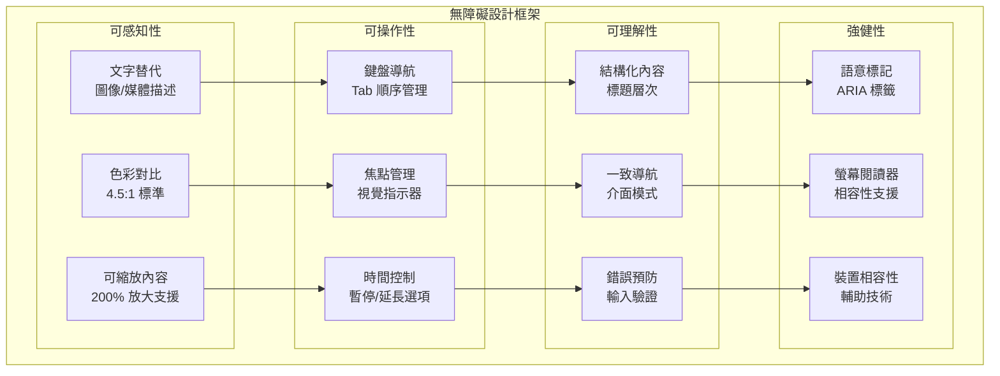
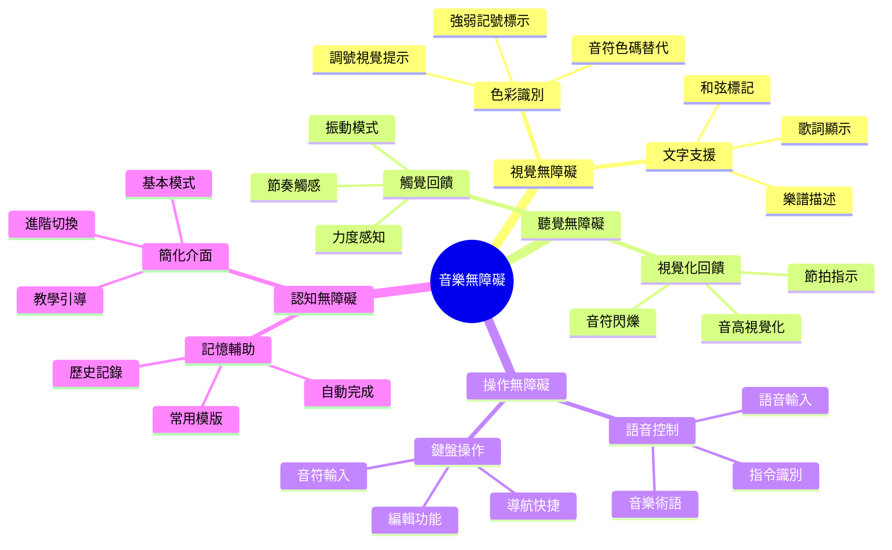

# BandPro 無障礙設計規範

符合 WCAG 2.1 AA 標準的完整無障礙設計指導原則

## ♿ 無障礙設計架構

### 無障礙層次框架


### 音樂軟體專用無障礙需求


---

## 🎨 色彩與對比設計

### 色彩無障礙規範
```vue
<!-- composables/useAccessibleColors.ts -->
<template>
  <div class="accessible-colors-demo">
    <!-- 色彩對比測試 -->
    <div class="color-contrast-section">
      <h3 class="section-title">色彩對比測試</h3>
      
      <div class="contrast-examples">
        <!-- 標準對比 (4.5:1) -->
        <div class="contrast-example">
          <div class="contrast-sample standard-contrast">
            <span class="contrast-text">標準文字 (4.5:1)</span>
          </div>
          <div class="contrast-info">
            <div class="contrast-ratio">4.51:1</div>
            <div class="contrast-status pass">✓ AA 通過</div>
          </div>
        </div>
        
        <!-- 增強對比 (7:1) -->
        <div class="contrast-example">
          <div class="contrast-sample enhanced-contrast">
            <span class="contrast-text">增強文字 (7:1)</span>
          </div>
          <div class="contrast-info">
            <div class="contrast-ratio">7.21:1</div>
            <div class="contrast-status pass">✓ AAA 通過</div>
          </div>
        </div>
        
        <!-- 大字體對比 (3:1) -->
        <div class="contrast-example">
          <div class="contrast-sample large-text-contrast">
            <span class="contrast-text large-text">大字體 (3:1)</span>
          </div>
          <div class="contrast-info">
            <div class="contrast-ratio">3.12:1</div>
            <div class="contrast-status pass">✓ AA 大字體</div>
          </div>
        </div>
      </div>
    </div>
    
    <!-- 色盲友好設計 -->
    <div class="colorblind-friendly-section">
      <h3 class="section-title">色盲友好設計</h3>
      
      <div class="colorblind-examples">
        <!-- 音符狀態指示 -->
        <div class="note-status-examples">
          <h4 class="subsection-title">音符狀態指示</h4>
          
          <div class="status-indicators">
            <div class="status-item">
              <div class="note-indicator selected">
                <MusicalNoteIcon class="note-icon" />
                <div class="status-pattern selected-pattern"></div>
              </div>
              <span class="status-label">已選取</span>
            </div>
            
            <div class="status-item">
              <div class="note-indicator error">
                <MusicalNoteIcon class="note-icon" />
                <div class="status-pattern error-pattern"></div>
              </div>
              <span class="status-label">錯誤</span>
            </div>
            
            <div class="status-item">
              <div class="note-indicator playing">
                <MusicalNoteIcon class="note-icon" />
                <div class="status-pattern playing-pattern"></div>
              </div>
              <span class="status-label">播放中</span>
            </div>
          </div>
        </div>
        
        <!-- 調號視覺化 -->
        <div class="key-signature-examples">
          <h4 class="subsection-title">調號視覺化</h4>
          
          <div class="key-signatures">
            <div class="key-signature-item">
              <div class="key-indicator sharp">
                <span class="key-symbol">♯</span>
                <div class="key-pattern sharp-pattern"></div>
              </div>
              <span class="key-label">升號 + 向上箭頭</span>
            </div>
            
            <div class="key-signature-item">
              <div class="key-indicator flat">
                <span class="key-symbol">♭</span>
                <div class="key-pattern flat-pattern"></div>
              </div>
              <span class="key-label">降號 + 向下箭頭</span>
            </div>
            
            <div class="key-signature-item">
              <div class="key-indicator natural">
                <span class="key-symbol">♮</span>
                <div class="key-pattern natural-pattern"></div>
              </div>
              <span class="key-label">還原號 + 圓點</span>
            </div>
          </div>
        </div>
      </div>
    </div>
  </div>
</template>

<script setup lang="ts">
import { MusicalNoteIcon } from '@heroicons/vue/24/outline'

// 色彩對比計算
const calculateContrast = (color1: string, color2: string): number => {
  // 實現色彩對比度計算
  // 返回對比度比值
  return 4.5
}

// 色盲友好色彩方案
const colorBlindFriendlyPalette = {
  // 適用於多種色盲的安全色彩
  primary: '#0066CC',      // 藍色
  secondary: '#FF6600',    // 橙色
  success: '#228B22',      // 森林綠
  warning: '#FFD700',      // 金色
  error: '#DC143C',        // 深紅色
  info: '#4682B4',         // 鋼藍色
  
  // 灰階輔助
  gray100: '#F7FAFC',
  gray200: '#EDF2F7',
  gray500: '#718096',
  gray800: '#2D3748'
}

// 無障礙色彩工具
const accessibleColors = {
  // 檢查色彩對比度
  checkContrast: (foreground: string, background: string) => {
    const ratio = calculateContrast(foreground, background)
    return {
      ratio,
      passAA: ratio >= 4.5,
      passAAA: ratio >= 7,
      passAALarge: ratio >= 3
    }
  },
  
  // 獲取高對比度版本
  getHighContrast: (color: string) => {
    // 實現高對比度色彩生成
    return color
  },
  
  // 色盲模擬
  simulateColorBlindness: (color: string, type: string) => {
    // 實現色盲模擬
    return color
  }
}
</script>

<style scoped>
/* 色彩對比範例 */
.accessible-colors-demo {
  @apply p-6 space-y-8;
}

.section-title {
  @apply text-xl font-semibold mb-4;
  @apply text-gray-900 dark:text-white;
}

.subsection-title {
  @apply text-lg font-medium mb-3;
  @apply text-gray-800 dark:text-gray-200;
}

/* 對比度測試 */
.contrast-examples {
  @apply space-y-4;
}

.contrast-example {
  @apply flex items-center space-x-4;
  @apply p-4 bg-white dark:bg-gray-800;
  @apply rounded-lg border border-gray-200 dark:border-gray-700;
}

.contrast-sample {
  @apply flex-1 p-4 rounded-md;
}

.standard-contrast {
  @apply bg-white text-gray-700;
  /* 4.5:1 對比度 */
}

.enhanced-contrast {
  @apply bg-white text-gray-900;
  /* 7:1 對比度 */
}

.large-text-contrast {
  @apply bg-white text-gray-600;
  /* 3:1 對比度適用於大字體 */
}

.contrast-text {
  @apply font-medium;
}

.large-text {
  @apply text-xl;
}

.contrast-info {
  @apply text-right space-y-1;
}

.contrast-ratio {
  @apply text-lg font-bold;
  @apply text-gray-900 dark:text-white;
}

.contrast-status {
  @apply text-sm font-medium;
  
  &.pass {
    @apply text-green-600 dark:text-green-400;
  }
  
  &.fail {
    @apply text-red-600 dark:text-red-400;
  }
}

/* 色盲友好設計 */
.colorblind-examples {
  @apply space-y-6;
}

/* 音符狀態指示器 */
.status-indicators {
  @apply flex flex-wrap gap-4;
}

.status-item {
  @apply flex flex-col items-center space-y-2;
}

.note-indicator {
  @apply relative w-12 h-12;
  @apply flex items-center justify-center;
  @apply rounded-md;
  
  &.selected {
    @apply bg-blue-100 dark:bg-blue-900;
    @apply border-2 border-blue-500;
  }
  
  &.error {
    @apply bg-red-100 dark:bg-red-900;
    @apply border-2 border-red-500;
  }
  
  &.playing {
    @apply bg-green-100 dark:bg-green-900;
    @apply border-2 border-green-500;
  }
}

.note-icon {
  @apply w-6 h-6;
}

.status-pattern {
  @apply absolute top-1 right-1;
  @apply w-3 h-3;
  
  &.selected-pattern {
    @apply bg-blue-500;
    /* 方形圖案表示選取 */
  }
  
  &.error-pattern {
    @apply bg-red-500;
    /* X 圖案表示錯誤 */
    &::before {
      content: '×';
      @apply text-white text-xs;
      @apply absolute inset-0;
      @apply flex items-center justify-center;
    }
  }
  
  &.playing-pattern {
    @apply bg-green-500 rounded-full;
    /* 圓形圖案表示播放 */
    animation: pulse 1s infinite;
  }
}

.status-label {
  @apply text-sm text-gray-600 dark:text-gray-400;
}

/* 調號視覺化 */
.key-signatures {
  @apply flex flex-wrap gap-4;
}

.key-signature-item {
  @apply flex flex-col items-center space-y-2;
}

.key-indicator {
  @apply relative w-16 h-16;
  @apply flex items-center justify-center;
  @apply bg-gray-100 dark:bg-gray-700;
  @apply rounded-lg;
  
  &.sharp {
    @apply border-l-4 border-yellow-500;
  }
  
  &.flat {
    @apply border-b-4 border-blue-500;
  }
  
  &.natural {
    @apply border-2 border-gray-400;
  }
}

.key-symbol {
  @apply text-2xl font-bold;
  @apply text-gray-800 dark:text-gray-200;
}

.key-pattern {
  @apply absolute top-2 right-2;
  @apply w-4 h-4;
  
  &.sharp-pattern {
    /* 向上箭頭 */
    &::before {
      content: '↑';
      @apply text-yellow-500 font-bold;
    }
  }
  
  &.flat-pattern {
    /* 向下箭頭 */
    &::before {
      content: '↓';
      @apply text-blue-500 font-bold;
    }
  }
  
  &.natural-pattern {
    @apply bg-gray-500 rounded-full;
    /* 圓點 */
  }
}

.key-label {
  @apply text-sm text-gray-600 dark:text-gray-400;
  @apply text-center;
}

/* 動畫 */
@keyframes pulse {
  0%, 100% {
    transform: scale(1);
    opacity: 1;
  }
  50% {
    transform: scale(1.1);
    opacity: 0.8;
  }
}
</style>
```

---

## ⌨️ 鍵盤導航設計

### 鍵盤導航系統
```typescript
// composables/useKeyboardNavigation.ts
import { ref, onMounted, onUnmounted } from 'vue'

export interface FocusableElement {
  element: HTMLElement
  tabIndex: number
  group?: string
  priority?: number
}

export const useKeyboardNavigation = () => {
  const focusableElements = ref<FocusableElement[]>([])
  const currentFocusIndex = ref(-1)
  const trapFocus = ref(false)
  
  // 鍵盤快捷鍵映射
  const keyboardShortcuts = {
    // 導航快捷鍵
    navigation: {
      'Tab': 'nextFocus',
      'Shift+Tab': 'previousFocus',
      'Home': 'firstFocus',
      'End': 'lastFocus',
      'ArrowUp': 'upFocus',
      'ArrowDown': 'downFocus',
      'ArrowLeft': 'leftFocus',
      'ArrowRight': 'rightFocus',
      'Escape': 'exitFocus'
    },
    
    // 編輯快捷鍵
    editing: {
      'Ctrl+Z': 'undo',
      'Ctrl+Y': 'redo',
      'Ctrl+X': 'cut',
      'Ctrl+C': 'copy',
      'Ctrl+V': 'paste',
      'Delete': 'delete',
      'Backspace': 'backspace'
    },
    
    // 音樂專用快捷鍵
    music: {
      'Space': 'togglePlayback',
      'Enter': 'addNote',
      '1': 'wholeNote',
      '2': 'halfNote',
      '4': 'quarterNote',
      '8': 'eighthNote',
      'S': 'sharp',
      'F': 'flat',
      'N': 'natural'
    }
  }
  
  // 註冊焦點元素
  const registerFocusable = (element: HTMLElement, options?: {
    tabIndex?: number
    group?: string
    priority?: number
  }) => {
    const focusableElement: FocusableElement = {
      element,
      tabIndex: options?.tabIndex ?? 0,
      group: options?.group,
      priority: options?.priority ?? 0
    }
    
    focusableElements.value.push(focusableElement)
    
    // 按優先級和 tabIndex 排序
    focusableElements.value.sort((a, b) => {
      if (a.priority !== b.priority) {
        return (b.priority || 0) - (a.priority || 0)
      }
      return a.tabIndex - b.tabIndex
    })
  }
  
  // 移除焦點元素
  const unregisterFocusable = (element: HTMLElement) => {
    const index = focusableElements.value.findIndex(
      item => item.element === element
    )
    if (index > -1) {
      focusableElements.value.splice(index, 1)
    }
  }
  
  // 焦點移動方法
  const moveFocus = (direction: 'next' | 'previous' | 'first' | 'last') => {
    const elements = focusableElements.value
    if (elements.length === 0) return
    
    let newIndex: number
    
    switch (direction) {
      case 'next':
        newIndex = currentFocusIndex.value < elements.length - 1 
          ? currentFocusIndex.value + 1 
          : trapFocus.value ? 0 : currentFocusIndex.value
        break
      case 'previous':
        newIndex = currentFocusIndex.value > 0 
          ? currentFocusIndex.value - 1 
          : trapFocus.value ? elements.length - 1 : currentFocusIndex.value
        break
      case 'first':
        newIndex = 0
        break
      case 'last':
        newIndex = elements.length - 1
        break
    }
    
    if (newIndex !== currentFocusIndex.value) {
      currentFocusIndex.value = newIndex
      elements[newIndex].element.focus()
    }
  }
  
  // 方向性焦點移動（用於網格佈局）
  const moveDirectionalFocus = (direction: 'up' | 'down' | 'left' | 'right') => {
    // 實現基於空間位置的焦點移動
    const currentElement = focusableElements.value[currentFocusIndex.value]?.element
    if (!currentElement) return
    
    const currentRect = currentElement.getBoundingClientRect()
    let bestMatch: { element: HTMLElement; distance: number } | null = null
    
    focusableElements.value.forEach(item => {
      const rect = item.element.getBoundingClientRect()
      let isValidDirection = false
      let distance = 0
      
      switch (direction) {
        case 'up':
          isValidDirection = rect.bottom <= currentRect.top
          distance = currentRect.top - rect.bottom
          break
        case 'down':
          isValidDirection = rect.top >= currentRect.bottom
          distance = rect.top - currentRect.bottom
          break
        case 'left':
          isValidDirection = rect.right <= currentRect.left
          distance = currentRect.left - rect.right
          break
        case 'right':
          isValidDirection = rect.left >= currentRect.right
          distance = rect.left - currentRect.right
          break
      }
      
      if (isValidDirection && (!bestMatch || distance < bestMatch.distance)) {
        bestMatch = { element: item.element, distance }
      }
    })
    
    if (bestMatch) {
      bestMatch.element.focus()
    }
  }
  
  // 鍵盤事件處理
  const handleKeydown = (event: KeyboardEvent) => {
    const key = event.key
    const modifiers = []
    
    if (event.ctrlKey) modifiers.push('Ctrl')
    if (event.shiftKey) modifiers.push('Shift')
    if (event.altKey) modifiers.push('Alt')
    if (event.metaKey) modifiers.push('Meta')
    
    const keyCombo = modifiers.length > 0 
      ? `${modifiers.join('+')}+${key}` 
      : key
    
    // 檢查導航快捷鍵
    if (keyboardShortcuts.navigation[keyCombo]) {
      event.preventDefault()
      
      switch (keyboardShortcuts.navigation[keyCombo]) {
        case 'nextFocus':
          moveFocus('next')
          break
        case 'previousFocus':
          moveFocus('previous')
          break
        case 'firstFocus':
          moveFocus('first')
          break
        case 'lastFocus':
          moveFocus('last')
          break
        case 'upFocus':
          moveDirectionalFocus('up')
          break
        case 'downFocus':
          moveDirectionalFocus('down')
          break
        case 'leftFocus':
          moveDirectionalFocus('left')
          break
        case 'rightFocus':
          moveDirectionalFocus('right')
          break
        case 'exitFocus':
          if (trapFocus.value) {
            document.body.focus()
          }
          break
      }
    }
  }
  
  // 焦點陷阱
  const setFocusTrap = (enabled: boolean, container?: HTMLElement) => {
    trapFocus.value = enabled
    
    if (enabled && container) {
      // 找到容器內的所有可焦點元素
      const trapElements = focusableElements.value.filter(
        item => container.contains(item.element)
      )
      
      if (trapElements.length > 0) {
        trapElements[0].element.focus()
      }
    }
  }
  
  // 跳過連結功能
  const addSkipLink = (target: string, label: string) => {
    const skipLink = document.createElement('a')
    skipLink.href = `#${target}`
    skipLink.textContent = label
    skipLink.className = 'skip-link'
    
    // 樣式
    skipLink.style.cssText = `
      position: absolute;
      top: -40px;
      left: 6px;
      background: #000;
      color: #fff;
      padding: 8px 16px;
      text-decoration: none;
      border-radius: 4px;
      z-index: 1000;
      transition: top 0.3s;
    `
    
    skipLink.addEventListener('focus', () => {
      skipLink.style.top = '6px'
    })
    
    skipLink.addEventListener('blur', () => {
      skipLink.style.top = '-40px'
    })
    
    document.body.insertBefore(skipLink, document.body.firstChild)
  }
  
  onMounted(() => {
    document.addEventListener('keydown', handleKeydown)
    
    // 添加跳過連結
    addSkipLink('main-content', '跳至主要內容')
    addSkipLink('main-navigation', '跳至主要導航')
  })
  
  onUnmounted(() => {
    document.removeEventListener('keydown', handleKeydown)
  })
  
  return {
    focusableElements,
    currentFocusIndex,
    registerFocusable,
    unregisterFocusable,
    moveFocus,
    moveDirectionalFocus,
    setFocusTrap,
    keyboardShortcuts
  }
}
```

---

## 📱 螢幕閱讀器支援

### ARIA 標籤與語意標記
```vue
<!-- components/accessibility/AccessibleEditor.vue -->
<template>
  <div 
    class="accessible-music-editor"
    role="application"
    :aria-label="editorLabel"
    :aria-describedby="editorDescriptionId"
  >
    <!-- 編輯器描述 -->
    <div :id="editorDescriptionId" class="sr-only">
      音樂編輯器，使用鍵盤快捷鍵進行音符輸入和編輯操作
    </div>
    
    <!-- 工具欄 -->
    <div 
      class="editor-toolbar"
      role="toolbar"
      aria-label="編輯工具"
      :aria-controls="canvasId"
    >
      <div class="tool-groups">
        <!-- 音符工具組 -->
        <div 
          class="tool-group"
          role="group"
          aria-labelledby="note-tools-label"
        >
          <div id="note-tools-label" class="tool-group-label">
            音符工具
          </div>
          
          <button
            v-for="note in noteTools"
            :key="note.id"
            @click="selectTool(note)"
            class="tool-button"
            role="button"
            :aria-pressed="selectedTool?.id === note.id"
            :aria-label="note.ariaLabel"
            :aria-describedby="`${note.id}-desc`"
            :aria-keyshortcuts="note.shortcut"
          >
            <span class="tool-icon" :aria-hidden="true">{{ note.symbol }}</span>
            <span class="sr-only">{{ note.name }}</span>
            
            <!-- 工具描述 -->
            <div :id="`${note.id}-desc`" class="sr-only">
              {{ note.description }}。快捷鍵：{{ note.shortcut }}
            </div>
          </button>
        </div>
        
        <!-- 播放控制組 -->
        <div 
          class="tool-group"
          role="group"
          aria-labelledby="playback-controls-label"
        >
          <div id="playback-controls-label" class="tool-group-label">
            播放控制
          </div>
          
          <button
            @click="togglePlayback"
            class="tool-button play-button"
            :aria-label="isPlaying ? '暫停播放' : '開始播放'"
            :aria-keyshortcuts="'Space'"
          >
            <PlayIcon v-if="!isPlaying" class="tool-icon" aria-hidden="true" />
            <PauseIcon v-else class="tool-icon" aria-hidden="true" />
            <span class="sr-only">
              {{ isPlaying ? '暫停' : '播放' }}
            </span>
          </button>
          
          <button
            @click="stopPlayback"
            class="tool-button"
            aria-label="停止播放"
          >
            <StopIcon class="tool-icon" aria-hidden="true" />
            <span class="sr-only">停止</span>
          </button>
        </div>
      </div>
    </div>
    
    <!-- 樂譜畫布區域 -->
    <main 
      :id="canvasId"
      class="score-canvas-container"
      role="img"
      :aria-label="scoreDescription"
      :aria-describedby="scoreDetailsId"
      tabindex="0"
      @keydown="handleCanvasKeydown"
      @focus="announceCanvasFocus"
    >
      <!-- 樂譜描述 -->
      <div :id="scoreDetailsId" class="sr-only">
        {{ scoreStructureDescription }}
      </div>
      
      <!-- 五線譜系統 -->
      <div 
        v-for="(system, systemIndex) in staffSystems"
        :key="systemIndex"
        class="staff-system"
        :aria-label="`五線譜系統 ${systemIndex + 1}`"
        role="group"
      >
        <!-- 小節 -->
        <div
          v-for="(measure, measureIndex) in system.measures"
          :key="measureIndex"
          class="measure"
          :aria-label="`第 ${measureIndex + 1} 小節`"
          role="group"
          :tabindex="0"
          @focus="announceMeasure(systemIndex, measureIndex)"
        >
          <!-- 音符 -->
          <div
            v-for="(note, noteIndex) in measure.notes"
            :key="noteIndex"
            class="note"
            role="button"
            :tabindex="0"
            :aria-label="getNoteAriaLabel(note)"
            :aria-describedby="`note-${systemIndex}-${measureIndex}-${noteIndex}-desc`"
            :aria-selected="isNoteSelected(note)"
            @click="selectNote(note)"
            @keydown="handleNoteKeydown($event, note)"
            @focus="announceNote(note)"
          >
            <!-- 音符視覺表示 -->
            <span class="note-symbol" aria-hidden="true">
              {{ note.symbol }}
            </span>
            
            <!-- 音符詳細描述 -->
            <div 
              :id="`note-${systemIndex}-${measureIndex}-${noteIndex}-desc`" 
              class="sr-only"
            >
              {{ getNoteDetailDescription(note) }}
            </div>
          </div>
        </div>
      </div>
      
      <!-- 即時狀態回饋 -->
      <div 
        :id="liveRegionId"
        class="sr-only"
        role="status"
        aria-live="polite"
        aria-atomic="true"
      >
        {{ liveMessage }}
      </div>
      
      <!-- 錯誤訊息 -->
      <div
        v-if="errorMessage"
        class="sr-only"
        role="alert"
        aria-live="assertive"
      >
        錯誤：{{ errorMessage }}
      </div>
    </main>
    
    <!-- 狀態欄 -->
    <div 
      class="status-bar"
      role="status"
      aria-label="編輯器狀態"
    >
      <div class="status-items">
        <div class="status-item">
          <span class="status-label">當前位置：</span>
          <span class="status-value">
            第 {{ currentMeasure }} 小節，第 {{ currentBeat }} 拍
          </span>
        </div>
        
        <div class="status-item">
          <span class="status-label">選取項目：</span>
          <span class="status-value">
            {{ selectedCount > 0 ? `${selectedCount} 個音符` : '無' }}
          </span>
        </div>
        
        <div class="status-item">
          <span class="status-label">工具：</span>
          <span class="status-value">{{ selectedTool?.name || '無' }}</span>
        </div>
      </div>
    </div>
  </div>
</template>

<script setup lang="ts">
import { ref, computed, onMounted } from 'vue'
import { PlayIcon, PauseIcon, StopIcon } from '@heroicons/vue/24/outline'

// 唯一ID生成
const generateId = (prefix: string) => `${prefix}-${Math.random().toString(36).substr(2, 9)}`

const editorDescriptionId = generateId('editor-desc')
const canvasId = generateId('canvas')
const scoreDetailsId = generateId('score-details')
const liveRegionId = generateId('live-region')

// 編輯器狀態
const isPlaying = ref(false)
const selectedTool = ref(null)
const selectedNotes = ref([])
const currentMeasure = ref(1)
const currentBeat = ref(1)
const liveMessage = ref('')
const errorMessage = ref('')

// 音符工具
const noteTools = [
  {
    id: 'whole-note',
    name: '全音符',
    symbol: '𝅝',
    shortcut: '1',
    ariaLabel: '全音符工具',
    description: '插入持續四拍的全音符'
  },
  {
    id: 'half-note', 
    name: '二分音符',
    symbol: '𝅗𝅥',
    shortcut: '2',
    ariaLabel: '二分音符工具',
    description: '插入持續兩拍的二分音符'
  },
  {
    id: 'quarter-note',
    name: '四分音符',
    symbol: '♩',
    shortcut: '4',
    ariaLabel: '四分音符工具',
    description: '插入持續一拍的四分音符'
  }
]

// 計算屬性
const editorLabel = computed(() => 
  `音樂編輯器 - ${isPlaying.value ? '播放中' : '已停止'}`
)

const scoreDescription = computed(() => 
  `音樂樂譜，包含 ${staffSystems.value.length} 個五線譜系統`
)

const scoreStructureDescription = computed(() => {
  const totalMeasures = staffSystems.value.reduce(
    (sum, system) => sum + system.measures.length, 0
  )
  return `樂譜結構：${staffSystems.value.length} 個五線譜系統，共 ${totalMeasures} 個小節`
})

const selectedCount = computed(() => selectedNotes.value.length)

const staffSystems = ref([
  {
    measures: [
      {
        notes: [
          { 
            id: 1, 
            pitch: 'C4', 
            duration: 'quarter', 
            symbol: '♩',
            selected: false
          }
        ]
      }
    ]
  }
])

// 無障礙方法
const announceCanvasFocus = () => {
  liveMessage.value = '已進入樂譜編輯區域。使用方向鍵導航，Enter 鍵選取音符'
}

const announceMeasure = (systemIndex: number, measureIndex: number) => {
  liveMessage.value = `第 ${systemIndex + 1} 個五線譜系統，第 ${measureIndex + 1} 小節`
}

const announceNote = (note: any) => {
  liveMessage.value = getNoteAriaLabel(note)
}

const getNoteAriaLabel = (note: any) => {
  const pitchName = getPitchName(note.pitch)
  const durationName = getDurationName(note.duration)
  return `${durationName} ${pitchName}${note.selected ? '，已選取' : ''}`
}

const getNoteDetailDescription = (note: any) => {
  const pitchName = getPitchName(note.pitch)
  const durationName = getDurationName(note.duration)
  return `音符：${pitchName}，時值：${durationName}，位置：第 ${note.measure} 小節第 ${note.beat} 拍`
}

const getPitchName = (pitch: string) => {
  const pitchNames = {
    'C4': '中央C',
    'D4': 'D',
    'E4': 'E',
    'F4': 'F',
    'G4': 'G',
    'A4': 'A',
    'B4': 'B'
  }
  return pitchNames[pitch] || pitch
}

const getDurationName = (duration: string) => {
  const durationNames = {
    'whole': '全音符',
    'half': '二分音符',
    'quarter': '四分音符',
    'eighth': '八分音符'
  }
  return durationNames[duration] || duration
}

// 事件處理
const selectTool = (tool: any) => {
  selectedTool.value = tool
  liveMessage.value = `已選取 ${tool.name} 工具`
}

const togglePlayback = () => {
  isPlaying.value = !isPlaying.value
  liveMessage.value = isPlaying.value ? '開始播放' : '暫停播放'
}

const stopPlayback = () => {
  isPlaying.value = false
  liveMessage.value = '停止播放'
}

const selectNote = (note: any) => {
  note.selected = !note.selected
  if (note.selected) {
    selectedNotes.value.push(note)
    liveMessage.value = `已選取 ${getNoteAriaLabel(note)}`
  } else {
    const index = selectedNotes.value.indexOf(note)
    if (index > -1) {
      selectedNotes.value.splice(index, 1)
    }
    liveMessage.value = `已取消選取 ${getNoteAriaLabel(note)}`
  }
}

const isNoteSelected = (note: any) => {
  return note.selected
}

const handleCanvasKeydown = (event: KeyboardEvent) => {
  switch (event.key) {
    case 'ArrowRight':
      event.preventDefault()
      // 移動到下一個音符
      liveMessage.value = '移動到下一個音符'
      break
    case 'ArrowLeft':
      event.preventDefault()
      // 移動到上一個音符
      liveMessage.value = '移動到上一個音符'
      break
    case 'Enter':
      event.preventDefault()
      // 選取當前音符
      liveMessage.value = '選取當前音符'
      break
    case 'Delete':
      event.preventDefault()
      // 刪除選取的音符
      liveMessage.value = '刪除選取的音符'
      break
  }
}

const handleNoteKeydown = (event: KeyboardEvent, note: any) => {
  switch (event.key) {
    case 'Enter':
    case ' ':
      event.preventDefault()
      selectNote(note)
      break
    case 'Delete':
      event.preventDefault()
      // 刪除音符
      liveMessage.value = `刪除 ${getNoteAriaLabel(note)}`
      break
  }
}

// 錯誤處理
const showError = (message: string) => {
  errorMessage.value = message
  setTimeout(() => {
    errorMessage.value = ''
  }, 5000)
}

onMounted(() => {
  // 初始化無障礙設定
  liveMessage.value = '音樂編輯器已載入'
})
</script>

<style scoped>
/* 無障礙樣式 */
.accessible-music-editor {
  @apply relative;
}

.sr-only {
  @apply absolute w-px h-px p-0 -m-px;
  @apply overflow-hidden;
  clip: rect(0, 0, 0, 0);
  @apply whitespace-nowrap;
  @apply border-0;
}

/* 跳過連結樣式 */
:global(.skip-link:focus) {
  @apply relative;
  clip: auto !important;
  @apply w-auto h-auto p-2 m-0;
  @apply overflow-visible;
  @apply whitespace-normal;
}

/* 焦點指示器 */
.tool-button:focus,
.note:focus,
.measure:focus {
  @apply outline-none;
  @apply ring-2 ring-blue-500 ring-offset-2;
  @apply ring-offset-white dark:ring-offset-gray-800;
}

/* 高對比度模式 */
@media (prefers-contrast: high) {
  .tool-button,
  .note,
  .measure {
    @apply border-2 border-black dark:border-white;
  }
  
  .tool-button:focus,
  .note:focus,
  .measure:focus {
    @apply bg-yellow-200 dark:bg-yellow-800;
  }
}

/* 減少動畫偏好 */
@media (prefers-reduced-motion: reduce) {
  * {
    @apply transition-none;
    animation-duration: 0.01ms !important;
    animation-iteration-count: 1 !important;
    scroll-behavior: auto !important;
  }
}

/* 工具欄 */
.editor-toolbar {
  @apply bg-white dark:bg-gray-800;
  @apply border-b border-gray-200 dark:border-gray-700;
  @apply p-4;
}

.tool-groups {
  @apply flex flex-wrap gap-6;
}

.tool-group {
  @apply space-y-2;
}

.tool-group-label {
  @apply text-sm font-medium;
  @apply text-gray-700 dark:text-gray-300;
}

.tool-button {
  @apply inline-flex items-center justify-center;
  @apply w-10 h-10 mr-2;
  @apply bg-gray-100 dark:bg-gray-700;
  @apply hover:bg-gray-200 dark:hover:bg-gray-600;
  @apply rounded-md;
  @apply transition-colors duration-200;
  
  &[aria-pressed="true"] {
    @apply bg-blue-100 dark:bg-blue-900;
    @apply text-blue-600 dark:text-blue-400;
  }
}

.tool-icon {
  @apply w-5 h-5;
}

/* 樂譜畫布 */
.score-canvas-container {
  @apply flex-1 p-4;
  @apply bg-white dark:bg-gray-900;
  @apply overflow-auto;
  @apply min-h-96;
}

.staff-system {
  @apply mb-8;
}

.measure {
  @apply inline-block mr-4 p-2;
  @apply border border-gray-200 dark:border-gray-700;
  @apply rounded;
  @apply min-w-20 min-h-16;
}

.note {
  @apply inline-block m-1 p-1;
  @apply cursor-pointer;
  @apply rounded;
  
  &[aria-selected="true"] {
    @apply bg-blue-100 dark:bg-blue-900;
    @apply text-blue-600 dark:text-blue-400;
  }
}

.note-symbol {
  @apply text-2xl;
}

/* 狀態欄 */
.status-bar {
  @apply bg-gray-100 dark:bg-gray-800;
  @apply border-t border-gray-200 dark:border-gray-700;
  @apply p-4;
}

.status-items {
  @apply flex flex-wrap gap-6;
}

.status-item {
  @apply flex items-center space-x-2;
}

.status-label {
  @apply text-sm text-gray-600 dark:text-gray-400;
}

.status-value {
  @apply text-sm font-medium;
  @apply text-gray-900 dark:text-white;
}
</style>
```

---

## ✅ 本文件包含內容

1. **無障礙設計架構** - WCAG 2.1 AA 標準的四層框架
2. **音樂軟體專用需求** - 視覺、聽覺、操作、認知無障礙
3. **色彩與對比設計** - 色盲友好設計和對比度檢測
4. **鍵盤導航系統** - 完整的鍵盤快捷鍵和焦點管理
5. **螢幕閱讀器支援** - ARIA 標籤和語意標記實現

## 🔗 相關文件

👉 **下一步：參考 [10_性能優化設計.md](./10_性能優化設計.md) 了解性能優化策略**
