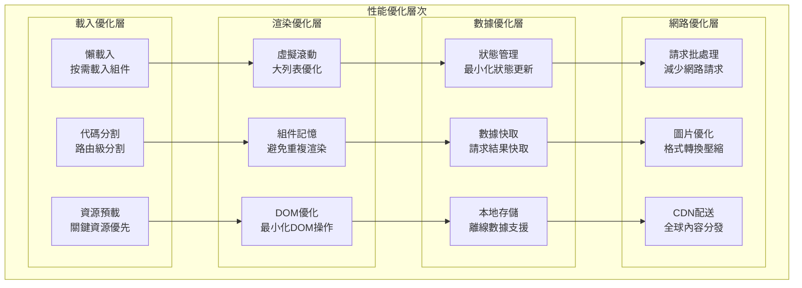
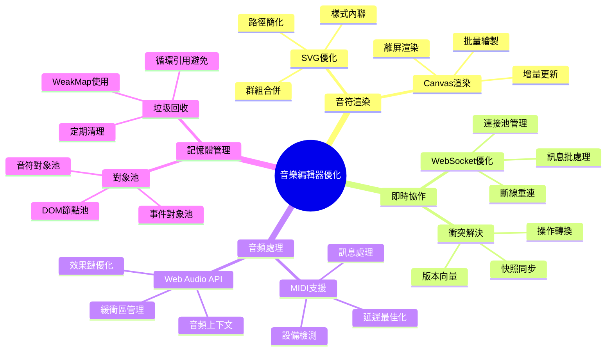

# BandPro 性能優化設計

前端性能優化與用戶體驗提升的完整設計規範

## ⚡ 性能優化架構

### 性能優化層次


### 音樂編輯器專用優化


---

## 🚀 載入性能優化

### 懶載入與代碼分割
```typescript
// router/index.ts - 路由級代碼分割
import { createRouter, createWebHistory } from 'vue-router'

const router = createRouter({
  history: createWebHistory(),
  routes: [
    {
      path: '/',
      name: 'Home',
      component: () => import('../views/HomePage.vue')
    },
    {
      path: '/editor',
      name: 'Editor',
      component: () => import('../views/EditorPage.vue'),
      // 編輯器需要額外的依賴
      meta: { 
        requiresAuth: true,
        preload: ['music-notation-lib', 'audio-engine']
      }
    },
    {
      path: '/library',
      name: 'Library', 
      component: () => import('../views/LibraryPage.vue'),
      children: [
        {
          path: 'search',
          component: () => import('../views/library/SearchPage.vue')
        },
        {
          path: 'browse/:category',
          component: () => import('../views/library/BrowsePage.vue')
        }
      ]
    }
  ]
})

// 路由預載入
router.beforeResolve(async (to, from, next) => {
  if (to.meta?.preload) {
    const preloadPromises = to.meta.preload.map((module: string) => {
      switch (module) {
        case 'music-notation-lib':
          return import('../utils/musicNotation')
        case 'audio-engine':
          return import('../utils/audioEngine')
        default:
          return Promise.resolve()
      }
    })
    
    try {
      await Promise.all(preloadPromises)
    } catch (error) {
      console.error('預載入模組失敗:', error)
    }
  }
  
  next()
})

export default router
```

### 組件懶載入策略
```vue
<!-- components/LazyLoadWrapper.vue -->
<template>
  <div ref="wrapper" class="lazy-load-wrapper">
    <!-- 載入中狀態 -->
    <div v-if="loading" class="loading-placeholder">
      <div class="loading-skeleton">
        <div class="skeleton-header"></div>
        <div class="skeleton-content"></div>
        <div class="skeleton-footer"></div>
      </div>
    </div>
    
    <!-- 錯誤狀態 -->
    <div v-else-if="error" class="error-state">
      <ExclamationTriangleIcon class="error-icon" />
      <p class="error-message">載入失敗</p>
      <button @click="retry" class="retry-button">重試</button>
    </div>
    
    <!-- 實際組件 -->
    <Suspense v-else>
      <component :is="lazyComponent" v-bind="componentProps" />
      <template #fallback>
        <div class="component-loading">
          <div class="spinner"></div>
        </div>
      </template>
    </Suspense>
  </div>
</template>

<script setup lang="ts">
import { ref, onMounted, defineAsyncComponent } from 'vue'
import { ExclamationTriangleIcon } from '@heroicons/vue/24/outline'

interface Props {
  componentPath: string
  componentProps?: Record<string, any>
  threshold?: number
  rootMargin?: string
}

const props = withDefaults(defineProps<Props>(), {
  threshold: 0.1,
  rootMargin: '50px'
})

const wrapper = ref<HTMLElement>()
const loading = ref(false)
const error = ref(false)
const lazyComponent = ref()

// 建立 Intersection Observer
const createObserver = () => {
  return new IntersectionObserver(
    (entries) => {
      entries.forEach((entry) => {
        if (entry.isIntersecting && !lazyComponent.value && !loading.value) {
          loadComponent()
        }
      })
    },
    {
      threshold: props.threshold,
      rootMargin: props.rootMargin
    }
  )
}

// 載入組件
const loadComponent = async () => {
  loading.value = true
  error.value = false
  
  try {
    // 動態導入組件
    lazyComponent.value = defineAsyncComponent({
      loader: () => import(/* @vite-ignore */ props.componentPath),
      loadingComponent: () => null, // 使用外部載入狀態
      errorComponent: () => null,   // 使用外部錯誤狀態
      delay: 200,
      timeout: 10000
    })
  } catch (err) {
    error.value = true
    console.error('組件載入失敗:', err)
  } finally {
    loading.value = false
  }
}

// 重試載入
const retry = () => {
  error.value = false
  loadComponent()
}

onMounted(() => {
  const observer = createObserver()
  if (wrapper.value) {
    observer.observe(wrapper.value)
  }
  
  // 清理觀察者
  return () => {
    observer.disconnect()
  }
})
</script>

<style scoped>
.lazy-load-wrapper {
  @apply min-h-32;
}

/* 載入骨架屏 */
.loading-skeleton {
  @apply space-y-4 p-4;
}

.skeleton-header,
.skeleton-content,
.skeleton-footer {
  @apply bg-gray-200 dark:bg-gray-700;
  @apply animate-pulse rounded;
}

.skeleton-header {
  @apply h-6 w-3/4;
}

.skeleton-content {
  @apply h-24 w-full;
}

.skeleton-footer {
  @apply h-4 w-1/2;
}

/* 錯誤狀態 */
.error-state {
  @apply flex flex-col items-center justify-center;
  @apply p-8 text-center;
}

.error-icon {
  @apply w-12 h-12 text-red-500 mb-4;
}

.error-message {
  @apply text-gray-600 dark:text-gray-400 mb-4;
}

.retry-button {
  @apply px-4 py-2;
  @apply bg-blue-500 hover:bg-blue-600;
  @apply text-white rounded-md;
  @apply transition-colors duration-200;
}

/* 組件載入中 */
.component-loading {
  @apply flex items-center justify-center p-8;
}

.spinner {
  @apply w-8 h-8;
  @apply border-4 border-blue-500 border-t-transparent;
  @apply rounded-full animate-spin;
}
</style>
```

---

## 🎯 渲染性能優化

### 虛擬滾動實現
```vue
<!-- components/VirtualScroll.vue -->
<template>
  <div 
    ref="scrollContainer"
    class="virtual-scroll-container"
    @scroll="handleScroll"
  >
    <!-- 上方填充 -->
    <div 
      class="spacer"
      :style="{ height: `${offsetTop}px` }"
    ></div>
    
    <!-- 可見項目 -->
    <div 
      v-for="item in visibleItems"
      :key="getItemKey(item)"
      class="virtual-item"
      :style="getItemStyle(item)"
    >
      <slot :item="item" :index="item.index">
        {{ item.data }}
      </slot>
    </div>
    
    <!-- 下方填充 -->
    <div 
      class="spacer"
      :style="{ height: `${offsetBottom}px` }"
    ></div>
  </div>
</template>

<script setup lang="ts">
import { ref, computed, onMounted, onUnmounted, watch } from 'vue'

interface VirtualItem {
  index: number
  data: any
  height?: number
  top?: number
}

interface Props {
  items: any[]
  itemHeight: number | ((item: any, index: number) => number)
  containerHeight: number
  overscan?: number
  keyField?: string
}

const props = withDefaults(defineProps<Props>(), {
  overscan: 5,
  keyField: 'id'
})

const scrollContainer = ref<HTMLElement>()
const scrollTop = ref(0)
const containerHeight = ref(0)

// 計算項目位置
const itemPositions = computed(() => {
  const positions: Array<{ top: number; height: number }> = []
  let top = 0
  
  props.items.forEach((item, index) => {
    const height = typeof props.itemHeight === 'function' 
      ? props.itemHeight(item, index)
      : props.itemHeight
    
    positions.push({ top, height })
    top += height
  })
  
  return positions
})

// 總高度
const totalHeight = computed(() => {
  const lastPosition = itemPositions.value[itemPositions.value.length - 1]
  return lastPosition ? lastPosition.top + lastPosition.height : 0
})

// 可見範圍
const visibleRange = computed(() => {
  const start = Math.max(0, 
    itemPositions.value.findIndex(pos => 
      pos.top + pos.height > scrollTop.value
    ) - props.overscan
  )
  
  const end = Math.min(props.items.length - 1,
    itemPositions.value.findLastIndex(pos => 
      pos.top < scrollTop.value + containerHeight.value
    ) + props.overscan
  )
  
  return { start, end }
})

// 可見項目
const visibleItems = computed(() => {
  const { start, end } = visibleRange.value
  const items: VirtualItem[] = []
  
  for (let i = start; i <= end; i++) {
    if (props.items[i]) {
      items.push({
        index: i,
        data: props.items[i],
        height: itemPositions.value[i]?.height,
        top: itemPositions.value[i]?.top
      })
    }
  }
  
  return items
})

// 上方偏移
const offsetTop = computed(() => {
  const { start } = visibleRange.value
  return start > 0 ? itemPositions.value[start]?.top || 0 : 0
})

// 下方偏移
const offsetBottom = computed(() => {
  const { end } = visibleRange.value
  const lastVisibleTop = itemPositions.value[end]?.top || 0
  const lastVisibleHeight = itemPositions.value[end]?.height || 0
  return Math.max(0, totalHeight.value - lastVisibleTop - lastVisibleHeight)
})

// 事件處理
const handleScroll = () => {
  if (scrollContainer.value) {
    scrollTop.value = scrollContainer.value.scrollTop
  }
}

// 獲取項目鍵值
const getItemKey = (item: VirtualItem) => {
  if (props.keyField && item.data[props.keyField]) {
    return item.data[props.keyField]
  }
  return item.index
}

// 獲取項目樣式
const getItemStyle = (item: VirtualItem) => {
  return {
    position: 'absolute' as const,
    top: `${item.top}px`,
    height: `${item.height}px`,
    width: '100%'
  }
}

// 滾動到指定項目
const scrollToItem = (index: number, alignment: 'start' | 'center' | 'end' = 'start') => {
  if (!scrollContainer.value || !itemPositions.value[index]) return
  
  const itemPosition = itemPositions.value[index]
  let scrollTo: number
  
  switch (alignment) {
    case 'start':
      scrollTo = itemPosition.top
      break
    case 'center':
      scrollTo = itemPosition.top + (itemPosition.height - containerHeight.value) / 2
      break
    case 'end':
      scrollTo = itemPosition.top + itemPosition.height - containerHeight.value
      break
  }
  
  scrollContainer.value.scrollTo({
    top: Math.max(0, Math.min(scrollTo, totalHeight.value - containerHeight.value)),
    behavior: 'smooth'
  })
}

// 響應式調整
const updateContainerHeight = () => {
  if (scrollContainer.value) {
    containerHeight.value = scrollContainer.value.clientHeight
  }
}

// 節流滾動事件
let scrollTimeout: number
const throttledScroll = () => {
  if (scrollTimeout) {
    cancelAnimationFrame(scrollTimeout)
  }
  
  scrollTimeout = requestAnimationFrame(handleScroll)
}

onMounted(() => {
  updateContainerHeight()
  window.addEventListener('resize', updateContainerHeight)
  
  if (scrollContainer.value) {
    scrollContainer.value.addEventListener('scroll', throttledScroll, { passive: true })
  }
})

onUnmounted(() => {
  window.removeEventListener('resize', updateContainerHeight)
  
  if (scrollTimeout) {
    cancelAnimationFrame(scrollTimeout)
  }
})

// 監聽項目變化
watch(() => props.items, () => {
  scrollTop.value = scrollContainer.value?.scrollTop || 0
}, { flush: 'post' })

defineExpose({
  scrollToItem
})
</script>

<style scoped>
.virtual-scroll-container {
  @apply relative overflow-auto;
  height: v-bind(containerHeight + 'px');
}

.spacer {
  @apply w-full;
}

.virtual-item {
  @apply absolute left-0 right-0;
}
</style>
```

### 組件記憶化優化
```typescript
// composables/useComponentMemo.ts
import { ref, computed, watch, shallowRef } from 'vue'

interface MemoOptions<T> {
  // 比較函數，返回 true 表示相等
  compare?: (prev: T, next: T) => boolean
  // 快取大小限制
  cacheSize?: number
  // 快取鍵生成函數
  keyGenerator?: (props: T) => string
}

export const useComponentMemo = <T extends Record<string, any>>(
  component: any,
  options: MemoOptions<T> = {}
) => {
  const cache = new Map<string, { component: any; props: T }>()
  const {
    compare = shallowEqual,
    cacheSize = 50,
    keyGenerator = defaultKeyGenerator
  } = options
  
  return computed(() => {
    return (props: T) => {
      const key = keyGenerator(props)
      const cached = cache.get(key)
      
      // 檢查快取是否命中且 props 相等
      if (cached && compare(cached.props, props)) {
        return cached.component
      }
      
      // 創建新的組件實例
      const memoizedComponent = shallowRef(component)
      
      // 更新快取
      cache.set(key, { component: memoizedComponent, props })
      
      // 限制快取大小
      if (cache.size > cacheSize) {
        const firstKey = cache.keys().next().value
        cache.delete(firstKey)
      }
      
      return memoizedComponent
    }
  })
}

// 淺比較函數
const shallowEqual = <T extends Record<string, any>>(a: T, b: T): boolean => {
  const keysA = Object.keys(a)
  const keysB = Object.keys(b)
  
  if (keysA.length !== keysB.length) {
    return false
  }
  
  return keysA.every(key => a[key] === b[key])
}

// 預設鍵生成器
const defaultKeyGenerator = <T extends Record<string, any>>(props: T): string => {
  return JSON.stringify(props)
}

// React.memo 風格的組件包裝器
export const memo = <T extends Record<string, any>>(
  component: any,
  compare?: (prev: T, next: T) => boolean
) => {
  const memoizedComponent = useComponentMemo(component, { compare })
  
  return (props: T) => memoizedComponent.value(props)
}

// 使用範例
export const useMemoizedScoreCard = () => {
  return memo(
    // 組件
    () => import('../components/ScoreCard.vue'),
    // 比較函數
    (prevProps, nextProps) => {
      return prevProps.score.id === nextProps.score.id &&
             prevProps.score.updatedAt === nextProps.score.updatedAt
    }
  )
}
```

---

## 💾 數據與狀態優化

### 智能狀態管理
```typescript
// stores/optimizedStore.ts
import { defineStore } from 'pinia'
import { ref, computed, watch } from 'vue'

interface OptimizedState {
  // 使用 Map 替代 Object 以提升查找性能
  scores: Map<string, Score>
  selectedScores: Set<string>
  // 分頁資料
  scorePages: Map<number, string[]>
  currentPage: number
  // 快取統計
  cacheStats: {
    hits: number
    misses: number
    size: number
  }
}

export const useOptimizedStore = defineStore('optimized', () => {
  // 狀態
  const state = ref<OptimizedState>({
    scores: new Map(),
    selectedScores: new Set(),
    scorePages: new Map(),
    currentPage: 1,
    cacheStats: {
      hits: 0,
      misses: 0,
      size: 0
    }
  })
  
  // 計算屬性 - 使用記憶化避免重複計算
  const currentPageScores = computed(() => {
    const scoreIds = state.value.scorePages.get(state.value.currentPage)
    if (!scoreIds) return []
    
    return scoreIds
      .map(id => state.value.scores.get(id))
      .filter(Boolean) as Score[]
  })
  
  const selectedScoresList = computed(() => {
    return Array.from(state.value.selectedScores)
      .map(id => state.value.scores.get(id))
      .filter(Boolean) as Score[]
  })
  
  // 批量操作 - 減少響應式更新次數
  const batchUpdateScores = (scores: Score[]) => {
    // 暫停響應式更新
    const originalScores = state.value.scores
    const newScores = new Map(originalScores)
    
    // 批量更新
    scores.forEach(score => {
      newScores.set(score.id, score)
    })
    
    // 一次性更新
    state.value.scores = newScores
    state.value.cacheStats.size = newScores.size
  }
  
  // 智能快取 - LRU 快取策略
  const scoreCache = new Map<string, { data: Score; accessTime: number }>()
  const MAX_CACHE_SIZE = 100
  
  const getScoreFromCache = (id: string): Score | null => {
    const cached = scoreCache.get(id)
    
    if (cached) {
      // 更新存取時間
      cached.accessTime = Date.now()
      state.value.cacheStats.hits++
      return cached.data
    }
    
    state.value.cacheStats.misses++
    return null
  }
  
  const setScoreToCache = (score: Score) => {
    // 檢查快取大小
    if (scoreCache.size >= MAX_CACHE_SIZE) {
      // 移除最久未存取的項目
      let oldestKey = ''
      let oldestTime = Date.now()
      
      scoreCache.forEach((value, key) => {
        if (value.accessTime < oldestTime) {
          oldestTime = value.accessTime
          oldestKey = key
        }
      })
      
      if (oldestKey) {
        scoreCache.delete(oldestKey)
      }
    }
    
    scoreCache.set(score.id, {
      data: score,
      accessTime: Date.now()
    })
  }
  
  // 防抖操作 - 避免頻繁API請求
  const debouncedSearch = debounce((query: string) => {
    return searchScores(query)
  }, 300)
  
  // 選取狀態優化 - 使用 Set 提升性能
  const toggleScoreSelection = (scoreId: string) => {
    const newSelection = new Set(state.value.selectedScores)
    
    if (newSelection.has(scoreId)) {
      newSelection.delete(scoreId)
    } else {
      newSelection.add(scoreId)
    }
    
    state.value.selectedScores = newSelection
  }
  
  const selectAllScores = (scoreIds: string[]) => {
    state.value.selectedScores = new Set([
      ...state.value.selectedScores,
      ...scoreIds
    ])
  }
  
  const clearSelection = () => {
    state.value.selectedScores = new Set()
  }
  
  // 記憶體清理
  const cleanup = () => {
    // 清理快取
    scoreCache.clear()
    
    // 重置統計
    state.value.cacheStats = {
      hits: 0,
      misses: 0,
      size: state.value.scores.size
    }
  }
  
  // 監聽器優化 - 使用 shallow 監聽
  watch(
    () => state.value.scores.size,
    (newSize) => {
      state.value.cacheStats.size = newSize
    }
  )
  
  return {
    // 狀態
    state: readonly(state),
    
    // 計算屬性
    currentPageScores,
    selectedScoresList,
    
    // 操作方法
    batchUpdateScores,
    getScoreFromCache,
    setScoreToCache,
    toggleScoreSelection,
    selectAllScores,
    clearSelection,
    debouncedSearch,
    cleanup
  }
})

// 防抖工具函數
function debounce<T extends (...args: any[]) => any>(
  func: T,
  delay: number
): (...args: Parameters<T>) => void {
  let timeoutId: number
  
  return (...args: Parameters<T>) => {
    clearTimeout(timeoutId)
    timeoutId = setTimeout(() => func(...args), delay)
  }
}

// 節流工具函數
function throttle<T extends (...args: any[]) => any>(
  func: T,
  limit: number
): (...args: Parameters<T>) => void {
  let inThrottle: boolean
  
  return (...args: Parameters<T>) => {
    if (!inThrottle) {
      func(...args)
      inThrottle = true
      setTimeout(() => inThrottle = false, limit)
    }
  }
}
```

### 本地儲存優化
```typescript
// utils/storage.ts
interface StorageItem<T> {
  value: T
  expiry?: number
  version?: number
}

class OptimizedStorage {
  private prefix: string
  private maxSize: number
  private compressionThreshold: number
  
  constructor(prefix = 'bandpro_', maxSize = 5 * 1024 * 1024, compressionThreshold = 1024) {
    this.prefix = prefix
    this.maxSize = maxSize
    this.compressionThreshold = compressionThreshold
  }
  
  // 設定項目
  set<T>(key: string, value: T, expiryMs?: number): boolean {
    try {
      const item: StorageItem<T> = {
        value,
        expiry: expiryMs ? Date.now() + expiryMs : undefined,
        version: 1
      }
      
      let serialized = JSON.stringify(item)
      
      // 壓縮大型資料
      if (serialized.length > this.compressionThreshold) {
        serialized = this.compress(serialized)
      }
      
      // 檢查儲存空間
      if (this.getStorageSize() + serialized.length > this.maxSize) {
        this.cleanup()
      }
      
      localStorage.setItem(this.prefix + key, serialized)
      return true
      
    } catch (error) {
      console.error('儲存失敗:', error)
      return false
    }
  }
  
  // 獲取項目
  get<T>(key: string, defaultValue?: T): T | undefined {
    try {
      const item = localStorage.getItem(this.prefix + key)
      if (!item) return defaultValue
      
      let parsed: StorageItem<T>
      
      // 檢查是否為壓縮資料
      if (item.startsWith('compressed:')) {
        const decompressed = this.decompress(item)
        parsed = JSON.parse(decompressed)
      } else {
        parsed = JSON.parse(item)
      }
      
      // 檢查過期時間
      if (parsed.expiry && Date.now() > parsed.expiry) {
        this.remove(key)
        return defaultValue
      }
      
      return parsed.value
      
    } catch (error) {
      console.error('讀取失敗:', error)
      return defaultValue
    }
  }
  
  // 移除項目
  remove(key: string): void {
    localStorage.removeItem(this.prefix + key)
  }
  
  // 清空所有項目
  clear(): void {
    const keys = Object.keys(localStorage)
    keys.forEach(key => {
      if (key.startsWith(this.prefix)) {
        localStorage.removeItem(key)
      }
    })
  }
  
  // 獲取儲存大小
  private getStorageSize(): number {
    let size = 0
    const keys = Object.keys(localStorage)
    
    keys.forEach(key => {
      if (key.startsWith(this.prefix)) {
        size += localStorage.getItem(key)?.length || 0
      }
    })
    
    return size
  }
  
  // 清理過期項目
  private cleanup(): void {
    const keys = Object.keys(localStorage)
    const now = Date.now()
    
    keys.forEach(key => {
      if (key.startsWith(this.prefix)) {
        try {
          const item = localStorage.getItem(key)
          if (item) {
            const parsed: StorageItem<any> = JSON.parse(item)
            if (parsed.expiry && now > parsed.expiry) {
              localStorage.removeItem(key)
            }
          }
        } catch (error) {
          // 移除損壞的項目
          localStorage.removeItem(key)
        }
      }
    })
  }
  
  // 簡單壓縮（實際應用中可使用更好的壓縮算法）
  private compress(data: string): string {
    try {
      // 使用簡單的 RLE 壓縮或者 LZ 壓縮
      return 'compressed:' + btoa(data)
    } catch (error) {
      return data
    }
  }
  
  // 解壓縮
  private decompress(data: string): string {
    try {
      return atob(data.replace('compressed:', ''))
    } catch (error) {
      return data
    }
  }
  
  // 批量操作
  setBatch<T>(items: Array<{ key: string; value: T; expiryMs?: number }>): void {
    items.forEach(item => {
      this.set(item.key, item.value, item.expiryMs)
    })
  }
  
  getBatch<T>(keys: string[]): Array<T | undefined> {
    return keys.map(key => this.get<T>(key))
  }
  
  // 獲取儲存統計
  getStats(): {
    totalSize: number
    itemCount: number
    expiredCount: number
  } {
    const keys = Object.keys(localStorage)
    let totalSize = 0
    let itemCount = 0
    let expiredCount = 0
    const now = Date.now()
    
    keys.forEach(key => {
      if (key.startsWith(this.prefix)) {
        itemCount++
        const item = localStorage.getItem(key)
        if (item) {
          totalSize += item.length
          
          try {
            const parsed: StorageItem<any> = JSON.parse(item)
            if (parsed.expiry && now > parsed.expiry) {
              expiredCount++
            }
          } catch (error) {
            // 忽略解析錯誤
          }
        }
      }
    })
    
    return { totalSize, itemCount, expiredCount }
  }
}

// 導出單例實例
export const storage = new OptimizedStorage()

// 專用快取類別
export class CacheManager<T> {
  private storage: OptimizedStorage
  private namespace: string
  
  constructor(namespace: string) {
    this.storage = storage
    this.namespace = namespace
  }
  
  async get(key: string): Promise<T | null> {
    return this.storage.get<T>(`${this.namespace}:${key}`) || null
  }
  
  async set(key: string, value: T, ttl = 3600000): Promise<void> {
    this.storage.set(`${this.namespace}:${key}`, value, ttl)
  }
  
  async delete(key: string): Promise<void> {
    this.storage.remove(`${this.namespace}:${key}`)
  }
  
  async clear(): Promise<void> {
    const keys = Object.keys(localStorage)
    keys.forEach(key => {
      if (key.startsWith(`${this.storage['prefix']}${this.namespace}:`)) {
        localStorage.removeItem(key)
      }
    })
  }
}

// 使用範例
export const scoreCache = new CacheManager<Score>('scores')
export const userCache = new CacheManager<User>('users')
export const settingsCache = new CacheManager<Settings>('settings')
```

---

## 📊 性能監控與分析

### 性能指標收集
```typescript
// utils/performanceMonitor.ts
interface PerformanceMetrics {
  // Core Web Vitals
  LCP?: number  // Largest Contentful Paint
  FID?: number  // First Input Delay
  CLS?: number  // Cumulative Layout Shift
  FCP?: number  // First Contentful Paint
  TTFB?: number // Time to First Byte
  
  // 自訂指標
  routeChangeTime?: number
  componentRenderTime?: number
  apiResponseTime?: number
  memoryUsage?: number
  
  // 使用者互動
  userInteractions?: number
  errorCount?: number
}

class PerformanceMonitor {
  private metrics: PerformanceMetrics = {}
  private observers: PerformanceObserver[] = []
  
  constructor() {
    this.initializeObservers()
  }
  
  private initializeObservers() {
    // Web Vitals 監控
    this.observeWebVitals()
    
    // 路由變更監控
    this.observeRouteChanges()
    
    // 記憶體使用監控
    this.observeMemoryUsage()
    
    // 網路請求監控
    this.observeNetworkRequests()
  }
  
  private observeWebVitals() {
    // LCP 監控
    const lcpObserver = new PerformanceObserver((list) => {
      const entries = list.getEntries()
      const lastEntry = entries[entries.length - 1] as PerformanceEntry
      this.metrics.LCP = lastEntry.startTime
    })
    lcpObserver.observe({ type: 'largest-contentful-paint', buffered: true })
    this.observers.push(lcpObserver)
    
    // FID 監控
    const fidObserver = new PerformanceObserver((list) => {
      const entries = list.getEntries() as PerformanceEventTiming[]
      entries.forEach(entry => {
        this.metrics.FID = entry.processingStart - entry.startTime
      })
    })
    fidObserver.observe({ type: 'first-input', buffered: true })
    this.observers.push(fidObserver)
    
    // CLS 監控
    let clsValue = 0
    const clsObserver = new PerformanceObserver((list) => {
      const entries = list.getEntries() as LayoutShift[]
      entries.forEach(entry => {
        if (!entry.hadRecentInput) {
          clsValue += entry.value
        }
      })
      this.metrics.CLS = clsValue
    })
    clsObserver.observe({ type: 'layout-shift', buffered: true })
    this.observers.push(clsObserver)
  }
  
  private observeRouteChanges() {
    let routeStartTime = Date.now()
    
    // 監聽路由變更
    window.addEventListener('beforeunload', () => {
      routeStartTime = Date.now()
    })
    
    window.addEventListener('load', () => {
      this.metrics.routeChangeTime = Date.now() - routeStartTime
    })
  }
  
  private observeMemoryUsage() {
    // 定期收集記憶體使用情況
    setInterval(() => {
      if ('memory' in performance) {
        const memory = (performance as any).memory
        this.metrics.memoryUsage = memory.usedJSHeapSize / memory.totalJSHeapSize
      }
    }, 30000) // 每 30 秒收集一次
  }
  
  private observeNetworkRequests() {
    const resourceObserver = new PerformanceObserver((list) => {
      const entries = list.getEntries() as PerformanceResourceTiming[]
      entries.forEach(entry => {
        if (entry.name.includes('/api/')) {
          this.metrics.apiResponseTime = entry.responseEnd - entry.requestStart
        }
      })
    })
    resourceObserver.observe({ type: 'resource', buffered: true })
    this.observers.push(resourceObserver)
  }
  
  // 標記自訂效能指標
  mark(name: string) {
    performance.mark(name)
  }
  
  // 測量時間間隔
  measure(name: string, startMark: string, endMark?: string) {
    performance.measure(name, startMark, endMark)
    
    const measures = performance.getEntriesByName(name, 'measure')
    const lastMeasure = measures[measures.length - 1]
    
    return lastMeasure.duration
  }
  
  // 收集組件渲染時間
  measureComponentRender<T>(componentName: string, renderFn: () => T): T {
    const startMark = `${componentName}-render-start`
    const endMark = `${componentName}-render-end`
    
    this.mark(startMark)
    const result = renderFn()
    this.mark(endMark)
    
    const duration = this.measure(`${componentName}-render`, startMark, endMark)
    this.metrics.componentRenderTime = duration
    
    return result
  }
  
  // 收集用戶互動指標
  recordUserInteraction(type: string) {
    this.metrics.userInteractions = (this.metrics.userInteractions || 0) + 1
    
    // 記錄互動類型和時間
    this.mark(`interaction-${type}-${Date.now()}`)
  }
  
  // 收集錯誤指標
  recordError(error: Error) {
    this.metrics.errorCount = (this.metrics.errorCount || 0) + 1
    
    // 可以發送錯誤資訊到監控服務
    console.error('效能監控 - 錯誤記錄:', error)
  }
  
  // 獲取當前指標
  getMetrics(): PerformanceMetrics {
    return { ...this.metrics }
  }
  
  // 發送指標到監控服務
  async sendMetrics() {
    try {
      await fetch('/api/metrics', {
        method: 'POST',
        headers: {
          'Content-Type': 'application/json'
        },
        body: JSON.stringify({
          metrics: this.metrics,
          timestamp: Date.now(),
          userAgent: navigator.userAgent,
          url: window.location.href
        })
      })
    } catch (error) {
      console.error('發送性能指標失敗:', error)
    }
  }
  
  // 生成性能報告
  generateReport(): string {
    const report = []
    
    // Core Web Vitals 評級
    if (this.metrics.LCP) {
      const lcpGrade = this.metrics.LCP < 2500 ? 'Good' : 
                       this.metrics.LCP < 4000 ? 'Needs Improvement' : 'Poor'
      report.push(`LCP: ${this.metrics.LCP.toFixed(2)}ms (${lcpGrade})`)
    }
    
    if (this.metrics.FID) {
      const fidGrade = this.metrics.FID < 100 ? 'Good' : 
                       this.metrics.FID < 300 ? 'Needs Improvement' : 'Poor'
      report.push(`FID: ${this.metrics.FID.toFixed(2)}ms (${fidGrade})`)
    }
    
    if (this.metrics.CLS) {
      const clsGrade = this.metrics.CLS < 0.1 ? 'Good' : 
                       this.metrics.CLS < 0.25 ? 'Needs Improvement' : 'Poor'
      report.push(`CLS: ${this.metrics.CLS.toFixed(3)} (${clsGrade})`)
    }
    
    // 其他指標
    if (this.metrics.routeChangeTime) {
      report.push(`Route Change: ${this.metrics.routeChangeTime}ms`)
    }
    
    if (this.metrics.componentRenderTime) {
      report.push(`Component Render: ${this.metrics.componentRenderTime.toFixed(2)}ms`)
    }
    
    if (this.metrics.memoryUsage) {
      report.push(`Memory Usage: ${(this.metrics.memoryUsage * 100).toFixed(1)}%`)
    }
    
    return report.join('\n')
  }
  
  // 清理觀察者
  cleanup() {
    this.observers.forEach(observer => observer.disconnect())
    this.observers = []
  }
}

// 導出單例實例
export const performanceMonitor = new PerformanceMonitor()

// Vue 插件
export const PerformancePlugin = {
  install(app: any) {
    // 全域屬性
    app.config.globalProperties.$performance = performanceMonitor
    
    // 路由守衛
    if (app.config.globalProperties.$router) {
      app.config.globalProperties.$router.beforeEach(() => {
        performanceMonitor.mark('route-start')
      })
      
      app.config.globalProperties.$router.afterEach(() => {
        performanceMonitor.mark('route-end')
        performanceMonitor.measure('route-change', 'route-start', 'route-end')
      })
    }
    
    // 錯誤處理
    app.config.errorHandler = (error: Error) => {
      performanceMonitor.recordError(error)
    }
  }
}
```

---

## ✅ 本文件包含內容

1. **性能優化架構** - 載入、渲染、數據、網路四層優化策略
2. **載入性能優化** - 懶載入、代碼分割、資源預載入實現
3. **渲染性能優化** - 虛擬滾動、組件記憶化、DOM優化
4. **數據與狀態優化** - 智能狀態管理、本地儲存、快取策略
5. **性能監控與分析** - Core Web Vitals監控、自訂指標收集

## 🎯 UI設計文件系列完成

已完成整套 BandPro UI/UX 設計文件：

1. **00_UI設計總覽與指導原則** - 設計原則、用戶群、主題策略
2. **01_設計系統與組件庫** - 設計代幣、組件規範、音樂專用組件
3. **02_主題系統與色彩規範** - 深淺色主題、色彩規範、主題切換
4. **03_響應式佈局設計** - 斷點系統、佈局策略、音樂專用響應式
5. **04_導航系統設計** - 多層導航、響應式導航、搜尋系統
6. **05_頁面佈局設計** - 首頁、編輯器佈局架構
7. **06_編輯器界面設計** - 工具面板、樂譜畫布、音符編輯
8. **07_樂庫與協作界面** - 樂譜管理、瀏覽界面、樂譜卡片
9. **08_用戶系統界面** - 登入註冊、個人檔案、權限管理
10. **09_無障礙設計規範** - WCAG 2.1 AA、鍵盤導航、螢幕閱讀器
11. **10_性能優化設計** - 載入優化、渲染優化、性能監控

這套完整的 UI/UX 設計文件為 BandPro 樂團協作打譜系統提供了：
- ✅ **現代化設計** - Vue 3 + TypeScript + Tailwind CSS
- ✅ **響應式支援** - 桌面/平板/手機完整適配
- ✅ **主題切換** - 深色/淺色模式無縫切換
- ✅ **無障礙友好** - 符合國際標準的無障礙設計
- ✅ **性能優化** - 完整的前端性能優化策略
- ✅ **音樂專業** - 針對音樂編輯場景的專業設計
